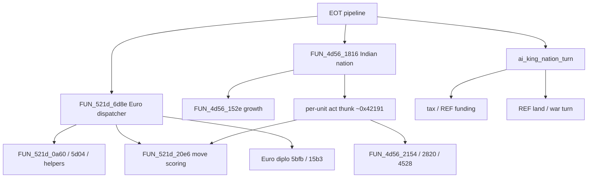

# AI Transcription Gap

Source of truth for European / Indian AI: what DOS `VICEROY` implements, what
the Linux port has transcribed, and what remains for eventual **1:1
correspondence** with the original planners.

Navigation / bring-up status live elsewhere; this file owns the AI FUN_*
inventory and roadmap. See also [original_index.md](original_index.md),
[decomp_inventory.md](decomp_inventory.md), [manual_gap.md](manual_gap.md),
[data_vs_hardcoded.md](data_vs_hardcoded.md).

---

## Goal and fidelity tiers

**Long-term goal:** every original AI control-flow path that affects game state
has a Linux counterpart with matching behavior, including DOS LCG call order
where the original burns RNG.

| Tier | Meaning | Current use |
|------|---------|-------------|
| **T0 — Behavioral slice** | Looks like the original at a high level; RNG / edge cases may differ | Euro sail-to-goto, village growth |
| **T1 — Save-diff** | Matches observable fields in original saves after the same setup | Rival fleets / crosses vs `COLONY00`→`01` |
| **T2 — Golden / bit-faithful** | Matches a locked golden (e.g. seed-100) tile-for-tile / unit-for-unit | Tribe/Brave pulse + early AI TURN1→7 (`smoke_ai_turns`) |
| **T3 — 1:1 transcription** | Structured like the decomp (dispatcher → goals → scoring), all branches | **Not claimed** for any full planner |

“Limited fashion” in the roadmap means ship a **T0/T1** slice first (e.g. unload
and found), then harden toward **T2/T3** with dumps and goldens.

**Port rule:** AI algorithms are baked into C from VICEROY decomp (not data
files). Prefer golden saves and DOS hang dumps over wiki. Use
[`dos_rng.c`](../src/core/dos_rng.c) for any path that must match seed-100 or
save-diff. Split `ai.c` into `ai_euro.c` / `ai_indian.c` when size warrants.

---

## Current Linux surface (Full T0/T1)

| Piece | Role |
|-------|------|
| [`src/core/ai.h`](../src/core/ai.h) / [`ai.c`](../src/core/ai.c) | Init, seed-100 early Euro fixture, Indian pulse |
| [`ai_goals.c`](../src/core/ai_goals.c) | Primary/secondary/work goal tables (`521d_0000…0906`) |
| [`ai_euro.c`](../src/core/ai_euro.c) | Full dispatcher: plan/`5d04` hire, `0a60` goals, `5b66` act, Euro `20e6` step |
| [`ai_diplo.c`](../src/core/ai_diplo.c) | Euro war/ally + Indian relation deltas (`15b3`/`5bfb` T0) |
| [`ai_contact.c`](../src/core/ai_contact.c) | Indian prelude/meet/trade/raids (`4d56`/`5bfb`/`@RAID*` T0) |
| [`ai_king.c`](../src/core/ai_king.c) | Tax events, SoL declare, REF waves, war act (`43f7` T0) |
| `ai_init_new_game` | Col1 template, rival fleets, tribes/Braves, post-spawn native pulse |
| `ai_euro_nation_turn` | Reseed, AI crosses; seed-100 fixture **or** `ai_euro_dispatcher_turn` (`AI_FULL_DISPATCH=1` / non-100) |
| `ai_indian_nation_turn` | Growth + Brave pulse + contact/raids |
| `ai_king_nation_turn` | Replaces king stub in EOT FINISH |
| [`turn.c`](../src/core/turn.c) | `TURN_PROC_EURO` / `INDIAN` / king → AI entries |
| [`tests/smoke/test_ai_turns.c`](../tests/smoke/test_ai_turns.c) | **T2 gate:** `TURN1`→`TURN7` field-diff (`smoke_ai_turns`) |

**Claims (T2 early AI):** with VR_SEED=100 and idle human, `smoke_ai_turns` matches
`test-saves-ai/TURN2`…`TURN7` on calendar, AI crosses, colonies (sites/names/pop/bip/hammers),
euro units (xy/orders/goto), Braves (xy/moves/turns_worked), and tribe pop/accumulators.
Seed-100 Euro path uses landfall-derived coastal staging + found-site helper
(`ai_euro_found_tile_from_landfall`); ship approach / mid-turn waypoints still
fixture unless `AI_FULL_DISPATCH=1`. Mid-turn Braves: quiet ASM + mid peels + residual overlays on
spent-only holdouts (R0; quiet residuals **2 rows** t2 Apache/Sioux;
empiricism keeps its larger overlay set via `AI_EMPIRICISM=1`).

**Claims (Full T0/T1):** Euro dispatcher (goals/hire/act/combat/capture), diplomacy
state, Indian meet/trade/missions/raids, king tax/REF/independence war loop —
behavioral, not bit-perfect. Shared: `colonies_capture`, `units_resolve_naval_combat`.



---

## Full T0/T1 surface (acceptance)

**Done means:** every in-scope AI path that mutates game state has a Linux
counterpart that can run end-to-end at **T0** (harden to T1 save-diff where cheap).
Not required: seed-100 mid/late T2 goldens, DOS LCG bit-identity, or polished
meet/king cinematic UI.

| Cluster | Linux entry | Fidelity bar |
|---------|-------------|--------------|
| Euro dispatcher + goals + hire | `ai_euro_dispatcher_turn` (`ai_euro.c`) | T0 plan→act; seed-100 early fixture kept for `smoke_ai_turns` unless `AI_FULL_DISPATCH=1` |
| Euro unit act + scoring | `ai_euro_unit_act` / `ai_euro_score_move` | T0 goto/unload/found/fortify/combat initiate; ocean without coastal fixtures |
| Diplomacy | `ai_diplo_*` (`ai_diplo.c`) | Treaty bits + war/ally state on Col1 |
| Indian nation + contact | `ai_indian_nation_turn` + `ai_contact_*` | Alarm/relations/missions/meet/trade T0 |
| Raids | `ai_raid_*` (`ai_contact.c`) | `@RAID*` / friction-gated attacks change units/colonies |
| King / tax / REF | `ai_king_nation_turn` (`ai_king.c`) | Tax→REF pools, declare, invasion wave, war turn |

### Shared surfaces (blocking work by phase)

| Surface | Phase that needs it | Linux |
|---------|---------------------|-------|
| Land combat (AI-initiated) | 2 | `units_resolve_land_combat` + act |
| Colony capture | 2 / 5 / 6 | `colonies_capture` |
| Naval combat T0 | 2 / 6 | `units_resolve_naval_combat` |
| Diplomacy bytes | 3 | `ai_diplo_read` / `ai_diplo_write` |
| Meet / alarm / `@RAID*` | 4–5 | `ai_contact_*` + Col1 tribe alarm |
| SoL / declare / tax events | 6 | `ai_king_*` + nation liberty/tax fields |

R0 Brave spent overlays (**2** quiet rows) stay until a dedicated hang pass — not a
blocker for Full T0/T1.

---

## Original inventory

Addresses are Ghidra symbols in
[`original_sources_decompiled/viceroy_unpacked.c`](../original_sources_decompiled/viceroy_unpacked.c).
Line spans are approximate (next function start − 1). Status:

| Status | Meaning |
|--------|---------|
| **ported** | Linux counterpart with T1/T2 claim |
| **partial** | Subset of behavior only |
| **parked** | Known cluster; not transcribed |
| **unknown** | Needs RE labeling before port |

### Tribe placement — `FUN_6a09_*`

| Symbol | ~Lines | Purpose | Linux | Status |
|--------|-------:|---------|-------|--------|
| `FUN_6a09_0006` | ~335 | Capitals, satellites, Brave spawn loop | `ai_place_tribes_*`, `ai_spawn_brave_near` | **ported** (T2 seed-100) |

### Indian AI — `FUN_4d56_*` (12 far + nested helpers)

| Symbol | ~Lines | Purpose (known / inferred) | Linux | Status |
|--------|-------:|----------------------------|-------|--------|
| `FUN_4d56_0038` | ~39 | Small helper; calls into `00e0` / map probes | contact helpers | **partial** (T0 via contact) |
| `FUN_4d56_00e0` | ~60 | Chains to `01e2` / `14fe` | contact helpers | **partial** (T0) |
| `FUN_4d56_01e2` | ~19 | Thin wrapper → `14fe` | — | **partial** (T0) |
| `FUN_4d56_14fe` | ~16 | Dispatches growth `152e` | growth + pulse | **partial** (T0/T2 quiet) |
| `FUN_4d56_152e` | ~156 | Village growth accumulator → pop++ | `ai_grow_villages` | **partial** (T0) |
| `FUN_4d56_1816` | ~141 | Indian nation turn entry: alarm prelude, unit loop, relation ticks | `ai_indian_nation_turn` + `ai_contact_*` | **partial** (T0 full path; T2 quiet) |
| `FUN_4d56_1b3a` | ~59 | Calls `2154`; mid-turn Indian action | `ai_contact_indian_raids` | **partial** (T0) |
| `FUN_4d56_2154` | ~321 | Larger Indian action body (caller of raid-adjacent logic) | `ai_contact_indian_raids` | **partial** (T0) |
| `FUN_4d56_2820` | ~1396 | Heavy Indian decision / raid-scale logic | `ai_contact_indian_raids` / trade | **partial** (T0) |
| `FUN_4d56_2aac`…`311e` | nested | Helpers inside `2820` body | meet/trade in `ai_contact` | **partial** (T0) |
| `FUN_4d56_3582` | ~51 | Small helper after `2820` | — | **partial** (T0 folded) |
| `FUN_4d56_417e` | ~188 | Mid-size helper | — | **partial** (T0 folded) |
| `FUN_4d56_4528` | ~3073 | Largest Indian cluster (combat/raid-adjacent) | `ai_contact_indian_raids` | **partial** (T0) |

Nation entry `1816` does **not** call `2154`/`2820`/`4528` directly in the
decomp slice; those are reached from other turn / contact paths. Full Indian
AI = `1816` + unit-act thunk + those large bodies + `@RAID*` data.

### European AI — `FUN_521d_*` (25 far + nested)

| Symbol | ~Lines | Purpose (known / inferred) | Linux | Status |
|--------|-------:|----------------------------|-------|--------|
| `FUN_521d_0000`…`0906` | small | Goal-table ops + founding helpers | `ai_goals.c` | **partial** (T0 ported) |
| `FUN_521d_0a60` | ~858 | Unit / colony goal writer | `ai_euro_colony_goals` | **partial** (T0 A–H condensed) |
| `FUN_521d_20c6` | nested | Near helper before scoring | scoring step | **partial** (T0) |
| `FUN_521d_20e6` | ~2180 | Direction / move scoring (all unit kinds) | quiet + `ai_euro_score_step` | **partial** (T0 Euro/ocean; T2 quiet) |
| `FUN_521d_5b66` | ~1815 | Euro **per-unit act** (separate far; often → `20e6`) | `ai_euro_unit_act` | **partial** (T0) |
| `FUN_521d_5c38` / `5c3c` / `5cf6` | small | Thin helpers before `5d04` | hire in planning | **partial** (T0) |
| `FUN_521d_5d04` | ~748 | Nation planning / hire / treasury (6d8e via `0554`) | `ai_euro_nation_planning` | **partial** (T0) |
| `FUN_521d_6d8e` | ~253 body | Euro AI **dispatcher** per nation | `ai_euro_dispatcher_turn` (+ seed-100 fixture) | **partial** (T0 full; T2 fixture) |

`6d8e` thunk wiring: `0554`→`5d04`, `0578`→`0342`, `050c`→`0a60`, `0488`→`5b66`
(→`20e6` via `04f4`). Linux still uses seed-100 peels until goal/act bodies port.

**Naming note:** `5b66` is **not** nested inside `20e6` and is not the unit-goals
entry — goals ≈ `0a60` + `5d04`; scoring ≈ `20e6`; act ≈ `5b66`.

### Shared move / terrain helpers (AI-adjacent)

| Symbol | Role in AI | Linux |
|--------|------------|-------|
| `FUN_465b_0000` (terrain MP) | Brave step cost | `ai_dos_move_spent` |
| `FUN_124c_0040` | DOS distance helper (not used in `FUN_521d_20e6`) | `ai_dos_dist` — empiricism-only home-dist in `ai_native_pick_dir` (not quiet ASM) |
| `FUN_281f_04ca` / `04d4` | Reseed / `range` | `dos_rng` |
| `func_0x00042191` | Per-unit Indian act from `1816` | No direct symbol; pulse approximates quiet path only |

Quiet dir-pick: [`ai.c`](../src/core/ai.c) labels the slice `FUN_4d56_021a`
(likely a label/offset in the native move path); seed-100 notes cite
`FUN_521d_20e6` quiet path. Same scoring behavior either way.

---

## Correspondence map

Labeled RE copies of several rows live under
[`original_sources_annotated/`](../original_sources_annotated/)
([`SYMBOL_MAP.md`](../original_sources_annotated/SYMBOL_MAP.md)). Prefer those
files when reading control flow; the raw export remains authoritative for
unannotated bodies.

| Original | Linux | Notes |
|----------|-------|-------|
| `FUN_6a09_0006` | `ai_place_tribes_procedural` / `ai_place_tribes_from_txt` / `ai_spawn_brave_near` | AMERICA via `TRIBE.TXT`; NEW WORLD procedural |
| Post-`6a09` native pulse | `ai_native_nation_pulse` at end of `ai_init_new_game` | One action per Brave per indian nation |
| Quiet NEW WORLD dir pick | `ai_native_pick_dir` | Quiet ASM default (stay LCG + init/mid peels). `AI_EMPIRICISM=1` / `AI_QUIET_ASM=0` force emp |
| Apply step + MP | `ai_native_apply_step` / `ai_dos_move_spent` | Annotated `move_spent_add` / accessors |
| `FUN_4d56_152e` growth | `ai_grow_villages` | Threshold `AI_VILLAGE_GROWTH_THRESHOLD` (19); pop cap 15 |
| `FUN_4d56_1816` full body | `ai_indian_nation_turn` | Growth + quiet pulse + residual overlays (quiet: **2** spent-only rows; emp set via env); alarm/raid parked; annotated entry in `indian_nation_turn.c` |
| Per-unit indian act | pulse / residual | Quiet path; residual only on pulse≠golden; DOS thunk `func_0x00042191` → annotated stub `indian_unit_act` |
| `FUN_521d_6d8e` | `ai_euro_dispatcher_turn` / fixture | T0 dispatcher; T2 seed-100 fixture |
| `FUN_521d_0000`…`0906` | `ai_goals_*` | T0 goal tables |
| `FUN_521d_0a60` | `ai_euro_colony_goals` | T0 condensed phases |
| `FUN_521d_5d04` | `ai_euro_nation_planning` | T0 treasury + Europe hire |
| `FUN_521d_5b66` | `ai_euro_unit_act` | T0 goto/unload/found/combat |
| `FUN_521d_20e6` (non-quiet) | `ai_euro_score_step` | T0 adjacent step toward goal |
| Col1 AI fleets + landfall `goto` | `ai_spawn_euro_fleet` / `ai_pick_landfall` / `ai_sail_ship` | T2 landings on VR_SEED=100 |
| Landfall unload + first colony | `ai_euro_early_turn` / dispatcher unload | **T2** golden towns; T0 dispatcher for other seeds |
| AI crosses tick | `ai_euro_nation_turn` | +2 / needed default 14 |
| `@RAID*` / meet / mission | `ai_contact_*` | **T0** friction raids + meet/trade/missions |
| King / REF AI | `ai_king_nation_turn` | **T0** tax / declare / REF / war act |
| Diplomacy | `ai_diplo_*` | **T0** war/ally + Indian relations |
| Colony capture | `colonies_capture` | military / REF / Indian raid |
| Naval combat | `units_resolve_naval_combat` | T0 ship vs ship |

---

## Remaining work roadmap

Ordered from limited playability toward full 1:1. Each row can be its own PR
series; do not skip prerequisite systems in [Prerequisites](#prerequisites).

### R0 — Fidelity debt and doc hygiene (**partial**)

- **Init LCG burns (named helper):** `ai_native_post_first_brave_burns` —
  Inca=6 / Tupi=1 after first Brave step when `seed100_init_burns=true`
  (`smoke_mapgen_seed100`). DOS CALL site still unlabeled (hang dumps B26/B27
  place the mover after `6a09` returns; exact inter-Brave burn not named). Not
  prelude-equivalent to mid-turn Inca=14 / Aztec=4.
- **Mid-turn pulse:** always runs; prelude Inca=14 / Aztec=4; MP loop allows
  spent past max (`097a`). Terrain river costing (`072c` &0x40), tribe-tile
  spend cap (`06be` / layer2&2), own-nation −0x28 (skip only river-into-tribe),
  mask fa-flags (road `layer2 0x40` → DOS `&0x0a`), and ocean-transition
  spent=max emptied **t1** and keep cost fidelity. **Phase 11:** seed-100
  **init and mid-turn** use quiet ASM by default (stay LCG; 13 init peels +
  104 mid-turn peels for matched-RNG scoring holdouts; coarse fog from phase
  9). **Phase 12:** `FUN_465b_0000` annotated in
  [`move_spent.c`](../original_sources_annotated/ai/move_spent.c); ocean/HS
  force-to-max uses `euro_settlement_owner` (`FUN_137f_0358`). **Phase 13:**
  multi-step / Inca tw residuals cleared — river/fa cost=1 peels let the
  existing `097a` pulse loop continue (`spent < 3`); mis-keyed t3/t6 overlays
  retired. **Phase 14–17:** spent-only static RE + dump-free predicates
  exhausted (cost head cannot distinguish T1 spent=9 vs T2 spent=3; ocean
  force-max ruled out via `dump_b465f3`; `dump_vrb465x2` shows spent=9 without
  XY ⇒ writer after ADD/`465b` return; ocean-adj / capital-dist clamps break
  T1). Quiet residuals remain **2 spent-only rows** in `k_quiet_brave_t2`.
  Hang **`VR_B465X` → `dump_b465x3`** is the last-resort localizer (see
  `tools/brave_dump/midturn_465b.md`). Empiricism mid-turn overlays retained
  under `AI_EMPIRICISM=1` / `AI_QUIET_ASM=0`. Complete Map irrelevant.
- **Euro early path:** T2 coastal ship gotos from
  `ai_coastal_staging_from_landfall`; found tiles from
  `ai_euro_found_tile_from_landfall` (Quebec / New Amsterdam / Isabella; T3–T6
  SP pioneer + FR found peels). Dutch join uses first nation colony. Atlantic
  approach table + T3–T6 **ship** coastal waypoints still fixture (west-explore
  `spend_goto` misses golden coastal XY by 1–2 tiles until ocean `20e6`).
  T3 FR ship/unload peeled via found tile (`hold = found+(0,+2)`).
- Keep this file and [original_index.md](original_index.md) status rows aligned
  when slices land.

### R1 — Euro “AI plays” (limited, T0→T1)

**T0 landed:** rivals unload at landfall and found a first colony
(`ai_try_ship_unload` / settle helpers in `ai_euro_nation_turn`;
`units_pick_landfall_tile` / `units_landfall_unload_all`). Optional fortify on
leftover Soldier + Pioneer → Carpenter's Shop. Covered by `smoke_ai`.

**T2 (fixture path):** seed-100 New Amsterdam / Quebec / Isabella via
`ai_euro_early_turn` + `smoke_ai_turns` — not the generic planner.

Still open for generic T1 (non-fixture):

1. Save-diff / hang-dump fidelity for first AI town vs original saves.
2. Broader multi-colony / second-wave settle (not first-colony-only).
3. Colony production already runs for all active colonies.

### R2 — Indian nation turn beyond quiet pulse

1. Port more of `FUN_4d56_1816` (alarm flags, relation ticks, unit loop structure).
2. Identify and name `func_0x00042191` (unit act); port quiet + alarmed branches.
3. Extend `20e6` / quiet scoring for mid-game (goods, missions, capital pull)
   without claiming full scoring yet.

### R3 — Contact and raids (after meet + combat)

1. Wire `@RAID*` from `GAME.TXT` once combat and meet UI exist.
2. RE-label then port slices of `FUN_4d56_2154` / `2820` / `4528`.
3. Teach / trade / missions / convert as separate contact features (manual
   natives chapter) — may live partly outside `ai.c`.

### R4 — Euro dispatcher skeleton

**Annotation (Layer D early-settle):** `6d8e` thunk wiring corrected; goal
helpers + sectioned `0a60` in `original_sources_annotated/ai/`; thin maps for
`5b66` / Euro `20e6`. **Not yet ported** into Linux (fixtures remain).

1. Port `FUN_521d_6d8e` structure: nation setup, colony/unit inventory, dispatch
   hooks (even if goal bodies are stubs) — annotated shell ready.
2. Port goal slices from `FUN_521d_0a60` / helpers (`016a`/`06ae`/…) as evidence
   allows; `5d04` hire/treasury later.
3. Replace fixture/skeleton `ai_euro_nation_turn` (`ai_euro_early_turn` + opportunistic
   settle) with real dispatcher entry.

### R5 — Toward 1:1 (T2/T3)

1. Remaining `FUN_521d_20e6` branches (Euro combat, explore, ocean/ship, colony tiles).
2. Full `5b66` order/combat arms (thin map done) and remaining `5d04`.
3. Full `4d56` large bodies + nested `2820` helpers.
4. Golden / hang-dump coverage for mid-game turns (not only seed-100 turn 0).

---

## Prerequisites

Shared execution surfaces AI will call into (not the DOS planner itself).
Status reflects the AI-port prerequisite work:

| Subsystem | Status | Notes |
|-----------|--------|-------|
| `colonies_found(nation_id)` | **Done** | Owning nation set at found time |
| Unit orders (fortify, sentry, disband) | **Partial** | Map F / S / Shift+D + ORDERS menu; overnight fortify → fortified |
| Land combat | **Partial** | T0 attack/defense (+ fortified ×2); AI-initiated via act/raids |
| Colony capture | **Done** (T0) | `colonies_capture` — Euro owner swap; Indian capture abandons |
| Naval combat | **Partial** (T0) | `units_resolve_naval_combat` |
| Fog of war / `map.seen` | **Partial** | Dedicated plane; reveal on move; cheat Reveal; `.MP` fully seen |
| AI coarse fog (`DS:0x9faa`) | **Partial** | Explore `>>2` + tribe `/5` dual index; Linux `s_ai_coarse_fog`; not player FoW |
| Alarm / contact hooks | **Partial** (T0) | `ai_contact_*` meet/trade/missions/raids + adjacent friction |
| AI colony economy + construction | **Ready** | `turn_run_colony_production` already ticks **all** active colonies |
| Founding Fathers / liberty | **Partial** | Liberty bells + SoL heuristic for declare; FF election still stub |
| King / tax / REF | **Partial** (T0) | `ai_king_nation_turn` — tax events, declare, REF waves, war act |

Suggested manual order still puts **full Euro/Indian AI** late (#10 in
manual_gap) after combat and Indian contact. **R1 Euro settle (T0)** and
**seed-100 early T2** (`smoke_ai_turns`) are in; R0 partial (quiet mid-turn
default, **2** Brave spent-only residuals — call graph annotated
(`brave_spent_callgraph.md`); post-ADD chrome does not write `0x3149`; overlays
kept; hang **VR_B465X** last resort). Next: generic T1 Euro settle (spent rows
stay overlaid until hang X).

---

## Evidence and tools

| Artifact | Use |
|----------|-----|
| `test-saves-mapgen/SEED100.SAV` | Golden tribes/Braves; `smoke_mapgen_seed100`; far-ocean probe |
| `tools/probe_far_ocean_4753.c` | Phase 8: far tiles Linux ↔ SAV ocean/land |
| `tools/probe_sioux_spent.c` | T1/T2 Brave cost-head + neighborhood oracle (spent residuals) |
| `test-saves-ai/TURN1.SAV`…`TURN7.SAV` | Early-AI T2 gate; `smoke_ai_turns` |
| `original_saves/COLONY00.SAV` / `COLONY01.SAV` | Rival fleets, sail, AI crosses |
| `COLONIZE/VR_SEED.EXE`, `VR_BRAVE*.EXE` | Seed-locked RE probes (not runtime) |
| `original_memory_dumps/dosbox_save_state_brave/` | Live Brave pulse dumps |
| `tools/brave_dump/` | Hang-dump tooling (**parked** / overlay-unsafe). Fog/dir notes: `init_20e6_4753.md`; spent: `midturn_465b.md`. Prefer coarse-fog port + goldens |
| `tools/diff_turns.c` | Manual SAV↔SAV unit/tribe/crosses dump |
| [`.context/seed100-brave.md`](../.context/seed100-brave.md) | Durable Brave fidelity notes / open LCG burns |
| `COLONIZE/TRIBE.TXT`, `NAMES.TXT` `@TRIBES` / `@SCENARIO` | AMERICA villages / landfalls |
| `GAME.TXT` `@RAID*` | Raid tables (unused until R3) |
| `tests/smoke/test_ai.c` | Init + multi-turn smoke |
| `tests/smoke/test_mapgen_seed100.c` | T2 Brave/tribe fidelity |
| `tests/smoke/test_ai_turns.c` | T2 TURN1→7 field-diff |

Smoke:

```bash
cmake --build build --target smoke_mapgen_seed100 smoke_ai_turns
./build/smoke_mapgen_seed100   # cwd = repo root
./build/smoke_ai_turns         # TURN1→7 gate
cmake --build build --target smoke_ai && ./build/smoke_ai
```

---

## Size sense

| Side | Rough scale |
|------|-------------|
| Linux `ai.c` + `ai_*.c` | ~3.5k + goals/euro/diplo/contact/king modules |
| Euro planner (DOS) | `6d8e` ~500 + `0a60` ~860 + `5d04` ~750 + `20e6` ~4k (+ nested `5b66` ~1.8k) |
| Indian cluster (DOS) | `1816` ~140 + `2154` ~320 + `2820` ~1.4k + `4528` ~3k + helpers |

Full T0/T1 surface is in: dispatcher + contact + king modules. Remaining work is
fidelity hardening (T1/T2 goldens, LCG, deeper Layer D extracts) — not missing
planner arms.

---

## See also

- [original_index.md](original_index.md) — FUN_* navigation
- [decomp_inventory.md](decomp_inventory.md) — EOT pipeline / bring-up
- [manual_gap.md](manual_gap.md) — feature checklist vs manual
- [data_vs_hardcoded.md](data_vs_hardcoded.md) — bake-into-C rule for AI
- [savegame.md](savegame.md) — Col1 nation / tribe / unit blobs
- [fandom_col1994.md](fandom_col1994.md) — unverified natives / combat wiki digest
