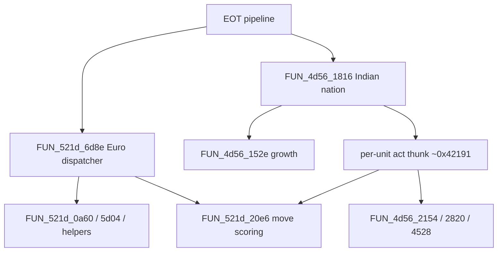

# AI Transcription Gap

Source of truth for European / Indian AI: what DOS `VICEROY` implements, what
the Linux port has transcribed, and what remains for eventual **1:1
correspondence** with the original planners.

Navigation / bring-up status live elsewhere; this file owns the AI FUN_*
inventory and roadmap. See also [original_index.md](original_index.md),
[decomp_inventory.md](decomp_inventory.md), [manual_gap.md](manual_gap.md),
[data_vs_hardcoded.md](data_vs_hardcoded.md).

---

## Goal and fidelity tiers

**Long-term goal:** every original AI control-flow path that affects game state
has a Linux counterpart with matching behavior, including DOS LCG call order
where the original burns RNG.

| Tier | Meaning | Current use |
|------|---------|-------------|
| **T0 — Behavioral slice** | Looks like the original at a high level; RNG / edge cases may differ | Euro sail-to-goto, village growth |
| **T1 — Save-diff** | Matches observable fields in original saves after the same setup | Rival fleets / crosses vs `COLONY00`→`01` |
| **T2 — Golden / bit-faithful** | Matches a locked golden (e.g. seed-100) tile-for-tile / unit-for-unit | Tribe placement + post-`6a09` Brave pulse |
| **T3 — 1:1 transcription** | Structured like the decomp (dispatcher → goals → scoring), all branches | **Not claimed** for any full planner |

“Limited fashion” in the roadmap means ship a **T0/T1** slice first (e.g. unload
and found), then harden toward **T2/T3** with dumps and goldens.

**Port rule:** AI algorithms are baked into C from VICEROY decomp (not data
files). Prefer golden saves and DOS hang dumps over wiki. Use
[`dos_rng.c`](../src/core/dos_rng.c) for any path that must match seed-100 or
save-diff. Split `ai.c` into `ai_euro.c` / `ai_indian.c` when size warrants.

---

## Current Linux surface (Phase 1 + R1 settle)

| Piece | Role |
|-------|------|
| [`src/core/ai.h`](../src/core/ai.h) / [`ai.c`](../src/core/ai.c) | All ported AI |
| `ai_init_new_game` | Col1 template, rival fleets, tribes/Braves, one post-spawn native pulse |
| `ai_euro_nation_turn` | Refresh MP (caller), tick AI crosses, sail ships with `goto`, **R1 T0 unload + first colony** |
| `ai_indian_nation_turn` | Village growth + DOS-style Brave quiet pulse |
| [`turn.c`](../src/core/turn.c) | `TURN_PROC_EURO` / `TURN_PROC_INDIAN` call the above; King remains stub |

**Phase 1 + R1 does claim:** new-game actors exist; AI ships move toward landfall;
**unload passengers and found a first colony (T0)**; villages can grow; seed-100 Brave
coords/MP/`turns_worked` match golden after pulse.

**Does not claim:** `FUN_521d_6d8e` dispatcher, colony economy planner, combat AI,
raids, meet/trade/missions, bit-identical mid-game native AI, or King/REF AI.



Linux today: thin Euro sail path (not `6d8e`); Indian growth + quiet scoring
slice (not full `1816` / raid bodies).

---

## Original inventory

Addresses are Ghidra symbols in
[`original_sources_decompiled/viceroy_unpacked.c`](../original_sources_decompiled/viceroy_unpacked.c).
Line spans are approximate (next function start − 1). Status:

| Status | Meaning |
|--------|---------|
| **ported** | Linux counterpart with T1/T2 claim |
| **partial** | Subset of behavior only |
| **parked** | Known cluster; not transcribed |
| **unknown** | Needs RE labeling before port |

### Tribe placement — `FUN_6a09_*`

| Symbol | ~Lines | Purpose | Linux | Status |
|--------|-------:|---------|-------|--------|
| `FUN_6a09_0006` | ~335 | Capitals, satellites, Brave spawn loop | `ai_place_tribes_*`, `ai_spawn_brave_near` | **ported** (T2 seed-100) |

### Indian AI — `FUN_4d56_*` (12 far + nested helpers)

| Symbol | ~Lines | Purpose (known / inferred) | Linux | Status |
|--------|-------:|----------------------------|-------|--------|
| `FUN_4d56_0038` | ~39 | Small helper; calls into `00e0` / map probes | — | **unknown** |
| `FUN_4d56_00e0` | ~60 | Chains to `01e2` / `14fe` | — | **unknown** |
| `FUN_4d56_01e2` | ~19 | Thin wrapper → `14fe` | — | **unknown** |
| `FUN_4d56_14fe` | ~16 | Dispatches growth `152e` | — | **partial** (via growth only) |
| `FUN_4d56_152e` | ~156 | Village growth accumulator → pop++ | `ai_grow_villages` | **partial** (T0) |
| `FUN_4d56_1816` | ~141 | Indian nation turn entry: alarm prelude, unit loop (`func_0x00042191`), relation ticks | `ai_indian_nation_turn` (growth + pulse only) | **partial** |
| `FUN_4d56_1b3a` | ~59 | Calls `2154`; mid-turn Indian action | — | **parked** |
| `FUN_4d56_2154` | ~321 | Larger Indian action body (caller of raid-adjacent logic) | — | **parked** |
| `FUN_4d56_2820` | ~1396 | Heavy Indian decision / raid-scale logic | — | **parked** |
| `FUN_4d56_2aac`…`311e` | nested | Helpers inside `2820` body | — | **parked** |
| `FUN_4d56_3582` | ~51 | Small helper after `2820` | — | **unknown** |
| `FUN_4d56_417e` | ~188 | Mid-size helper | — | **unknown** |
| `FUN_4d56_4528` | ~3073 | Largest Indian cluster (combat/raid-adjacent; needs RE labels) | — | **parked** |

Nation entry `1816` does **not** call `2154`/`2820`/`4528` directly in the
decomp slice; those are reached from other turn / contact paths. Full Indian
AI = `1816` + unit-act thunk + those large bodies + `@RAID*` data.

### European AI — `FUN_521d_*` (25 far + nested)

| Symbol | ~Lines | Purpose (known / inferred) | Linux | Status |
|--------|-------:|----------------------------|-------|--------|
| `FUN_521d_0000`…`0906` | small | Planner helpers (scores, probes, bookkeeping) | — | **parked** |
| `FUN_521d_0a60` | ~858 | Unit / colony goal logic | — | **parked** |
| `FUN_521d_20c6` | nested | Near helper before scoring | — | **parked** |
| `FUN_521d_20e6` | ~3995 | Direction / move scoring (all unit kinds) | quiet NEW WORLD Brave slice only | **partial** |
| `FUN_521d_5b66` | ~1815 nested | Large helper **inside** the `20e6` span (not a separate far export); historically mis-cited as sole “unit goals” entry | — | **parked** |
| `FUN_521d_5c38` / `5c3c` / `5cf6` | small | Thin helpers before `5d04` | — | **parked** |
| `FUN_521d_5d04` | ~748 | Unit goals / planning (alongside `0a60`) | — | **parked** |
| `FUN_521d_6d8e` | ~516 | Euro AI **dispatcher** per nation | — | **parked** |

`6d8e` calls into `5b66`, `0a60`, `20e6`, `5d04`, and many small `521d_*`
helpers (plus platform `FUN_281f_*` / `FUN_2a1f_*`). Linux Euro turn does
**not** enter this dispatcher.

**Naming note:** older docs listed `FUN_521d_5b66` as a top-level unit-goals
peer of `0a60`. Prefer: goals ≈ `0a60` + `5d04`; scoring ≈ `20e6` (with nested
`5b66`).

### Shared move / terrain helpers (AI-adjacent)

| Symbol | Role in AI | Linux |
|--------|------------|-------|
| `FUN_465b_0000` (terrain MP) | Brave step cost | `ai_dos_move_spent` |
| `FUN_124c_0040` | Home distance in quiet scoring | `ai_dos_dist` / home-dist in `ai_native_pick_dir` |
| `FUN_281f_04ca` / `04d4` | Reseed / `range` | `dos_rng` |
| `func_0x00042191` | Per-unit Indian act from `1816` | No direct symbol; pulse approximates quiet path only |

Quiet dir-pick: [`ai.c`](../src/core/ai.c) labels the slice `FUN_4d56_021a`
(likely a label/offset in the native move path); seed-100 notes cite
`FUN_521d_20e6` quiet path. Same scoring behavior either way.

---

## Correspondence map

| Original | Linux | Notes |
|----------|-------|-------|
| `FUN_6a09_0006` | `ai_place_tribes_procedural` / `ai_place_tribes_from_txt` / `ai_spawn_brave_near` | AMERICA via `TRIBE.TXT`; NEW WORLD procedural |
| Post-`6a09` native pulse | `ai_native_nation_pulse` at end of `ai_init_new_game` | One action per Brave per indian nation |
| Quiet NEW WORLD dir pick | `ai_native_pick_dir` | T2 for seed-100 |
| Apply step + MP | `ai_native_apply_step` / `ai_dos_move_spent` | |
| `FUN_4d56_152e` growth | `ai_grow_villages` | Threshold `AI_VILLAGE_GROWTH_THRESHOLD` (19); pop cap 15 |
| `FUN_4d56_1816` full body | — | **No** Linux counterpart for alarm / unit-act loop / relation block |
| Per-unit indian act | — | Pulse only; no `func_0x00042191` |
| `FUN_521d_6d8e` | — | **No** counterpart; `ai_euro_nation_turn` is sail+crosses only |
| `FUN_521d_0a60` / `5d04` / `20e6` (non-quiet) | — | **No** counterpart |
| Col1 AI fleets + landfall `goto` | `ai_spawn_euro_fleet` / `ai_pick_landfall` / `ai_sail_ship` | T1 save-diff; not planner |
| Landfall unload + first colony | `ai_try_ship_settle` via `units_landfall_unload_all` / `colonies_found` | **R1 T0** (smoke); optional fortify / Carpenter workplace |
| AI crosses tick | `ai_euro_nation_turn` | +2 / needed default 14 |
| `@RAID*` / meet / mission | — | **No** counterpart |
| King / REF AI | `turn_run_king_stub` | Stub only |

---

## Remaining work roadmap

Ordered from limited playability toward full 1:1. Each row can be its own PR
series; do not skip prerequisite systems in [Prerequisites](#prerequisites).

### R0 — Fidelity debt and doc hygiene

- Resolve post-first-Brave **LCG burns** (Inca nation 4 = 6 steps, Tupi 11 = 1;
  others 0). Today hardcoded in `ai_native_nation_pulse`; DOS call site still
  TBD — see [`.context/seed100-brave.md`](../.context/seed100-brave.md).
- Keep this file and [original_index.md](original_index.md) status rows aligned
  when slices land.

### R1 — Euro “AI plays” (limited, T0→T1)

**T0 landed:** rivals unload at landfall and found a first colony
(`ai_try_ship_settle` in `ai_euro_nation_turn`; helpers
`units_pick_landfall_tile` / `units_landfall_unload_all`). Optional fortify on
leftover Soldier + Pioneer → Carpenter's Shop. Covered by `smoke_ai`.

Still open for T1:

1. Save-diff / hang-dump fidelity for first AI town vs original saves.
2. Broader multi-colony / second-wave settle (not first-colony-only).
3. Colony production already runs for all active colonies.

### R2 — Indian nation turn beyond quiet pulse

1. Port more of `FUN_4d56_1816` (alarm flags, relation ticks, unit loop structure).
2. Identify and name `func_0x00042191` (unit act); port quiet + alarmed branches.
3. Extend `20e6` / quiet scoring for mid-game (goods, missions, capital pull)
   without claiming full scoring yet.

### R3 — Contact and raids (after meet + combat)

1. Wire `@RAID*` from `GAME.TXT` once combat and meet UI exist.
2. RE-label then port slices of `FUN_4d56_2154` / `2820` / `4528`.
3. Teach / trade / missions / convert as separate contact features (manual
   natives chapter) — may live partly outside `ai.c`.

### R4 — Euro dispatcher skeleton

1. Port `FUN_521d_6d8e` structure: nation setup, colony/unit inventory, dispatch
   hooks (even if goal bodies are stubs).
2. Port goal slices from `FUN_521d_0a60` / `5d04` as evidence allows (colony
   build, military, trade ships).
3. Replace sail-only `ai_euro_nation_turn` with dispatcher entry.

### R5 — Toward 1:1 (T2/T3)

1. Remaining `FUN_521d_20e6` branches (Euro combat, explore, colony tiles).
2. Nested `5b66` and small `521d_*` helpers.
3. Full `4d56` large bodies + nested `2820` helpers.
4. Golden / hang-dump coverage for mid-game turns (not only seed-100 turn 0).

---

## Prerequisites

Shared execution surfaces AI will call into (not the DOS planner itself).
Status reflects the AI-port prerequisite work:

| Subsystem | Status | Notes |
|-----------|--------|-------|
| `colonies_found(nation_id)` | **Done** | Owning nation set at found time |
| Unit orders (fortify, sentry, disband) | **Partial** | Map F / S / Shift+D + ORDERS menu; overnight fortify → fortified |
| Land combat | **Partial** | T0 attack/defense (+ fortified ×2); naval / colony defense later |
| Fog of war / `map.seen` | **Partial** | Dedicated plane; reveal on move; cheat Reveal; `.MP` fully seen |
| Alarm / contact hooks | **Partial** | Adjacent village bumps friction + status; no meet UI / `@RAID*` |
| AI colony economy + construction | **Ready** | `turn_run_colony_production` already ticks **all** active colonies (docs formerly claimed skip — stale) |
| Founding Fathers / liberty | Missing | Euro long-term goals |
| King / tax / REF | Stub | Independence AI only |

Suggested manual order still puts **full Euro/Indian AI** late (#10 in
manual_gap) after combat and Indian contact. **R1 Euro settle (T0)** is in;
harden toward T1 save-diff when convenient.

---

## Evidence and tools

| Artifact | Use |
|----------|-----|
| `test-saves-mapgen/SEED100.SAV` | Golden tribes/Braves; `smoke_mapgen_seed100` |
| `original_saves/COLONY00.SAV` / `COLONY01.SAV` | Rival fleets, sail, AI crosses |
| `COLONIZE/VR_SEED.EXE`, `VR_BRAVE*.EXE` | Seed-locked RE probes (not runtime) |
| `original_memory_dumps/dosbox_save_state_brave/` | Live Brave pulse dumps |
| `tools/brave_dump/` | Hang-dump tooling |
| [`.context/seed100-brave.md`](../.context/seed100-brave.md) | Durable Brave fidelity notes / open LCG burns |
| `COLONIZE/TRIBE.TXT`, `NAMES.TXT` `@TRIBES` / `@SCENARIO` | AMERICA villages / landfalls |
| `GAME.TXT` `@RAID*` | Raid tables (unused until R3) |
| `tests/smoke/test_ai.c` | Init + multi-turn smoke |
| `tests/smoke/test_mapgen_seed100.c` | T2 Brave/tribe fidelity |

Smoke:

```bash
cmake --build build --target smoke_mapgen_seed100
./build/smoke_mapgen_seed100   # cwd = repo root
cmake --build build --target smoke_ai && ./build/smoke_ai
```

---

## Size sense (unfinished work)

| Side | Rough scale |
|------|-------------|
| Linux `ai.c` | ~1.3k lines |
| Euro planner alone | `6d8e` ~500 + `0a60` ~860 + `5d04` ~750 + `20e6` ~4k (+ nested `5b66` ~1.8k) |
| Indian cluster | `1816` ~140 + `2154` ~320 + `2820` ~1.4k + `4528` ~3k + helpers |

Current code is orchestration + new-game setup + one Brave scoring path — not a
transcription of the planners.

---

## See also

- [original_index.md](original_index.md) — FUN_* navigation
- [decomp_inventory.md](decomp_inventory.md) — EOT pipeline / bring-up
- [manual_gap.md](manual_gap.md) — feature checklist vs manual
- [data_vs_hardcoded.md](data_vs_hardcoded.md) — bake-into-C rule for AI
- [savegame.md](savegame.md) — Col1 nation / tribe / unit blobs
- [fandom_col1994.md](fandom_col1994.md) — unverified natives / combat wiki digest
