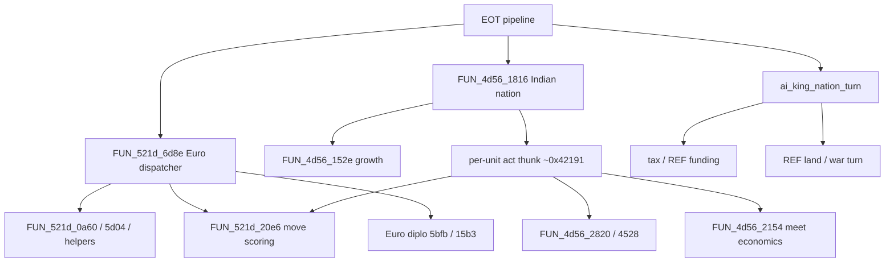

# AI Transcription Gap

Source of truth for European / Indian AI: what DOS `VICEROY` implements, what
the Linux port has transcribed, and what remains for eventual **1:1
correspondence** with the original planners.

Navigation / bring-up status live elsewhere; this file owns the AI FUN_*
inventory and roadmap. See also [original_index.md](original_index.md),
[decomp_inventory.md](decomp_inventory.md), [turn_between_players.md](turn_between_players.md),
[manual_gap.md](manual_gap.md),
[data_vs_hardcoded.md](data_vs_hardcoded.md),
[popups.md](popups.md) (player dialog / `ai_popup` checklist).

---

## Goal and fidelity tiers

**Long-term goal:** every original AI control-flow path that affects game state
has a Linux counterpart with matching behavior, including DOS LCG call order
where the original burns RNG.

| Tier | Meaning | Current use |
|------|---------|-------------|
| **T0 — Behavioral slice** | Looks like the original at a high level; RNG / edge cases may differ | Euro sail-to-goto, village growth |
| **T1 — Save-diff** | Matches observable fields in original saves after the same setup | Rival fleets / crosses vs `COLONY00`→`01` |
| **T2 — Golden / bit-faithful** | Matches a locked golden (e.g. seed-100) tile-for-tile / unit-for-unit | Tribe/Brave pulse + early AI TURN1→7 (`golden_ai_turns`) |
| **T3 — 1:1 transcription** | Structured like the decomp (dispatcher → goals → scoring), all branches | **Not claimed** for any full planner |

“Limited fashion” in the roadmap means ship a **T0/T1** slice first (e.g. unload
and found), then harden toward **T2/T3** with dumps and goldens.

**Port rule:** AI algorithms are baked into C from VICEROY decomp (not data
files). Prefer golden saves and DOS hang dumps over wiki. Use
[`dos_rng.c`](../src/core/dos_rng.c) for any path that must match seed-100 or
save-diff. Planner modules are already split (`ai_euro` / `ai_contact` /
`ai_diplo` / `ai_king` / `ai_goals` / `ai_popup`); `ai.c` keeps init, pulse,
and nation-turn entry.

### Golden alignment (how to work)

**Alignment means improving port fidelity to DOS**, not scripting special cases
so `golden_ai_turns` stays green. When Linux output disagrees with a golden:

1. Diff the field (unit xy/orders/goto, colony, tribe, diplo bytes).
2. Trace the DOS FUN_* / annotated thin map that owns that mutation.
3. Fix or deepen the ported path (unpark blockers as needed).
4. Do **not** add seed-/turn-/nation-only exception tables unless they are
   explicitly documented as temporary PORT DEBT with a retire criterion
   (e.g. Atlantic approach tiles until `LAB_521d_3558` cargo/colony sail matches;
   `48d3_048e` spiral place is Done).

The retired seed-100 `ai_euro_early_turn` fixture remains available via
`AI_EURO_EARLY_FIXTURE=1` for regression bisect only. Default path is the full
dispatcher (`ai_euro_dispatcher_turn`), including VR_SEED=100.

---

## Current Linux surface (Full T0/T1)

| Piece | Role |
|-------|------|
| [`src/core/ai.h`](../src/core/ai.h) / [`ai.c`](../src/core/ai.c) | Init, optional early Euro fixture (`AI_EURO_EARLY_FIXTURE`), Indian pulse / nation entry |
| [`ai_goals.c`](../src/core/ai_goals.c) | Primary/secondary/work goal tables (`521d_0000…0906`) |
| [`ai_euro.c`](../src/core/ai_euro.c) | Full dispatcher: plan/`5d04` hire, `0a60` goals, `5b66` act, Euro `20e6` step |
| [`ai_diplo.c`](../src/core/ai_diplo.c) | Bilateral `15b3` via `euro_relation[]` + `5bfb` war/ally (`euro_diplo.md`) |
| [`ai_contact.c`](../src/core/ai_contact.c) | Indian prelude/meet/trade/raids (`4d56`/`5bfb`/`@RAID*` partial structural) |
| [`ai_king.c`](../src/core/ai_king.c) | Tax / SoL declare / REF waves / war act (`43f7` partial structural; `king_ref.md`) |
| [`ai_popup.c`](../src/core/ai_popup.c) | Shared OK/CHOICE queue for contact / diplo / king player dialogs |
| `ai_init_new_game` | Col1 template, rival fleets, tribes/Braves, post-spawn native pulse |
| `ai_euro_nation_turn` | Reseed; **full dispatcher by default**; fixture only if `AI_EURO_EARLY_FIXTURE=1` (crosses in `turn_run_nation_ticks`) |
| `ai_indian_nation_turn` | `1816` phases: prelude → growth → relation → pulse → meet/raids |
| `ai_king_nation_turn` | Replaces king stub in EOT FINISH |
| [`turn.c`](../src/core/turn.c) | `TURN_PROC_EURO` / `INDIAN` / king → AI entries |
| [`tests/golden/test_ai_turns.c`](../tests/golden/test_ai_turns.c) | **T2 gate:** `TURN1`→`TURN7` field-diff (`golden_ai_turns`; full dispatcher; fixture optional) |

**Claims (T2 early AI / full dispatcher):** with VR_SEED=100 and idle human,
`golden_ai_turns` **TURN1→7** matches under the full dispatcher (Europe exit →
Atlantic approach → west-explore → coastal beachhead unload → found-approach /
Isabella → Quebec found → SP New Amsterdam found + post-found coast cruise →
FR ship home sail / pioneer→Soldier / DU cruise leg3). **`FUN_521d_0492` ported**
(`ai_goals_colony_balance_flags`: live nation×continent counts +
`post_map.continent_tally_b/12`; wired into `06ae` as `0492*16 + explore`).
First-colony / Atlantic tips live in thin **`LAB_521d_3558` / `06ae` ports**
(`ai_euro_ocean_3558_first_leg_tip`, `ai_euro_ocean_3558_empty_cruise_tip`,
`ai_euro_06ae_first_colony_from_landfall`) — separate latitude stand-in helpers
**retired**. Soft tip (Quebec/NA/Isabella) remains a **prior inside** the live
`06ae` landfall port when foundable; mid empty-cruise tip is scored (no caller
`fx+2,fy+6`). Full cargo/colony `3558` matrix and multi-ring live `06ae` still
OPEN. **`FUN_521d_20e6` section-mapped** (band table in `move_scoring.md`); Europe-exit
uses `units_spiral_place_hs_near` (`48d3_048e`); ocean score adds
leave-HS-into-ocean + Chebyshev + empty-hold coastal cling. Post-found SW cruise
legs are geometric from tip (`−4,+2` / `−6,+3` / `−11,+6`) plus SP tip−1→NE berth.
Do **not** grow tip/join peels. CI runs full dispatcher; `AI_EURO_EARLY_FIXTURE=1`
remains for bisect.

**Claims (Full T0/T1):** Euro dispatcher (goals/hire/act/combat/capture), diplomacy
state, Indian meet/trade/missions/raids, king tax/REF/independence war loop —
behavioral, not bit-perfect. Shared: `colonies_capture`, `units_resolve_naval_combat`.



Color-coded SVG (done / partial / unported, plus orphan nodes whose callers
are unidentified): [diagrams/ai_function_call_map.svg](diagrams/ai_function_call_map.svg).

EOT orchestration (calendar / production / nation order / `130d`↔`TURN_PROC_*`):
[turn_between_players.md](turn_between_players.md). This file owns planner
fidelity only.

---

## Full T0/T1 surface (acceptance)

**Done means:** every in-scope AI path that mutates game state has a Linux
counterpart that can run end-to-end at **T0** (harden to T1 save-diff where cheap).
Not required: seed-100 mid/late T2 goldens, DOS LCG bit-identity, or polished
meet/king cinematic UI.

| Cluster | Linux entry | Fidelity bar |
|---------|-------------|--------------|
| Euro dispatcher + goals + hire | `ai_euro_dispatcher_turn` (`ai_euro.c`) | **6d8e shell itself: done** (sticky anti-spin, wave order, treaty timers, ship follow-up all byte-faithful); overall row is partial only because callees (`5d04`/`0a60`/`5b66`/`20e6`) are; full dispatch **default**, fixture via `AI_EURO_EARLY_FIXTURE=1` |
| Euro unit act + scoring | `ai_euro_unit_act` / ocean `20e6` branch | **Partial** 5b66 case 0x0b + naval score; land/combat `20e6` **OPEN** (unpark #4) |
| Diplomacy | `ai_diplo_*` (`ai_diplo.c`) | Bilateral peer bytes + war/ally; see R3.5 |
| Indian nation + contact | `ai_indian_nation_turn` + `ai_contact_*` | Alarm/relations/missions/meet/trade T0 |
| Raids | `ai_contact_indian_raids` | `@RAID*` kinds / friction-gated combat + colony loot |
| King / tax / REF | `ai_king_nation_turn` (`ai_king.c`) | **Partial structural** `2424` peace/war; see R6 |

### Shared surfaces (blocking work by phase)

| Surface | Phase that needs it | Linux |
|---------|---------------------|-------|
| Land combat (AI-initiated) | 2 | `units_resolve_land_combat` + act |
| Colony capture | 2 / 5 / 6 | `colonies_capture` |
| Naval combat T0 | 2 / 6 | `units_resolve_naval_combat` |
| Diplomacy bytes | 3 | `ai_diplo_read` / `ai_diplo_write` |
| Meet / alarm / `@RAID*` | 4–5 | `ai_contact_*` + Col1 tribe alarm |
| SoL / declare / tax events | 6 | `ai_king_*` + nation liberty/tax fields |

R0 Brave spent overlays (**2** quiet rows) stay until a dedicated hang pass — not a
blocker for Full T0/T1.

---

## Original inventory

Addresses are Ghidra symbols in
[`original_sources_decompiled/viceroy_unpacked.c`](../original_sources_decompiled/viceroy_unpacked.c).
Line spans are approximate (next function start − 1). Status:

| Status | Meaning |
|--------|---------|
| **ported** | Linux counterpart with T1/T2 claim |
| **partial** | Subset of behavior only |
| **parked** | Known cluster; not transcribed |
| **unknown** | Needs RE labeling before port |

### Tribe placement — `FUN_6a09_*`

| Symbol | ~Lines | Purpose | Linux | Status |
|--------|-------:|---------|-------|--------|
| `FUN_6a09_0006` | ~335 | Capitals, satellites, Brave spawn loop | `ai_place_tribes_*`, `ai_spawn_brave_near` | **ported** (T2 seed-100) |

### Indian AI — `FUN_4d56_*` (12 far + nested helpers)

| Symbol | ~Lines | Purpose (known / inferred) | Linux | Status |
|--------|-------:|----------------------------|-------|--------|
| `FUN_4d56_0038` | ~39 | Settlement-record CREATE (full-field init of the `0x54ec` array); sole caller is `FUN_6a09_0006` (via `2a1f_0440` thunk, 3 call sites, tribe/village placement search) — not a contact-chain helper, not related to `00e0` (sibling delete/reindex fn, not a callee) | covered by `ai_install_tribes` (no separate port needed — see `settlement_record_8d4a.md`) | **partial** (T0; struct-equivalent already exists) |
| `FUN_4d56_00e0` | ~60 | Chains to `01e2` / `14fe` | contact helpers | **partial** (T0) |
| `FUN_4d56_01e2` | ~19 | Thin wrapper → `14fe` | — | **partial** (T0) |
| `FUN_4d56_14fe` | ~16 | Dispatches growth `152e` | growth + pulse | **partial** (T0/T2 quiet) |
| `FUN_4d56_152e` | ~156 | Village growth accumulator → pop++ | `ai_grow_villages` | **partial** (T0) |
| `FUN_4d56_1816` | ~141 | Indian nation turn entry: alarm prelude, unit loop, relation ticks | `ai_indian_nation_turn` + `ai_contact_*` | **partial** (structural; T2 quiet) |
| `FUN_4d56_1b3a` | ~59 | Mid-turn: clear tables / tribe + colony ownership probes (does **not** call `2154`) | — | **partial** (known; not raid) |
| `FUN_4d56_2154` | ~321 | Meet economics (`0x9e*` tables) from `5bfb_022e` via `2a1f_0434` — **not** raid | `ai_contact_meet_economics_2154` + gift/demand | **Done** (scorer + `0ce0` work-slot gate) |
| `FUN_4d56_2820` | 595 lines (clean re-disasm; old ~1396 line estimate was from corrupted decomp, see `indian_trade_2820.md`) | AI-buy-offer price + trade dispatch (single function; the `2aac…311e` "nest" was internal goto labels, not separate functions) | `ai_contact_2820_ai_buy_price` + gold debit in `ai_contact_auto_trade` | **Done** (AI-buy-offer price path, `LAB_002bbc`); human CHOICE buy-offer path (`LAB_002e92`) still PARKED |
| `FUN_4d56_2aac`…`311e` | n/a — resolved as internal labels of `2820` itself, not separate functions | — | — | superseded, see `2820` row |
| `FUN_4d56_3582` | ~51 | Small helper after `2820` | friction floor (via contact clamp) | **partial** (thin Done) |
| `FUN_4d56_417e` | 933 bytes (clean re-disasm; identified as Incite Indians / WARPATH, `indian_incite_417e.md`) | Incite Indians (WARPATH) price + gold deduct + relation push | `ai_contact_incite_price` / `ai_contact_apply_incite` (6th village-meet CHOICE) | **Done** (Mode-1 human path; price formula fully byte-faithful (2026-08-14; base-combine op resolved to a real multiply after reading the two DOS platform helpers' decompiled bodies; discount loop uses real `mission`/`state.capital` fields; French get the real 2/3 price break; Missionary/target-capital sub-discounts now wired too, captured at Meet-CHOICE offer time and carried through the payload, no threading gap after all — see `indian_incite_417e.md`), AI-Mode-2 path not ported) |
| `FUN_4d56_4528` | ~3073 | Settlement enter/raid | `ai_contact_indian_raids` + `@RAID*` kinds | **partial** (structural outcomes) |

Nation entry `1816` does **not** call `2154`/`2820`/`4528` directly in the
decomp slice; those are reached from other turn / contact paths. Full Indian
AI = `1816` + unit-act thunk + those large bodies + `@RAID*` data.

### European AI — `FUN_521d_*` (25 far + nested)

| Symbol | ~Lines | Purpose (known / inferred) | Linux | Status |
|--------|-------:|----------------------------|-------|--------|
| `FUN_521d_0000`…`0906` | small | Goal-table ops + founding helpers | `ai_goals.c` | **partial** (T0 ported) |
| `FUN_521d_0a60` | ~5510 (was wrongly cited ~858 — silently truncated, see [`euro_goal_orders_0a60_full.md`](../original_sources_annotated/ai/euro_goal_orders_0a60_full.md)) | Unit / colony goal writer + goal-consumption/orders engine (new section, 2026-08-14) | `ai_euro_colony_goals` (A–H condensed writer) + `ai_euro_0a60_goal_orders_structural` (2026-08-18, live, replaced the old approximate soldier/founder/fallback scan in `ai_euro_unit_act`) | **partial** (writer side still T0 A–H condensed, but real write sites extracted from the raw colony loop and fixed — colony COLONY/COLONY_ALT goal gated on naval-threat `ai_flags` not unconditional; haul work-queue score now the real `euro_price[cargo]×clamp(stock,target)` formula incl. real per-colony `target` (=`colonies_warehouse_capacity`, resolved via `address_mapping.csv` — `FUN_1000_8f2a`→`FUN_281f_0d3a`→`FUN_15eb_0a50`) plus the missionary/exposed-unit +800/+1500 bonus terms (unit-tile walk resolved the same way — `FUN_1000_89d0`/`84d4`→`FUN_281f_07e0`/`02e4`, already-known `ai/accessors.c` helpers); all four `thunk_FUN_2a1f_*` callees `0a60` itself calls are now named, confirming the goal/work-queue write shapes were already structurally correct; goal-*consumption* tail is a structural line-for-line port of the real single-pass scored scan, live; only the unit-loop's own per-unit `0x3148` garrison-request housekeeping and the deep G-table's literal write path remain condensed/unported — same class of blocker as `FUN_1000_8aac`'s field-id puzzle (6 passes, 2/15 cases resolved; re-checked via `address_mapping.csv` 2026-08-18, confirmed same wall, not a wrong-address dead end), not attempted blind — see doc. Also fixed a real bug in the live consumption tail's re-evaluation gate (`FUN_1000_8886` was ported as "unit standing on goal tile"; it's actually `euro_settlement_owner` on the *unit's own* tile — different check, different address), and closed a real capability gap: ships were never eligible for FOUND/MIL_EXPAND goals (their names never matched the land-unit name checks that gated those) — `unit+0x3148` bit2/bit3 turned out to be about ship cargo composition (founders/military aboard, resolved via `unit+0x3150`=`holds_occupied` + type-table `0x5237`=sail capacity, both already known project-wide), now computed directly from real `cargo_ids[]`. `unit_ai_euro_expand`'s pioneer-founds-second-colony case fixed; a later sub-test in the same binary still fails but was bisected to a pre-existing, unrelated Europe ship-buy bug from a separate concurrent commit, not this work) |
| `FUN_521d_20c6` | nested | Near helper before scoring | scoring step | **partial** (T0) |
| `FUN_521d_20e6` | ~2180 | Direction / move scoring (all unit kinds) | quiet + `ai_euro_score_step` | **partial** (T0 Euro/ocean; T2 quiet incl. RNG(1,5) seen-branch, phase 18; `0x46` attack gate Done; 2026-08-15 deep-port pass: `0x42`/`0x65` found/contact gate blocked on `FUN_1000_8aac`→`FUN_0000_4fa8` (2026-08-15: "corrupted" diagnosis was wrong, decompiler mis-chases its jump table; all 15 cases now disassembled — it's a generic shared CRT-shaped utility, not a per-unit-field API; only case 2, used here, is real: transport-chain insert returning a unit id, `<2` gate meaning still open — see `move_scoring_20e6_full.md`); explore-ring wander goal now a real radius-5 box scan (`ai_euro_land_explore_scan_target`, replaces old placeholder) reusing the already-ported G-table continent-pressure tier as the `−0x6b1a`/`−0x6a8e` friction stand-in — thin, not byte-exact; epilogue commit block mapped, attaches to already-existing `orders`/`goto_x/y`/`last_dir`/`col1_ai_plan` fields (no struct change needed) but not yet wired as a live read-back cache — see `move_scoring_20e6_full.md`/`move_scoring_land.md` "2026-08-15" updates) |
| `FUN_521d_5b66` | 44 (was wrongly cited ~1815 — corrupted-blob desync, see `euro_unit_act.md`; real bodies live in `FUN_479b_076e`/`01a6`/`0526`/`0972`, ~390 total) | Euro **per-unit act** dispatcher (separate far; often → `20e6`) | `ai_euro_unit_act` | **partial** (T0; 2026-08-15: case 7 FOUND + case 9 Pioneer-road reward fully ported, case 8 thin/parked, case `0xb`/`0xc` move drivers checked — `FUN_6662_0f74` clean 250-line pathing algorithm not yet ported [needs 4 more local helpers], `FUN_4720_049e` re-examined 2026-08-15: corruption is narrow (one switch case only), the real body is NOT a move driver — it's a diplomacy/tension notify handler, very likely `@VIOLATE`'s long-unknown trigger (see `popups.md`/`euro_unit_act.md`), not yet wired; shared blocker found: unmapped terrain table `DS:0x2f76..0x2f80` gates case 8's reward *and* `0f74`'s toughness term — see `euro_unit_act.md`) |
| `FUN_521d_5c38` / `5c3c` / `5cf6` | small | Thin helpers before `5d04` | hire in planning | **partial** (T0) |
| `FUN_521d_5d04` | ~748 | Nation planning / hire / treasury (6d8e via `0554`) | `ai_euro_nation_planning` (live, thin) + `ai_euro_5d04_nation_planning_structural` (full reference port, not wired live) | **structurally complete, not live** (2026-08-18/19: full raw-line coverage 85872-86564 now has a corresponding piece in `ai_euro.c` — real semantics where resolved (treasury formula live; gate cascade, ship-buy ladder's early-return semantics, and the hire-ladder tail's arithmetic/RNG-consumption all computed but reference-only), every remaining callee an honest stub per the original brief. Two live DOSBox-X sessions resolved a large fraction of the previously-opaque DS globals along the way — see the `ai-5d04-structural-port` memory for the full resolved-symbol table and what's still genuinely unresolved (mainly two list-iterator callees whose exact identity/argument-count is still ambiguous). The still-live `ai_euro_nation_planning` is unchanged in behavior except the treasury-bump formula; wiring the rest live is a deliberate future decision, not implied by "the port is finished") |
| `FUN_521d_6d8e` | ~253 body | Euro AI **dispatcher** per nation | `ai_euro_dispatcher_turn` (+ seed-100 fixture) | **partial** (structural; T2 fixture) |

`6d8e` thunk wiring: `0554`→`5d04`, `0578`→`0342`, `050c`→`0a60`, `0488`→`5b66`
(→`20e6` via `04f4`). Linux still uses seed-100 peels until goal/act bodies port.

**Naming note:** `5b66` is **not** nested inside `20e6` and is not the unit-goals
entry — goals ≈ `0a60` + `5d04`; scoring ≈ `20e6`; act ≈ `5b66`.

### Diplomacy — `FUN_15b3_*` / `FUN_5bfb_*` (Euro war/ally)

| Symbol | ~Lines | Purpose | Linux | Status |
|--------|-------:|---------|-------|--------|
| `FUN_15b3_0004` / `0032` | small | Bilateral read/write (Euro×`0x13c`+peer) | `ai_diplo_read` / `write` | **partial** (structural) |
| `FUN_15b3_0066` / `00d0` | small | OR/clear both directions | `ai_diplo_or_both` / `clear_both` | **partial** |
| `FUN_5bfb_10ec` | ~63 | War/ally eligibility | `ai_diplo_euro_balance` | **partial** |
| `FUN_5bfb_13b0` | ~61 | Form/break alliance | `form_alliance` / `break_alliance` | **partial** |
| `FUN_5bfb_153e` | ~1112 | Large war-declare body | thin sting + structural deepen (**Done** unpark #5); deep body's outcome dispatch resolved 2026-08-14 to a resident jump table routing into 10 already-known `FUN_5bfb_*` functions (102a/1092/0182 dialogs, 312e/0000 score, 13b0 alliance, 10ec eligibility, 022e Indian contact, `12d0` order-clear — all 10 targets now understood as of 2026-08-19); worthiness-score phase + which selector picks the table index still genuinely open (see `euro_diplo_153e_full.md`, includes a retraction of an earlier same-day false lead) | **partial** |
| `FUN_5bfb_3180` | 239 | Adjacent-unit encounter resolver (ambush + diplo dispatch) | naval ambush sub-mechanic **Done** (`ai_euro_naval_try_ambush`); diplo-dispatch branches PARKED | **partial** |
| `FUN_4cc6_00f2` | — | Indian relation delta | `ai_diplo_indian_relation_delta` | **partial** |

Thin map: [`euro_diplo.md`](../original_sources_annotated/ai/euro_diplo.md).

### King / REF — `FUN_43f7_*`

| Symbol | ~Lines | Purpose | Linux | Status |
|--------|-------:|---------|-------|--------|
| `FUN_43f7_0004` | ~42 | Pop-weighted SoL | `ai_king_sol_percent` | **partial** |
| `FUN_43f7_1d42` | ~64 | Tax→REF funding | `ai_king_tax_event` | **partial** |
| `FUN_43f7_2564` / `1a26` | ~200 / ~140 | Declare gate / crown setup | `ai_king_try_declare` (auto; `ai_popup` CHOICE **Done** structural) | **partial** |
| `FUN_43f7_0108` | ~22 | Eliminate nation (diplo clear + scrub units + status=2), called from `1a26` fold loop for every non-human non-crown Euro | `ai_king_do_declare` fold loop **Done** (unit-scrub + diplo WAR/PEACE-clear/MET-set vs both human and crown fold, 2026-08-14; two DOS bits unmapped, see `king_ref.md`) | **partial** |
| `FUN_43f7_060a` | ~37 | Landing / garrison score | `ai_king_weakest_port` | **partial** |
| `FUN_43f7_0982` / `06a6` | ~335 / ~106 | REF wave / empty irregulars | `ai_king_ref_wave` | **partial** |
| `FUN_43f7_2022` / `1eca` | ~98 / ~66 | War act + Continental promote | `ai_king_war_act` (`1eca` cap/fortify/own-tile gate **Done** full port; rest of `2022` war-act **partial**) | **partial** |
| `FUN_43f7_2424` | ~61 | Nation SoL + peace/war dispatch | `ai_king_nation_turn` | **partial** (structural) |
| `FUN_43f7_10f0` / `1528` / `160a` / `2022` / `2244` | — | Intervene / announce / rename / merc | `ai_king` thin 10f0/1528/160a; `2022` rebel merc real formula **Done**; `2244` peacetime AI-only self/ally-gift twin **Done** (`ai_king_ai_peacetime_gift`, called from `ai_euro_nation_turn`); letter cinematic / VGA PARKED | **partial** |

Thin map: [`king_ref.md`](../original_sources_annotated/ai/king_ref.md). Unit: `unit_ai_king`.

### Shared move / terrain helpers (AI-adjacent)

| Symbol | Role in AI | Linux |
|--------|------------|-------|
| `FUN_465b_0000` (terrain MP) | Brave step cost | `ai_dos_move_spent` |
| `FUN_124c_0040` | DOS distance helper, **not** used in `FUN_521d_20e6`. 5 confirmed callers (2026-08-18, direct + thunk-traced): `FUN_1427_14f4` (tile display, ui), `FUN_15eb_0142` (pedia/map draw, ui), `FUN_5952_035e` (colony tick), `FUN_6662_09ae` (goto pathfinding, ui), `FUN_4cc6_0356` (Indian relations, ai — sibling of the already-known `FUN_4cc6_00f2`). Generic shared utility, not AI-exclusive. | `ai_dos_dist` — empiricism-only home-dist in `ai_native_pick_dir` (not quiet ASM) |
| `FUN_281f_04ca` / `04d4` | Reseed / `range` | `dos_rng` |
| `func_0x00042191` | Per-unit Indian act from `1816` | No direct symbol; pulse approximates quiet path only |

`FUN_4d56_021a` — **not a real symbol.** No match in the decompiled sources
or `address_mapping.csv` (checked 2026-08-18). Nearest real code is the tail
of `FUN_4d56_01e2` (ends ~offset `0x0213`, RETF followed by unrecognized
bytes the decompiler didn't chase as a function). The `ai.c`/diagram label
citing it was an unverified guess; treat "quiet dir-pick" as living in
`FUN_4d56_01e2`/`14fe`/`152e` until someone re-disassembles that gap.
Same-behavior claim vs `FUN_521d_20e6` quiet path stands regardless.

**2026-08-18 caller placements:**
- `FUN_6662_0f74` (land pathing algorithm, `521d_5b66` case `0xb`/`0xc`) —
  confirmed callers: `FUN_479b_0972` (one of the real `5b66` case bodies)
  and `FUN_4720_015c` (ui naval-order / settlement target-slot helper).
- `FUN_4720_049e` (`@VIOLATE` tension-notify handler, not a move driver) —
  confirmed callers: `FUN_479b_0972` (same `5b66` case body as above),
  `FUN_4720_015c` (sibling), and `FUN_2b5a_32a2`/`FUN_2b5a_3462` (player
  unit-order UI, module `2b5a`) — so it's reachable from both an AI unit-act
  path and direct human order input.
- `FUN_5bfb_12d0` — two confirmed paths, both via `thunk_FUN_2a1f_060a`:
  (1) already-known — `FUN_5bfb_153e`'s outcome jump table, index 1
  (`euro_diplo_153e_full.md`); (2) new — 4 direct static call sites inside
  `FUN_5bfb_13b0` (form/break alliance), not previously traced. Not
  `FUN_5bfb_3180` (checked; the earlier pass mis-attributed a call site
  that's actually inside `thunk_FUN_2a1f_060a` itself, not `3180`'s body —
  `3180` has no path to `12d0`). Body itself **resolved 2026-08-19**
  (`euro_diplo_153e_full.md`): cancels roam/reevaluate orders (state 5/6→0)
  on the calling nation's combat-capable land units adjacent to the other
  nation's settlements — a border-garrison "wake up and re-plan" refresh
  fired on alliance form / war-outcome resolution.
- `FUN_0000_4fa8` — sole caller `FUN_1000_8aac` (tail `JMPF`), already
  resolved in `move_scoring_20e6_full.md`; formalized on the diagram.

---

## Correspondence map

Labeled RE copies of several rows live under
[`original_sources_annotated/`](../original_sources_annotated/)
([`SYMBOL_MAP.md`](../original_sources_annotated/SYMBOL_MAP.md)). Prefer those
files when reading control flow; the raw export remains authoritative for
unannotated bodies.

| Original | Linux | Notes |
|----------|-------|-------|
| `FUN_6a09_0006` | `ai_place_tribes_procedural` / `ai_place_tribes_from_txt` / `ai_spawn_brave_near` | AMERICA via `TRIBE.TXT`; NEW WORLD procedural. Caller confirmed: DOS `FUN_2a1f_087c` (map-gen dispatch thunk, `viceroy_unpacked.c:38633`) → Linux `ai_init_new_game`. Outside the EOT turn-loop web (new-game init only), not callerless. |
| Post-`6a09` native pulse | `ai_native_nation_pulse` at end of `ai_init_new_game` | One action per Brave per indian nation |
| Quiet NEW WORLD dir pick | `ai_native_pick_dir` | Quiet ASM default (stay LCG + init/mid peels). `AI_EMPIRICISM=1` / `AI_QUIET_ASM=0` force emp |
| Apply step + MP | `ai_native_apply_step` / `ai_dos_move_spent` | Annotated `move_spent_add` / accessors |
| `FUN_4d56_152e` growth | `ai_grow_villages` | Threshold `AI_VILLAGE_GROWTH_THRESHOLD` (19); pop cap 15 |
| `FUN_4d56_1816` full body | `ai_indian_nation_turn` | Structural phases (prelude → growth → relation → pulse → meet/raid); quiet T2 overlays; thin maps `indian_contact.md` |
| Per-unit indian act | pulse / residual | Quiet path; residual only on pulse≠golden; DOS thunk `func_0x00042191` → annotated stub `indian_unit_act` |
| `@RAID*` / meet / mission | `ai_contact_*` | **Partial structural** — `@RAID*` + `5bfb` meet; player dialogs **Done** structural (`ai_popup`); `2820` AI-buy-offer price **Done** (see `indian_trade_2820.md`); `4528` **mapped**, deep body still port PARKED; VGA PARKED |
| `FUN_521d_6d8e` | `ai_euro_dispatcher_turn` / fixture | **Shell done** (not thin — full control flow ported: sticky anti-spin, wave order, treaty timers, ship follow-up); "partial" is inherited from callees `5d04`/`0a60`/`5b66`/`20e6`, not `6d8e` itself; T2 seed-100 fixture |
| `FUN_521d_0000`…`0906` | `ai_goals_*` | T0 goal tables |
| `FUN_521d_0a60` | `ai_euro_colony_goals` (writer) + `ai_euro_0a60_goal_orders_structural` (consumption tail, live) | Writer T0 condensed phases; consumption tail structural port |
| `FUN_521d_5d04` | `ai_euro_nation_planning` (live) / `ai_euro_5d04_nation_planning_structural` (full port, not live) | T0 treasury + Europe hire live; full structural port complete but reference-only |
| `FUN_521d_5b66` | `ai_euro_unit_act` | T0 goto/unload/found/combat |
| `FUN_521d_20e6` (non-quiet) | `ai_euro_score_step` | T0 adjacent step toward goal |
| Col1 AI fleets + landfall `goto` | `ai_spawn_euro_fleet` / `ai_pick_landfall` / `ai_sail_ship` / `ai_euro_unit_act` Europe exit | NEW WORLD: `map_gen_euro_landfall` (`FUN_684c` HS rim); Europe→map uses landfall goto not sentinel Y; T2 landings on VR_SEED=100 |
| Landfall unload + first colony | `ai_euro_early_turn` / dispatcher unload | **T2** golden towns; T0 dispatcher for other seeds |
| AI crosses tick | `turn_run_nation_ticks` | +2 / needed default 14; Europe Free Colonist on threshold **PARKED** (T2 TURN7) |
| King / REF AI | `ai_king_nation_turn` | **Partial structural** `43f7` peace/war; `unit_ai_king` |
| Diplomacy | `ai_diplo_*` | **Partial structural** bilateral `15b3` + `10ec`/`13b0` balance |
| Colony capture | `colonies_capture` | military / REF / Indian raid |
| Naval combat | `units_resolve_naval_combat` | T0 ship vs ship |

---

## Remaining work roadmap

Ordered from limited playability toward full 1:1. Each row can be its own PR
series; do not skip prerequisite systems in [Prerequisites](#prerequisites).

### Unparked queue (2026-08-07)

Structural Full T0/T1 slices unlocked six tracks that were still labeled
**PARKED**. Deep line-by-line bodies, hang dumps, MAPEDIT, `COLDIG`,
letter/MoW chrome, and VGA-identical dialog polish remain correctly **PARKED**
(see R0 / R5).

| # | Track | Status |
|--:|-------|--------|
| 1 | Indian meet/trade/gift/teach/incite **player dialogs** | **Done** structural (`ai_popup`); village-enter Meet CHOICE **Done** thin (now 6 options: Trade/Gift/Demand/Teach/Incite/Leave); gift-amount CHOICE **Done** thin; deep `2820` **mapped** ([`indian_trade_2820.md`](../original_sources_annotated/ai/indian_trade_2820.md)); VGA PARKED. `ai_contact_teach_skill` correctly free (teaching never costs gold) — **Done** fixed capital-village exemption from the one-shot learn limit same day. `FUN_4d56_417e` (task #5, **closed**) identified and **ported** as Incite Indians / WARPATH (confirmed vs. `GAME.TXT` `@INDIANWARPATH`/`@INDIANWARPATH2` and two live captures) — `ai_contact_incite_price`/`ai_contact_apply_incite`, closes the "incite/WARPATH gold PARKED" gap cited below and elsewhere; Mode-1 human path only, price formula fully byte-faithful (2026-08-14; base-combine op resolved to a real multiply after reading the two DOS platform helpers' decompiled bodies; discount loop uses real `mission`/`state.capital` fields; French get the real 2/3 price break; Missionary/target-capital sub-discounts now wired too, captured at Meet-CHOICE offer time and carried through the payload, no threading gap after all — see `indian_incite_417e.md`) ([`indian_incite_417e.md`](../original_sources_annotated/ai/indian_incite_417e.md)) |
| 2 | King audience / declare confirm / merc hire **UI** | **Done** structural + MoW×6 / Dragoon garrison / Cont. capital-rally / siege spawn **Done**; dump-goods CHOICE **Done**; VGA / `160a` remain PARKED |
| 3 | Founding Fathers **deeper effect table** | Cortes coastal cash + de Witt delivery + Sepulveda convert-join (**Done** FUN_5fef_31ea peel); human Congress debate CHOICE (**Done** structural); KINGGALLEON2 still PARK; F3 portrait grid / VGA PARKED |
| 4 | Euro mid-planner (`5d04` / CONTACT / land `20e6`) | Deep −0x6790 G-table **Done** real formula (2026-08-14, was thin `own≥2/3/4→6/7/8` heuristic) — [`euro_g_table_0a60.md`](../original_sources_annotated/ai/euro_g_table_0a60.md); presence-vs-`continent_tally_b` baseline + defense-value pressure comparison vs each rival/tribe, `ai_euro_refresh_continent_stance`; diplomacy-flag sub-gate approximated (always-count), existing at-war/sticky overrides kept; naval FUN_157e_004a holds/damage + ocean combat approach **Done**; land fort% + siege/open hunt + vet/Drake toughness **Done**; … ocean east-Europe HS bias **Done**; thin Europe ship buy ladder (Caravel/Merchantman/Galleon/Frigate) **Done**; mid-game colonies≥6 ship-buy+war hire **Done**; Col1 `labor_shortage` (+0x8e) LABOR join **Done**; `garrison_quota` (+0x1e) fortify DEC **Done**; `specialty_cargo` (+0x8d) haul prefer **Done**; `cargo_idle_turns` (+0x8f) haul score **Done**; `improve_timer` (+0x8c) pioneer gate **Done**; `build_ai_flags` (+0x1d bit7) wants_construction **Done**; `cargo_produced_mask` (+0x90) haul prefer **Done**; `ai_flags` (+0x1b) MoW→COLONY_ALT **Done**; `colony_flags` (+0x1c) starvation LABOR **Done**; `hammers_purchased` (+0x98) BUY **Done**; `colony_flags` sol_50/sol_100 latch **Done**; `depletion_counter` (+0x97) ore/silver wrap+suppress **Done**; `warehouse_level`/`capitol_level` (+0x95/+0x96) **Done** |
| 5 | Indian×Euro `15b3` + fuller `153e` | **Done** structural + Privateer spawn **Done** (8g prize PARK); FA `3f41` full UI PARKED |
| 6 | `manual_gap.md` hygiene | Done this pass |

Playability mirror: [manual_gap.md](manual_gap.md). Thin maps under
`original_sources_annotated/ai/` mark structural `ai_popup` work **Done** and
reserve **PARKED** / **OPEN** for the still-deferred column (deep bodies, VGA,
leftover FF KINGGALLEON2, deep `20e6`).

### R0 — Fidelity debt and doc hygiene (**partial**)

- **Init LCG burns (named helper):** `ai_native_post_first_brave_burns` —
  Inca=6 / Tupi=1 after first Brave step when `seed100_init_burns=true`
  (`golden_mapgen_seed100`). DOS CALL site still unlabeled (hang dumps B26/B27
  place the mover after `6a09` returns; exact inter-Brave burn not named). Not
  prelude-equivalent to mid-turn Inca=14 / Aztec=4.
- **Mid-turn pulse:** always runs; prelude Inca=14 / Aztec=4; MP loop allows
  spent past max (`097a`). Terrain river costing (`072c` &0x40), tribe-tile
  spend cap (`06be` / layer2&2), own-nation −0x28 (skip only river-into-tribe),
  mask fa-flags (road `layer2 0x40` → DOS `&0x0a`), and ocean-transition
  spent=max emptied **t1** and keep cost fidelity. **Phase 11:** seed-100
  **init and mid-turn** use quiet ASM by default (stay LCG; 13 init peels +
  113 mid-turn peels for matched-RNG scoring holdouts; coarse fog explore index
  `(y>>2)+(x>>2)*18` ASM-correct as of 2026-08-12). **Phase 12:** `FUN_465b_0000` annotated in
  [`move_spent.c`](../original_sources_annotated/ai/move_spent.c); ocean/HS
  force-to-max uses `euro_settlement_owner` (`FUN_137f_0358`). **Phase 13:**
  multi-step / Inca tw residuals cleared — river/fa cost=1 peels let the
  existing `097a` pulse loop continue (`spent < 3`); mis-keyed t3/t6 overlays
  retired. **Phase 14–17 + dump-free 2026-08-12:** spent-only static RE + dump-free
  predicates exhausted (cost head cannot distinguish T1 spent=9 vs T2 spent=3; ocean
  force-max ruled out via `dump_b465f3`; `dump_vrb465x2` shows spent=9 without
  XY ⇒ writer after ADD/`465b` return; ocean-adj / capital-dist clamps break
  T1; `465b:01ce` early exhaust is **foreign-only**). Quiet residuals remain **2
  spent-only rows** in `k_quiet_brave_t2`. Hang **`VR_B465X`** parked by policy
  this pass. Score dumps show annotated quiet terms still miss all 13 init golden
  dirs at matched LCG — peels kept (`AI_NO_BRAVE_PEELS=1` to measure). Empiricism
  mid-turn overlays retained under `AI_EMPIRICISM=1` / `AI_QUIET_ASM=0`. Complete
  Map irrelevant. **Phase 18 (2026-08-13):** `FUN_521d_20e6` re-disassembled
  clean via the overlay project (was never decompiling before —
  `docs/seed100_brave.md` "Root cause candidate"); found and implemented the
  previously-100%-unported **RNG(1,5) "seen by Euro nation" branch**
  (`ai_native_pick_dir_asm` in `ai.c`; gate `FUN_1000_89d0`/`88cc`, term
  `map_dos_terr_found_score_byte`). Verified stash-based before/after: both
  `AI_NO_BRAVE_PEELS=1` counts (13 init, 18 mid missing-unit lines) are
  **unchanged** — turn-0/1 Braves are all genuinely unseen, so this doesn't
  touch either golden's window. All 126 peels kept; branch is live in the
  default path for when later-turn visibility-flip goldens exist.
- **Euro early path (full dispatcher, 2026-08-10):** Default is
  `ai_euro_dispatcher_turn` (opt into retired fixture with
  `AI_EURO_EARLY_FIXTURE=1`). **TURN1→2 green:** `FUN_48d3_048e` place near
  landfall → sail RE'd Atlantic approach → west-explore goto `(4,13)` with
  passengers aboard; no same-act unload; no Europe ship-buy while
  `colony_count==0`. **Diplo finding:** peer WAR/ALLY flags must use Col1
  `euro_relation[]` (DS −0x77c4), not `unknown26[4..7]` — the latter bytes in
  TURN goldens are unrelated and false-triggered WAR → Privateer spawn.
  **TURN2→3 green:** geometry beachhead (not nation scripts) — approach peel
  (Dutch sentry unload), staging + hold-west coast water (French soldier tip,
  pioneer stays aboard), staging + land-west (Spanish full unload).   **TURN3→4
  green:** landfall-keyed found tile + post-beachhead ship cruise; planning may
  yank settler gotos off landfall keys — recover landfall from ship tip;
  Dutch Isabella found after ship leaves adj; Spanish pioneer one AI_SAIL hop.
  **TURN4→5 green (full dispatch):** FR soldier founds Quebec (same-turn walk
  does not found; outer re-entry deferred); post-found ship leave-hold → coast
  tip `(colony+(2,6))`; pioneer tip leave SW then return; SP pioneer on found
  defers found; ship tip→tip−1; soldier SE→SE+1; Dutch post-found SW cruise
  `(43,16)→(39,18)`; Isabella soldier LABOR admit + unused Stockade bip clear.
  **TURN5→6 green:** SP founds New Amsterdam; ship tip−1→NE berth `(46,49)`;
  soldier SE+2; FR/DU geometric cruise legs; Dutch pop≥2 banks hammers with
  bip `0xFF` (no Warehouse/craft re-queue). **TURN6→7 green:** FR ship home
  from SW leg1 → tip `(52,43)` AI_SAIL goto Quebec; pioneer at town → Soldier
  (tools deposit / muskets equip; pop stays 1); SP soldier SE+3; DU cruise
  leg3 `(37,19)→(32,22)`; Isabella stale zero-hammer bip clear. **Found /
  sail (Phase 2):** Atlantic / cruise / first-town live in thin `3558`/`06ae`
  ports (`ai_euro_ocean_3558_*`, `ai_euro_06ae_first_colony_from_landfall`);
  latitude stand-in helpers retired; soft tip prior inside live `06ae` port;
  mid empty-cruise tip scored (no caller `fx+2,fy+6`). `FUN_521d_06ae` +
  `0492` ported; adj `06ae` still misses some coastal first towns. `48d3_048e`
  spiral place + `20e6` band map Done. Full `LAB_521d_3558` cargo/colony sail
  OPEN.
- **Euro early path (fixture, bisect only):** T2 coastal ship gotos from
  `ai_coastal_staging_from_landfall`; found tiles from `06ae` landfall seed
  (Quebec / New Amsterdam / Isabella). Dutch join uses first nation
  colony. Opt-in via `AI_EURO_EARLY_FIXTURE=1` only.
- Keep this file and [original_index.md](original_index.md) status rows aligned
  when slices land.

### R1 — Euro “AI plays” (limited, T0→T1)

**T0 landed:** rivals unload at landfall and found a first colony
(`ai_try_ship_unload` / settle helpers in `ai_euro_nation_turn`;
`units_pick_landfall_tile` / `units_landfall_unload_all`). Optional fortify on
leftover Soldier + Pioneer → Carpenter's Shop. Covered by `unit_ai`.

**T2 (fixture path):** seed-100 New Amsterdam / Quebec / Isabella via
`ai_euro_early_turn` + `golden_ai_turns` — not the generic planner.

**Second-wave settle (partial):** full-dispatch unload/found while
`colony_count < 6`, light H-bind founders→FOUND, founders prefer FOUND over
LABOR. Unit: `unit_ai_euro_expand`. **Mid-war:** Soldier/Dragoon Europe hire +
one idle military → foreign MILITARY goal (`unit_ai_euro_war`). Thin **G** stance
(≥2 colonies: war MILITARY prio 6 / peace FOUND bump). Deep −0x6790 / mid-planner
slices **OPEN** (unpark queue #4) — not T3.

Still open for generic T1 (non-fixture):

1. Save-diff / hang-dump fidelity for first AI town vs original saves.
2. Colony production already runs for all active colonies.

### R2 — Indian nation turn beyond quiet pulse (**partial structural**)

**Linux:** `ai_indian_nation_turn` mirrors annotated `1816` phase order
(§2 WoI defection → prelude → growth → relation → quiet pulse → post-pulse
meet/raids). Seed-100 LCG burns stay inside the pulse; prelude/§2 use
isolated contact RNG.

**Done (2026-08-14):** §2 War of Independence tribe defection —
`ai_contact_indian_woi_defect`, see
[`indian_woi_defect_1816.md`](../original_sources_annotated/ai/indian_woi_defect_1816.md)
(a previously-undocumented mechanic under the old checklist's "no-op"
label for this phase). Musket/horse windfall tech source stays
approximated; DOS's `FUN_2a1f_0398` "mission clear" side-effect is now
wired too (same day, byte-exact — clears human missions on the defecting
tribe's own nation, see doc).

**Still open:** alarmed branches inside `14fe`; mid-game quiet scoring
(goods/missions/capital pull) — checked 2026-08-14 whether this was a
quick win, confirmed genuinely blocked (not just unattempted): needs a
`2244`-style overlay re-recovery for `FUN_291f_0a14` (canonical boundary
looks wrong, "gap"-kind + arg-count mismatch against a real call site)
plus mapping a widely-shared generic colony-field accessor's numeric
field-index semantics — see `quiet_score_colony_pull`'s comment in
`quiet_brave_scoring.c`; also no golden currently reaches `colony_count>0`
for a Brave, so there'd be nothing to verify a fix against anyway; retiring
spent overlays.

### R3 — Contact and raids (**partial structural port**)

**Linux:** [`ai_contact.c`](../src/core/ai_contact.c) — `5bfb` meet/auto-trade,
`4528`/`5fef`-shaped raid arms with `@RAID*` loot kinds, `359c` Scout stub;
high-friction raid → `ai_diplo_indian_relation_delta`; peaceful meet friction decay;
Missionary adjacent convert pulse (`tribe.mission` + crosses); teach-skill sets
`tribe.state.learned` with cargo/`nation_id` profession map (Scout→Seasoned);
thin gift (−10g/−2 friction) / demand (tools or gold/−3 friction) stand-in;
`359c` Scout displace (xy nudge + AI_MOVE; despawn only if blocked);
prelude encroachment (+2 friction within 2) / mission pacify (−1);
raid multi-loot (−5 muskets/horses; +tools drain if friction≥80).
Thin maps: [`indian_contact.md`](../original_sources_annotated/ai/indian_contact.md),
[`indian_raid_outcomes.md`](../original_sources_annotated/ai/indian_raid_outcomes.md).
Unit: `unit_ai_contact`.

**Done (structural unpark #1):** real dialog **widgets** via `ai_popup`
(`5bfb_022e` first-contact `@INDIANWELCOME` Yes/No on **land** only → `0182`
`@INDIANPEACE` / `@INDIANCOME` or `@INDIANSHUN`+war; peaceful path ends after
COME — no chained Meet CHOICE). Later teach / gift / demand CHOICE apply
handlers remain for village-enter (**Done** thin trigger). Thin human-facing
`ctx->status` for teach/convert/raid **Done**; Brave-adjacency auto refuse/
gift/trade chrome for humans **removed** (matched DOS first-contact exit +
no ship hail).

**Still PARKED (port):** full `2154`/`2820`/`4528`/`5fef` loot **bodies** —
section-mapped in
[`indian_meet_scoring_2154.md`](../original_sources_annotated/ai/indian_meet_scoring_2154.md) /
[`indian_trade_2820.md`](../original_sources_annotated/ai/indian_trade_2820.md) /
[`indian_settlement_4528.md`](../original_sources_annotated/ai/indian_settlement_4528.md) /
[`indian_raid_loot.md`](../original_sources_annotated/ai/indian_raid_loot.md);
Brave escort deep `14fe`;
VGA-identical dialog chrome (chief portrait / `FUN_281f_04ac`); multi-tile
WELCOME land-grant radius (thin occupied-tile stamp **Done**). Scout `359c` RNG
kill-with-flee **Done** thin (alarm≥95 ~1/4); French alarm half-rate + trade
reach **Done**. `@TRIBES` flavor trade chrome **Done** (live NAMES when
`ctx->names`; static fallback). Gift amount CHOICE Generous −20/−3 **Done** thin
(deep `2820` haggle matrix mapped / port PARKED; hard-bargain mid-alarm **Done** thin).
Spanish raid gate 35 **Done** thin. Capital destroy surrender **Done** thin.
Trade-refuse `2af6` last-goods clear **Done** thin. Sea-hold / wagon-hold trade-goods drain **Done** thin (fandom sea/land). Hard-bargain
skips tribe friction decay **Done** thin.
Harbor `@RAIDSHIP` hold-cargo dump + status **Done** thin.
`@INDIANWAGONS` demand tools-from-wagon hold **Done** thin.
`@INDIANSCONVERT` colony-name convert status **Done** thin.
`@INDIANCOMMENT` encroachment mid-cross chrome **Done** thin (colony encroachment
only — unit bumps still apply without popup).
WELCOME Accept clears alarm/friction; Reject floors friction ≥80 + attacks++ **Done** thin.
Missionary flee status (established mission) **Done** thin.
Teach/gift/demand/raid/convert/trade-refuse status tribe naming **Done** thin.
`@INDIANCOMMENT` / missionary flee / harbor / scout-kill tribe naming **Done** thin.
Foreign-mission heresy denounce 50/50 **Done** thin. Incite/WARPATH gold
**Done** thin (2026-08-13, `FUN_4d56_417e` → `ai_contact_apply_incite`;
`indian_incite_417e.md`).
Ambush `@INDIANWIN1`/`WIN2` muskets/horses seize **Done** thin.
Peaceful relation-tick tribe friction −1 **Done** thin.
Raid `@INDIANSURPRISE` / peace-break `@INDIANWAR` **Done** thin.
`@INDIANSURPRISE` near-colony naming **Done** thin.
Dragoon/Artillery encroachment **Done** thin.
Village `@INDIANHELLO1`/`HELLO2` worthy/ruthless greet **Done** thin.
Colony encroachment (Chebyshev ≤2, `@INDIANCOMMENT` / FOREST2-shaped) **Done** thin.
`@RAIDNOTHING` tribe+colony wipeout + Scout displace tribe warn **Done** thin.
`@RAIDSTORES`/`@RAIDWREAK`/`@RAIDGOLD` tribe+colony raid chrome **Done** thin.
`@RAIDSCALP`/`@RAIDSHIP` tribe+colony raid chrome **Done** thin.
`@RAIDBURN` buildings (no named structure) + `@INDIANSURPRISE` near-colony **Done** thin.

### R3.5 — Euro diplomacy (`15b3` / `5bfb`) (**partial structural port**)

**Linux:** [`ai_diplo.c`](../src/core/ai_diplo.c) — peer-correct bilateral flags in
`nation.unknown26[4+peer]` (timers in `[0..3]`); `treaty_timers` can
`break_alliance`; `euro_balance` is `10ec`/`13b0`-shaped; thin `153e` war sting
(100 gold + tax+1 on first declare; 5 gold/turn/peer upkeep); alliance −25 gold/side;
peaceful Indian relation drift (+1/tick to 160); war −5 Indian relations;
thin FA aid (ally +10g when richer); break_alliance −20g; alliance timer bump to 8;
wartime Furs embargo bit on `boycott_bitmap` (lift on alliance if no wars left);
`ai_diplo_make_peace` + rare near-parity balance peace; wartime privateer prize
(8g richer→poorer after upkeep); thin FA `ai_diplo_fa_gift` (15g + timer+2 on
expiring ally).
Thin map: [`euro_diplo.md`](../original_sources_annotated/ai/euro_diplo.md). Unit:
`unit_ai_diplo`.

**Done (structural unpark #5):** Indian×Euro thin `15b3` matrix helpers + fuller
`153e` sting; war/peace / alliance **widgets** via `ai_popup`.
Military score weights + colony-gap Tools embargo + war/peace `_ctx` status chrome
+ `unknown26[8]` sticky 0/1/2 sync + peace feeler (+2 toward 100) + exported
matrix helpers / native-hostility status **Done**.
Wartime Cloth/Coats boycott bits; sticky→0 status "Native tensions ease.";
`break_alliance_ctx` human chrome **Done**. Privateer **unit** spawn **Done**
(commission status line only; no invented INFO OK popup).
(8g treasury prize null-units only — PARK).

**Still PARKED:** FA `3f41` full body/UI; deep privateer cargo-raid loot; exact DS
`−0x77c4` field rename; full VGA `102a`/`1092` chrome; quiet Brave diplomacy goldens.

### R4 — Euro dispatcher skeleton (**partial structural port**)

**Linux:** `ai_euro_dispatcher_turn` in [`ai_euro.c`](../src/core/ai_euro.c)
mirrors annotated `euro_nation_turn` phases (inventory → treaty timers →
`5d04`/`0342`/`0a60` → `any_acted` waves → sticky → ship CONTACT). Goal upsert /
promote / 16-slot work queue in [`ai_goals.c`](../src/core/ai_goals.c). Full
dispatcher is the default; opt into `ai_euro_early_turn` with
`AI_EURO_EARLY_FIXTURE=1` (legacy `AI_FULL_DISPATCH=0` forces fixture off-path).

**Second-wave:** unload/found + light H-bind while `colony_count < 6`
(`unit_ai_euro_expand`). **Mid-war hire/bind:** Soldier/Dragoon dock hire + one
MILITARY goto (`unit_ai_euro_war`). Thin G stance (≥2 colonies). Thin naval war
hunt (AI_SAIL toward enemy ship/coast; adjacent naval combat). Thin land war hunt
(AI_MOVE toward enemy land/colony; adjacent combat). Thin E scout explore (peaceful
idle Scout → tribe FOUND). Thin mid-hire Artillery when at war with ≥2 colonies.
Thin Pioneer tools delivery (+10 stock on short colony). Thin tools-cargo hire when
`tools_short>40` (ship +20 TOOLS or colony +15). Thin sticky CONTACT re-hunt
(end of `ai_euro_unit_act`: moves left + adjacent war foe → `try_attack`).
Thin CONTACT scout rings (peace Scout → CONTACT; FoW-prefer unseen tiles when
`map.seen` exists). Thin land adjacent-foe pick (prefer weaker / non-fortified defense).
Thin `5d04` tools/wagon hire (peace: Pioneer when `tools_short>20`; Wagon Train once when `>30`).
Thin 2-step FOUND/MILITARY land advances while `moves_left` remain.
Thin case-7 treasury gate (skip hire below colonist `hire_cost`; Artillery 500$;
dock Hardy/Expert Pioneer or Master Carpenter only when already on Europe dock).
Thin Treasure → coastal colony `AI_MOVE`; peace Missionary/Jesuit CONTACT toward
unmissioned tribes (skip Alarm≥55). Expert Lumberjack field-assign **Done**
(`ai_euro_try_lumberjack_field_assign`). Expert Teacher Europe-dock hire when
Schoolhouse/College/University owned **Done** (parallel Preacher↔Church).
Wagon hire-once for lumber/ore/muskets/horses/food short (TOOLS preferred cargo)
**Done**. Thin Treasure adjacent/hunt + weak-foe hunt prefer **Done**.
Thin land adjacent combat chain (drain `moves_left` across foes) **Done**.
Wagon surplus load prefers FOOD when `food_short>20` **Done**.
Thin lumber/ore/muskets/horses/food cargo hire stand-in (mirror tools ship/colony)
**Done**.
**OPEN (unpark #4):** explore-ring matrix still PARKED; deep −0x6790 G-table
**Done** real formula (2026-08-14, see
[`euro_g_table_0a60.md`](../original_sources_annotated/ai/euro_g_table_0a60.md));
land `20e6` settlement/siege peels + adjacent toughness **Done** thin;
`0x46` undefended-colony-seize (combat-capable unit adjacent to an
undefended foreign colony walks in and captures it, then fortifies to hold)
**Done** full port (`ai_euro_land_try_adjacent_colony_seize`)
([`move_scoring_land.md`](../original_sources_annotated/ai/move_scoring_land.md));
ocean-naval combat approach **Done** thin
([`move_scoring_ship.md`](../original_sources_annotated/ai/move_scoring_ship.md));
leftover mid `5d04` matrix (colonies≥6 ship-buy + war/peace shortage hire **Done**; Free Colonist settle gated ≥6). Thin ocean east-Europe HS bias
**Done** (complement west-explore). Thin Europe ship buy ladder **Done**: Caravel (no ship / full / colonies≥6), Merchantman
(cargo pressure), Galleon (at war), Frigate (at war, 5000$) —
`smoke_5d04_buy_*`. Mid-game planning no longer hard-returns at colonies≥6
(ship-buy + war hire + peace shortage/dock/wagon continue; Free Colonist settle gated).
Wartime Privateer spawn stays in `ai_diplo_euro_balance`.
Odd deviations OK; not T3 / LCG goldens (those stay R5).

### R5 — Toward 1:1 (T2/T3) — Euro + Indian joint roadmap

Long-form phases: Euro planner + Indian nation act together (shared `20e6` /
`15b3`/sticky / raids / FOUND). Do **not** claim blanket T3 for all AI.

**Phase 0 (harness) — Done**

| In-scope golden fields | Out of scope (chrome) |
|------------------------|------------------------|
| Calendar / crosses / founded_colonies | VGA meet/diplo/king wood frames |
| Colony xy/nation/pop/bip/hammers/name | FA `3f41` full dialog widgets |
| All units (Euro + Braves): type/nation/xy/orders/goto; Brave moves/spent | Letter cinematic `160a` |
| Tribe pop / growth_accum / tribe_count | MAPEDIT / `COLDIG` / F3 portraits |
| `euro_relation[4]` per Euro nation | Privateer 8g treasury fiction |
| `relation_by_indian[8]` + `indian_hostility_sticky` | Hang dumps as primary path |

Gates: `golden_ai_turns` (early joint), `golden_mapgen_seed100`, `unit_ai_contact`,
`unit_ai_diplo`. Aggregate: **`golden_ai_joint`** CMake target/test.
Mid-turn scaffold: [`test-saves-ai/JOINT_MIDTURN.md`](../test-saves-ai/JOINT_MIDTURN.md)
(`MID01`/`MID02` Done; `LATE01` structural Done via `golden_ai_late01` — not T2 field-diff).

**Shared-surface PR policy:** any change to `20e6`, Indian×Euro `15b3`/sticky,
raids, or FOUND must keep `golden_ai_joint` green (Euro **and** Indian fields).

**Phase 1 (shared foundation) — partial**

- Indian×Euro fidelity: unmet `euro_relation==0` no longer stamped PEACE|MET|ALLY;
  peaceful drift / sticky treat `relation_by_indian==0` as unmet (not war);
  first-meet baseline **96** (seed-100 TURN3+); `euro_diplo` OR `0x20` then PEACE
  `0x40` → 96; Euro-side unload welcome before Brave pulse moves contact away;
  peace-meet floor holds relation under hot alarm wobble.
- Land `20e6`: explore ring thin (continent match, FoW, LCR skip / Scout rumour);
  combat prefers settlement-adjacent foes (`0x46`-shaped). Ocean empty-hold
  coastal cling. Full arms + combat-resolve field fidelity remain **OPEN**.

**Phase 2 (retire early Euro geometry) — Done (soft-tip prior)**

- Deleted stand-ins `ai_euro_atlantic_approach_tile` /
  `ai_euro_post_beachhead_ship_waypoint` / `ai_euro_found_tile_from_landfall`.
- Replaced by thin ports: `ai_euro_ocean_3558_first_leg_tip`,
  `ai_euro_ocean_3558_empty_cruise_tip` (mid tip scored — no caller `fx+2,fy+6`),
  `ai_euro_06ae_first_colony_from_landfall` (live west-box + coastal bias;
  latitude soft tip wins when foundable — prior inside the port, not a separate
  resolve seed branch).
- First-colony resolve prefers the live landfall port; adj 06ae staging last.
  TURN1→7 + Indian joint rows green. Full DOS multi-ring 06ae still OPEN.

**Phase 3 (Euro mid-planner) — partial**

- `0a60` G: thin `−0x6790` stance nibbles `{0,3,4,6}` from live tallies
  (`s_euro_continent_stance`); sticky≥2 → peacetime military nibble; stance 3
  soft-caps mil + bumps FOUND.
- `3558` peace colony-sail score (pop/idle/docks) in short-coastal haul pick;
  war cargo sail when stance≠0 + muskets/horses/mil pax.
- Thin `4393` / `−0x5f24` work-queue haul peel (flag_b=1 colony shorts;
  distance-normalized pick before nearest-short).
- Series I: mil unload requires continent stance ≠ 0 (prefer 4) after refresh.
- Series L: peacetime sticky≥2 + stance==4 mil unload vs Indian Brave MD≤3
  (war path unchanged); ship act invokes unload when sticky≥2 even if `!at_war`.
- Series O: war cargo colony-sail `0x1b` defense ladder (Stockade/Fort/Fortress).
- Series R: `4393` specialty `flag_a` haul match (+32 when hold matches).
- Deep E–H / full nibble fidelity / remaining `5d04` / full `5b66` /
  full cargo matrix remain **OPEN**.

**Phase 4 (Indian large bodies) — partial**

- `2154`: **Done** scorer — dual `ask[16]`/`bid[16]` (`0x9e58`/`0x9e78`) from
  terr_class buckets + tribe/indian fields + capital/tons mix; gift uses
  ask−bid + gold≥0x4b + RNG; demand ask↔bid preference (`unit_ai_contact`).
  `281f_0ce0` work-slot cover **Done**: colony's own tile always covered, an
  immediate ring tile (N/NE/E/SE/S/SW/W/NW) only when actively worked
  (`colony->tiles[dir] >= 0`); the outer distance-2 ring is never
  worker-assignable so is never covered — matches DOS
  `15eb_06a6`/`15eb_05e2` signed-byte gate exactly.
- `2820`: hard-bargain 45..54; primary extra trade-goods for all non-`0xff`
  teach primaries (silver/ore/tobacco/cotton/furs/sugar; Arawak fish single).
- `4528`: `5fef` kind demote (difficulty/year/missing target → STORES/NOTHING)
  + early-year demote smoke; ship mid-band wary+Meet (Series T).
- Series J: successful-raid friction/alarm kind-scaled (STORES +4, BURN/WREAK
  +12, SCALP +16, GOLD/SHIP +8; Pocahontas/France half).
- Series M: `2820` hard-bargain primary extras beyond silver/ore.
- Series P/S scalar `S` gift floors **retired** (replaced by `2154` tables).
- Growth `152e` / relation tick: prior T0 fidelity retained.

**Phase 5 (alarmed act + claims) — partial**

- Alarmed escort: MD≤4 / 2× at alarm≥55; MD≤5 / 3× at alarm≥80 + smoke.
- `MID01.SAV` + `MID02.SAV`: Linux-derived mid-war stamp + one joint turn pair
  compare via `golden_ai_mid01` (wired into `golden_ai_joint`).
- `LATE01.SAV`: late-war stamp from MID02 + structural raid/hunt compare via
  `golden_ai_late01` (joint gate) — **not** T2 field-diff, **not** blanket T3.
- Series I: mil unload stance-gate (`−0x6790` / `local_9c` 0x10-shaped).
- Series L: peacetime sticky mil unload (Brave MD≤3 / stance==4).
- Series J: `5fef` kind-scaled raid tension (0d6c-shaped deltas).
- Series N: alarm≥80 escort deepen (outside quiet `14fe`) — **not** blanket T3.
- Series Q: alarm≥80 raid approach MD≤8 + gold-before-tools — **not** blanket T3.
- Series T: `4528` ship-village mid-relation (50..74) wary status then Meet —
  **not** blanket T3 / LATE XY field-diff.
- Quiet `14fe` dir picker unchanged. Full alarmed unit-act **PARKED**.

**Per-module fidelity (honest — not blanket T3)**

| Module | Claim |
|--------|-------|
| Early Euro TURN1→7 (`6d8e` path) | **T2** (joint fields) |
| Quiet Brave / tribes seed-100 | **T2** |
| Indian×Euro `15b3` / sticky / meet floor 96 | **T2**-shaped partial |
| Ocean `3558` / first-colony `06ae` | Thin ports + soft-tip prior — **not T3** |
| Mid `0a60` / `5d04` / `5b66` | Thin / partial — **not T3** |
| `2154` / `2820` / `4528` bodies | `2154` scorer **Done**; `2820`/`4528` thin/partial — **not T3** |
| Alarmed Indian unit-act | Escort peel + smoke — **not T3** |
| Mid joint golden | MID01+MID02 pair Done (Linux-derived) |
| Late joint golden | LATE01 structural Done — **not** T2 field-diff / blanket T3 |

### R6 — King / REF (`43f7`) (**partial structural port**)

**Linux:** [`ai_king.c`](../src/core/ai_king.c) — `2424`-shaped peace (SoL → `1d42`
tax → `2564`/`1a26` auto-declare) vs war (`0982`/`06a6` wave → `2022` act +
`1eca` promote); thin `10f0` via `backup_force` (up to 2 landings, or **3** when `difficulty≥2`,
Regular+Dragoon mix); thin MoW cargo unload (up to **3** Regulars with ship);
structural tax boycott/refuse
(`unknown46[2]` + Sugar boycott bit; thin audience status + `ai_popup` CHOICE **Done**);
thin `1528` arrival status on REF spawn; real `2022` rebel-branch merc
troop-gift (2026-08-14, was thin `unknown46[3]`/300-gold once-per-war
invented stand-in) — recurring per-turn 1-in-3 roll while REF absent or
artillery pool empty, real price/qty formula, paid from the rebel's own
treasury, landing tile captured at offer time; `ai_popup` Hire/Decline
CHOICE **Done**; `2244`'s peacetime AI-nation-only twin now also ported
(`ai_king_ai_peacetime_gift`, see `king_ref.md` "2244/2022 — corrected"); thin `160a` rename
(`country_name` / europe → "United Colonies"); **`1eca` full port** — per
colony with SoL>49, `cap = max(1, min(pop>>1, pop*(sol-50)/50))` shared
across that colony's own **fortified** Soldier/Dragoon (own-tile only, raw
type 1/4 — Regular/Veteran/already-Continental untouched, matching the
decomp exactly); Soldier→Continental Army, Dragoon→Continental Cavalry; at
SoL==50 the cap is always exactly 1 (later units wait a turn); thin SoL
40–49 restless
status + `unknown46[5]` congress confirm + congress status on declare
(`2564` confirm `ai_popup` CHOICE **Done** structural; VGA chrome PARKED).
WoI stand-in `head.unknown46[0]` (DOS `0x5382` bit0 rename still PARKED); REF-present
`unknown46[1]`; crown/intervene use non-human Euro nation_ids. Thin Cont. Army
in hunter check + capital rally after `1eca`; refuse clear when `boycott_bitmap==0`;
second MoW at `difficulty≥2`; capture status chrome **Done**. Thin map:
[`king_ref.md`](../original_sources_annotated/ai/king_ref.md). Unit:
`unit_ai_king`.

**Done (structural unpark #2):** real `38fd_5be8` / `2564` / `2022` **modals** via
`ai_popup` (status chrome Done; `2022` merc CHOICE now real formula, not
stand-in). VGA-identical wood chrome still PARKED.

**Still PARKED:** `160a` letter cinematic; full merc/arrival/hold embark chrome;
exact `0x5382` Col1 bit rename / T3.

Note (stale-claim correction): refuse already boycotts a **second** cargo
beyond Sugar via `ai_king_tax_refuse_hike`'s dump-goods pick (`FUN_38fd_3dc8`
stand-in) — human `KING_DUMP_GOODS` CHOICE among eligible bid>0 cargos, else
RNG via `ai_king_pick_dump_goods_cargo`. Not a gap.

---

## Prerequisites

Shared execution surfaces AI will call into (not the DOS planner itself).
Status reflects the AI-port prerequisite work:

| Subsystem | Status | Notes |
|-----------|--------|-------|
| `colonies_found(nation_id)` | **Done** | Owning nation set at found time |
| Unit orders (fortify, sentry, disband) | **Done** | Map F / S / Shift+D + full ORDERS menu (anchor, plow/road, goto place/port, pillage, dump, trade-route byte); overnight fortify → fortified |
| Land combat | **Partial** | T0 attack/defense (+ fortified ×2); AI-initiated via act/raids |
| Colony capture | **Done** (T0) | `colonies_capture` — Euro owner swap; Indian capture abandons |
| Naval combat | **Partial** (T0) | `units_resolve_naval_combat` |
| Fog of war / `map.seen` | **Partial** | Dedicated plane; reveal on move; cheat Reveal; `.MP` fully seen |
| AI coarse fog (`DS:0x9faa`) | **Partial** | Explore `(y>>2)+(x>>2)*18` + tribe `/5` dual index; Linux `s_ai_coarse_fog`; not player FoW |
| Alarm / contact hooks | **Partial** (T0) | `ai_contact_*` meet/trade/missions/raids + adjacent friction |
| AI colony economy + construction | **Ready** | `turn_run_colony_production` already ticks **all** active colonies |
| Founding Fathers / liberty | **Partial** | Human+AI Euro elect; **manual-aligned effects** (no gold/crosses fiction); factory/Custom House gates; Magellan +1 sea MP; Fugger clears all boycotts; Minuit + Franklin + Brebeuf + Las Casas + Sepulveda convert-join (**Done** `units_try_native_settlement_fallout`) + Cortes coastal cash + de Witt **Done**; KINGGALLEON2 / Congress UI PARKED |
| King / tax / REF | **Partial structural** | `ai_king_nation_turn` — R6; audience / confirm / `2022` merc via `ai_popup` **Done** (merc now real formula, not stand-in); VGA chrome PARKED; `unit_ai_king` |

Suggested manual order: finish leftover **unpark #3** KINGGALLEON2 (non-Cortes
royal-galleon share) if evidence appears, and **unpark #4** deep land/ocean `20e6`, then deepen PARKED bodies
(VGA dialog chrome, FA `3f41`, letter cinematic, full `2820`/`4528`). **R1 Euro
settle (T0)** and **seed-100 early T2** (`golden_ai_turns`) are in; R0 partial
(quiet mid-turn default, **2** Brave spent-only residuals — call graph annotated
(`brave_spent_callgraph.md`); post-ADD chrome does not write `0x3149`; overlays
kept; hang **VR_B465X** parked; explore fog index axes corrected). Generic T1 Euro settle + unpark #4
mid-planner share the next Euro path.

---

## Evidence and tools

| Artifact | Use |
|----------|-----|
| `original_saves/mapgen/SEED100.SAV` | Golden tribes/Braves; `golden_mapgen_seed100`; far-ocean probe |
| `tools/probe_far_ocean_4753.c` | Phase 8: far tiles Linux ↔ SAV ocean/land |
| `tools/probe_sioux_spent.c` | T1/T2 Brave cost-head + neighborhood oracle (spent residuals) |
| `test-saves-ai/TURN1.SAV`…`TURN7.SAV` | Early-AI T2 joint gate; `golden_ai_turns` (Euro+Indian+diplo fields) |
| `test-saves-ai/JOINT_MIDTURN.md` | Mid-game joint golden scaffold + field policy |
| `original_saves/COLONY00.SAV` / `COLONY01.SAV` | Rival fleets, sail, AI crosses |
| `COLONIZE/VR_SEED.EXE`, `VR_BRAVE*.EXE` | Seed-locked RE probes (not runtime) |
| `original_memory_dumps/dosbox_save_state_brave/` | Live Brave pulse dumps |
| `tools/brave_dump/` | Hang-dump tooling (**parked** / overlay-unsafe). Fog/dir notes: `init_20e6_4753.md`; spent: `midturn_465b.md`. Prefer coarse-fog port + goldens |
| `tools/diff_turns.c` | Manual SAV↔SAV unit/tribe/crosses dump |
| [seed100_brave.md](seed100_brave.md) | Durable Brave fidelity notes / open LCG burns |
| `COLONIZE/TRIBE.TXT`, `NAMES.TXT` `@TRIBES` / `@SCENARIO` | AMERICA villages / landfalls |
| `GAME.TXT` `@RAID*` | Raid message tags → `AiRaidKind` loot picker in `ai_contact` |
| `tests/unit/test_ai.c` | Init + multi-turn unit |
| `tests/golden/test_mapgen_seed100.c` | T2 Brave/tribe fidelity |
| `tests/golden/test_ai_turns.c` | T2 TURN1→7 joint field-diff (Euro+Indian+diplo) |
| `tests/unit/test_ai_contact.c` | Meet + raids multi-loot + teach + gift + 359c + prelude |
| `tests/unit/test_ai_diplo.c` | War/ally, make_peace, privateer, FA gift |
| `tests/unit/test_ai_king.c` | REF/MoW cargo×2 + 10f0/boycott/1528/160a/2244/1eca |
| `tests/unit/test_ai_euro_expand.c` | Second-wave + scout + tools delivery/cargo hire |
| `tests/unit/test_ai_euro_war.c` | Mid-war hire/Artillery + naval/land hunt |
| `tests/unit/test_founding_fathers.c` | Human+AI FF elect; manual-aligned effects; no gold fiction; arctic can_found |

Tests:

```bash
cmake --build build --target golden_ai_joint   # mapgen + turns + contact + diplo
cmake --build build --target golden_mapgen_seed100 golden_ai_turns unit_ai_contact unit_ai_diplo
./build/golden_mapgen_seed100   # cwd = repo root
./build/golden_ai_turns         # TURN1→7 joint gate (Euro+Indian+diplo)
./build/unit_ai_contact       # Indian meet/raid structural
./build/unit_ai_diplo         # Euro bilateral diplo
cmake --build build --target unit_ai && ./build/unit_ai
```
---

## Size sense

| Side | Rough scale |
|------|-------------|
| Linux `ai.c` + `ai_*.c` | ~3.5k + goals/euro/diplo/contact/king modules |
| Euro planner (DOS) | `6d8e` ~500 + `0a60` ~5.5k + `5d04` ~750 + `20e6` ~2.2k + `5b66` 44-line dispatcher → `479b_*` handlers ~390 |
| Indian cluster (DOS) | `1816` ~140 + `2154` ~320 + `2820` ~1.4k + `4528` ~3k + helpers |

Full T0/T1 surface is in: dispatcher + contact + king modules. Remaining work is
fidelity hardening (T1/T2 goldens, LCG, deeper Layer D extracts) — not missing
planner arms.

---

## See also

- [original_index.md](original_index.md) — FUN_* navigation
- [decomp_inventory.md](decomp_inventory.md) — EOT pipeline / bring-up
- [turn_between_players.md](turn_between_players.md) — full between-turns map (`130d`/`3844` ↔ `TURN_PROC_*`)
- [manual_gap.md](manual_gap.md) — feature checklist vs manual
- [data_vs_hardcoded.md](data_vs_hardcoded.md) — bake-into-C rule for AI
- [savegame.md](savegame.md) — Col1 nation / tribe / unit blobs
- [fandom_col1994.md](fandom_col1994.md) — unverified natives / combat wiki digest
- [combat.md](combat.md) — land/naval odds / peels / resolve (AI callers)
- [move_enter.md](move_enter.md) — enter fight gates
