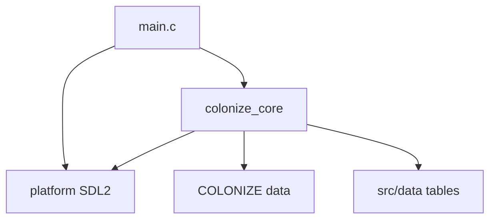

# Code architecture

Living hub for the Linux port’s **present** code shape and **intended**
architectural constraints. Fidelity bar and conflict order:
[project_goals.md](project_goals.md). Whole-project phases:
[roadmap.md](roadmap.md).

This file owns **structure and contracts** (layers, modules, control flow).
It does **not** own feature Done/Partial matrices, AI FUN inventories, or
Col1 field atlases — those stay in their owning docs (see [Where detail
lives](#where-detail-lives)).

---

## Authority

| Concern | Owner |
|---------|-------|
| Code architecture / layering (this file) | **Here** |
| Acceptance order / fidelity bar | [project_goals.md](project_goals.md) |
| Phase order / what’s next | [roadmap.md](roadmap.md) |
| Manual feature gaps | [manual_gap.md](manual_gap.md) |
| AI FUN / unpark | [ai_transcription.md](ai_transcription.md) |
| Decomp / data navigation | [original_index.md](original_index.md) |

**Non-goal:** restructuring `src/` to mirror VICEROY overlays. DOS segment maps
([`MODULE_MAP.md`](../original_sources_annotated/MODULE_MAP.md)) are for RE
navigation, not the Linux module plan. Implementation may diverge from DOS for
technological reasons; fidelity is judged by player-visible and save/interop
behavior ([project_goals.md](project_goals.md)).

---

## Present: process and layer cake

### CMake targets

From [`CMakeLists.txt`](../CMakeLists.txt):

| Target | Contents | Links |
|--------|----------|-------|
| **`colonize_core`** (STATIC) | All `src/core/*.c`, `src/data/viceroy_tables.c`, `platform/diagnostics`, `platform/dos_compat` | `m`, `pthread`; optional FluidSynth |
| **`colonize_linux`** (EXE) | `src/main.c` + `platform/linux_sdl2/sdl_runtime.c` | `colonize_core` + SDL2 |
| **Smoke tests** | Mostly `tests/smoke/test_*.c` | Mostly `colonize_core` (headless); a few recompile subsets |

Include root is `src/` (`#include "core/…"`, `#include "platform/…"`).

### Layer responsibilities (present)

| Layer | Responsibility |
|-------|----------------|
| **Platform** | Window, 320×200 present, input, ticks, sleep, mouse cursor, audio device, DOS path/port stubs |
| **Core** | Game state, simulation, screens, asset decode, sound *logic*, save codec — **UI paint lives here** (no `src/ui/`) |
| **Data (baked)** | EXE-only lookup tables extracted into `src/data/` |
| **Data (runtime)** | Original `COLONIZE/` catalogs, art, maps, sound — via `--data-dir` / `<exe>/COLONIZE` |

Presentation is an **8-bit indexed framebuffer + palette** filled by core and
presented by SDL.

---

## Present: module map (`src/`)

Cluster table (not every file). Paths are under `src/core/` unless noted.

| Cluster | Key paths | Role |
|---------|-----------|------|
| **Shell** | `game_loop.c/.h` | `ColonizeGameState` hub; mode flags; input routing; render |
| **Turn** | `turn.c/.h` | EOT processor (`TURN_PROC_*`); production / nation ticks |
| **Map** | `map`, `map_gen`, `map_panel`, `map_menu` | `.MP` layers, fog/seen, compositor helpers, panel UI |
| **Units / combat** | `units`, `unit_stack`, `unit_chrome`, `combat_strength`, `combat_analysis` | Move/orders, combat, chrome |
| **Colonies** | `colony*`, `colony_screen`, `colony_yield`, `colony_production`, `colony_craft`, `colony_preview` | Logic + colony screen |
| **Europe / economy** | `europe.c/.h` | Market, sail, recruit/hire |
| **AI** | `ai`, `ai_euro`, `ai_contact`, `ai_diplo`, `ai_king`, `ai_goals`, `ai_popup` | Init + nation-turn entry; split planners |
| **Save / Col1** | `savegame`, `col1_save`, `col1_bridge`, `col1_post_map`, `col1_stuff_census` | DOS `COLONY##.SAV` interop |
| **Assets / art** | `assets`, `madspack`, `pik`, `ss`, `ff`, `font`, `debug_atlas` | Catalogs + MADSPACK decode |
| **UI primitives** | `popup`, `popup_msg`, `ui_button`, `ui_drag`, `ui_colors`, dialogs (`save_load`, `options`, `pick_music`, …) | Wood/list modals |
| **Screens** | `new_game`, `pedia`, `reports`, `founding_fathers` | Wizard / advisors / FF |
| **Audio** | `sound.c/.h` | MIDI/SFX logic (FluidSynth when present) |
| **RNG / util** | `dos_rng`, `strutil`, `version.h` | DOS LCG fidelity |
| **Platform** | `src/platform/platform.h`, `linux_sdl2/sdl_runtime.c`, `dos_compat/` | Contract + SDL2 + stubs |
| **Baked tables** | `src/data/viceroy_tables.c/.h` | Extracted VICEROY lookups |

### Present shape facts

- **`game_loop.c` is a large orchestrator** owning mode flags (`in_menu`,
  `in_europe`, `in_colony`, `in_pedia`, `in_report`, …) and modal priority.
  Modal input gate (before parent hotkeys): pick_music → save_load → options →
  name_entry → howmuch → cheat_list → **ai_popups** → unit_stack — see
  [popups.md](popups.md) Architecture.
- UI and simulation **cohabit** in `colonize_core`; that is the present design,
  not an accidental leak from platform.
- Session hooks such as `units_set_*` context pointers exist for bring-up
  wiring; treat them as present concentration, not a public API surface.

---

## Present: key contracts and control flow

### Process entry

[`src/main.c`](../src/main.c):

1. `diag_init` → parse CLI → `ColonizePlatformConfig` / `ColonizeGameConfig`
2. `platform_create` → `game_create` → `sound_init`
3. Loop (~16 ms sleep): `platform_poll_input` → `game_set_platform` →
   `game_update` → `game_apply_mouse_cursor` → `game_render` →
   `platform_present`
4. Shutdown: `game_destroy`, `sound_shutdown`, `platform_destroy`, `diag_shutdown`

Framebuffer is fixed **320×200** indexed + `ColonizePalette`.

### Contracts (pointers, not API dumps)

| Contract | Path |
|----------|------|
| Platform API | [`src/platform/platform.h`](../src/platform/platform.h) |
| Game shell | [`src/core/game_loop.h`](../src/core/game_loop.h) — `game_create` / `game_update` / `game_render` |
| Turn / EOT | [`src/core/turn.h`](../src/core/turn.h) — `turn_processor_start` / `turn_processor_advance` |
| AI entry | [`src/core/ai.h`](../src/core/ai.h) — `ai_init_new_game`; nation turns in `ai_euro` / contact / king |
| Save slots | [`src/core/savegame.h`](../src/core/savegame.h) — `savegame_write_col1` / `savegame_read_col1` → `col1_*` + bridge |
| Assets / data root | [`src/core/assets.h`](../src/core/assets.h) — `assets_resolve_data_dir` |

### Control flow sketches

**End of turn:** human EOT in `game_loop` → `turn_processor_*` (`turn.c`) →
finish / human MP refresh. Full pipeline map:
[turn_between_players.md](turn_between_players.md).

**AI:** new game `ai_init_new_game` (`ai.c`); per nation
`ai_euro_nation_turn` / Indian / king planners.

**Save:** Col1 is the real interop path (`col1_save` + `col1_bridge` into live
pools). Legacy COLZ POC remains in `savegame.h` as bring-up residue only —
[savegame.md](savegame.md).

---

## Present ↔ DOS correspondence

Navigational only. Do **not** treat this as a required 1:1 file split.
Segment systems: [`MODULE_MAP.md`](../original_sources_annotated/MODULE_MAP.md).

| Linux cluster | Typical VICEROY systems / segments |
|---------------|-------------------------------------|
| Platform | `platform` (`1d1d`, `210d`, `1a58`, …) |
| Map draw / panel | `mapdraw` (`15eb`, `1427`), map planes (`137f`) |
| Map gen | `mapgen` (`2a1f`, …) |
| Colony screen | `colony` (`2f2b`, `647e`) |
| Europe / trade | `trade` (`38fd`) |
| Units / orders UI | `ui` (`2b5a`, …) |
| Popups / dialogs | `ui` (`6f74`, …) |
| Turn / between players | `turn` (`1984`, …) + Layer D extracts in turn docs |
| Euro / Indian / king AI | `ai` (`521d`, `4d56`, `43f7`, …) |
| Save | `save` (`75c2`) |

Decomp exports under `original_sources_decompiled/` and annotated peels under
`original_sources_annotated/` are **not compiled**. Bring-up notes and the
historical core/platform boundary sketch:
[decomp_inventory.md](decomp_inventory.md).

---

## Intended architecture

Target **constraints**, grounded in existing project authority — not a
greenfield redesign or a mandated `game_loop` rewrite phase.

### Layering

- Keep **platform thin**: present, input, time, paths, audio device.
- Keep **game rules, simulation, and screen paint** in core unless a clear
  platform concern emerges (palette/FB present already is platform;
  *what* to draw is core).
- Sound *playback device* is platform; sound *catalog / MIDI logic* stays in
  core (`sound.c`), matching the present split.

### Data

- Prefer runtime load from `COLONIZE/` catalogs, art, maps, and sound drivers.
- Bake only EXE-only algorithms/tables into `src/` / `src/data/`.
- Never make dumps, decomp C/ASM, or RE probe EXEs a runtime dependency.
- Decision rule: [data_vs_hardcoded.md](data_vs_hardcoded.md).

### Bring-up and fidelity

- Match **rules, assets, saves, inputs** — not DOS code structure
  ([project_goals.md](project_goals.md)).
- Wrap legacy behavior; do not refactor gameplay first for structure’s sake
  ([decomp_inventory.md](decomp_inventory.md) Bring-Up).
- Incomplete logic: implement closest real behavior, or **PARK** with a comment
  naming the intended effect — no invented gold/crosses fiction.
- Acceptance order when goals conflict: save/data interop → gameplay/
  determinism → UI parity → visual polish last.

### Modularization

- Split by **gameplay concern** when files grow — pattern already used for AI
  (`ai_euro`, `ai_contact`, `ai_diplo`, `ai_king`, `ai_goals`, `ai_popup`).
- Splits are **opportunistic** while implementing features, not a scheduled
  architecture phase to dismantle `game_loop`.
- Do not invent a separate `src/ui/` package solely for polish; UI-in-core is
  acceptable for the fidelity-first port.
- Do not restructure modules to mirror DOS overlays.

### Save and tests

- **Col1** remains the interoperability path; remove or quarantine legacy COLZ
  when convenient, without blocking gameplay work.
- Keep headless core smokes and the joint AI gate (`smoke_ai_joint`) as
  architecture checks for simulation / AI regressions.

### Explicitly not intended (unless decided elsewhere)

- Cloning VICEROY overlay / segment layout in `src/`
- Pixel-identical rendering as a day-one architectural requirement (phase 5
  polish in [roadmap.md](roadmap.md))
- Claiming T3 / 1:1 AI bodies as an architectural gate before gameplay
  unpark work in [ai_transcription.md](ai_transcription.md)

---

## Where detail lives

| Topic | Doc |
|-------|-----|
| Phases / what’s next | [roadmap.md](roadmap.md) |
| Feature Done/Partial/Missing | [manual_gap.md](manual_gap.md) |
| AI FUN inventory / unpark | [ai_transcription.md](ai_transcription.md) |
| EOT / between-player turns | [turn_between_players.md](turn_between_players.md) |
| Popup / modal architecture | [popups.md](popups.md) |
| Assets, formats, map draw | [assets.md](assets.md) |
| Load vs bake | [data_vs_hardcoded.md](data_vs_hardcoded.md) |
| Decomp bring-up / core–platform sketch | [decomp_inventory.md](decomp_inventory.md) |
| Decomp / data index | [original_index.md](original_index.md) |
| Save codec / Col1 bridge | [savegame.md](savegame.md) |
| Col1 field atlas | [save_format_map.md](save_format_map.md) |
| DOS segment → system map | [`MODULE_MAP.md`](../original_sources_annotated/MODULE_MAP.md) |

Update this file when layering, CMake targets, or architectural constraints
change. Keep per-feature and per-FUN status in their owning gap docs.
