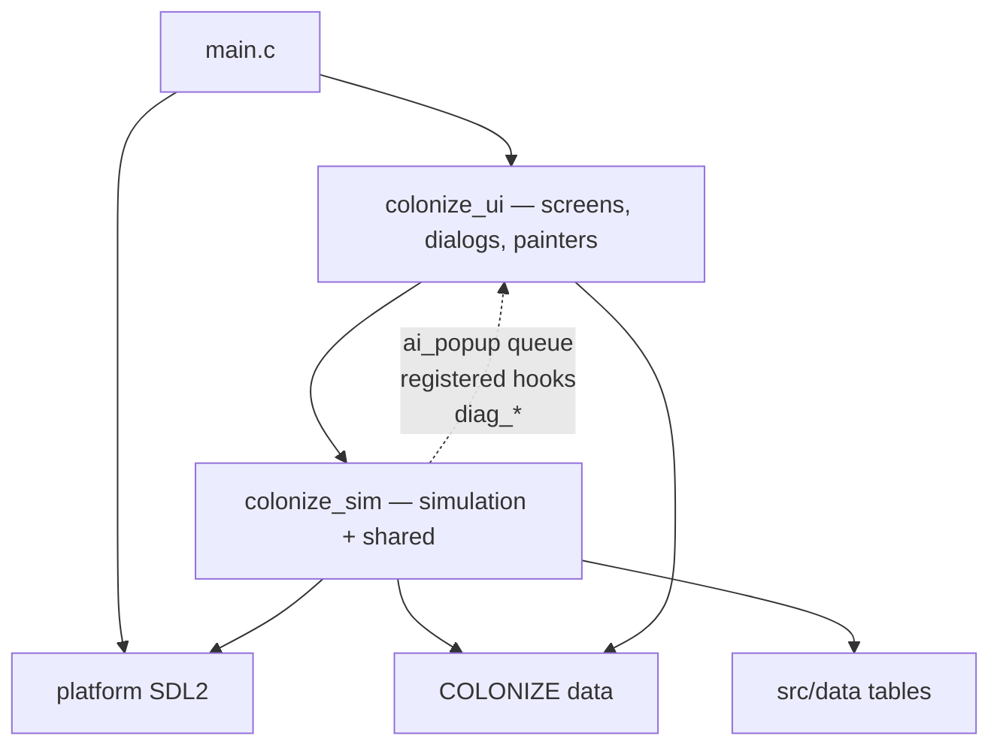

# Code architecture

Living hub for the Linux port’s **present** code shape and **intended**
architectural constraints. Fidelity bar and conflict order:
[project_goals.md](project_goals.md). Whole-project phases:
[port_plan.md](port_plan.md).

This file owns **structure and contracts** (layers, modules, control flow).
It does **not** own feature Done/Partial matrices, AI FUN inventories, or
Col1 field atlases — those stay in their owning docs (see [Where detail
lives](#where-detail-lives)).

---

## Authority

| Concern | Owner |
|---------|-------|
| Code architecture / layering (this file) | **Here** |
| Acceptance order / fidelity bar | [project_goals.md](project_goals.md) |
| Phase order / what’s next | [port_plan.md](port_plan.md) |
| Manual feature gaps | [manual_gap.md](manual_gap.md) |
| AI FUN / unpark | [port_plan.md](port_plan.md) |
| Euro AI control flow (machine-readable map + flowchart) | [ai_euro_logic_map.yaml](ai_euro_logic_map.yaml), rendered by `tools/ai_logic_map.py` to [diagrams/ai_euro_logic.html](diagrams/ai_euro_logic.html) |
| Decomp / data navigation | [original_index.md](original_index.md) |
| Feature Done / Partial / Missing | [manual_gap.md](manual_gap.md) |
| Popup inventory / authenticity | [popups.md](popups.md), [popups_catalog.md](popups_catalog.md), [popup_audit.md](popup_audit.md) |
| Combat mechanics | [combat.md](combat.md), [combat_analysis.md](combat_analysis.md) |
| Report screens (F2–F10 + HoF) | [reports.md](reports.md), [report_screens.md](report_screens.md) |
| SoL / independence | [sons_of_liberty.md](sons_of_liberty.md) |
| Indians | [indians.md](indians.md), [indians_port.md](indians_port.md) |
| Production formulas | [building_production.md](building_production.md), [terrain_yields.md](terrain_yields.md) |
| Asset formats, graphics, map | [assets.md](assets.md) |
| Music / sound | [assets_sound.md](assets_sound.md) |
| `COLONY##.SAV` layout / Col1 bridge | [savegame.md](savegame.md), [save_format_map.md](save_format_map.md) |
| Conventions, jargon, fixture traps, verification loop | [conventions.md](conventions.md) |
| Debug env vars / `debug.logs` categories | [debug_env_vars.md](debug_env_vars.md) |
| Data files vs bake-into-code (dev guide) | [data_vs_hardcoded.md](data_vs_hardcoded.md) |
| Move-into-tile authority (enter / landfall) | [move_enter.md](move_enter.md) |
| Unit orders (issue / tick / gates / port status) | [unit_orders.md](unit_orders.md) |
| Bring-up status, EOT pipeline, map fidelity gaps | [decomp_inventory.md](decomp_inventory.md) |
| Between player turns (full EOT map) | [turn_between_players.md](turn_between_players.md) |
| Difficulty level effects | [difficulty.md](difficulty.md) |
| Fandom wiki digest (1994 Col only; tier-3) | [fandom_col1994.md](fandom_col1994.md) |
| Extracted VICEROY DS tables | [viceroy_tables.md](viceroy_tables.md) |
| Decomp function catalog (all `FUN_*`, light) | [`../original_sources_annotated/FUNCTION_CATALOG.md`](../original_sources_annotated/FUNCTION_CATALOG.md) · [`MODULE_MAP.md`](../original_sources_annotated/MODULE_MAP.md) |

**Non-goal:** restructuring `src/` to mirror VICEROY overlays. DOS segment maps
([`MODULE_MAP.md`](../original_sources_annotated/MODULE_MAP.md)) are for RE
navigation, not the Linux module plan. Implementation may diverge from DOS for
technological reasons; fidelity is judged by player-visible and save/interop
behavior ([project_goals.md](project_goals.md)).

---

## Present: process and layer cake



`colonize_ui` depends on `colonize_sim`; **the reverse edge does not exist and
is enforced by the linker** (see [Layering enforcement](#layering-enforcement)).
The dotted edge is not a link dependency: the simulation reaches the player
only through channels the UI registers or drains —

- **`ai_popup`** — the popup/woodcut queue. Sim enqueues (`ai_popup_enqueue_*`,
  `woodcut_fire`); the UI drains and paints it. This is the sim→UI message bus.
- **Registered callbacks** — `units_set_*` context/hooks,
  `units_set_combat_music_hooks`, `combat_analysis_set_presenter`,
  `woodcut_set_sound_hooks`, `europe`'s sound hook. The UI installs these at
  `game_create`; sim holds only function pointers.
- **`diag_*`** — logging, from `platform/diagnostics` (shared).

### CMake targets

From [`CMakeLists.txt`](../CMakeLists.txt):

| Target | Contents | Links |
|--------|----------|-------|
| **`colonize_sim`** (STATIC) | Simulation: `map*`, `units`, `unit_chrome` (colour/flag lookups), `colony*` (less screen/chrome), `combat_*` (less render), `turn`, `europe`, `founding_fathers`, `ai*` incl. `ai_popup`, `col1_*`, `savegame`, `reports_names`, `new_game_scenario`, `woodcut` (queue), `dos_rng`. Shared: `assets`, `strutil`, `ff`, `madspack`, `popup_msg`, `sound`, `gsound_vm`, `settings`, `json_min`, `src/data/viceroy_tables.c`, `platform/diagnostics`, `platform/dos_compat` | `m`, `pthread`; optional FluidSynth |
| **`colonize_ui`** (STATIC) | Presentation: `fb`, `font`, `pik`, `ss`, `popup`, `ui_*`, `text_edit`, every `*_dialog`, `game_loop`, `game_dialogs`, `map_menu`, `map_panel`, `unit_stack`, `unit_chrome_draw`, `units_render`, `colony_screen`, `colony_chrome`, `colony_preview`, `europe_art`, `reports`, `pedia`, `new_game`, `trade_screen`, `combat_analysis_render`, `ai_popup_render`, `woodcut_present`, `declaration`, `opening`, `closing`, `debug_atlas` | **`colonize_sim`** (PUBLIC) |
| **`colonize_core`** (INTERFACE) | No objects of its own — the one name every consumer still links | `colonize_ui` (hence `colonize_sim`) |
| **`colonize_sim_linkcheck`** (SHARED) | `cmake/sim_linkcheck.c` + all of `colonize_sim` under `-Wl,--no-undefined`; builds with ALL | `colonize_sim` |
| **`colonize_linux`** (EXE) | `src/main.c` + `platform/linux_sdl2/sdl_runtime.c` | `colonize_core` + SDL2 |
| **Tests** | `tests/smoke/` (`smoke_*`), `tests/unit/` (`unit_*`), `tests/golden/` (`golden_*`) | Mostly `colonize_core` (headless); see [`tests/README.md`](../tests/README.md) |

`ai_contact_link_stubs.c` is in no library — slim tests only (see its header).

Include root is `src/` (`#include "core/…"`, `#include "platform/…"`).

### Layering enforcement

Two static archives cannot enforce a direction on their own: the UI archive is
on the link line anyway, so a sim→UI call would just resolve. The direction is
therefore checked by **re-linking the simulation objects alone** into
`libcolonize_sim_linkcheck.so` with `-Wl,--no-undefined`. Every symbol must
resolve inside `colonize_sim` or libc / libm / pthread / FluidSynth, so one
`fb_` / `font_` / `ss_` / `pik_` / `popup_` / `game_` / report-render reference
from a simulation file fails the build with a named undefined reference. The
probe is an ALL target: `make build`, `make test` and `make golden` all run it.

If a new DOS port needs to reach the player: enqueue through `ai_popup`, or add
a hook pointer the UI registers at `game_create` and call it where the direct
call would have been. If the thing you need is a lookup or a text measurement
rather than paint, move that helper to the shared half (`reports_names`,
`popup_msg`, `unit_chrome`) instead of hooking.

### Files split by half

Eleven files carry a `_<half>` sibling because logic and paint used to
cohabit. Every split was a **pure move** (2026-09-16) — bodies unchanged, only
`static` removed where the other half still calls in, via a small internal
header (`*_render.h` / `*_draw.h` / `*_art.h` / `reports_names.h`).

| Sim / shared half | UI half |
|---|---|
| `reports_names.c` (NAMES/LABELS.TXT display names) | `reports.c` (F2–F10 screens) |
| `unit_chrome.c` (nation colours, flags, crown/rebel) | `unit_chrome_draw.c` (+ `turn_draw_owner_indicator`) |
| `units.c` | `units_render.c` (`units_render_on_map`) |
| `colony.c` | `colony_chrome.c` (settlement icon, map markers) |
| `europe.c` (market, pool, docks, voyages) | `europe_art.c` (`europe_load` / `europe_free`) |
| `combat_analysis.c` (`should_show`, `log_engagement`, presenter hook) | `combat_analysis_render.c` |
| `woodcut.c` (once-only bits, pending queue, `woodcut_fire`) | `woodcut_present.c` |
| `ai_popup.c` (queue, enqueue, appliers) | `ai_popup_render.c` (geometry, portrait sheets, painter, input) |
| `new_game_scenario.c` (`@SCENARIO` start tiles) | `new_game.c` (wizard) |

### The context object: `ColonizeWorld`

`src/core/world.h` (2026-09-16). Long simulation chains used to thread the same
four to six pointers by hand — `units`, `colonies`, `map`, `col1`, `rng`,
`europe` — so 183 prototypes took a `ColonizeUnitPool*`, 143 a
`ColonizeColonyPool*`, and adding one piece of state meant editing dozens of
signatures plus every call site. `ColonizeWorld` bundles them once:

```c
typedef struct ColonizeWorld {
  ColonizeUnitPool* units;   ColonizeColonyPool* colonies;
  ColonizeWorldMap* map;     ColonizeCol1Save*   col1;   bool col1_ok;
  ColonizeDosRng*   rng;     EuropeScreen*       europe;
} ColonizeWorld;
```

Rules:

- **View struct, no ownership.** It allocates nothing and frees nothing. Build
  one on the stack and pass its address. Callees take `const ColonizeWorld* w`
  — the *view* is immutable, the pools it points at are not — so `w->map` keeps
  whatever constness the callee's own local declares.
- **Forward declarations only.** `world.h` forward-declares the six struct tags
  instead of including their headers, so it sits *under* `units.h`,
  `colony.h`, `map.h` … and any of them can include it to declare a
  `ColonizeWorld`-taking entry point with no include cycle.
- **Field names match `ColonizeTurnContext`'s**, which is the de-facto world
  struct already: `world_from_turn_ctx()` (in `turn.h`) is a field-for-field
  copy, and a migrated body keeps its original spelling through one alias line
  (`ColonizeUnitPool* pool = w->units;`).
- **Three constructors.** `world_from_turn_ctx(ctx)` for anything holding a
  turn context; `world_make(...)` for call sites that have only loose pointers
  (`game_dialogs`, UI screens); `fx_world(...)` in `tests/common/ai_fixture.h`
  for tests, which pass NULL for the pieces the call under test never reads.
- **`col1_ok`** mirrors `ColonizeTurnContext.col1_ok`. `world_make` callers
  that have no such flag pass `col1 != NULL`; no migrated body reads it yet.

**Migration shape (68 signatures, 2026-09-16).** Each converted function keeps
its body byte-for-byte; the world pointers move out of the parameter list into
alias locals at the top, and the pre-world signature survives as a `_w`-less
**compat shim** that builds a `ColonizeWorld` and forwards. Callers therefore
needed no edits, and no DOS-LITERAL logic moved. The canonical entry point is
the `_w` one; the shim is scaffolding to be retired call site by call site.
Inside a chain the shims are already gone — `units_advance_goto_w` →
`units_advance_goto_one_step_w` → `units_next_goto_step_w` /
`units_try_move_w` → `units_can_enter_w` passes `w` straight through.

Migrated modules: `units` (movement/goto/pioneer, combat, cargo, sight),
`colony`, `europe`, `ai` / `ai_goals` / `ai_contact`, `col1_bridge`,
`col1_stuff_census`, `colony_preview`, `turn`, and the UI renderers
`reports`, `map_panel`, `colony_screen`, `game_loop`'s move watch.

### Layer responsibilities (present)

| Layer | Responsibility |
|-------|----------------|
| **Platform** | Window, 320×200 present, input, ticks, sleep, mouse cursor, audio device, DOS path/port stubs |
| **Core / sim** | Game state, simulation, save codec, DOS tables and display-name lookups, asset decode, sound *logic* — no framebuffer writes |
| **Core / UI** | Screens, dialogs, sprite and font painting — **UI paint still lives in core** (no `src/ui/`), but only on the `colonize_ui` side |
| **Data (baked)** | EXE-only lookup tables extracted into `src/data/` |
| **Data (runtime)** | Original `COLONIZE/` catalogs, art, maps, sound — via `--data-dir` / `<exe>/COLONIZE` |

Presentation is an **8-bit indexed framebuffer + palette** filled by core and
presented by SDL.

---

## Present: module map (`src/`)

Cluster table (not every file). Paths are under `src/core/` unless noted.

| Cluster | Key paths | Role |
|---------|-----------|------|
| **Shell** | `game_loop.c` (+ `game_loop_{menus,saveload,render,orders,colony,eot,update}.c`, seams in `game_loop_internal.h`), `game_loop.h`, `game_dialogs.c/.h` | `ColonizeGameState` hub; mode flags; input routing; render; dialog wiring + modal input handling. The `game_loop_*.c` files are the old banner sections of the single 15k-line `game_loop.c`, moved verbatim: `_menus` cheat/trade-route/save-load popups, `_saveload` slot IO + reports/score/pedia menus, `_render` sprite blit/zoom + Europe + colony screen render + `game_create`, `_orders` unit selection/movement + foreign-colony trade, `_colony` colony UI drag&drop + Europe voyages/dock orders, `_eot` end-of-turn + map menu actions, `_update` woodcut/popup servicing + `game_update` |
| **Turn** | `turn.c/.h` | EOT processor (`TURN_PROC_*`); production / nation ticks |
| **Map** | `map`, `map_gen`, `map_panel`, `map_menu` | `.MP` layers, fog/seen, compositor helpers, panel UI |
| **Units / combat** | `units.h` (umbrella) + `units_move.h`, `units_combat.h`, `units_cargo.h`, `unit_stack`, `unit_chrome`, `combat_strength`, `combat_analysis` | Move/orders, combat, cargo; split by concern for bring-up (pool lifecycle in `units.h`, modular specialization in the three). Implementation: `units.c` was one 13.5k-line file until 2026-09-23; it is now eight files (`units.c` pool/spawn/ship ticks, `units_map.c` occupancy/sight/hooks, `units_combat.c` defender pick + outcomes + popups, `units_combat_resolve.c` land/naval resolution + fort fire, `units_capture.c` colony capture + MP accounting, `units_move.c` movement/orders/pathfinding, `units_pioneer.c` plow/road/clear, `units_cargo.c` holds/boarding/start placement) with the cross-file seams declared in `units_internal.h` |
| **Colonies** | `colony*`, `colony_screen`, `colony_yield`, `colony_production`, `colony_craft`, `colony_preview` | Logic + colony screen |
| **Europe / economy** | `europe.c/.h` | Market, sail, recruit/hire |
| **AI** | `ai`, `ai_euro` (+ `ai_euro_colony_jobs`, `ai_euro_expand`, `ai_euro_europe`, `ai_euro_goals`, `ai_euro_land`, `ai_euro_ship`, `ai_euro_act`), `ai_contact` (+ `ai_contact_demand`, `ai_contact_trade`, `ai_contact_raid`, `ai_contact_actions`), `ai_diplo`, `ai_king`, `ai_goals`, `ai_popup` | Init + nation-turn entry; split planners. The Euro AI was one 21.7k-line `ai_euro.c` until 2026-09-23; it is now eight files (dispatcher / 5952 colony jobs / wagon+found / 5d04 Europe / 0a60+colony goals / 20e6 land / ship band / act stages) with the cross-file seams declared in `ai_euro_internal.h`. `ai_contact.c` got the same treatment the same day: 10.3k lines split along its banners into five files (bookkeeping/welcome/encounter, demand economics, village trade, raids, @ACTIONS menu), seams in `ai_contact_internal.h`. |
| **Save / Col1** | `savegame`, `col1_save` (API) + `col1_save_layout.h` (on-disk), `col1_bridge`, `col1_post_map`, `col1_stuff_census` | DOS `COLONY##.SAV` interop; layout split from API |
| **Settings** | `settings.c/.h`, `json_min.c/.h` | Port-only `settings.json` preference file (see [settings.md](settings.md)) |
| **Assets / art** | `assets`, `madspack`, `pik`, `ss`, `ff`, `font`, `debug_atlas` | Catalogs + MADSPACK decode |
| **UI primitives** | `popup`, `popup_msg`, `ui_button`, `ui_drag`, `ui_colors`, dialogs (`save_load_dialog`, `options_dialog`, `pick_music`, …) | Wood/list modals |
| **Screens** | `new_game`, `pedia`, `reports`, `founding_fathers` | Wizard / advisors / FF |
| **Audio** | `gsound_vm.c/.h`, `sound.c/.h` | Literal `GSOUND.COL` driver emulation + DOS BGM scheduler, `COLDIG.BIN` SFX mixing, FluidSynth when present |
| **RNG / util** | `dos_rng`, `strutil`, `version.h` | DOS LCG fidelity |
| **Platform** | `src/platform/platform.h`, `linux_sdl2/sdl_runtime.c`, `dos_compat/` | Contract + SDL2 + stubs |
| **Baked tables** | `src/data/viceroy_tables.c/.h` | Extracted VICEROY lookups |

### Present shape facts

- **`game_loop.c` + `game_dialogs.c` orchestrate UI flow.** `game_loop.c` owns
  mode flags (`in_menu`, `in_europe`, `in_colony`, `in_pedia`, `in_report`, …)
  and modal priority; `game_dialogs.c` contains dialog wiring (game_request_*/
  game_open_*/game_apply_*_result), modal input handling, and AI popup result
  appliers. `game_update` is now a ~157-line dispatcher over `game_update_<screen>`
  functions. Modal input gate (before parent hotkeys): pick_music → save_load →
  options → name_entry → howmuch → cheat_list → **ai_popups** → unit_stack — see
  [popups.md](popups.md) Architecture.
- UI and simulation still **cohabit in `src/core/`** (there is no `src/ui/`),
  but since 2026-09-16 they are two link targets: `colonize_sim` and
  `colonize_ui`. `colonize_core` is now an INTERFACE alias for both, so no
  consumer changed. See [Layering enforcement](#layering-enforcement).
- Session hooks such as `units_set_*` context pointers exist for bring-up
  wiring; treat them as present concentration, not a public API surface.

---

## Present: key contracts and control flow

### Process entry

[`src/main.c`](../src/main.c):

1. `diag_init` → parse CLI → `ColonizePlatformConfig` / `ColonizeGameConfig`
2. `platform_create` → `game_create` → `sound_init`
3. Loop (~16 ms sleep): `platform_poll_input` → `game_set_platform` →
   `game_update` → `game_apply_mouse_cursor` → `game_render` →
   `platform_present`
4. Shutdown: `game_destroy`, `sound_shutdown`, `platform_destroy`, `diag_shutdown`

Framebuffer is fixed **320×200** indexed + `ColonizePalette`.

### Contracts (pointers, not API dumps)

| Contract | Path |
|----------|------|
| Platform API | [`src/platform/platform.h`](../src/platform/platform.h) |
| Game shell | [`src/core/game_loop.h`](../src/core/game_loop.h) — `game_create` / `game_update` / `game_render` |
| Turn / EOT | [`src/core/turn.h`](../src/core/turn.h) — `turn_processor_start` / `turn_processor_advance` |
| AI entry | [`src/core/ai.h`](../src/core/ai.h) — `ai_init_new_game`; nation turns in `ai_euro` / contact / king |
| Save slots | [`src/core/savegame.h`](../src/core/savegame.h) — `savegame_write_col1` / `savegame_read_col1` → `col1_*` + bridge |
| Assets / data root | [`src/core/assets.h`](../src/core/assets.h) — `assets_resolve_data_dir` |

### Control flow sketches

**End of turn:** human EOT in `game_loop` → `turn_processor_*` (`turn.c`) →
finish / human MP refresh. Full pipeline map:
[turn_between_players.md](turn_between_players.md).

**Blocking-popup invariant (2026-09-01):** every player-facing modal blocks all
simulation, DOS-style. Time/turn processing runs **only** with the overland map
on screen and nothing over it. Two enforcement points in `game_loop.c`:
`game_turn_flow_allowed` (unit hand-offs / end-turn starts; also false while
the EOT processor is active) and the EOT branch at the top of `game_update`,
which presents queued popups/woodcuts **mid-EOT** and freezes
`turn_processor_advance` until each is answered — dialogs are no longer hoarded
until FINISH. New popup-ish features need no per-site gating: enqueue via
`ai_popup` / open a `game_modal_open`-listed dialog and the pipeline stops by
construction. If a new modal type is added, it must be added to
`game_modal_open`.

**AI:** new game `ai_init_new_game` (`ai.c`); per nation
`ai_euro_nation_turn` / Indian / king planners.

**Save:** Col1 is the real interop path (`col1_save` + `col1_bridge` into live
pools). The legacy native COLZ POC format was removed 2026-08-29 —
[savegame.md](savegame.md).

---

## Present ↔ DOS correspondence

Navigational only. Do **not** treat this as a required 1:1 file split.
Segment systems: [`MODULE_MAP.md`](../original_sources_annotated/MODULE_MAP.md).

| Linux cluster | Typical VICEROY systems / segments |
|---------------|-------------------------------------|
| Platform | `platform` (`1d1d`, `210d`, `1a58`, …) |
| Map draw / panel | `mapdraw` (`15eb`, `1427`), map planes (`137f`) |
| Map gen | `mapgen` (`2a1f`, …) |
| Colony screen | `colony` (`2f2b`, `647e`) |
| Europe / trade | `trade` (`38fd`) |
| Units / orders UI | `ui` (`2b5a`, …) |
| Popups / dialogs | `ui` (`6f74`, …) |
| Turn / between players | `turn` (`1984`, …) + Layer D extracts in turn docs |
| Euro / Indian / king AI | `ai` (`521d`, `4d56`, `43f7`, …) |
| Save | `save` (`75c2`) |

Decomp exports under `original_sources_decompiled/` and annotated peels under
`original_sources_annotated/` are **not compiled**. Bring-up notes and the
historical core/platform boundary sketch:
[decomp_inventory.md](decomp_inventory.md).

---

## Intended architecture

Target **constraints**, grounded in existing project authority — not a
greenfield redesign or a mandated `game_loop` rewrite phase.

### Layering

- Keep **platform thin**: present, input, time, paths, audio device.
- Keep **game rules, simulation, and screen paint** in core unless a clear
  platform concern emerges (palette/FB present already is platform;
  *what* to draw is core).
- Sound *playback device* is platform; sound *catalog / MIDI logic* stays in
  core (`sound.c`), matching the present split.

### Data

- Prefer runtime load from `COLONIZE/` catalogs, art, maps, and sound drivers.
- Bake only EXE-only algorithms/tables into `src/` / `src/data/`.
- Never make dumps, decomp C/ASM, or RE probe EXEs a runtime dependency.
- Decision rule: [data_vs_hardcoded.md](data_vs_hardcoded.md).

### Bring-up and fidelity

- Match **rules, assets, saves, inputs** — not DOS code structure
  ([project_goals.md](project_goals.md)).
- Wrap legacy behavior; do not refactor gameplay first for structure’s sake
  ([decomp_inventory.md](decomp_inventory.md) Bring-Up).
- Incomplete logic: implement closest real behavior, or **PARK** with a comment
  naming the intended effect — no invented gold/crosses fiction.
- Acceptance order when goals conflict: save/data interop → gameplay/
  determinism → UI parity → visual polish last.

### Modularization

- Split by **gameplay concern** when files grow — pattern already used for AI
  (`ai_euro`, `ai_contact`, `ai_diplo`, `ai_king`, `ai_goals`, `ai_popup`).
- Splits are **opportunistic** while implementing features, not a scheduled
  architecture phase to dismantle `game_loop`.
- Do not invent a separate `src/ui/` package solely for polish; UI-in-core is
  acceptable for the fidelity-first port.
- Do not restructure modules to mirror DOS overlays.

### Save and tests

- **Col1** is the only save path (legacy COLZ removed 2026-08-29).
- Keep headless smoke/unit suites as architecture checks for simulation
  regressions. The AI cluster is **fully live** again: `golden_ai_turns` and
  the joint smoke pair (`smoke_ai_mid01` / `smoke_ai_late01`, renamed from
  `golden_ai_*` 2026-09-14) all run in a default `ctest`, and no test carries
  a `DISABLED` property in [`CMakeLists.txt`](../CMakeLists.txt). The parking
  that started 2026-08-19 ended 2026-09-05 (port_plan T1.23 / T3.3).
  `golden_ai_joint` is a **build-only convenience target** that re-runs the
  six gates in one shot (`cmake --build build/debug --target golden_ai_joint`); it
  has no `add_test()` registration, because each of the six is already its
  own ctest test.

### Explicitly not intended (unless decided elsewhere)

- Cloning VICEROY overlay / segment layout in `src/`
- Pixel-identical rendering as a day-one architectural requirement (phase 5
  polish in [port_plan.md](port_plan.md))
- Claiming T3 / 1:1 AI bodies as an architectural gate before gameplay
  unpark work in [port_plan.md](port_plan.md)

---

## Where detail lives

| Topic | Doc |
|-------|-----|
| Phases / what’s next | [port_plan.md](port_plan.md) |
| Whole-project agent work queue | [port_plan.md](port_plan.md) |
| Feature Done/Partial/Missing | [manual_gap.md](manual_gap.md) |
| AI FUN inventory / unpark | [port_plan.md](port_plan.md) |
| EOT / between-player turns | [turn_between_players.md](turn_between_players.md) |
| Popup / modal architecture | [popups.md](popups.md) |
| Assets, formats, map draw | [assets.md](assets.md) |
| Load vs bake | [data_vs_hardcoded.md](data_vs_hardcoded.md) |
| Decomp bring-up / core–platform sketch | [decomp_inventory.md](decomp_inventory.md) |
| Decomp / data index | [original_index.md](original_index.md) |
| Save codec / Col1 bridge | [savegame.md](savegame.md) |
| Persisted options (`settings.json`) | [settings.md](settings.md) |
| Col1 field atlas | [save_format_map.md](save_format_map.md) |
| DOS segment → system map | [`MODULE_MAP.md`](../original_sources_annotated/MODULE_MAP.md) |

Update this file when layering, CMake targets, or architectural constraints
change. Keep per-feature and per-FUN status in their owning gap docs.
