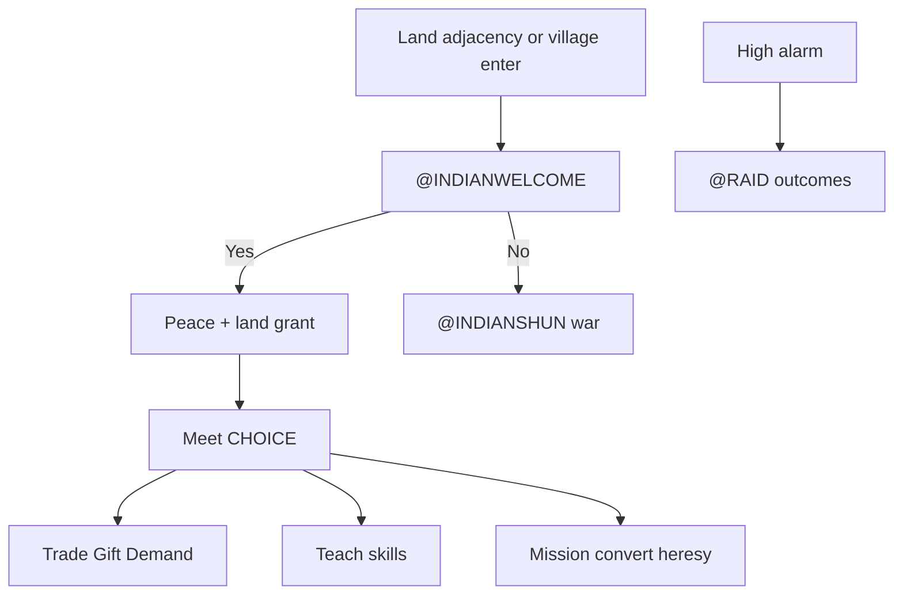

# Indians

Hub for native nations in Sid Meier's Colonization (1994): graphics, unit and
settlement types, tribe differentiation, alarm, and European contact. Deep FUN
checklists stay in annotated AI extracts — this file is the topic map.

Authority order: [project_goals.md](project_goals.md) (decomp / NAMES → manual →
fandom). Feature checklist: [manual_gap.md](manual_gap.md) §Indians. Port FUN
status: [port_plan.md](port_plan.md).

## Sources

| Source | Role |
|--------|------|
| [`COLONIZE/NAMES.TXT`](../COLONIZE/NAMES.TXT) `@TRIBES` / `@LEVELS` / `@UNIT` / `@ATTITUDE` / `@ACTIONS` / `@JOB` | Shipped catalogs (tech, specialty, icons, attitude labels) |
| [`COLONIZE/TRIBE.TXT`](../COLONIZE/TRIBE.TXT) | AMERICA village seed coordinates |
| [`COLONIZE/GAME.TXT`](../COLONIZE/GAME.TXT) `@INDIAN*` / `@RAID*` / `@MISSION*` | Dialog tags |
| `FUN_4d56_*` / `FUN_6a09_*` / `FUN_5bfb_*` / `FUN_4cc6_*` / `FUN_5fef_*` in [`viceroy_unpacked.c`](../original_sources_decompiled/viceroy_unpacked.c) | **Authoritative** nation turn, placement, meet, relations, raid loot |
| [`indian_contact.md`](../original_sources_annotated/ai/indian_contact.md) (+ trade / settlement / raid siblings) | Layer D contact / alarm / meet map |
| [`Colonization.pdf`](../COLONIZE/Colonization.pdf) pp.67–78 | Manual Natives prose |
| [fandom_col1994.md](fandom_col1994.md) §Natives | Tier-3 — Unverified until reconciled |
| Port [`ai_contact.c`](../src/core/ai_contact.c), [`ai.c`](../src/core/ai.c), [`ai_diplo.c`](../src/core/ai_diplo.c), [`map_panel.c`](../src/core/map_panel.c), [`col1_save.h`](../src/core/col1_save.h) | Wired stand-ins; PARK comments name gaps |

Col1 layouts: `ColonizeCol1Tribe` / `ColonizeCol1Indian` — field atlas in
[save_format_map.md](save_format_map.md). Nation ids **4–11** = `@TRIBES` order
(Inca…Tupi); Euro ids **0–3**.

---

## Graphics

| Asset | Use |
|-------|-----|
| `ICONS.SS` **#10–13** | Village markers by `indian.tech` (tipis / adobe / pyramid / city). `MAP_PANEL_TRIBE_ICON_BASE` 10 in [`map_panel.c`](../src/core/map_panel.c); sidebar Locat uses the same tech icon |
| `ICONS.SS` **109–112** | Unit blit indices from `@UNIT` icons **110–113** (1-based → 0-based on load) — Braves / Armed / Mtd. Braves / Mtd. Warriors |
| Minimap | Tribe dots palette **12** ([assets.md](assets.md)) |
| `REPORT9.PIK` | F9 Indian Adviser |
| `IND0A0.SS`…`IND7A3.SS` | Shipped 8 nations × 4 alarm tiers (`FUN_15dc_00a2` bands of `alarm_by_player`). **Loaded 2026-08-29** as the chief portrait beside every tribe-addressed contact popup (`ai_popup.c`, `FUN_6f74_0042` — DS:0x1f77 holds the literal `"IND0A0"`, DOS adds the tribe to byte 3 and the quartile to byte 5, so the name is patched in place, never formatted). **Placement made DOS-literal 2026-09-07e** (`FUN_6f74_14c6`, OVL24 `0x17a0..0x189c`): span = `dialog_w + sprite_w + 6` clamped to 320, `span_x = 160 − span_w/2`; sprite LEFT for tribes 0/3/5/7 and the King, RIGHT otherwise; the DOS gutter word starts at **−3** (not 0) and only becomes `span_w − 323` on clamp, so the left arm puts the dialog at `span_x + sprite_w + 6` and the right arm the sprite at `span_x + dialog_w + 3`; sprite top = `100 − (sprite_h + 3)/2`. Sheet dims are the loaded sprite's (DOS `+0x4a/+0x4c` is a runtime field — the `.SS` header carries no bounding box); `KING.SS` and `KING2.SS` are both 79×161, so the port's base/overlay max is a no-op |

Draw order on the main map: colonies → villages → units so stacked units stay
visible ([assets.md](assets.md)).

**Capital marker:** Col1 `tribe.state.capital` bit drives growth, homeland
radius, surrender, and Cortes `rich_capital`. Fandom “starburst” on capitals is
**Unverified vs DOS** as a separate sprite — Linux blits the same tech icon
`#10–13` for capital and satellite villages.

Euro colony contrast: settlement art **#0–3** (none / stockade / fort /
fortress).

---

## Unit types

From `NAMES.TXT` `@UNIT` (Indian block). Comment columns: icon, movement,
attack, combat, …

| Name | Icon (1-based) | Moves | Attack | Combat | Notes |
|------|---------------:|------:|-------:|-------:|-------|
| Braves | 110 | 1 | 1 | 1 | Base; Viceroy type **19** (`VICEROY_UNIT_TYPE_BRAVE`) |
| Armed Braves | 111 | 1 | 2 | 2 | Muskets |
| Mtd. Braves | 112 | 4 | 2 | 2 | Horses |
| Mtd. Warriors | 113 | 4 | 3 | 3 | Horses + muskets |

Nation stocks `indian.muskets` / `horse_herds` / `horse_breeding` feed equipment
upgrades (Col1; see save atlas). Quiet Brave AI: `FUN_4d56_14fe` → Linux
`ai_native_nation_pulse` (history: port_plan.md T1.23). Brave MP uses
terrain table ×3 (same scale note as unit orders).

**2026-09-08 — `01e2`/`14fe` audit closed.** Both re-read off the raw asm
(Ghidra mis-resolves every `PUSH CS; CALL` in overlay `0x0C` into `CODE_112`;
the truth is the 15-entry JMPF stub table at `4d56:4c22..4c6c`,
`turn/mid_pass_indian_rank.md`).

- `FUN_4d56_01e2` (`4d56:01e2..0219`) is **not** act plumbing: it is the
  tribe-wipe helper — `nation = arg + 4`, descending walk of the tribe array
  (`DS:0x54ec`, stride `0x12`, count `DS:0x539a`), `FUN_4d56_00e0(i)` for every
  row whose `+2` nation byte matches. It is **dead code** in the shipped EXE
  (absent from the export stub table, no near CALL/JMP in segment `4d56`, no
  bank record targets it), so there is nothing to port. `col1_kill_indian_nation`
  (`ai.c`) is a Linux invention with a wider blast radius; `col1_destroy_tribe_at`
  (`units.c`) is the real `00e0` port.
- `FUN_4d56_14fe` (`4d56:14fe..152c`) is **faithful** and is three branches
  only: `dir = FUN_4d56_021a(unit)`; `dir != 8` → `FUN_2a1f_0150` (→ `465b`
  step); else `FUN_281f_0934` (exhaust MP — the guarding `dir >= 0` test is
  dead). `021a` already exhausts on its own `dir == 8` exit (`021a:14e6`), so
  the Linux `moves_left = max_mp` covers both writes.
- The residue behind the old "partial (T2 quiet)" label is the **callee**:
  `FUN_4d56_021a` (`4d56:021a..14fd`, 4836 bytes, one function) — the Indian
  unit decision routine Ghidra emitted as raw `??` bytes, reached from `14fe`
  via stub `4c3b`. It calls the `521d` move scorer through thunk `291f:012c`
  (`021a:1182`), so the ported quiet formula sits one level *below* it. Newly
  decoded there and **unported**: homeless-unit despawn (`021a:0337`, bad
  `+0x314a` → `FUN_281f_0808` + return −1); unconditional `facing` write
  including the stay value 8 (`021a:11b9` → `+0x314f`); the `orders` cower
  latch 5→6 on stay, 0 on move (`021a:11cd`/`126e`); and the **in-field
  arm/mount upgrade** (`021a:11cd..126c`) — a Brave that stays on its own
  tribe's tile gets type `0x13`/`0x15` → +1 when `indian+7` muskets > 0 (musket
  spent on `rng_range(0, difficulty) == 0`) and += 2 when `indian+0x0a`
  horse_breeding ≥ `0x19` and max MP ≤ 3 (`-= 0x19`). This is separate from the
  spawn-time arming already ported in `ai_indian_152e_village_growth`
  (thresholds `0x31`/`0x32` there) and is the DOS source for the "nation stocks
  feed equipment upgrades" line above.
- Caller-side (`1816` §7/§8) deltas, report-only because
  `tests/golden/test_ai_turns.c:195` compares Brave `moves`/`turns_worked`: DOS
  increments the act counter `+0x315a` (= `turns_worked`) once per **attempt**
  before calling `14fe` (`4d56:1af3`), caps at `0x14` then exhausts and zeroes
  it; the Linux pulse bumps `turns_worked` only after a committed step. Gate is
  `FUN_281f_097a` → `FUN_1427_13b0` (AX-register arg): index in range, `+0x3144`
  ≥ 0, nation nibble == `DS:0x5394`, `(+0x3148 & 0x80) == 0 || type == 0x0b`,
  and `+0x3149` spent < max MP.

Related catalogs:

| Catalog | Indian-relevant entries |
|---------|-------------------------|
| `@JOB` | **Convert** (`Indian Converts`) — missionary / Sepulveda / Las Casas paths |
| `@ORDERS` | **Live In Village** |
| `@ACTIONS` | Trade With Village, Enter Hostile Village, Establish Mission, Denounce Heresy, Live Among The Natives, Speak With Chief, Incite Indians, Demand Tribute, Attack Village |

Euro units that drive contact: Scout, Pioneer, Soldier, Dragoon, Artillery,
Missionary / Jesuit (encroachment and mission pulses).

---

## Settlement types

### Tech class (`@LEVELS` ↔ `indian.tech`)

| Tech | Level name | Settlement word | Map icon |
|-----:|------------|-----------------|----------|
| 0 | Semi-Nomadic | Camp | `#10` tipis |
| 1 | Agrarian | Village | `#11` adobe |
| 2 | Advanced | City | `#12` pyramid |
| 3 | Civilized | City | `#13` city |

`@LEVELS` also lists `<Any>, Capital, Capitals` — capital is the **state bit**,
not a fifth tech.

### Nations (`@TRIBES`)

| Nation id | Plural / short | Specialty good | Tech | UI color |
|----------:|----------------|----------------|-----:|---------:|
| 4 | Incas / Inca | Jewelled Relics | 3 | 97 |
| 5 | Aztecs / Aztec | Gold Bars | 2 | 149 |
| 6 | Arawaks / Arawak | Bone Jewelry | 1 | 54 |
| 7 | Iroquois / Iroquois | Wood Carvings | 1 | 87 |
| 8 | Cherokee / Cherokee | Turquoise | 1 | 67 |
| 9 | Apache / Apache | Beads | 0 | 111 |
| 10 | Sioux / Sioux | Beads | 0 | 118 |
| 11 | Tupi / Tupi | Gems | 0 | 71 |

`NAMES.TXT` also lists extra tribe name pairs (Maya, Huron, …) after the eight
playable nations — cosmetic / scenario pool, not additional `indian[8]` slots.

### Placement and growth

| Mode | Source |
|------|--------|
| AMERICA | [`TRIBE.TXT`](../COLONIZE/TRIBE.TXT) `@INCA`…`@TUPI` coordinates |
| NEW WORLD | Procedural `FUN_6a09_0006` → `ai_place_tribes_procedural` (capitals then satellites) |

**NEW WORLD-only Silver bid bonus (wired 2026-08-24).** After every capital
and satellite tribe is placed, `FUN_6a09_0006`'s own tail re-walks each tribe
and scans the 5×5 window centered on its own tile for terrain class `0x1b`,
adding that nation's `tech` to `indian.hill_silver_bid_bonus` per hit (read
side already fed the tribe's Silver bid — see `ai_contact.c`). Class `0x1b`
is **Mountains**, not Hills — the field's original name was a decode-era
mislabel (raw `.asm` of `FUN_13e4_000e` and `map.c`'s independent
MAPEDIT-derived convention agree: `0x1b`=Mountains, `0x1c`=Hills); kept the
existing field name (no rename of a live field) and fixed the comments +
the write side instead. AMERICA-mode tribes never get this bonus — it's
specific to the NEW WORLD/procedural placement function, not the
TRIBE.TXT path. Full trace: `col1_save.h`'s `hill_silver_bid_bonus` comment
and `ai.c`'s `ai_place_tribes_procedural`/`ai_decoded_type`.

Initial village population = **`3 + 2*tech`**. Growth `FUN_4d56_152e` /
`ai_grow_villages`: accumulates on **capitals only**; threshold accum **> 19**;
pop cap **15**. Empty-tile Attack (`FUN_5fef_1b0e`): temp Brave fight from the
**adjacent** tile (attacker stays put), then **`population--`**, or **destroy**
when `population < 2` (so a pop-3 camp survives two successful raids). Map Braves
that patrol nearby are separate — killing one does not burn the dwelling.

Homeland (tribal-land) radius: the tribe's tech tier — `FUN_15dc_006a`:
tech 0/1 → **1**, tech 2 (Aztec) → **2**, tech 3 (Inca) → **3**, nearest
village on the **same continent** (`FUN_4cc6_0356` / the 5x5 native cache).
**Re-verified 2026-09-04** (bugs.md "Indian land should only be a 1-tile
radius"): `FUN_15dc_006a(nation)` reads `nation*0x4e + 0x5ad8` (tech) and
returns 1 / 1 / 2 / 3; all three call sites test `dist <= radius`
(`viceroy_unpacked.c:12850` colony tile cache, `viceroy_unpacked_2.c:75564`
and `:75663` the `@INDIANLAND` found/clear gate). 1 tile is right for six of
the eight nations — only Aztec (2) and Inca (3) reach further. `colony.c`
`colonies_indian_land_radius` matches; **not a defect**.
Was the manual's "capital 2" rule until 2026-08-28 (`colony.c`
`colonies_tile_indian_homeland`).

**Which tiles the colony screen may mark (2026-09-04, bugs.md 372).** The
5x5 table `FUN_15eb_26e4` builds is not just "village within radius":

* `FUN_13e4_0074(tile)` clears the slot whenever the terrain index is **25 or
  26** (Ocean / Sea Lane) — no totem ever sits on water, however close the
  village is. Arctic (24) is *not* excluded.
* The continent filter passed to `FUN_4cc6_0356` is read **once, at the colony
  tile** (`uVar2 = FUN_137f_02a0(colony.x, colony.y)`, hoisted above the loop),
  not per cell. A village on a neighbouring island can therefore never claim a
  cell of this colony's ring. The unit-side gates (`FUN_479b_043b` / `_0687`,
  clear-forest and road) read it at their own tile instead — different call
  site, different origin.
* The slot is also cleared for a worked field tile (`FUN_15eb_06a6`), for
  already-purchased land (`FUN_15eb_0620`, mask bit 0x10), for an unmet tribe
  (`FUN_15b3_0004 & 0x20`) and, wholesale, for Peter Minuit
  (`FUN_15eb_3960(nation, 2)`).

Port: `colonies_indian_claim_tribe_from(col1, map, pool, nation, origin_x,
origin_y, x, y)`; `colonies_indian_claim_tribe` is the origin==tile wrapper.

Founding / clearing / road-building on
such a tile at PEACE with the owner raises the DOS `@INDIANLAND` /
`@INDIANFOREST` / `@INDIANROAD` CHOICE (respect / offer gold / take it);
outside that dialog nothing is charged — see
[indian_actions_menu.md](../original_sources_annotated/ai/indian_actions_menu.md).

**Teach skill is always free** (no gold changes hands either way — corrected
2026-08-13, was never wired to charge). Non-capital villages teach **one**
skill to **one** colonist, **total across all Euro nations** — once any
nation's colonist learns there, the offer is gone for everyone. The tribe's
**capital** is exempt from that one-shot and teaches unlimited colonists.
`ai_contact_teach_skill` (`ai_contact.c`) implements this via
`tribe.state.learned` (one-shot, shared — matches "total across all
nations") gated by `!tribe.state.capital` (capital bypasses the gate).

**Human teach is the "Live Among The Natives" menu action** (2026-08-28,
`ai_contact_live_among_natives` = `thunk_FUN_1000_a618`): `@LEARNSTAY`
Yes/No, `@LEARNSLOW` random refusal in the 25..49 alarm quartile,
`@LEARNMAD` (+3 alarm) at quartile ≥ 2, `@TEACHCONVERT`, `@LEARNMASTER`,
`@LEARNCRIMINAL`, `@LEARNALREADY`. The taught skill is DOS's weighted draw
over the 2154 bid table (tech-trimmed; Fur Trapper → Seasoned Scout on
`(x+y)%3==0`; Farmer → Fisherman by an ocean-ring roll), seeded from the
village position so each village always offers the same skill. The
per-turn auto-teach pulse now runs for AI nations only.

Key tribe fields: `x`/`y`, `nation_id`, `state.{capital,learned,scouted,…}`,
`population`, `mission` (`0xff` none; low nibble Euro id; bit `0x10` Jesuit),
`last_bought` / `last_sold`, `alarm[4]`.

---

## Tribe “personality”

There is **no dedicated personality byte** in Col1 or NAMES. Differentiation is:

| Mechanism | Effect |
|-----------|--------|
| **`indian.tech`** | Settlement art class, initial pop, meet-scoring weight (`FUN_4d56_2154`) |
| **Specialty good** (`@TRIBES` field 3) | Trade chrome flavor (`Jewelled Relics` … `Gems`) — not the teach profession |
| **UI color** | Tribe tint from `@TRIBES` |
| **Teach outdoor map** | Nation → default `@JOB` when `last_sold` unset (Inca→Silver Miner … Tupi→Sugar Planter) — [indian_contact.md](../original_sources_annotated/ai/indian_contact.md) |
| **Runtime attitude** | Alarm / friction → `@ATTITUDE` labels (Content … War) |

Fandom “Aztec warlike / Inca peaceful” ([fandom_col1994.md](fandom_col1994.md))
is **Unverified vs DOS**. Observed nation bias in code/docs is tech + Spanish
conquest / French cooperation hooks, not a named personality enum.

---

## Alarm

### Two layers

| Layer | Field | Scope |
|-------|-------|-------|
| Nation × Euro | `ColonizeCol1Indian.alarm_by_player[4]` | Whole native nation toward each European |
| Village × Euro | `ColonizeCol1Tribe.alarm[4].{friction,attacks}` | Per settlement; `attacks` also tracks retaliation budget (save atlas) |

Nation turn prelude (`FUN_4d56_1816` → `ai_contact_indian_prelude`) bumps both
layers together on escalation. Clamp alarm ≥ 0 after prelude.

**DS:0x54f6 "grudge/tension" is NOT a third layer — corrected 2026-09-08.**
It is the *village × Euro* row above, read as a whole 16-bit word. The
settlement record lives at `DS:0x54ec` with stride `0x12`, and DOS's own
indexing

```
(tribe * 9 + nation) * 2 + 0x54f6   ==   tribe * 0x12 + 0x54ec + 10 + nation * 2
```

is byte-for-byte field **+10** of that record: `int16_t attitude[4]`, one
**signed** word per European nation. (The apparent "stride 9 words" *is* the
record stride — 9 × 2 = 0x12.) In the port that word is
`ColonizeCol1Tribe.alarm[nation]` = `{uint8_t friction; uint8_t attacks;}`,
low byte `friction`, high byte `attacks` — already byte-exact, already inside
the saved tribe blob (`col1_save.c` tribes read/write), and — since 2026-09-08 —
fed by **all four** DOS raisers:

| DOS raiser | Amount | Port |
|---|---|---|
| `FUN_465b_0000` trespass | `attacks++` = **+0x100** | `units.c` |
| `FUN_4d56_152e` encroachment arm | accumulator | `ai.c` |
| `FUN_5bfb_022e` @INDIANBEGFOOD refused | **×1.5** (`w += w >> 1`) | `ai_contact_apply_beg_food` |
| `FUN_5bfb_022e` LAB_5bfb_0ff2 — @INDIANCITY / @INDIANWAGONS reparations refused | **+0x80** | `ai_contact_apply_reparations` |

The last row was the file's one remaining unported raiser until 2026-09-08.
It is the shared `else` limb of LAB_5bfb_0def's two demand sites (raw
`viceroy_unpacked.c:96973`): the village names a good it wants — out of a
colony's stores (`@INDIANCITY`, tag `0x1866`) or the whole of hold 0 of a
Wagon Train it walked up to (`@INDIANWAGONS`, tag `0x1871`) — and a refusal
costs no goods but adds `0x80` to that settlement's word. Since `022e` reads
`0x7f < word` at its head (`local_10`) as the "this village is sore at you"
latch, **one refusal permanently moves that village off the gift arm and onto
the demand arm** — which is what makes this raiser worth having.

Accepting runs the other limb: the word is zeroed outright and the nation
alarm takes a **negative** `price[cargo] * qty * 4 / -100` delta
(`FUN_281f_0d6c`), walked down in steps of 5 while `alarm + delta >= 0x47` at
the `@INDIANCITY` site only. `price[]` is the DS:0x84BC (`−0x7b44`) byte row
the port already carries as `k_2820_throttle`. `@INDIANCITY` accepts also run
DOS's arming tail — Muskets arm the visiting Brave (type +1) or bank
`indian.muskets`; Horses mount it (type +2) or bank `horse_breeding += 0x32`,
and always `horse_herds += 1`.

The two GAME.TXT sections print their rows in **opposite** order, which is why
DOS reads `local_c != 2 → refuse` at `0x1866` and `local_c == 1 → accept` at
`0x1871`: `@INDIANCITY` is "Man the stockade." / "Hand them over.",
`@INDIANWAGONS` is "Hand them over." / "Circle the wagons.". That text is what
finally settles the accept/decline polarity `indian_contact.md` recorded in
2026-08-14 as unrecoverable.

Read and write the word through `col1_tribe_attitude` /
`col1_tribe_attitude_set` (`col1_save.h`), which sign-extend / re-split the
two bytes the way DOS's signed `int` accesses do.

*Retired 2026-09-08:* `ColonizeCol1Save.indian_tension`, a parallel
`int16_t[tribe_count*4]` array added 2026-08-19 on the misreading that 0x54f6
was a standalone table. It was `calloc`'d to zero on every load, never
serialized and never raised, so every reader saw dead zeros and every writer
wrote into scratch. All consumers now key off the real record word; the array,
its alloc/free and the two array-compaction remaps that existed only to keep it
aligned (`units.c` village destroy, `ai.c` whole-nation kill) are gone — the
word rides the tribe record.

DOS's clamping write site is `FUN_4cc6_00f2` (relation-delta,
`ai_diplo_indian_relation_delta` in `ai_diplo.c`): on a negative relation delta
that crosses a 5-point tier boundary, clamp every tribe-of-that-Indian-nation's
attitude word down to `0x20` (new relation <50) or `0x60` (≥50) — the write
rebuilds *both* bytes, so a clamp also drops the `attacks` count. See
`docs/archive/mysteries_catalog.md`'s "0x54f6" entry for the older formula
trace (its "separate table" framing is superseded by this section).

**Read side wired 2026-09-08 — `FUN_521d_0896`, the hostility gate**
(`ai_goals.c`, `ai_goals_filter_profession_by_distance_wealth`; the catalog
name is an inferred mislabel kept for SYMBOL_MAP continuity). Raw body,
`viceroy_unpacked.c:87319-87340`:

```
if (3 < param_2) {                       /* owner id: 0..3 Euro, >=4 Indian */
  if (param_3 == 0) return -1;
  iVar2 = FUN_281f_030c(0x521d, param_2 + -4, param_1);   /* DS:0x5b1c alarm */
  bVar1 = 0x4a < iVar2;
  if ((-1 < param_4) &&
     (0x7f < *(int *)((*(char *)(param_4 * 0x1c + 0x314a) * 9 + param_1)
                      * 2 + 0x54f6))) bVar1 = true;       /* DS:0x54f6 tension */
  if (!bVar1) return -1;
}
return param_2;
```

Ghidra prepends the far-call segment word, so at the two `FUN_521d_0906`
call sites (`thunk_FUN_2a1f_056c(0x281f, param_3, iVar5, param_4, local_10)`)
the real order is `param_1` = acting Euro nation, `param_2` = the adjacent
tile's owner id, `param_3` = 0906's own flag, `param_4` = the unit index on
that tile (`-1` for Euro owners and for the settlement probe). The tension
row key is the *tile unit's* `+0x06` home settlement id (`DS:0x314a`,
`ColonizeUnit.home_tribe_id`), not the Indian nation — same key
`ai_contact_indian_raids` and `units.c` write with. The "stride 9" is the
settlement-record stride, so the cell is `col1->tribe[home].alarm[nation]`
read as one signed word (`col1_tribe_attitude`).

Meaning: **an adjacent native raises a Euro-AI contact claim only when that
Indian nation is already hostile (alarm > 74) or that specific village
carries a grudge (attitude word > 127 — so any village with one recorded
trespass, `attacks ≥ 1` = word ≥ 0x100, qualifies, as does friction > 127).**
Live since 2026-09-08 against real state; before the repoint it read the
phantom array and could never fire. `param_3 == 0` rejects outright — that is
the `20e6` explorer-flag probe (`ai_euro_20e6_probe_adjacent`), so only the
`0a60` tile-housekeeping probe (`ai_euro.c`, flag 1, sets `act_state = 10`)
can ever see a native claim. Both reads were parked at 0 before this pass.

One further DOS read of DS:0x54f6 (the second, `FUN_5952_035e`, was ported
2026-09-08 — see below) turned out to need no port at all once the word was
identified:

* `FUN_112b_0790` (village map/settlement chrome, `viceroy_unpacked.c:2411-2425`)
  — `iVar6 = (tribe * 9 + nation) * 2; iVar7 = *(int*)(iVar6 + 0x54f6); if
  (iVar7 < 0) iVar7 = 0; *(int*)(iVar6+0x54f6) = iVar7;` (a clamping RMW),
  then `tier = min(iVar7 >> 5, 3)`, forced to 3 when
  `FUN_15dc_00e0(indian, nation) > 0x4a`. Tier picks glyph 10/11/14/12. The
  Linux port (`map_panel.c`, `map_panel_draw_tribe_chrome`) sources the tier
  from `tribe.alarm[nation].{friction,attacks}` — which, as of the 2026-09-08
  correction, **is** the DS:0x54f6 word, so this was the DOS read all along,
  not the stand-in it was labelled as. (DOS's RMW clamps a negative word to 0
  before `>> 5`; with `attacks < 0x80` the word is never negative, so the port
  matches.) There is also a debug-only branch
  (`DS:0x894 & 1`) that prints the raw word via `FUN_1d1d_08fa`.
**`FUN_5952_035e`'s colony threat accumulator — PORTED 2026-09-08** (was the
second parked reader). `ai_euro.c`'s `ai_euro_colony_threat_seed_5952` is the
DOS-literal transcription of the clean recovery
(`original_sources_annotated/ai/colony_tick_5952_035e.md`, raw 254-324;
`viceroy_unpacked.c:94940-94975` corroborates the accumulator body). It walks
an 11×11 box around each own colony, and for every non-ship unit on a tile
whose **stack head** is foreign it accumulates
`(8 − dos_dist(dx,dy)) × combat_value_x8(unit, mode 1) >> 3`, halved first when
the unit stands on a settlement tile (`FUN_281f_06be`). Euro-owned units get
`v < 2 → 0` and a `+50%` bump when their nation is human (`DS:0x543f`
control byte 0). **Indian-owned units are zeroed by either gate:**
`FUN_281f_030c` alarm (`ai_diplo_indian_alarm`) `< 0x19`, or
`DS:0x54f6[unit.+0x314a][colony nation]`
(`col1_tribe_attitude(&col1->tribe[home_tribe_id], euro)`) `< 0x80` — the row key
is the adjacent unit's own home settlement, the same key the `0906` claim
above and the raid/combat writers use. The tail is
`floor = min(threat, 0x10); threat = max(threat / (walls + 1), floor);
garrison_quota = threat >> 3`, where `walls` = `FUN_281f_0ab0(0)` = owned
Stockade/Fort/Fortress, so walls only cap an already-large threat and never
push the quota below 2. The old "idle unfortified Soldier on the colony tile →
quota 1" latch is retired. Covered by
`tests/unit/test_ai_euro_war.c:unit_garrison_quota_threat_seed`. Still not
ported from the same loop: the `iStack_22` ring-1 counter and the
`iStack_76` `labor_shortage` (+0x8e) formula that consumes it.

**Second write site wired 2026-08-24, made live 2026-09-08 — raid discharges
the attitude word.** `FUN_5fef_0f14` (colony raid loot) unconditionally zeroes
the raiding tribe's word toward the raided Euro nation right before it
returns, for every loot kind (including "Nothing"). Both entries into that
resolver do it — the raid pulse in `ai_contact_indian_raids` and
`ai_contact_colony_raid_repelled` — via
`col1_tribe_attitude_set(&col1->tribe[home_tribe_id], target_euro, 0)` after
`ai_contact_apply_raid_loot`. DOS stores 0 into the **whole word**, so a raid
wipes the village's `friction` *and* its `attacks` count toward that European.
Until the phantom array was retired this discharge wrote nowhere; it is real
state now.

**Third and fourth write sites wired 2026-09-08 — `FUN_5fef_1b0e`, both
ported in `units.c`** (closes the "left open" note; raw =
`viceroy_unpacked.c`):

| Site | Raw | DOS gate | Index cleared | Linux |
|------|-----|----------|---------------|-------|
| combat discharge | 101039-101041 | attacker nation ≥ 4 **and** defender nation < 4, **and** (`local_10 < 0` ∥ `DS:0x8db8 != 0` ∥ attacker won). `local_10` = `FUN_281f_0614(x, y, -1, -1)` nearest-colony scan on the **defender's** tile, `0x8db8` = that scan's distance output, so the two leading terms together read "the fight was not on a colony tile". The `else` limb is DOS's handoff to `FUN_5fef_0f14`, which carries its own clear. | `tribe[attacker.+0x314a].alarm[defender_nation]`, whole word | `units_indian_attack_tension_clear`, called from both arms of `units_resolve_land_combat_ff` |
| capital razed | 101289-101298 | `local_c != 0` (dwelling destroyed) **and** `local_ce != 0` (record +3 bit 2, capital). Same block first clamps alarm **down** to 15 when above (`FUN_281f_030c` → `FUN_281f_0d6c(-(alarm-15))`) and then draws `@INDIANDEAD` (0x1cd7). | walks the whole DS:0x539a settlement array, zeroing every record whose `+2` type byte (= owner nation − 4, `settlement_record_8d4a.md`) equals the bound nation index at DS:0x8d52 — nation-wide, not just the razed settlement. In the port: `tribe[ti].alarm[attacker_nation]` zeroed for every tribe of that nation | the `rich_capital` arm of `units.c`'s village-destroy path, beside `ai_diplo_indian_capital_surrender` (which models the alarm half) |

Net rule for the combat site: **every** resolved native-vs-European land
fight discharges the raiding tribe's tension toward that European, except a
native attack that *loses at a colony* — DOS routes that limb to
`FUN_5fef_0f14` instead, whose own tail clear then fires.

A table-alignment fix from that pass (shifting `indian_tension` alongside the
tribe array in `col1_destroy_tribe_at`, mirroring `ai.c`'s whole-nation kill
remap) was **deleted 2026-09-08**: with the word living *inside* the tribe
record there is nothing to keep aligned — both compactions carry it for free.
That was always the tell that 0x54f6 sat inside the record (`0x54f6 ==
0x54ec + 10`, stride `0x12`).

**Colony-raid handoff — wired 2026-09-08.** DOS's `else` limb (raw 101142):
a native attacker that *loses* while the defender stands on a European colony
tile does not simply die. 1b0e skips its whole alarm/tension block and calls
`thunk_FUN_2a1f_06c8(indian_nation, colony, home_tribe, local_ca,
attacker_type)` = **`FUN_5fef_0f14` in full** — nothing of the raid resolver
is skipped on this limb, only its entry arguments differ from the raid
pulse's, and `local_a6` stays 0 so there is no vent here either. Ported as
`ai_contact_colony_raid_repelled` (`ai_contact.c`, called from
`units_resolve_land_combat_ff`'s attacker-loses arm). `local_ca` = 0f14's
`param_4`, which bypasses the walls check at 0f14's head; it is set by the
Brave-vs-human-Artillery auto-loss (raw `100573-100577`, ported 2026-09-08 as
`units_combat_brave_vs_human_arty` — see [combat.md](combat.md)), and the
same latch is passed straight through as this handoff's `forced` argument.

**0f14's own alarm tail — ported 2026-09-08, both entries.** Each of the four
loot arms ends with the same two lines and then falls into one shared call
(raw 99961 / 99992 / 100006 / 100031 for the constants, 100033 for the call):

```
uVar10 = FUN_281f_0a38(0x281f,*(undefined2 *)0x8d50,uVar5);
if ((uVar10 & 2) != 0) goto LAB_5fef_16d2;
uVar6 = 0xfffc;                    /* per-kind constant */
...
FUN_281f_0d6c(0x281f,param_1 + -4,uVar5,uVar6,0);
LAB_5fef_16d2:
*(undefined2 *)((param_3 * 9 + uVar5) * 2 + 0x54f6) = 0;
```

so the real argument list is `0d6c(indian_nation, euro, delta, 0)` and every
delta is **negative** — a raid *discharges* alarm, exactly like the
unconditional tension zero on the next line and like 1b0e's `local_a6` vent
below:

| DOS `local_6` | outcome | `uVar6` | delta | port `AiRaidKind` |
|---|---|---|---|---|
| 1 | warehouse goods stolen | `0xfffc` | −4 | `AI_RAID_STORES` |
| 2 | building razed (index 0..0x29) | `0xfff4` | −12 | `AI_RAID_BURN`, `AI_RAID_WREAK` |
| 3 | unit at the colony killed | `0xfff0` | −16 | `AI_RAID_SHIP`, `AI_RAID_SCALP` |
| 4 | gold plundered | `0xfff8` | −8 | `AI_RAID_GOLD` |
| 0 | nothing looted | — | no call at all (kind-0 arm jumps straight to `LAB_5fef_16d2`, raw 100013) | `AI_RAID_NOTHING` |

Kind 3 is the **ship** kind: its walk only accepts unit types `0xd..0x12`,
the same ship band `FUN_4cc6_03f8`'s threat ring skips (see the "Units at
sea" row above). The port's colonist-kill band (`AI_RAID_SCALP`) has no DOS
kind of its own and takes the same row, being the same "a unit at the colony
dies" outcome. Until this pass the port had these swapped — `SCALP` got the
16 and `SHIP` was lumped in with gold's 8.

The gate is the same one the `local_a6` vent uses: `FUN_281f_0a38` =
`FUN_15b3_0004(indian_nation, euro)` = `indian[].euro_diplo[euro]`, bit 1 =
WAR, and the branch **skips** the `0d6c` call — so there is no relief once
the tribe is at war with that European. `FUN_281f_0d6c` = `FUN_4cc6_00f2` =
`ai_diplo_indian_alarm_delta` (the France/Pocahontas halving inside it is
positive-delta-only, so these pass through raw).

Ported as `ai_contact_raid_alarm_tail` (`ai_contact.c`), called from **both**
entries into the resolver — the raid pulse in `ai_contact_indian_raids` and
`ai_contact_colony_raid_repelled` — immediately before each site's DS:0x54f6
clear, as DOS orders them. The pulse's old *positive* fandom bump
(`kind_delta` +4/+12/+16/+8 via `ai_contact_alarm_bump_amount`) is retired
under the same rule as the three fandom alarm drips (bugs.md 295): DOS grows
Indian alarm only through the `FUN_4d56_152e` accumulator.

**`local_a6` alarm vent — ported 2026-09-08** (raw 101043-101196), applied as
`FUN_281f_0d6c(nation, euro, local_a6, 0)`. All values are **negative** —
attacking vents alarm, matching the tension clear in the same block:

| Situation | `local_a6` | Port |
|-----------|-----------|------|
| natives raze the Euro colony (`bVar28 && local_c`) | −50 flat | `units_try_capture_foreign_colony` Indian arm, burn limb |
| natives beat an undefended colony, dwelling survives | `difficulty − 10` (the `difficulty` term only when the Euro side is human) | same arm, colonist-kill limb |
| natives win an ordinary field fight (`!bVar28 && bVar8`) | `difficulty/2 − 5` (same human-only term) | `units_resolve_land_combat_ff` attacker-wins arm |
| natives lose a field fight | 0 — no delta | nothing to apply |

Note the polarity of the human term: a **higher** difficulty gives back
*less* alarm relief.

The gate is `FUN_281f_0a38(DS:0x8d50, euro) & 2` == 0.
`FUN_281f_0a38` = `FUN_15b3_0004(a, b)`, which for `a >= 4` reads
`a * 0x4e + 23000 + b` — the Indian record's relation byte toward that
European, i.e. the port's `indian[].euro_diplo[euro]`, whose bit 1 is the WAR
bit. So the vent applies **only while the tribe is not already at war with
that European** (`units_indian_attack_alarm_vent`, `units.c`); it is not a
treaty check. `FUN_281f_0d6c` is `FUN_4cc6_00f2` = `ai_diplo_indian_alarm_delta`.

**Model note.** DOS runs 1b0e once per attack and picks exactly ONE row; the
port splits the same beat, resolving the fight and then walking the winner
into the colony, where the Indian arm plays the `bVar28` rows. Two statics in
`units.c` keep that one-row-per-attack property: `g_units_colony_autodefender`
(DOS `bVar28`, raised by `units_revere_defend_colony_tile` around its resolve
call, so an auto-spawned colony defender does not take the field-fight row)
and `g_units_indian_combat_vent_done` (cleared at the top of every
`units_try_move`, so a native that beats a real garrison and steps in does not
also take the undefended-colony row).

### Gameplay bands

Used by contact / mission / raid gates ([indian_contact.md](../original_sources_annotated/ai/indian_contact.md)):

| Band | Typical use |
|------|-------------|
| **&lt; 40** | Cool: gift / teach / friction decay; any missionary may establish |
| **40–54** | Mid: demand/payoff; Jesuit-grade (or Brebeuf) convert only; hard-bargain trade (~45–49); teach refused |
| **≥ 55** | Refuse trade / gifts / convert; raid gate (non-mission villages); missionary flee |
| **≥ 80** | Mission burn (`FUN_4cc6_0000`); burn/raid band; stronger escort |
| **≥ 90 / 95** | Scout displace; ~¼ RNG kill at ≥95 even when flee exists |

First-contact **reject** floors alarm/friction into the **≥80** band
(`@INDIANSHUN`).

### Escalation and pacify

| Driver | Effect |
|--------|--------|
| Encroachment | **RETIRED 2026-09-03** (bugs.md "alarm rises incredibly fast"). The former fandom +2/turn unit/colony bump was not DOS; DOS grows alarm only via the `152e` threat accumulator (colonies within distance 7 + military ring → `euro_relation_accum`, −8 crossing = alarm +1). The friction ±1/turn relation-tick band drift retired with it. |
| Units at sea | **Never counted** (verified 2026-09-04). `FUN_4cc6_03f8`'s 20-tile threat ring skips a tile when `FUN_281f_0768` → `FUN_13e4_0074` says terrain class `0x19`/`0x1a` (water), and its stack walk ignores unit types `0xd..0x12` (ships). So combat units riding a ship raise no alarm; `@MADATSHIPS` / `@DONTKNOWSHIPS` are refusal chrome with no alarm bump. `ai_indian_village_threat` already matched (`map_tile_is_water`, `units_is_sea`, and `units_is_on_map` excluding aboard passengers). |
| French (Euro nation 1) | Half-rate bumps; +1 auto-trade reach |
| Pocahontas | Half-rate bumps; elect zeros this nation's tribe friction/attacks + `alarm_by_player` |
| Missions | Low band extra −1; mid 40–79 meet pulse −2 toward mission owner; ≥80 burns mission |
| Difficulty prelude | Chance `2+(4-diff)`, bump `5+(4-diff)` — [difficulty.md](difficulty.md) §Indians |

`@ATTITUDE` labels: Content, Uneasy, Restless, Angry, War (+ `@ATTITUDINAL`
modifiers). F9 Indian Adviser (`reports.c`) maps alarm to those labels with a
**rough** low-threshold stand-in (not the same 40/55/80 contact gates).

---

## Interactions with Europeans

Deep path map: [indian_contact.md](../original_sources_annotated/ai/indian_contact.md).
Popup tags: [popups.md](popups.md). Diplo matrix: [`euro_diplo.md`](../original_sources_annotated/ai/euro_diplo.md),
[`ai_diplo.c`](../src/core/ai_diplo.c).



### First contact (`FUN_5bfb_022e` / `0182`)

- Unmet **land** unit next to a village (ships skipped) → `@INDIANWELCOME` Yes/No.
- **Yes** → peace bit, clear alarm/friction toward Euro, OK `@INDIANPEACE` /
  `@INDIANCOME`; thin land grant stamps purchased + owner on the occupied tile.
  Ends without Meet CHOICE.
- **No** → war / hostility, alarm ≥80, `@INDIANSHUN`.

### Meet menu (already met)

Village tile / synthetic apply: Trade / Gift / Demand / Teach / Leave
(`ai_contact_try_village_meet`). Greet `@INDIANHELLO1` / `HELLO2` by cool/hot
alarm. Deep bargain matrix `FUN_4d56_2820` is **ported**, not parked (stale
row corrected 2026-09-07f): `ai_contact.c:4882-5400` — hold pick, throttle
table `k_2820_throttle` (`:5066`), want-sort (`:5050`), haggle, gift,
post-sale buy. Verification rewrite 2026-08-29,
[`indian_trade_2820.md`](../original_sources_annotated/ai/indian_trade_2820.md).

**Interacting with a village forfeits the unit's remaining MP** (2026-09-04).
`FUN_4d56_4528`'s common tail (`viceroy_overlays.asm` `OVL13::004c0a`) calls
`FUN_1000_8b24` = `FUN_281f_0934` → `FUN_1427_155e` (`spent := max MP`)
whenever the dispatch returns code **1** — Trade, Denounce Heresy, Live Among
The Natives, Speak With Chief, Incite, Demand Tribute and plain Leave. Only
**Attack Village** (code 0; the move/combat spends MP itself) and **Establish
Mission** (code 2) keep their movement. Full case table + the retraction of
the old "8b24 is a harmless stat-cache refresh" reading:
[`indian_settlement_4528.md`](../original_sources_annotated/ai/indian_settlement_4528.md)
§2026-09-04. Ported in `ai_contact_apply_popup_result`.

### Indian-initiated visit (`FUN_5bfb_022e`, the Brave's own move)

One encounter picks **exactly one** of two halves via `bVar6` (mood roll
`rng(1,0x148) ≥ max(0, alarm−0x19)*4 + village alarm word`, plus
`alarm ≤ 0x4a` overall and `alarm ≤ 0x31` for the generous half):

| Half | Arms |
|------|------|
| Generous (`LAB_5bfb_096c`) | `@INDIANGIVEFOOD` (village food surplus `bid[0] > ask[0]` **and** colony food ≤ 25 → top up to 75) / `@INDIANGIVESTUFF` (gift the good the village values most that still fits) — and, on a mission-owned village, `@INDIANSCONVERT` first on a `tech+2` (×2 Jesuit) vs `rng(0,0xf)` roll |
| Demanding (`LAB_5bfb_0def`) | `@INDIANBEGFOOD` (`ask[0] > bid[0]` **and** colony food > 74) / tribute from an adjacent unit |

The gift half stamps `contact_state[euro] = 2` and **zeroes that village's
alarm word** toward the visited nation. `contact_state` (`ColonizeCol1Indian
+0x2e`, persisted) is a sticky per-(tribe nation, Euro) latch and the two
halves read it: **2 permanently disables the demand/beg arm**, **1 permanently
disables the gift arm** (`local_10`). `ai_contact_try_village_gifts` (returns 1
when it gifted, so `ai.c`'s §9 skips the beg arm) /
`ai_contact_try_village_beg_food`. The generous half was missing entirely until
2026-09-04 — the only peaceful visitor the player ever saw was a beggar.
Whether a village begs or gifts is a **per-village** 2154 terrain/population
question (DOS binds the visiting Brave's own home settlement, `unit+0x314a`),
not a tribe personality: an Aztec village on food-poor terrain begs, one with a
surplus brings food.

**Trigger — the port's one divergence.** DOS runs `022e` from `FUN_465b`'s move
tail (`FUN_281f_0984` → `FUN_5bfb_3180`), once per Brave *step*, for the
neighbour tile the encounter scan found; a Brave parked beside a colony raises
nothing. The Linux pulse commits steps inline and runs the contact arms once
per nation afterwards, so both halves reconstruct it from
`ai_native_brave_turn_origin` ("walked up this turn, was not already
adjacent") plus an 8-turn per-nation throttle, and the gift half additionally
declines when there is no popup queue. That last gate is not cosmetic: the
port's Brave paths are not DOS-faithful (`golden_ai_turns` is DISABLED for
exactly that), and in `COLONY00→01` the port walks an Iroquois Brave beside New
Amsterdam while DOS's Braves end that turn two and three tiles away — letting a
mis-walked Brave move colony stores corrupts the DOS production goldens.

There is **no passive teach arm** in `022e` — retired 2026-09-04. The port's
old per-turn adjacency pulse invented "The %s teach outdoor skills." (no such
GAME.TXT tag) and fired `@LEARNMAD` / `@LEARNCRIMINAL` refusals at any
colonist a Brave wandered past. Teaching is reached only through the
deliberate **Live Among The Natives** `@ACTIONS` row.

### Missions and Founding Fathers

| Hook | Effect (port / sources) |
|------|-------------------------|
| Missionary / Jesuit | Sets `tribe.mission`; crosses; mid-band needs Jesuit or Brebeuf |
| Foreign mission | 50/50 heresy replace vs burn denouncer |
| Las Casas | Existing Converts → free colonists on elect |
| Sepulveda | Higher convert-join odds on settlement fallout |
| Cortes | Conquest treasure **bonus and guaranteed payout**, not a prerequisite — any conqueror can find treasure, and at difficulty 2+ always does (bugs.md 387); capital = `rich_capital` |
| Minuit | Indians no longer demand land payment |
| Pocahontas | Reset + half future alarm |

Incite / WARPATH gold **Done both modes, byte-faithful** (2026-09-06
audit; first ported thin 2026-08-13) — `FUN_4d56_417e` as a village-meet
CHOICE (`ai_contact_apply_incite`) plus the AI Mode-2 auto-incite
(`ai_contact_ai_incite_human`, `4528` tail case 7, hooked in the
missionary convert pulse). 2026-09-06 fixes: price multiplier is the raw
`0x5b1c` **alarm** value +75 (was inverted via `ai_diplo_indian_relation`);
the relation push is `281f_0d6c` → `FUN_4cc6_00f2` = **+100 alarm slam**
(French-target/Pocahontas-halved, clamped at 100 — was a flat +10
placeholder); DOS refusal gates wired (`@NOCONTACT` 0x16b7 tribe hasn't
met target, `@UNFORTUNATE` 0x16d0 treasury, `@ALREADYSMITE` 0x16dc tribe
already in the war band with target) and the shared `@INDIANWARFARE`
(0x16e9) War Council announce — the annotation's old "0x16e9 =
WARPATH2" was off by a tag (0x16c1 is WARPATH2, the pay confirm).
Mode-1 target set = the other Euros minus `head.crown_nation_id`; once
`game_options.woi` is set the target is fixed to the Crown (DOS
`0x5382` bit0 — the WoI latch, not an "AMERICA scenario" flag). See
[`indian_incite_417e.md`](../original_sources_annotated/ai/indian_incite_417e.md).

### Raids and combat fallout

High alarm → `@RAID*` kinds (stores / burn / scalp / gold / …); colony
encroachment and ambush chrome thin-Done. Capital destroy →
`ai_diplo_indian_capital_surrender` (reset hostility once; no new capital).
Loot detail: [indian_raid_outcomes.md](../original_sources_annotated/ai/indian_raid_outcomes.md),
[indian_raid_loot.md](../original_sources_annotated/ai/indian_raid_loot.md).
Odds / resolve: [combat.md](combat.md).

### Ship → village

Not landfall: `@DONTKNOWSHIPS` / `@MADATSHIPS` ([move_enter.md](move_enter.md);
settlement head `FUN_4d56_4528` warn→Attack Done thin; `2820` ported —
`ai_contact.c:4882`).

### Nation turn shell

`FUN_4d56_1816` / `ai_indian_nation_turn`: reseed → alarm prelude → clamp →
village growth → relation tick → quiet Brave pulse → meet/trade/raid arms.

---

## Port status snapshot

Aligned with [manual_gap.md](manual_gap.md) §Indians — no new fidelity claims.

| Area | Status | Where |
|------|--------|-------|
| Villages on map + Braves | Done to golden | Placement + icons; quiet pulse / growth — T1.23 **closed 2026-09-05**, `golden_ai_turns` TURN1→7 all green ([port_plan.md](port_plan.md)) |
| First contact WELCOME | Done structural | `ai_contact_*`; thin land grant |
| Meet / trade / gift / teach | Partial | Village trade `2820` **Done structural** (2026-08-29: hold pick, sell/haggle/gift, `@BADCARGO`/`@BRING`, post-sale buy); gift/teach widgets thin; VGA chrome PARKED |
| Missions / convert / heresy | Partial | Structural; incite/WARPATH **Done both modes byte-faithful** 2026-09-06 (`indian_incite_417e.md`) |
| Alarm / raids / wars | Partial | Structural `@RAID*`; village enter warn→Attack Done thin (`2820` itself is ported — `ai_contact.c:4882`) |
| Capital surrender / Cortes treasure | Done thin | `ai_diplo_*` / `units_*` fallout |
| Indian×Euro diplo matrix | Done structural | Fuller `153e` unpark; FA UI **PARKED** |
| `IND*.SS` meet chrome | Done | Loaded 2026-08-29, placement DOS-literal 2026-09-07e — `ai_popup.c:1020` (`"IND%dA%d.SS"`), `:1259`; see the `IND0A0.SS` row above. (Stale "Missing / not loaded" corrected 2026-09-07f.) |

Annotated deep dives (do not duplicate here):

| Topic | Doc |
|-------|-----|
| Contact / alarm checklist | [`indian_contact.md`](../original_sources_annotated/ai/indian_contact.md) |
| Meet scoring `2154` | [`indian_meet_scoring_2154.md`](../original_sources_annotated/ai/indian_meet_scoring_2154.md) |
| Trade `2820` | [`indian_trade_2820.md`](../original_sources_annotated/ai/indian_trade_2820.md) |
| Settlement enter `4528` | [`indian_settlement_4528.md`](../original_sources_annotated/ai/indian_settlement_4528.md) |
| Nation turn shell | [`indian_nation_turn.c`](../original_sources_annotated/ai/indian_nation_turn.c) |
| Quiet Brave scoring | [`quiet_brave_scoring.c`](../original_sources_annotated/ai/quiet_brave_scoring.c) |


### 2026-08-27 — single alarm store (relation/alarm consolidation)

`FUN_1000_84fc` / `FUN_15dc_00e0` (read) and `FUN_4cc6_00f2` (write) operate
on `indian[idx].alarm_by_player[euro]` — 0..100, high = hostile, map-gen seed
`RNG(0,14)` (+2×difficulty for AI nations), first contact clamps ≤20, **no
per-turn decay** (byte-stable across seed-100 TURN3..7). `nation.relation_by_indian`
is a flag byte (`0x60` once met) in every DOS save, never a scalar. Linux
therefore now has one store:

- `ai_diplo_indian_alarm` / `ai_diplo_indian_alarm_delta` — DOS-native; used at
  sites transcribed from DOS (152e accumulator ±1, 1816 WoI defect ±100 —
  direction was inverted before: the tribe turns *hostile to the rebels*,
  content with the Crown; 2820/417e price operands; `0x4b` MADAT gates).
- `ai_diplo_indian_relation` = `100 − alarm`, `_delta(d)` = `alarm_delta(−d)` —
  the Linux-side view for fandom-derived sites (thresholds <40 refuse-talk,
  <50 thin at-war, raids/attacks −5, trade +2).
- Retired as fiction: peaceful drift (+1/turn), peace feeler (+2), the
  relation ±1 arm of `ai_contact_indian_relation_tick`, the raid −3/−5 double
  push, the trade `alarm--` double push.
- "At war with tribe" (same day, second pass) = met ∧ (`euro_diplo & 0x02`
  ∨ alarm > 0x4a), i.e. `FUN_5bfb_153e`'s own test. Bit `0x02` = WAR on
  `euro_diplo` (`COL1_INDIAN_WAR_BIT`): DOS sets it only in `FUN_5bfb_153e`'s FA branch
  (`@SMITEINDIANS`/`@SMITEEUROPE` — pay an AI nation to declare war;
  unported) and clears it in `FUN_4cc6_00f2` when alarm cools below 75
  (mirrored in `ai_diplo_indian_alarm_delta`). Linux sticky bands moved to
  the DOS scale: at-war relation < 26, very-low < 16.

### 2026-09-06d — 152e / 1816 / 1b3a deepening (all three chains closed)

Result + trap + citation. Raw bodies: `viceroy_unpacked.c` 81387-81534
(`152e`), 81543-81683 (`1816`), 81684-81738 (`1b3a`).

**Resolved-symbol table** (all via `FUN_281f_X` → `FUN_1000_X`
(`tools/address_mapping.csv`) → the thunk's own `JMPF <reloc>:Y` → canonical;
raw thunk bytes read out of `viceroy_overlays.asm`, since Ghidra's C export
of several of these thunks is reloc-`0000` garbage):

| DOS call in 152e/1816/1b3a | Real target | Meaning | Linux |
|---|---|---|---|
| `FUN_281f_095c` | `FUN_1427_06b4` | unit CREATE (type, nation, x, y) | `ai_indian_152e_spawn_brave` |
| `FUN_281f_07b4` | `FUN_15eb_3960` | **Founding-Father bit test** (per-nation bitmap, stride `0x13c`) | `founding_fathers_nation_has` |
| `FUN_2a1f_0270` | `FUN_4962_06b6` | per-tribe-type census recount | `ai_contact_indian_census_4962_06b6` |
| `FUN_281f_09c8` | `FUN_157e_004a` | combat value ×8, mode 1 | `combat_unit_base_x8(.., 1, ..)` |
| `FUN_281f_081c` | `FUN_1427_0f0e` | continent id of a unit's tile | `map_continent_id_at` |
| `FUN_281f_0722` | `FUN_137f_02a0` | continent id of (x,y) | `map_continent_id_at` |
| `FUN_281f_06dc` | `FUN_137f_0200` | tile owner nibble (`0xf` → −1) | `ai_owner_nibble` |
| `FUN_281f_06d2` | `FUN_137f_0428` | settlement (layer2 `0x02`) **or** unit (`0x01`) at tile | `ai_layer2_at & 3` |
| `FUN_281f_0704` | `FUN_137f_0228` | stamp tile owner nibble | `ai_set_owner_nibble` |
| `FUN_281f_0c5e` | `FUN_15eb_0470` | Town-Hall ring tier → `DS:0x329[2..4]` | 8 tiles (P4.2 decision) |

**`152e` — no stubs left.**
- `FUN_281f_095c`'s argument was mis-transcribed as a "cost": DOS's `local_4`
  is the **unit type** — `0x13` Brave, `+1` when a musket is spent, `+2` when
  50 horse-breeding is spent, i.e. Armed / Mtd. Brave / `0x16` Mtd. Warrior.
  The village arms its founding Brave out of the nation's own stock. Branch is
  still unreachable (its gate `state.needs_colonist` has no Linux producer —
  village CREATE `FUN_4d56_0038` is unported), ported anyway.
- `FUN_281f_07b4(nation, 0x18/0x17)` = **FF 24 Las Casas doubles / FF 23
  Sepulveda halves** the mission goodwill a village grants (applied in that
  order, so owning both nets ×1). Matches their PEDIA text.
- Capital-only gate on the growth block kept (see the code comment: removing
  it regresses `golden_ai_turns` TURN1→2).

**Two real defects found in the already-"ported" threat scorer**
(`ai_indian_village_threat` = `FUN_4cc6_03f8`, the *only* DOS producer of
Indian alarm):
1. `min(capitol_x, pop/2)` was the wrong field. DOS reads
   `byte[tribe.nation_id * 0x4e + 0x59a0]`, and `0x59a0 + 4*0x4e == 0x5ad8 ==
   indian_base + 2`, so the operand is **`ind->tech`** (+2), not `capitol_x`
   (+0) — adjacent fields of the same record.
2. `FUN_281f_07b4(nation, 0x10)` was inert. It is **FF 16 Pocahontas**, and
   this halving *is* PEDIA's "all Indian alarm is generated half as fast" —
   the effect had no wiring anywhere before.

**`1816` — three missing state mutations ported, one mis-mapped clamp fixed.**
- **§4** `if ((char)indian[+7] < 0) = 0` is a clamp on **`muskets`**, not on
  alarm. DOS treats `muskets` as a signed byte everywhere (152e's spend test
  is `'\0' < muskets` too). The old `ai_contact_clamp_alarms` alarm clamp was
  a stand-in; kept, but relabelled Linux-only.
- **§6a goods decay** (was missing): `indian.tons[16]` (+0x0e, the 16 Col1
  cargo types) walks toward zero by `tech + 1` every Indian turn, clamped at
  0 and never crossing; a zero entry is not written at all. This is the trade
  memory that makes a flooded village pay well again later.
- **§6b census** (was missing): `FUN_4962_06b6` zeroes and recomputes
  `tribe_data_9184`, `tribe_population_totals`, `tribe_village_counts`,
  `tribe_dwellings_91cc[slot*16+continent]` and `village_counts_by_continent`.
  **DOS quirk kept literal:** `village_counts_by_continent` is wiped on every
  call but refilled from the current tribe type only, so after the eight 1816
  calls it holds the last type's villages — confirmed against real
  `TURN7.SAV`, which stores exactly one `3` in it while slot 7's village count
  is 3.
- **§6c horse breeding** (was missing): `horse_breeding += horse_herds`,
  capped at `(tribe_population_totals[slot] + 0x19) * 2` — which is why a
  small tribe never accumulates enough stock to field Mounted Braves. Reads
  the census §6b just refreshed, hence the ordering.
- **WoI defect windfall clamp fixed**: DOS clamps muskets/herds against
  `DS:0x962a[slot]` = **`tribe_village_counts`**, not `ind->tech`
  (`*(char *)(*(int *)0x8d52 - 0x69d6)`; save_format_map.md file offset 581).
  A large low-tech tribe was being disarmed on defection, a small high-tech
  one over-armed.

*Deliberately not ported from `1816`* (display-only / already covered):
`FUN_281f_04ca` timer reseed (Linux `ai_nation_reseed`), `FUN_281f_0a42`
context select and `FUN_281f_0590` turn-owner chrome colour, `FUN_281f_0470`
UI pump (all three are DOS presentation state Linux keeps elsewhere), the
`0x5394` active-nation word (`turn_set_active_nation`), and the act-loop /
`act_counter` shape, which lives in `ai_native_nation_pulse` unchanged — it is
golden-pinned and this pass deliberately did not touch it.

**`1b3a` — phases 1 and 3 ported** (`ai_indian_midpass_clear_tables` /
`ai_indian_midpass_claim_worked_tiles`, called from `turn.c` around the eight
`ai_indian_nation_turn` calls; phase 2 *is* that loop — the `FUN_41f2_0266`
label is the reloc-`0000` stub misresolve documented in
`mid_pass_indian_rank.md`).
- **Phase 1**: `DS:0x5b04` = `0x5ad6 + 0x2e` = `indian.contact_state[4]`.
  **Behavioural correction:** `ai_contact.c` treated `contact_state` as a
  permanent per-(tribe, Euro) latch ("a tribe that has ever brought gifts
  never begs again"). DOS wipes all 32 words at the top of every year, so it
  is a **per-year** latch — one gift-or-beg resolution per pair per turn.
  That is why DOS villages keep visiting.
- **Phase 3**: a colonist *actually working* a plot the natives still own
  transfers that plot's owner nibble to the colony — unless a settlement or
  any unit stands on it. `0704`'s @SEIZURE popup arm cannot fire here (it
  needs a native settlement on the tile, which the `06d2` gate already
  excluded), so this is a silent ownership stamp.
- **Trap (table mislabel, corrected):** `colonist_work_plot_28c8.md` labels
  `DS:0xde` as dx and `DS:0xc8` as dy. Every consumer disagrees —
  `1b3a`, `2f2b_0b97`, `15eb`'s build gate and `4cc6_03f8` all compute
  `x = colony.x + DS:0xc8[i]`, `y = colony.y + DS:0xde[i]`. So **`DS:0xc8` is
  dx and `DS:0xde` is dy**; with that swap the dumped bytes are exactly
  `ai.c`'s existing `k_ring_dx`/`k_ring_dy`. Harmless until now (the two
  tables are the same multiset, and both prior consumers only needed the
  *set*), but it matters the moment an index is paired with `colony.tiles[i]`.
  Linux drives phase 3 off `colonies_field_tile_delta` + `colony->tiles[]`
  instead of re-deriving the DS index, so the claimed tile set is identical
  regardless of enumeration order.

**Test evidence.** `tests/unit/test_ai_indian_census.c` (new,
`unit_ai_indian_census`) loads real `test-saves-ai/TURN7.SAV`, wipes the
census block, runs the tick for all eight slots and requires the DOS-stored
arrays back byte for byte — `tribe_village_counts = 06 01 07 05 06 03 03 03`,
`tribe_population_totals = 39 09 24 1a 1f 0a 0a 0a`,
`tribe_data_9184 = 30 08 38 28 30 18 18 18` (= 8 × Brave count) — plus the
continent quirk, the goods decay signs, the horse cap, 1b3a phase 1, and
phase 3's claim / unit-blocked / unworked verdicts. Full `ctest` **58/58**;
`golden_ai_turns` TURN1→7, `golden_mapgen_seed100`, `golden_ai_joint` all
unchanged and green.

*Scenario rewrites required by this pass* (old fixtures encoded the old
behavior): `test_ai.c` village-threat and `test_map_panel.c` village-chrome
fixtures `memset` their `ColonizeCol1Save`, which says nation 0 owns all 25
Fathers — unclaimed is `-1` (`col1_save_init`), and the scorer now really
reads FF 16; both now seed `head.founding_father[] = -1`.
`test_ai_contact.c`'s WoI-windfall case now seeds
`stuff.tribe_village_counts[0]` instead of relying on `tech`.
