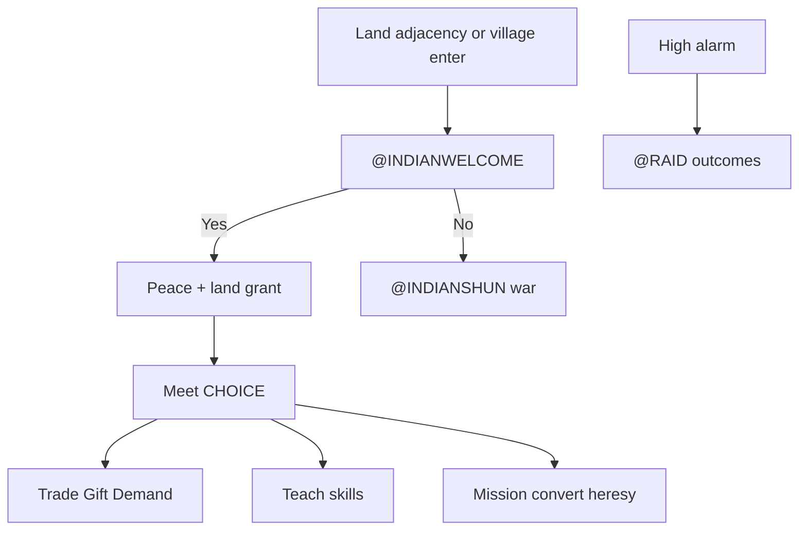

# Indians

Hub for native nations in Sid Meier's Colonization (1994): graphics, unit and
settlement types, tribe differentiation, alarm, and European contact. Deep FUN
checklists stay in annotated AI extracts — this file is the topic map.

Authority order: [project_goals.md](project_goals.md) (decomp / NAMES → manual →
fandom). Feature checklist: [manual_gap.md](manual_gap.md) §Indians. Port FUN
status: [ai_transcription.md](ai_transcription.md).

## Sources

| Source | Role |
|--------|------|
| [`COLONIZE/NAMES.TXT`](../COLONIZE/NAMES.TXT) `@TRIBES` / `@LEVELS` / `@UNIT` / `@ATTITUDE` / `@ACTIONS` / `@JOB` | Shipped catalogs (tech, specialty, icons, attitude labels) |
| [`COLONIZE/TRIBE.TXT`](../COLONIZE/TRIBE.TXT) | AMERICA village seed coordinates |
| [`COLONIZE/GAME.TXT`](../COLONIZE/GAME.TXT) `@INDIAN*` / `@RAID*` / `@MISSION*` | Dialog tags |
| `FUN_4d56_*` / `FUN_6a09_*` / `FUN_5bfb_*` / `FUN_4cc6_*` / `FUN_5fef_*` in [`viceroy_unpacked.c`](../original_sources_decompiled/viceroy_unpacked.c) | **Authoritative** nation turn, placement, meet, relations, raid loot |
| [`indian_contact.md`](../original_sources_annotated/ai/indian_contact.md) (+ trade / settlement / raid siblings) | Layer D contact / alarm / meet map |
| [`Colonization.pdf`](../COLONIZE/Colonization.pdf) pp.67–78 | Manual Natives prose |
| [fandom_col1994.md](fandom_col1994.md) §Natives | Tier-3 — Unverified until reconciled |
| Port [`ai_contact.c`](../src/core/ai_contact.c), [`ai.c`](../src/core/ai.c), [`ai_diplo.c`](../src/core/ai_diplo.c), [`map_panel.c`](../src/core/map_panel.c), [`col1_save.h`](../src/core/col1_save.h) | Wired stand-ins; PARK comments name gaps |

Col1 layouts: `ColonizeCol1Tribe` / `ColonizeCol1Indian` — field atlas in
[save_format_map.md](save_format_map.md). Nation ids **4–11** = `@TRIBES` order
(Inca…Tupi); Euro ids **0–3**.

---

## Graphics

| Asset | Use |
|-------|-----|
| `ICONS.SS` **#10–13** | Village markers by `indian.tech` (tipis / adobe / pyramid / city). `MAP_PANEL_TRIBE_ICON_BASE` 10 in [`map_panel.c`](../src/core/map_panel.c); sidebar Locat uses the same tech icon |
| `ICONS.SS` **109–112** | Unit blit indices from `@UNIT` icons **110–113** (1-based → 0-based on load) — Braves / Armed / Mtd. Braves / Mtd. Warriors |
| Minimap | Tribe dots palette **12** ([assets.md](assets.md)) |
| `REPORT9.PIK` | F9 Indian Adviser |
| `IND0A0.SS`…`IND7A3.SS` | Shipped 8 nations × 4 alarm tiers (`FUN_15dc_00a2` bands of `alarm_by_player`). **Loaded 2026-08-29** as the chief portrait beside every tribe-addressed contact popup (`ai_popup.c`, `FUN_6f74_0042`); exact DOS placement is D4 |

Draw order on the main map: colonies → villages → units so stacked units stay
visible ([assets.md](assets.md)).

**Capital marker:** Col1 `tribe.state.capital` bit drives growth, homeland
radius, surrender, and Cortes `rich_capital`. Fandom “starburst” on capitals is
**Unverified vs DOS** as a separate sprite — Linux blits the same tech icon
`#10–13` for capital and satellite villages.

Euro colony contrast: settlement art **#0–3** (none / stockade / fort /
fortress).

---

## Unit types

From `NAMES.TXT` `@UNIT` (Indian block). Comment columns: icon, movement,
attack, combat, …

| Name | Icon (1-based) | Moves | Attack | Combat | Notes |
|------|---------------:|------:|-------:|-------:|-------|
| Braves | 110 | 1 | 1 | 1 | Base; Viceroy type **19** (`VICEROY_UNIT_TYPE_BRAVE`) |
| Armed Braves | 111 | 1 | 2 | 2 | Muskets |
| Mtd. Braves | 112 | 4 | 2 | 2 | Horses |
| Mtd. Warriors | 113 | 4 | 3 | 3 | Horses + muskets |

Nation stocks `indian.muskets` / `horse_herds` / `horse_breeding` feed equipment
upgrades (Col1; see save atlas). Quiet Brave AI: `FUN_4d56_14fe` → Linux
`ai_native_nation_pulse` ([seed100_brave.md](seed100_brave.md)). Brave MP uses
terrain table ×3 (same scale note as unit orders).

Related catalogs:

| Catalog | Indian-relevant entries |
|---------|-------------------------|
| `@JOB` | **Convert** (`Indian Converts`) — missionary / Sepulveda / Las Casas paths |
| `@ORDERS` | **Live In Village** |
| `@ACTIONS` | Trade With Village, Enter Hostile Village, Establish Mission, Denounce Heresy, Live Among The Natives, Speak With Chief, Incite Indians, Demand Tribute, Attack Village |

Euro units that drive contact: Scout, Pioneer, Soldier, Dragoon, Artillery,
Missionary / Jesuit (encroachment and mission pulses).

---

## Settlement types

### Tech class (`@LEVELS` ↔ `indian.tech`)

| Tech | Level name | Settlement word | Map icon |
|-----:|------------|-----------------|----------|
| 0 | Semi-Nomadic | Camp | `#10` tipis |
| 1 | Agrarian | Village | `#11` adobe |
| 2 | Advanced | City | `#12` pyramid |
| 3 | Civilized | City | `#13` city |

`@LEVELS` also lists `<Any>, Capital, Capitals` — capital is the **state bit**,
not a fifth tech.

### Nations (`@TRIBES`)

| Nation id | Plural / short | Specialty good | Tech | UI color |
|----------:|----------------|----------------|-----:|---------:|
| 4 | Incas / Inca | Jewelled Relics | 3 | 97 |
| 5 | Aztecs / Aztec | Gold Bars | 2 | 149 |
| 6 | Arawaks / Arawak | Bone Jewelry | 1 | 54 |
| 7 | Iroquois / Iroquois | Wood Carvings | 1 | 87 |
| 8 | Cherokee / Cherokee | Turquoise | 1 | 67 |
| 9 | Apache / Apache | Beads | 0 | 111 |
| 10 | Sioux / Sioux | Beads | 0 | 118 |
| 11 | Tupi / Tupi | Gems | 0 | 71 |

`NAMES.TXT` also lists extra tribe name pairs (Maya, Huron, …) after the eight
playable nations — cosmetic / scenario pool, not additional `indian[8]` slots.

### Placement and growth

| Mode | Source |
|------|--------|
| AMERICA | [`TRIBE.TXT`](../COLONIZE/TRIBE.TXT) `@INCA`…`@TUPI` coordinates |
| NEW WORLD | Procedural `FUN_6a09_0006` → `ai_place_tribes_procedural` (capitals then satellites) |

**NEW WORLD-only Silver bid bonus (wired 2026-08-24).** After every capital
and satellite tribe is placed, `FUN_6a09_0006`'s own tail re-walks each tribe
and scans the 5×5 window centered on its own tile for terrain class `0x1b`,
adding that nation's `tech` to `indian.hill_silver_bid_bonus` per hit (read
side already fed the tribe's Silver bid — see `ai_contact.c`). Class `0x1b`
is **Mountains**, not Hills — the field's original name was a decode-era
mislabel (raw `.asm` of `FUN_13e4_000e` and `map.c`'s independent
MAPEDIT-derived convention agree: `0x1b`=Mountains, `0x1c`=Hills); kept the
existing field name (no rename of a live field) and fixed the comments +
the write side instead. AMERICA-mode tribes never get this bonus — it's
specific to the NEW WORLD/procedural placement function, not the
TRIBE.TXT path. Full trace: `col1_save.h`'s `hill_silver_bid_bonus` comment
and `ai.c`'s `ai_place_tribes_procedural`/`ai_decoded_type`.

Initial village population = **`3 + 2*tech`**. Growth `FUN_4d56_152e` /
`ai_grow_villages`: accumulates on **capitals only**; threshold accum **> 19**;
pop cap **15**. Empty-tile Attack (`FUN_5fef_1b0e`): temp Brave fight from the
**adjacent** tile (attacker stays put), then **`population--`**, or **destroy**
when `population < 2` (so a pop-3 camp survives two successful raids). Map Braves
that patrol nearby are separate — killing one does not burn the dwelling.

Homeland (tribal-land) radius: the tribe's tech tier — `FUN_15dc_006a`:
tech 0/1 → **1**, tech 2 (Aztec) → **2**, tech 3 (Inca) → **3**, nearest
village on the **same continent** (`FUN_4cc6_0356` / the 5x5 native cache).
Was the manual's "capital 2" rule until 2026-08-28 (`colony.c`
`colonies_tile_indian_homeland`). Founding / clearing / road-building on
such a tile at PEACE with the owner raises the DOS `@INDIANLAND` /
`@INDIANFOREST` / `@INDIANROAD` CHOICE (respect / offer gold / take it);
outside that dialog nothing is charged — see
[indian_actions_menu.md](../original_sources_annotated/ai/indian_actions_menu.md).

**Teach skill is always free** (no gold changes hands either way — corrected
2026-08-13, was never wired to charge). Non-capital villages teach **one**
skill to **one** colonist, **total across all Euro nations** — once any
nation's colonist learns there, the offer is gone for everyone. The tribe's
**capital** is exempt from that one-shot and teaches unlimited colonists.
`ai_contact_teach_skill` (`ai_contact.c`) implements this via
`tribe.state.learned` (one-shot, shared — matches "total across all
nations") gated by `!tribe.state.capital` (capital bypasses the gate).

**Human teach is the "Live Among The Natives" menu action** (2026-08-28,
`ai_contact_live_among_natives` = `thunk_FUN_1000_a618`): `@LEARNSTAY`
Yes/No, `@LEARNSLOW` random refusal in the 25..49 alarm quartile,
`@LEARNMAD` (+3 alarm) at quartile ≥ 2, `@TEACHCONVERT`, `@LEARNMASTER`,
`@LEARNCRIMINAL`, `@LEARNALREADY`. The taught skill is DOS's weighted draw
over the 2154 bid table (tech-trimmed; Fur Trapper → Seasoned Scout on
`(x+y)%3==0`; Farmer → Fisherman by an ocean-ring roll), seeded from the
village position so each village always offers the same skill. The
per-turn auto-teach pulse now runs for AI nations only.

Key tribe fields: `x`/`y`, `nation_id`, `state.{capital,learned,scouted,…}`,
`population`, `mission` (`0xff` none; low nibble Euro id; bit `0x10` Jesuit),
`last_bought` / `last_sold`, `alarm[4]`.

---

## Tribe “personality”

There is **no dedicated personality byte** in Col1 or NAMES. Differentiation is:

| Mechanism | Effect |
|-----------|--------|
| **`indian.tech`** | Settlement art class, initial pop, meet-scoring weight (`FUN_4d56_2154`) |
| **Specialty good** (`@TRIBES` field 3) | Trade chrome flavor (`Jewelled Relics` … `Gems`) — not the teach profession |
| **UI color** | Tribe tint from `@TRIBES` |
| **Teach outdoor map** | Nation → default `@JOB` when `last_sold` unset (Inca→Silver Miner … Tupi→Sugar Planter) — [indian_contact.md](../original_sources_annotated/ai/indian_contact.md) |
| **Runtime attitude** | Alarm / friction → `@ATTITUDE` labels (Content … War) |

Fandom “Aztec warlike / Inca peaceful” ([fandom_col1994.md](fandom_col1994.md))
is **Unverified vs DOS**. Observed nation bias in code/docs is tech + Spanish
conquest / French cooperation hooks, not a named personality enum.

---

## Alarm

### Two layers

| Layer | Field | Scope |
|-------|-------|-------|
| Nation × Euro | `ColonizeCol1Indian.alarm_by_player[4]` | Whole native nation toward each European |
| Village × Euro | `ColonizeCol1Tribe.alarm[4].{friction,attacks}` | Per settlement; `attacks` also tracks retaliation budget (save atlas) |

Nation turn prelude (`FUN_4d56_1816` → `ai_contact_indian_prelude`) bumps both
layers together on escalation. Clamp alarm ≥ 0 after prelude.

**Third, separate layer — grudge/tension (DS:0x54f6), storage + write-side
wired 2026-08-24.** `ColonizeCol1Save.indian_tension[tribe_index*4+euro_nation]`
(int16, runtime-only — not part of the persisted col1 record, DOS never
saves this table either). Distinct from both alarm layers above; DOS's own
write site is `FUN_4cc6_00f2` (relation-delta, `ai_diplo_indian_relation_delta`
in `ai_diplo.c`): on a negative relation delta that crosses a 5-point tier
boundary, clamp every tribe-of-that-Indian-nation's tension slot down to
`0x20` (new relation <50) or `0x60` (≥50). No Linux reader yet — DOS's own
read sites (`FUN_521d_0896` hostility gate in Euro AI goal-scoring; a
`>>5` 4-tier relations-report icon) are outside Indian/contact domain, left
for whoever owns `ai_euro.c`/reports. See `docs/mysteries_catalog.md`'s
"0x54f6" entry for the full formula trace.

**Second write site wired 2026-08-24 — raid discharges tension.**
`FUN_5fef_0f14` (colony raid loot) unconditionally zeroes the raiding
tribe's tension slot toward the raided Euro nation right before it
returns, for every loot kind (including "Nothing"). Wired in
`ai_contact_indian_raids` (`ai_contact.c`): clears
`indian_tension[brave->home_tribe_id * 4 + target_euro]` after
`ai_contact_apply_raid_loot`. `FUN_5fef_1b0e` (empty-tile Attack) has the
same clear on two more paths but lives in `units.c`, outside this domain —
left open.

### Gameplay bands

Used by contact / mission / raid gates ([indian_contact.md](../original_sources_annotated/ai/indian_contact.md)):

| Band | Typical use |
|------|-------------|
| **&lt; 40** | Cool: gift / teach / friction decay; any missionary may establish |
| **40–54** | Mid: demand/payoff; Jesuit-grade (or Brebeuf) convert only; hard-bargain trade (~45–49); teach refused |
| **≥ 55** | Refuse trade / gifts / convert; raid gate (non-mission villages); missionary flee |
| **≥ 80** | Mission burn (`FUN_4cc6_0000`); burn/raid band; stronger escort |
| **≥ 90 / 95** | Scout displace; ~¼ RNG kill at ≥95 even when flee exists |

First-contact **reject** floors alarm/friction into the **≥80** band
(`@INDIANSHUN`).

### Escalation and pacify

| Driver | Effect |
|--------|--------|
| Encroachment | **RETIRED 2026-09-03** (bugs.md "alarm rises incredibly fast"). The former fandom +2/turn unit/colony bump was not DOS; DOS grows alarm only via the `152e` threat accumulator (colonies within distance 7 + military ring → `euro_relation_accum`, −8 crossing = alarm +1). The friction ±1/turn relation-tick band drift retired with it. |
| French (Euro nation 1) | Half-rate bumps; +1 auto-trade reach |
| Pocahontas | Half-rate bumps; elect zeros this nation's tribe friction/attacks + `alarm_by_player` |
| Missions | Low band extra −1; mid 40–79 meet pulse −2 toward mission owner; ≥80 burns mission |
| Difficulty prelude | Chance `2+(4-diff)`, bump `5+(4-diff)` — [difficulty.md](difficulty.md) §Indians |

`@ATTITUDE` labels: Content, Uneasy, Restless, Angry, War (+ `@ATTITUDINAL`
modifiers). F9 Indian Adviser (`reports.c`) maps alarm to those labels with a
**rough** low-threshold stand-in (not the same 40/55/80 contact gates).

---

## Interactions with Europeans

Deep path map: [indian_contact.md](../original_sources_annotated/ai/indian_contact.md).
Popup tags: [popups.md](popups.md). Diplo matrix: [`euro_diplo.md`](../original_sources_annotated/ai/euro_diplo.md),
[`ai_diplo.c`](../src/core/ai_diplo.c).

### First contact (`FUN_5bfb_022e` / `0182`)

- Unmet **land** unit next to a village (ships skipped) → `@INDIANWELCOME` Yes/No.
- **Yes** → peace bit, clear alarm/friction toward Euro, OK `@INDIANPEACE` /
  `@INDIANCOME`; thin land grant stamps purchased + owner on the occupied tile.
  Ends without Meet CHOICE.
- **No** → war / hostility, alarm ≥80, `@INDIANSHUN`.

### Meet menu (already met)

Village tile / synthetic apply: Trade / Gift / Demand / Teach / Leave
(`ai_contact_try_village_meet`). Greet `@INDIANHELLO1` / `HELLO2` by cool/hot
alarm. Thin auto-trade drains Trade Goods from colony / ship / wagon; deep
bargain matrix `FUN_4d56_2820` **PARKED**.

### Missions and Founding Fathers

| Hook | Effect (port / sources) |
|------|-------------------------|
| Missionary / Jesuit | Sets `tribe.mission`; crosses; mid-band needs Jesuit or Brebeuf |
| Foreign mission | 50/50 heresy replace vs burn denouncer |
| Las Casas | Existing Converts → free colonists on elect |
| Sepulveda | Higher convert-join odds on settlement fallout |
| Cortes | Conquest treasure; capital = `rich_capital` |
| Minuit | Indians no longer demand land payment |
| Pocahontas | Reset + half future alarm |

Incite / WARPATH gold **Done** thin (2026-08-13) — `FUN_4d56_417e`
identified and ported as a 6th village-meet CHOICE
(`ai_contact_apply_incite`), confirmed against `@INDIANWARPATH`/
`@INDIANWARPATH2` in `GAME.TXT` and two live DOSBox-X captures of a real
player-driven Incite. See
[`indian_incite_417e.md`](../original_sources_annotated/ai/indian_incite_417e.md)
for exactly what's faithful vs. approximated — 2 of 4 price-formula
table values are unnamed data, substituted with `indian.tech`; only the
human-driven path is wired (no AI-nation auto-incite yet).

### Raids and combat fallout

High alarm → `@RAID*` kinds (stores / burn / scalp / gold / …); colony
encroachment and ambush chrome thin-Done. Capital destroy →
`ai_diplo_indian_capital_surrender` (reset hostility once; no new capital).
Loot detail: [indian_raid_outcomes.md](../original_sources_annotated/ai/indian_raid_outcomes.md),
[indian_raid_loot.md](../original_sources_annotated/ai/indian_raid_loot.md).
Odds / resolve: [combat.md](combat.md).

### Ship → village

Not landfall: `@DONTKNOWSHIPS` / `@MADATSHIPS` ([move_enter.md](move_enter.md);
settlement head `FUN_4d56_4528` warn→Attack Done thin; deep `2820` **PARKED**).

### Nation turn shell

`FUN_4d56_1816` / `ai_indian_nation_turn`: reseed → alarm prelude → clamp →
village growth → relation tick → quiet Brave pulse → meet/trade/raid arms.

---

## Port status snapshot

Aligned with [manual_gap.md](manual_gap.md) §Indians — no new fidelity claims.

| Area | Status | Where |
|------|--------|-------|
| Villages on map + Braves | Partial | Placement + icons; quiet pulse / growth — [seed100_brave.md](seed100_brave.md), [ai_transcription.md](ai_transcription.md) |
| First contact WELCOME | Done structural | `ai_contact_*`; thin land grant |
| Meet / trade / gift / teach | Partial | Village trade `2820` **Done structural** (2026-08-29: hold pick, sell/haggle/gift, `@BADCARGO`/`@BRING`, post-sale buy); gift/teach widgets thin; VGA chrome PARKED |
| Missions / convert / heresy | Partial | Structural; incite/WARPATH **Done** thin (`indian_incite_417e.md`) |
| Alarm / raids / wars | Partial | Structural `@RAID*`; village enter warn→Attack Done thin; deep `2820` PARKED |
| Capital surrender / Cortes treasure | Done thin | `ai_diplo_*` / `units_*` fallout |
| Indian×Euro diplo matrix | Done structural | Fuller `153e` unpark; FA UI **PARKED** |
| `IND*.SS` meet chrome | Missing / PARKED | Ship data present; not loaded |

Annotated deep dives (do not duplicate here):

| Topic | Doc |
|-------|-----|
| Contact / alarm checklist | [`indian_contact.md`](../original_sources_annotated/ai/indian_contact.md) |
| Meet scoring `2154` | [`indian_meet_scoring_2154.md`](../original_sources_annotated/ai/indian_meet_scoring_2154.md) |
| Trade `2820` | [`indian_trade_2820.md`](../original_sources_annotated/ai/indian_trade_2820.md) |
| Settlement enter `4528` | [`indian_settlement_4528.md`](../original_sources_annotated/ai/indian_settlement_4528.md) |
| Nation turn shell | [`indian_nation_turn.c`](../original_sources_annotated/ai/indian_nation_turn.c) |
| Quiet Brave scoring | [`quiet_brave_scoring.c`](../original_sources_annotated/ai/quiet_brave_scoring.c) |

### 2026-08-27 — single alarm store (relation/alarm consolidation)

`FUN_1000_84fc` / `FUN_15dc_00e0` (read) and `FUN_4cc6_00f2` (write) operate
on `indian[idx].alarm_by_player[euro]` — 0..100, high = hostile, map-gen seed
`RNG(0,14)` (+2×difficulty for AI nations), first contact clamps ≤20, **no
per-turn decay** (byte-stable across seed-100 TURN3..7). `nation.relation_by_indian`
is a flag byte (`0x60` once met) in every DOS save, never a scalar. Linux
therefore now has one store:

- `ai_diplo_indian_alarm` / `ai_diplo_indian_alarm_delta` — DOS-native; used at
  sites transcribed from DOS (152e accumulator ±1, 1816 WoI defect ±100 —
  direction was inverted before: the tribe turns *hostile to the rebels*,
  content with the Crown; 2820/417e price operands; `0x4b` MADAT gates).
- `ai_diplo_indian_relation` = `100 − alarm`, `_delta(d)` = `alarm_delta(−d)` —
  the Linux-side view for fandom-derived sites (thresholds <40 refuse-talk,
  <50 thin at-war, raids/attacks −5, trade +2).
- Retired as fiction: peaceful drift (+1/turn), peace feeler (+2), the
  relation ±1 arm of `ai_contact_indian_relation_tick`, the raid −3/−5 double
  push, the trade `alarm--` double push.
- "At war with tribe" (same day, second pass) = met ∧ (`euro_diplo & 0x02`
  ∨ alarm > 0x4a), i.e. `FUN_5bfb_153e`'s own test. Bit `0x02` = WAR on
  `euro_diplo` (`COL1_INDIAN_WAR_BIT`): DOS sets it only in `FUN_5bfb_153e`'s FA branch
  (`@SMITEINDIANS`/`@SMITEEUROPE` — pay an AI nation to declare war;
  unported) and clears it in `FUN_4cc6_00f2` when alarm cools below 75
  (mirrored in `ai_diplo_indian_alarm_delta`). Linux sticky bands moved to
  the DOS scale: at-war relation < 26, very-low < 16.
