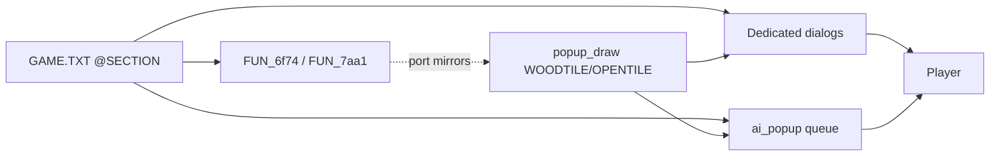

# Popup inventory

Inventory of every player-facing modal in original Colonization, cross-checked
against the Linux port. Canonical copy identity is the `@SECTION` name in
[`COLONIZE/GAME.TXT`](../COLONIZE/GAME.TXT) (499 sections). Decomp call sites
are secondary citations.

Feature-level status also lives in [manual_gap.md](manual_gap.md) and
[ai_transcription.md](ai_transcription.md). This file is the **popup checklist**.
Authenticity vs GAME.TXT (invented vs wired): [popup_audit.md](popup_audit.md).

## Legend

| Status | Meaning |
|--------|---------|
| **Done** | Playable wood/list modal with correct choices/behavior (VGA-identical chrome may still be parked) |
| **Partial** | Thin OK, status line, simplified choices, incomplete GAME.TXT fidelity, or PARKED FA stand-in |
| **Missing** | No user-facing modal in the port yet |
| **n/a** | Catalog sentinel / not a player modal |

**Partial** no longer means “invented English OK is fine.” Invented wood INFO OKs are demoted to status; real `@SECTION`s should be wired via `popup_msg_*`.

Structural Done (choices work) is enough per [project_goals.md](project_goals.md);
pixel VGA / portraits are end-game polish.

## Architecture

Original DOS uses one dialog compositor plus a thin message-box helper. Triggers
are scattered; presentation is centralized.

| Layer | Original | Port |
|-------|----------|------|
| Script source | `GAME.TXT` (+ `DEBUG.TXT` cheats) | `assets_msg_find` / hardcoded snippets |
| Compositor | segment `6f74` (`FUN_6f74_36ca` / `3760` / `3848` …) | [`popup.c`](../src/core/popup.c) chrome |
| Thin message box | `FUN_7aa1_003a` | often status line or `ai_popup` OK |
| Map event queue | flush immediately from AI/turn | [`ai_popup.c`](../src/core/ai_popup.c) (max 16) |
| Dedicated UIs | colony `2f2b`, Europe `38fd`, save `7562`, … | `colony_screen`, Europe menus in `game_loop`, `save_load_dialog`, `pick_music`, `unit_stack`, `cheat_list_dialog`, `new_game` |

Modal input (`game_loop.c`): early gate before parent hotkeys (E/Q/etc.) —
pick_music → save_load → options → name_entry → howmuch → cheat_list →
**ai_popups** → unit_stack. Letters typed in name/howmuch do not switch views.

**Out of main tables:** MAPEDIT.EXE ([`MAPEDIT.TXT`](../COLONIZE/MAPEDIT.TXT) —
19 sections), Colonizopedia articles, F2–F10 report *plates* (unless a nested
confirm), pulldown chrome from `MENU.TXT`. Woodcut discovery captions
(`WOODCUT.TXT`) are noted under Discovery.

---

## Inventory by system

Each row is one presentation site (what actually opens), not one `@SECTION`
fragment. Related sections are listed in the first column.

### 1. Shell / title / new game

| Popup / `@SECTION`s | When | Status | Port |
|---------------------|------|--------|------|
| `@BEGINMENU` | Title: New World / America / Customize / Load / Exit / HoF | Done | [`game_loop.c`](../src/core/game_loop.c) |
| `@AMERICA`, map pick | America vs generated / load `.MP` | Done | [`new_game.c`](../src/core/new_game.c) |
| `@DIFFICULTY` | Difficulty pick | Done | Image regions on `DIFFICUL.PIK` |
| `@PICKNATION` | Nation pick | Done | Image regions on `NATIONS.PIK` |
| `@LEADERNAME` | Leader name entry | Done | Wood name entry |
| `@VICEROY` / `@VICEROY2` | King audience intro | Done | `KINGLSS.PIK` phase |
| `@NATION0A`…`@NATION3B` | Nation lore | Done | Lore pages |
| `@BUILD1`…`@BUILD10` | Sail-away captions | Done | Over `LEVN*.PIK` |
| `@CUSTOM` / `@CLAND`…`@CCLIM` | Customize land/climate | Done | Image grid + `@MISC` labels |
| `@GAMEOPTIONS` / `@COLONYOPTIONS` / `@SOUNDOPTIONS` | Options checkboxes | Done | [`options_dialog.c`](../src/core/options_dialog.c) |
| `@DOS` / `@DOSYES` | Quit confirm | Done | Map/title confirm via `AI_POPUP_TAG_MAP_CONFIRM` |
| `@RETIRE` | Retire confirm | Done | Confirm then F10 score |
| `@MULTI*` | Multiplayer setup | Missing | — |

### 2. Save / load / music

| Popup / `@SECTION`s | When | Status | Port |
|---------------------|------|--------|------|
| `@SAVEGAME` (+ good/error) | Manual save slots | Done | [`save_load_dialog.c`](../src/core/save_load_dialog.c); GAME→Save / **S** |
| `@LOADGAME` (+ variants) | Manual / title load | Done | Same; slots 0–9; title LOAD / **L** |
| `@PICKMUSIC` + Independence/Military/Indian | GAME→Pick Music | Done | [`pick_music.c`](../src/core/pick_music.c) |

### 3. Map / unit orders

| Popup / `@SECTION`s | When | Status | Port |
|---------------------|------|--------|------|
| `@LANDFALL` / `@LANDFALL2` | Ship→bare land with passengers | Done | `AI_POPUP_TAG_LANDFALL` + `popup_msg_fill` |
| Stack picker | Multi-unit tile click | Done | [`unit_stack.c`](../src/core/unit_stack.c) |
| `@SUREDISBAND` / `@DISBANDSHIP` | Disband confirm | Done | `AI_POPUP_TAG_MAP_CONFIRM` |
| `@FINDCITY` / `@NOCITY` | Find colony picker | Done | `cheat_list` FIND_COLONY |
| `@OVERBOARD` | Dump cargo confirm | Done | Yes/No then dump first hold |
| Order gates (`@ONLYPIO`, `@NEEDTOOLS`, `@NOPLOW`, …) | Illegal order | Partial | Status / bounce; no modal |

### 4. Colony screen

| Popup / `@SECTION`s | When | Status | Port |
|---------------------|------|--------|------|
| Construction CHANGE | CHANGE / **C** | Done | [`colony_screen.c`](../src/core/colony_screen.c) |
| Field jobs | Assign colonist to field | Done | Job list popup |
| Leave-as (eject) | Fence with colonist | Done | Role list |
| `@ABANDON` / `@ABANDON2` | Last colonist leave | Done | Yes/No confirm from GAME.TXT |
| `@KEEPSTOCKADE` / `@MORETHANTHREE` | Stockade min pop | Done | OK from `@KEEPSTOCKADE` |
| `@COLONY` / `@RENAMECOLONY` | Found / rename | Done | Name entry after found; **R** rename in colony |
| `@LANDHO` | First land sight | Done | Name New World (`colony_region`); seed from NAMES `@COLONYNAME` per nation |
| `@HOWMUCH1`… | Cargo amount | Done | [`howmuch_dialog.c`](../src/core/howmuch_dialog.c) (`=` colony / Europe **L**) |
| `@WAREHOUSEFULL` | Warehouse overflow | Partial | Spoilage → `ai_popup` OK (`@SPOIL*`) |
| Train fails (`@NOTEACHER`, `@TRAINFAIL`, …) | School train | Missing | — |
| Spoil / starve (`@SPOIL*`, `@STARVE*`, …) | EOT production | Done | `ai_popup` OK from turn production |
| Docked unit orders | Colony transport orders | Missing | Select/load only |
| `@CARGOREADY*` | Ship build ready | Done | EOT `ai_popup` OK |

### 5. Europe

| Popup / `@SECTION`s | When | Status | Port |
|---------------------|------|--------|------|
| `@RECRUIT*` | Recruit pool | Done | Wood menu **R** |
| `@PURCHASE` / `@REALLYBUY` | Buy ship/artillery | Done | ~PURCHASE |
| `@SCHOOL1` / `@COLLEGE2` / `@UNIV3` | Train expert | Done | ~TRAIN |
| Europe dock orders | Don’t board / Board / Move front | Done | `EUROPE_MENU_DOCK` |
| `@HOWMUCH4`/`5` | Buy/sell amount | Done | Europe **L**/**U** → howmuch |
| `@PRICEUP` / `@PRICEDOWN` | Price change notice | Partial | Status lines |
| `@KINGTAX` / `@TAXOPTIONS` / `@TEAPARTY` | Tax audience (also map queue) | Done | `@KINGTAX` body + `@TAXOPTIONS` Kiss/Party; Tea Party follow-up still Partial |

### 6. Indian contact / trade / raids

| Popup / `@SECTION`s | When | Status | Port |
|---------------------|------|--------|------|
| `@INDIANWELCOME` → peace/shun | First contact Yes/No | Done | `CONTACT_WELCOME` |
| Meet Trade/Gift/Demand/Teach/Leave | Village meet | Done | `CONTACT_MEET` |
| Gift amount | Gift gold | Done | Small/Large/Generous CHOICE |
| Demand tools/gold | Tribute | Done | `CONTACT_DEMAND` |
| Teach (`@LEARN*`) | Teach skill result | Partial | `CONTACT_TEACH` OK |
| Mission / convert (`@MISSION*`, `@INDIANSCONVERT`) | Missionary | Partial | `CONTACT_CONVERT` OK |
| `@RAID*` outcomes | Raid / ambush | Partial | `CONTACT_RAID` OK; deep `4528` PARKED |
| Village attitude / HELLO | Enter settlement | Partial | Thin snippets / status |
| `@CHIEF*` | Chief portrait meet | Missing | — |
| `@TRADE0`/`1`, haggle `@BADHAGGLE*` | Deep village trade | Missing | `2820` PARKED |
| Bribe / encroachment CHOICE | Road/forest / alarm | Missing | Thin OK/status; CHOICE PARKED |

### 7. Euro diplomacy

| Popup / `@SECTION`s | When | Status | Port |
|---------------------|------|--------|------|
| War / Peace / Alliance / Break | Rival offers | Done | `DIPLO_WAR` / `PEACE` / `ALLIANCE` / `BREAK` Accept/Refuse |
| Boycott | War embargo / Tools lift | Partial | `DIPLO_BOYCOTT` OK |
| FA `@HELLO*` / `@PEACE*` / `@TRIBUTE*` … | Foreign Affairs script | Partial | Thin `DIPLO_FA` OK; full `3f41` PARKED |

### 8. King / REF / independence / FF

| Popup / `@SECTION`s | When | Status | Port |
|---------------------|------|--------|------|
| Tax audience Accept/Refuse | King tax hike | Done | `KING_AUDIENCE` |
| Dump-goods cargo | Refuse → boycott pick | Done | `KING_DUMP_GOODS` |
| Tax/boycott follow-up | After audience | Partial | `KING_TAX` OK |
| Merc Hire/Decline (`@MERCENARIES`) | Continental mercs | Done | `KING_MERC` |
| Declare (`@DECLARE`) | Independence confirm | Done | `KING_CONGRESS` |
| `@INDEPENDENCE` letter | Rename / letter | Partial | `KING_LETTER` from `@INDEPENDENCE`; cinematic PARKED |
| `@INVASION` / intervene | REF / ally arrival | Partial | `KING_ARRIVAL` OK |
| Crown capture | REF takes colony | Partial | `KING_CAPTURE` OK |
| Revolution win/lose | End WoI | Partial | `INFO` OK + latches |
| `@CONTINENTAL` FF elect | Founding Father debate | Done | `FF_CONGRESS` |
| 1800 peacetime end | Auto-end | Partial | Status only (no GAME.TXT dialog) |

### 9. Combat / loot / capture

| Popup / `@SECTION`s | When | Status | Port |
|---------------------|------|--------|------|
| Combat Analysis (options bit) | After combat roll, human side | Done | Dual-column wood `combat_analysis.c` (`636c`-shaped); gated by `combat_analysis` |
| `@LOOT*` / `@LOOTCAPTURE` / `@LOOTCASH` | Combat loot / ransom | Partial | Structural OK via `units_set_combat_popups`; ransom CHOICE PARKED |
| `@CAPTURED*` / `@BURNED*` / `@SHIPDAMAGE` / `@SHIPSUNK` | Capture / burn / naval | Partial | Capture + ship damage/sunk OK; burn colony chrome thin/PARK |
| `@EUROPEWIN` / `@EUROPELOSE` | Euro combat outcome | Done | Structural `AI_POPUP_TAG_COMBAT_EUROPE` |
| `@DEMOTE` | Specialty strip / demote | Partial | Enqueued when demote lands human-facing |
| `@SEIZURE*` | Privateer / seizure | Missing | — |
| Ambush WIN/LOSE (`@INDIANWIN*`) | Indian ambush | Partial | Raid OK/status; Spanish ambush peel enqueues `@INDIANWIN1` |

### 10. Year-end / victory / HoF / retire

| Popup / `@SECTION`s | When | Status | Port |
|---------------------|------|--------|------|
| `@LOSENOCOLONIES` / defeat | No colonies | Partial | Status; dialog PARKED |
| `@SCORE` / `@SCORED` / retire | Retire / F10 | Partial | F10 score; HoF stub `HOF.TXT` |
| `@LOSING*` / `@WARN*` / `@WINNING` | Anniversary / SoL chrome | Partial | Anniversary years enqueue `ai_popup` OK |
| `@TIMECHANGE` | Calendar help | Partial | Calendar Done; no modal |
| 1850 WoI win | Year≥1850 + no crown | Partial | Latch + INFO |

See also [sons_of_liberty.md](sons_of_liberty.md),
[`year_end_chrome.md`](../original_sources_annotated/turn/year_end_chrome.md).

### 11. Discovery / tutorial / woodcuts

| Popup / `@SECTION`s | When | Status | Port |
|---------------------|------|--------|------|
| `@LOSTCITY0`…`9`, `@BURIAL*`, `@SCREWED` | Lost City / ruins | Missing | — |
| `@TUTORIAL1`…`19`, `@TUT*` | Tutorial hints option | Missing | — |
| `WOODCUT.TXT` captions | Discovery woodcut scenes | Missing | Pedia uses woodcut art only |

### 12. Cheats (`DEBUG.TXT`)

| Popup | When | Status | Port |
|-------|------|--------|------|
| `@SETVIEW` Reveal Map | DEBUG → Reveal | Done | [`cheat_list_dialog.c`](../src/core/cheat_list_dialog.c) |
| Kill Indians tribe list | DEBUG | Done | Same |
| `@CREATE` / `@SETHUMAN` / other DEBUG | Other cheats | Missing | Status “Cheat not implemented yet” |

DEBUG sections: `MOTD`, `MOTD2`, `MEMORY`, `CREATE`, `CREATE2`, `CSHIP`,
`FOREIGN`, `FOREIGN2`, `SETVIEW`, `SETHUMAN`, `SETAUTO`, `SETREPORT`,
`SETEUROPE`, `DANGER`, `BADGUYS`, `SOUND`, `OPTIONS`, `FORCED`, `TEST`, `END`.

### 13. Trade routes

| Popup / `@SECTION`s | When | Status | Port |
|---------------------|------|--------|------|
| `@TRADESELECT` route picker | TRADE Edit | Done | `cheat_list` TRADE_SELECT |
| `@PICKACARGO` cargo picker | Edit unload/load | Partial | Multi-select via `cheat_list_open_trade_cargos` |
| `@TRADEDELETE` / `@SUREDELETE` | Delete confirm | Done | Route picker + Yes/No |
| VGA TRADE chrome | Full trade UI | Missing | PARKED |

---

## Summary counts

### By presentation site (system tables above)

| Status | Count |
|--------|------:|
| Done | ~50 |
| Partial | ~20 |
| Missing | ~23 |
| **Total sites** | **93** |

Counts shifted after 2026-08 feasible-popup pass and authenticity audit
([popup_audit.md](popup_audit.md)): invented INFO OKs demoted to status; wired
`@LANDFALL` / abandon / stockade / ships / FF / king tax+merc from GAME.TXT.
Re-tally when the checklist is next audited in full.

### By `GAME.TXT` `@SECTION` (Appendix A)

| Status | Count |
|--------|------:|
| Done | 66 |
| Partial | 263 |
| Missing | 169 |
| n/a | 1 |
| **Total** | **499** |

Many Partial section rows share one thin OK or status path (e.g. all `@RAID*`
under `CONTACT_RAID`). Prefer the **presentation site** counts when prioritizing
work.

---

## Appendix A — Full `GAME.TXT` `@SECTION` checklist

| `@SECTION` | Status | Port note |
|------------|--------|-----------|
| `@DOS` | Done | quit confirm (`AI_POPUP_TAG_MAP_CONFIRM`) |
| `@DOSYES` | Done | quit confirm |
| `@RETIRE` | Done | confirm then F10 score |
| `@BEGINMENU` | Done | title menu (`game_loop.c`) |
| `@AMERICA` | Done | new-game America / map pick (`new_game.c`) |
| `@MAPTOLOAD` | Done | new-game America / map pick (`new_game.c`) |
| `@MULTI` | Missing | no multiplayer UI |
| `@MULTINEXT` | Missing | no multiplayer UI |
| `@MULTIREV` | Missing | no multiplayer UI |
| `@GAMEOPTIONS` | Done | options_dialog |
| `@COLONYOPTIONS` | Done | options_dialog |
| `@SOUNDOPTIONS` | Done | options_dialog |
| `@SAVEGAME` | Done | slot / music dialogs |
| `@SAVEGOOD` | Partial | I/O feedback thin/status; slot dialog Done |
| `@SAVEERROR` | Partial | I/O feedback thin/status; slot dialog Done |
| `@LOADGAME` | Done | slot / music dialogs |
| `@LOADGOOD` | Partial | I/O feedback thin/status; slot dialog Done |
| `@LOADNOT` | Partial | I/O feedback thin/status; slot dialog Done |
| `@LOADOLD` | Partial | I/O feedback thin/status; slot dialog Done |
| `@LOADSIZE` | Partial | I/O feedback thin/status; slot dialog Done |
| `@LOADERROR` | Partial | I/O feedback thin/status; slot dialog Done |
| `@PICKNATION` | Done | new-game wizard |
| `@DIFFICULTY` | Done | new-game wizard |
| `@LEADERNAME` | Done | new-game wizard |
| `@FINDCITY` | Done | colony list picker |
| `@NOCITY` | Done | OK when no colonies |
| `@VICEROY` | Done | new-game wizard |
| `@VICEROY2` | Done | new-game wizard |
| `@LANDHO` | Done | first land sight → name New World |
| `@COLONY` | Done | name entry after found |
| `@RENAMECOLONY` | Done | colony **R** rename |
| `@LANDFALL` | Done | AI_POPUP_TAG_LANDFALL |
| `@LANDFALL2` | Partial | river landfall variant; port uses LANDFALL path |
| `@ONLYPIO` | Partial | order/gate — status or bounce; no modal |
| `@ONLYCOL` | Partial | order/gate — status or bounce; no modal |
| `@SHIPCOMBAT` | Partial | order/gate — status or bounce; no modal |
| `@SHIPLAKE` | Partial | order/gate — status or bounce; no modal |
| `@LANDFIRST` | Partial | order/gate — status or bounce; no modal |
| `@SEACOLONY` | Partial | order/gate — status or bounce; no modal |
| `@NOPORT` | Partial | order/gate — status or bounce; no modal |
| `@BUILT` | Missing | no colony modal (FULL/SIEGE may status) |
| `@FULL` | Missing | no colony modal (FULL/SIEGE may status) |
| `@NOTEACHER` | Missing | colony train fail dialogs missing |
| `@NEEDCOLLEGE` | Missing | colony train fail dialogs missing |
| `@NEEDUNIVERSITY` | Missing | colony train fail dialogs missing |
| `@TRAINFAIL` | Missing | colony train fail dialogs missing |
| `@TRAINCRIMINAL` | Missing | colony train fail dialogs missing |
| `@TRAININDENTURED` | Missing | colony train fail dialogs missing |
| `@TRAINPROFESSION` | Missing | colony train fail dialogs missing |
| `@SIEGE` | Missing | no colony modal (FULL/SIEGE may status) |
| `@ABANDON` | Done | colony abandon Yes/No (`colony_screen`) |
| `@ABANDON2` | Done | colony abandon Yes/No (`colony_screen`) |
| `@SAILHOME` | Partial | Europe sail/market — partial status or auto |
| `@SAILAWAY` | Partial | Europe sail/market — partial status or auto |
| `@SAILPORT` | Partial | Europe sail/market — partial status or auto |
| `@TRAVELPLACE` | Partial | Europe sail/market — partial status or auto |
| `@UNREST` | Partial | Europe sail/market — partial status or auto |
| `@RECRUIT` | Done | Europe recruit wood menu (structural) |
| `@RECRUITCHOOSE` | Done | Europe recruit wood menu (structural) |
| `@RECRUIT2` | Done | Europe recruit wood menu (structural) |
| `@KINGRECRUIT` | Done | Europe recruit wood menu (structural) |
| `@PURCHASE` | Done | purchase / train menus |
| `@SCHOOL1` | Done | purchase / train menus |
| `@COLLEGE2` | Done | purchase / train menus |
| `@UNIV3` | Done | purchase / train menus |
| `@NODOCKS` | Partial | Europe sail/market — partial status or auto |
| `@CARGOREADY0` | Done | EOT ai_popup OK |
| `@CARGOREADY1` | Partial | ship-ready chrome PARKED |
| `@CARGOREADY2` | Partial | ship-ready chrome PARKED |
| `@LUMBER` | Missing | production/EOT messages — status or silent; no modal |
| `@COTTON` | Missing | production/EOT messages — status or silent; no modal |
| `@TOBACCO` | Missing | production/EOT messages — status or silent; no modal |
| `@CANESUGAR` | Missing | production/EOT messages — status or silent; no modal |
| `@FURS` | Missing | production/EOT messages — status or silent; no modal |
| `@ORE` | Missing | production/EOT messages — status or silent; no modal |
| `@TOOLS` | Missing | production/EOT messages — status or silent; no modal |
| `@FOOD1` | Missing | production/EOT messages — status or silent; no modal |
| `@FOOD2` | Missing | production/EOT messages — status or silent; no modal |
| `@VANISH` | Missing | production/EOT messages — status or silent; no modal |
| `@STARVE1` | Done | EOT ai_popup OK |
| `@STARVE2` | Missing | production/EOT messages — status or silent; no modal |
| `@FOODLOW` | Missing | production/EOT messages — status or silent; no modal |
| `@SPOIL1` | Done | EOT ai_popup OK |
| `@SPOIL2` | Missing | production/EOT messages — status or silent; no modal |
| `@SPOIL3` | Missing | production/EOT messages — status or silent; no modal |
| `@SPOIL4` | Missing | production/EOT messages — status or silent; no modal |
| `@BUYME0` | Missing | production/EOT messages — status or silent; no modal |
| `@BUYME1` | Missing | production/EOT messages — status or silent; no modal |
| `@DEFOREST` | Missing | production/EOT messages — status or silent; no modal |
| `@DEPLETION` | Missing | production/EOT messages — status or silent; no modal |
| `@UNITFLAG` | Partial | Col1 flag bits; not dialogs |
| `@COLONYFLAG` | Partial | Col1 flag bits; not dialogs |
| `@LOSTCITY0` | Missing | Lost City / burial dialogs missing |
| `@LOSTCITY1` | Missing | Lost City / burial dialogs missing |
| `@LOSTCITY2` | Missing | Lost City / burial dialogs missing |
| `@LOSTCITY3` | Missing | Lost City / burial dialogs missing |
| `@LOSTCITY4` | Missing | Lost City / burial dialogs missing |
| `@SCREWED` | Missing | Lost City / burial dialogs missing |
| `@BURIAL1` | Missing | Lost City / burial dialogs missing |
| `@BURIAL2` | Missing | Lost City / burial dialogs missing |
| `@BURIAL3` | Missing | Lost City / burial dialogs missing |
| `@LOSTCITY5` | Missing | Lost City / burial dialogs missing |
| `@LOSTCITY6` | Missing | Lost City / burial dialogs missing |
| `@LOSTCITY7` | Missing | Lost City / burial dialogs missing |
| `@LOSTCITY8` | Missing | Lost City / burial dialogs missing |
| `@LOSTCITY9` | Missing | Lost City / burial dialogs missing |
| `@SNEAK` | Partial | FA / diplo lines — thin DIPLO_FA or status; full 3f41 PARKED |
| `@CANCELPEACE` | Done | DIPLO_* CHOICE structural |
| `@SIGNTREATY` | Done | DIPLO_* CHOICE structural |
| `@DECLAREWAR` | Done | DIPLO_* CHOICE structural |
| `@HAVETREATY` | Partial | FA / diplo lines — thin DIPLO_FA or status; full 3f41 PARKED |
| `@WHACKINDIANS` | Partial | contact/raid/mission — structural OK/status; deep/VGA PARKED |
| `@VILLAGEHAPPY` | Partial | contact/raid/mission — structural OK/status; deep/VGA PARKED |
| `@VILLAGESAVAGE` | Partial | contact/raid/mission — structural OK/status; deep/VGA PARKED |
| `@VILLAGEMEDIUM` | Partial | contact/raid/mission — structural OK/status; deep/VGA PARKED |
| `@VILLAGEBAD` | Partial | contact/raid/mission — structural OK/status; deep/VGA PARKED |
| `@VILLAGEWAR` | Partial | contact/raid/mission — structural OK/status; deep/VGA PARKED |
| `@INDIANWELCOME` | Done | CONTACT_WELCOME + follow-ups |
| `@INDIANBOW` | Partial | contact/raid/mission — structural OK/status; deep/VGA PARKED |
| `@INDIANTREATY` | Partial | contact/raid/mission — structural OK/status; deep/VGA PARKED |
| `@INDIANHELLO1` | Partial | thin greet OK/snippets |
| `@INDIANHELLO2` | Partial | thin greet OK/snippets |
| `@INDIANPEACE` | Done | CONTACT_WELCOME + follow-ups |
| `@INDIANCOME` | Done | CONTACT_WELCOME + follow-ups |
| `@INDIANSHUN` | Done | CONTACT_WELCOME + follow-ups |
| `@INDIANWAGONS` | Partial | contact/raid/mission — structural OK/status; deep/VGA PARKED |
| `@INDIANCITY` | Partial | contact/raid/mission — structural OK/status; deep/VGA PARKED |
| `@INDIANGOLD` | Partial | contact/raid/mission — structural OK/status; deep/VGA PARKED |
| `@INDIANSLAVES` | Partial | contact/raid/mission — structural OK/status; deep/VGA PARKED |
| `@INDIANSCONVERT` | Partial | contact/raid/mission — structural OK/status; deep/VGA PARKED |
| `@INDIANGIVEFOOD` | Partial | contact/raid/mission — structural OK/status; deep/VGA PARKED |
| `@INDIANGIVESTUFF` | Partial | contact/raid/mission — structural OK/status; deep/VGA PARKED |
| `@INDIANCOMMENT` | Done | Colony encroachment OK via `popup_msg_fill` |
| `@INDIANBEGFOOD` | Partial | contact/raid/mission — structural OK/status; deep/VGA PARKED |
| `@INDIANWAR` | Partial | contact/raid/mission — structural OK/status; deep/VGA PARKED |
| `@INDIANGRUDGE` | Partial | contact/raid/mission — structural OK/status; deep/VGA PARKED |
| `@INDIANLAND` | Partial | contact/raid/mission — structural OK/status; deep/VGA PARKED |
| `@INDIANROAD` | Partial | contact/raid/mission — structural OK/status; deep/VGA PARKED |
| `@INDIANFOREST` | Partial | contact/raid/mission — structural OK/status; deep/VGA PARKED |
| `@INDIANFOREST2` | Partial | contact/raid/mission — structural OK/status; deep/VGA PARKED |
| `@INDIANBRIBE` | Partial | contact/raid/mission — structural OK/status; deep/VGA PARKED |
| `@NOPLOW` | Partial | order/gate — status or bounce; no modal |
| `@NOROAD` | Partial | order/gate — status or bounce; no modal |
| `@VIOLATE` | Partial | FA / diplo lines — thin DIPLO_FA or status; full 3f41 PARKED |
| `@HALF` | Partial | order/gate — status or bounce; no modal |
| `@NOLOOT` | Missing | combat/loot modals missing (effects may apply silently) |
| `@LOOT` | Missing | combat/loot modals missing (effects may apply silently) |
| `@LOOT2` | Missing | combat/loot modals missing (effects may apply silently) |
| `@LOOTCASH` | Partial | structural combat popup (`COMBAT_LOOT`); ransom PARKED |
| `@LOOTFOREIGN` | Missing | combat/loot modals missing (effects may apply silently) |
| `@LOOTCAPTURE` | Partial | structural combat popup on treasure capture |
| `@WAGONCAPTURE` | Missing | combat/loot modals missing (effects may apply silently) |
| `@COLONISTCAPTURE` | Missing | combat/loot modals missing (effects may apply silently) |
| `@COLONISTCAPTURE2` | Missing | combat/loot modals missing (effects may apply silently) |
| `@CARGOCAPTURE` | Missing | combat/loot modals missing (effects may apply silently) |
| `@DEMOTE` | Partial | structural when demote lands human-facing |
| `@SHIPDAMAGE` | Partial | naval/arty damage-not-sink path |
| `@SHIPSUNK` | Partial | naval sink after plunder |
| `@RAIDNOTHING` | Partial | CONTACT_RAID OK thin |
| `@RAIDWREAK` | Partial | CONTACT_RAID OK thin |
| `@RAIDSTORES` | Partial | CONTACT_RAID OK thin |
| `@RAIDBURN` | Partial | CONTACT_RAID OK thin |
| `@RAIDSCALP` | Partial | CONTACT_RAID OK thin |
| `@RAIDSHIP` | Partial | CONTACT_RAID OK thin |
| `@RAIDGOLD` | Partial | CONTACT_RAID OK thin |
| `@MISSION0` | Partial | CONTACT_CONVERT OK thin |
| `@MISSION1` | Partial | CONTACT_CONVERT OK thin |
| `@MISSION2` | Partial | CONTACT_CONVERT OK thin |
| `@MISSION3` | Partial | CONTACT_CONVERT OK thin |
| `@HERESY0` | Partial | CONTACT_CONVERT OK thin |
| `@HERESY1` | Partial | CONTACT_CONVERT OK thin |
| `@INDIANBURN` | Partial | contact/raid/mission — structural OK/status; deep/VGA PARKED |
| `@INDIANWIN0` | Partial | contact/raid/mission — structural OK/status; deep/VGA PARKED |
| `@INDIANWIN1` | Partial | contact/raid/mission — structural OK/status; deep/VGA PARKED |
| `@INDIANWIN2` | Partial | contact/raid/mission — structural OK/status; deep/VGA PARKED |
| `@INDIANLOSE` | Partial | contact/raid/mission — structural OK/status; deep/VGA PARKED |
| `@INDIANWINCOLONY` | Partial | contact/raid/mission — structural OK/status; deep/VGA PARKED |
| `@INDIANWINCOLONY2` | Partial | contact/raid/mission — structural OK/status; deep/VGA PARKED |
| `@INDIANBURNCOLONY` | Partial | contact/raid/mission — structural OK/status; deep/VGA PARKED |
| `@INDIANBURNCOLONY2` | Partial | contact/raid/mission — structural OK/status; deep/VGA PARKED |
| `@INDIANSURPRISE` | Partial | contact/raid/mission — structural OK/status; deep/VGA PARKED |
| `@CAPTURED` | Partial | capture-alive non-combat Euro (`CAPTURED0`) |
| `@CAPTURED2` | Missing | combat/loot modals missing (effects may apply silently) |
| `@CAPTURED3` | Missing | combat/loot modals missing (effects may apply silently) |
| `@BURNED` | Missing | combat/loot modals missing (effects may apply silently) |
| `@BURNED2` | Missing | combat/loot modals missing (effects may apply silently) |
| `@BURNED3` | Missing | combat/loot modals missing (effects may apply silently) |
| `@EUROPEWIN` | Done | structural combat outcome popup |
| `@EUROPELOSE` | Done | structural combat outcome popup |
| `@WAREHOUSEFULL` | Missing | no warehouse-full modal |
| `@EXTORTSTUFF` | Missing | extort/ship anger dialogs missing |
| `@EXTORTPOOR` | Missing | extort/ship anger dialogs missing |
| `@EXTORTLAUGH` | Missing | extort/ship anger dialogs missing |
| `@EXTORTNO` | Missing | extort/ship anger dialogs missing |
| `@TOONEAR` | Partial | order/gate — status or bounce; no modal |
| `@TOONEARBUILD` | Partial | order/gate — status or bounce; no modal |
| `@TOOMOUNTAIN` | Partial | order/gate — status or bounce; no modal |
| `@DONTKNOWSHIPS` | Done | Ship→unmet village: `ai_contact_try_ship_village` OK |
| `@MADATSHIPS` | Done | Ship→met village (rel≥75 / friction≥64): same |
| `@MADATWAGONS` | Missing | extort/ship anger dialogs missing |
| `@GRUDGEWAGONS` | Missing | extort/ship anger dialogs missing |
| `@CONFISCATE` | Missing | extort/ship anger dialogs missing |
| `@CHIEFHOWDY` | Missing | chief portrait dialogs missing |
| `@CHIEFGUIDES` | Missing | chief portrait dialogs missing |
| `@CHIEFAREA` | Missing | chief portrait dialogs missing |
| `@CHIEFGIFT` | Missing | chief portrait dialogs missing |
| `@CHIEFBORED` | Missing | chief portrait dialogs missing |
| `@CHIEFKILL` | Missing | chief portrait dialogs missing |
| `@KILLWAGONS` | Missing | chief portrait dialogs missing |
| `@TRADE0` | Missing | deep village trade 2820 PARKED |
| `@TRADE1` | Missing | deep village trade 2820 PARKED |
| `@BADCARGO` | Missing | deep village trade 2820 PARKED |
| `@BADHAGGLE0` | Missing | deep village trade 2820 PARKED |
| `@BADHAGGLE1` | Missing | deep village trade 2820 PARKED |
| `@BADHAGGLE2` | Missing | deep village trade 2820 PARKED |
| `@BADHAGGLE3` | Missing | deep village trade 2820 PARKED |
| `@BRING` | Missing | deep village trade 2820 PARKED |
| `@DEFICIT` | Missing | deep village trade 2820 PARKED |
| `@BUYWHICH` | Missing | deep village trade 2820 PARKED |
| `@TRADEWHICH` | Missing | deep village trade 2820 PARKED |
| `@BUY0` | Missing | deep village trade 2820 PARKED |
| `@BUY1` | Missing | deep village trade 2820 PARKED |
| `@NOTENOUGH` | Missing | deep village trade 2820 PARKED |
| `@LEARNMASTER` | Partial | CONTACT_TEACH OK; not full LEARN scripts |
| `@LEARNCRIMINAL` | Partial | CONTACT_TEACH OK; not full LEARN scripts |
| `@LEARNALREADY` | Partial | CONTACT_TEACH OK; not full LEARN scripts |
| `@LEARNMAD` | Partial | CONTACT_TEACH OK; not full LEARN scripts |
| `@LEARNSLOW` | Partial | CONTACT_TEACH OK; not full LEARN scripts |
| `@LEARNSTAY` | Partial | CONTACT_TEACH OK; not full LEARN scripts |
| `@LEARNLATER` | Partial | CONTACT_TEACH OK; not full LEARN scripts |
| `@LEARNDONE` | Partial | CONTACT_TEACH OK; not full LEARN scripts |
| `@TRADEMANY` | Missing | deep village trade 2820 PARKED |
| `@TRADESTART` | Missing | deep village trade 2820 PARKED |
| `@TRADETYPE` | Missing | deep village trade 2820 PARKED |
| `@TRADENAMES` | Missing | deep village trade 2820 PARKED |
| `@TRADENAME` | Missing | deep village trade 2820 PARKED |
| `@TRADENONE` | Missing | deep village trade 2820 PARKED |
| `@TRADENONE2` | Missing | deep village trade 2820 PARKED |
| `@TRADESELECT` | Done | route picker (`cheat_list`) |
| `@TRADEDELETE` | Done | route picker |
| `@SUREDELETE` | Done | delete Yes/No |
| `@CARGOLOAD` | Partial | trade routes — menu + thin cargo picker; confirms Missing |
| `@CARGOUNLOAD` | Partial | trade routes — menu + thin cargo picker; confirms Missing |
| `@ROUTELOOP` | Partial | trade routes — menu + thin cargo picker; confirms Missing |
| `@PISS0` | Partial | king/REF — structural ai_popup OK/CHOICE or thin; VGA PARKED |
| `@PISS1` | Partial | king/REF — structural ai_popup OK/CHOICE or thin; VGA PARKED |
| `@PISS2` | Partial | king/REF — structural ai_popup OK/CHOICE or thin; VGA PARKED |
| `@PISS3` | Partial | king/REF — structural ai_popup OK/CHOICE or thin; VGA PARKED |
| `@PISS4` | Partial | king/REF — structural ai_popup OK/CHOICE or thin; VGA PARKED |
| `@PISS5` | Partial | king/REF — structural ai_popup OK/CHOICE or thin; VGA PARKED |
| `@KINGNO` | Partial | king/REF — structural ai_popup OK/CHOICE or thin; VGA PARKED |
| `@KINGFUND` | Partial | king/REF — structural ai_popup OK/CHOICE or thin; VGA PARKED |
| `@KINGLOWER` | Partial | king/REF — structural ai_popup OK/CHOICE or thin; VGA PARKED |
| `@KINGNOTHING` | Partial | king/REF — structural ai_popup OK/CHOICE or thin; VGA PARKED |
| `@KINGRAISE` | Partial | king/REF — structural ai_popup OK/CHOICE or thin; VGA PARKED |
| `@KINGTAX` | Done | king tax body via `popup_msg_fill` |
| `@KINGBLESS` | Partial | king/REF — structural ai_popup OK/CHOICE or thin; VGA PARKED |
| `@KINGLAUGH` | Partial | king/REF — structural ai_popup OK/CHOICE or thin; VGA PARKED |
| `@KINGWELCOME0` | Partial | king/REF — structural ai_popup OK/CHOICE or thin; VGA PARKED |
| `@MERCANTILISM` | Partial | king/REF — structural ai_popup OK/CHOICE or thin; VGA PARKED |
| `@PURCHASETAX` | Partial | king/REF — structural ai_popup OK/CHOICE or thin; VGA PARKED |
| `@TAXOPTIONS` | Done | ai_popup CHOICE structural |
| `@TEAPARTY` | Partial | king/REF — structural ai_popup OK/CHOICE or thin; VGA PARKED |
| `@KISSUP` | Partial | king/REF — structural ai_popup OK/CHOICE or thin; VGA PARKED |
| `@KISSSORRY` | Partial | king/REF — structural ai_popup OK/CHOICE or thin; VGA PARKED |
| `@PRICEUP` | Partial | market price status lines |
| `@PRICEDOWN` | Partial | market price status lines |
| `@WHICHFREEDOM` | Done | FF debate body via `popup_msg_fill`; choices = FF names |
| `@FREEDOM` | Done | FF elect announce via `popup_msg_fill` |
| `@CLAND` | Done | customize wizard |
| `@CCONT` | Done | customize wizard |
| `@CTEMP` | Done | customize wizard |
| `@CCLIM` | Done | customize wizard |
| `@SHIPSLOW` | Partial | order/gate — status or bounce; no modal |
| `@SHIPRUN` | Partial | order/gate — status or bounce; no modal |
| `@FORTFIRE` | Partial | order/gate — status or bounce; no modal |
| `@EUROPEARM` | Done | Europe dock / arm chrome |
| `@EUROPESHIPCLICK` | Done | Europe dock / arm chrome |
| `@ARMOPTIONS` | Partial | unit/ship option chrome thin or menu-driven |
| `@COLONYUNIT` | Partial | unit/ship option chrome thin or menu-driven |
| `@UNITOPTIONS` | Partial | unit/ship option chrome thin or menu-driven |
| `@SHIPOPTIONS` | Partial | unit/ship option chrome thin or menu-driven |
| `@EUROPESHIPOPTIONS` | Done | Europe dock / arm chrome |
| `@KINGFRIGATE` | Partial | king/REF — structural ai_popup OK/CHOICE or thin; VGA PARKED |
| `@KINGGALLEON2` | Partial | king/REF — structural ai_popup OK/CHOICE or thin; VGA PARKED |
| `@KINGGALLEON3` | Partial | king/REF — structural ai_popup OK/CHOICE or thin; VGA PARKED |
| `@CASHTREASURE` | Partial | Europe sail/market — partial status or auto |
| `@USEDUPTOOLS` | Partial | order/gate — status or bounce; no modal |
| `@EVASIVE` | Partial | order/gate — status or bounce; no modal |
| `@KINGMERCY` | Partial | king/REF — structural ai_popup OK/CHOICE or thin; VGA PARKED |
| `@KINGNEWWAR` | Partial | king/REF — structural ai_popup OK/CHOICE or thin; VGA PARKED |
| `@KINGVICTORY` | Partial | king/REF — structural ai_popup OK/CHOICE or thin; VGA PARKED |
| `@KINGWIFE` | Partial | king/REF — structural ai_popup OK/CHOICE or thin; VGA PARKED |
| `@KINGWAR` | Partial | king/REF — structural ai_popup OK/CHOICE or thin; VGA PARKED |
| `@KINGNAVACT` | Partial | king/REF — structural ai_popup OK/CHOICE or thin; VGA PARKED |
| `@KINGSTAMPACT` | Partial | king/REF — structural ai_popup OK/CHOICE or thin; VGA PARKED |
| `@COUNTRIES` | Partial | FA / diplo lines — thin DIPLO_FA or status; full 3f41 PARKED |
| `@ORDINAL` | Partial | FA / diplo lines — thin DIPLO_FA or status; full 3f41 PARKED |
| `@NEEDTOOLS` | Partial | order/gate — status or bounce; no modal |
| `@NEEDTOOLS0` | Partial | order/gate — status or bounce; no modal |
| `@ALREADYHAVE` | Partial | order/gate — status or bounce; no modal |
| `@LOBOTOMIZE` | Partial | FA / diplo lines — thin DIPLO_FA or status; full 3f41 PARKED |
| `@NATION0A` | Done | nation lore pages |
| `@NATION0B` | Done | nation lore pages |
| `@NATION1A` | Done | nation lore pages |
| `@NATION1B` | Done | nation lore pages |
| `@NATION2A` | Done | nation lore pages |
| `@NATION2B` | Done | nation lore pages |
| `@NATION3A` | Done | nation lore pages |
| `@NATION3B` | Done | nation lore pages |
| `@PICKACARGO` | Missing | trade Edit uses thin multi-select; not full PICKACARGO |
| `@CUSTOM` | Done | customize wizard |
| `@CONTINENTAL` | Partial | king/REF — structural ai_popup OK/CHOICE or thin; VGA PARKED |
| `@VETERAN` | Partial | SoL / veteran chrome — status or silent |
| `@VALOR` | Partial | SoL / veteran chrome — status or silent |
| `@SCOUTCOLONY` | Partial | scout messages thin/missing modal |
| `@LOSTOURSCOUTS` | Partial | scout messages thin/missing modal |
| `@LOSTTHEIRSCOUTS` | Partial | scout messages thin/missing modal |
| `@HELLOFIRST` | Partial | FA / diplo lines — thin DIPLO_FA or status; full 3f41 PARKED |
| `@HELLOUSA` | Partial | FA / diplo lines — thin DIPLO_FA or status; full 3f41 PARKED |
| `@HELLOAHOY` | Partial | FA / diplo lines — thin DIPLO_FA or status; full 3f41 PARKED |
| `@HELLOMEEK` | Partial | FA / diplo lines — thin DIPLO_FA or status; full 3f41 PARKED |
| `@HELLOMANLY` | Partial | FA / diplo lines — thin DIPLO_FA or status; full 3f41 PARKED |
| `@GREATKINGS` | Partial | FA / diplo lines — thin DIPLO_FA or status; full 3f41 PARKED |
| `@GREATDEEDS` | Partial | FA / diplo lines — thin DIPLO_FA or status; full 3f41 PARKED |
| `@GREATLEADER` | Partial | FA / diplo lines — thin DIPLO_FA or status; full 3f41 PARKED |
| `@GREATLEADER2` | Partial | FA / diplo lines — thin DIPLO_FA or status; full 3f41 PARKED |
| `@MYLEADER` | Partial | FA / diplo lines — thin DIPLO_FA or status; full 3f41 PARKED |
| `@PIRACY` | Partial | FA / diplo lines — thin DIPLO_FA or status; full 3f41 PARKED |
| `@PIRACYUSA` | Partial | FA / diplo lines — thin DIPLO_FA or status; full 3f41 PARKED |
| `@SIEGES` | Partial | FA / diplo lines — thin DIPLO_FA or status; full 3f41 PARKED |
| `@SIEGESUSA` | Partial | FA / diplo lines — thin DIPLO_FA or status; full 3f41 PARKED |
| `@MEEKNESS` | Partial | FA / diplo lines — thin DIPLO_FA or status; full 3f41 PARKED |
| `@HEATHEN` | Partial | FA / diplo lines — thin DIPLO_FA or status; full 3f41 PARKED |
| `@HEATHENUSA` | Partial | FA / diplo lines — thin DIPLO_FA or status; full 3f41 PARKED |
| `@APOSTATES` | Partial | FA / diplo lines — thin DIPLO_FA or status; full 3f41 PARKED |
| `@APOSTATESUSA` | Partial | FA / diplo lines — thin DIPLO_FA or status; full 3f41 PARKED |
| `@TRIBUTE` | Partial | FA / diplo lines — thin DIPLO_FA or status; full 3f41 PARKED |
| `@TRIBUTEUSA` | Partial | FA / diplo lines — thin DIPLO_FA or status; full 3f41 PARKED |
| `@WANTSTUFF` | Partial | FA / diplo lines — thin DIPLO_FA or status; full 3f41 PARKED |
| `@WANTSTUFFUSA` | Partial | FA / diplo lines — thin DIPLO_FA or status; full 3f41 PARKED |
| `@RID` | Partial | FA / diplo lines — thin DIPLO_FA or status; full 3f41 PARKED |
| `@RIDUSA` | Partial | FA / diplo lines — thin DIPLO_FA or status; full 3f41 PARKED |
| `@WORTHY` | Partial | FA / diplo lines — thin DIPLO_FA or status; full 3f41 PARKED |
| `@GIVECASH` | Partial | FA / diplo lines — thin DIPLO_FA or status; full 3f41 PARKED |
| `@PEACEMANLY` | Partial | FA / diplo lines — thin DIPLO_FA or status; full 3f41 PARKED |
| `@PEACEMEEK` | Partial | FA / diplo lines — thin DIPLO_FA or status; full 3f41 PARKED |
| `@OLDPEACEMEEK` | Partial | FA / diplo lines — thin DIPLO_FA or status; full 3f41 PARKED |
| `@OLDPEACEMANLY` | Partial | FA / diplo lines — thin DIPLO_FA or status; full 3f41 PARKED |
| `@PEACEUSA` | Partial | FA / diplo lines — thin DIPLO_FA or status; full 3f41 PARKED |
| `@NOTWITHDRAW` | Partial | FA / diplo lines — thin DIPLO_FA or status; full 3f41 PARKED |
| `@WITHDRAW` | Partial | FA / diplo lines — thin DIPLO_FA or status; full 3f41 PARKED |
| `@NOTHINGWITHDRAW` | Partial | FA / diplo lines — thin DIPLO_FA or status; full 3f41 PARKED |
| `@MAYBEWITHDRAW` | Partial | FA / diplo lines — thin DIPLO_FA or status; full 3f41 PARKED |
| `@PROVOKE` | Partial | FA / diplo lines — thin DIPLO_FA or status; full 3f41 PARKED |
| `@WARMEEK` | Partial | FA / diplo lines — thin DIPLO_FA or status; full 3f41 PARKED |
| `@WARMANLY` | Partial | FA / diplo lines — thin DIPLO_FA or status; full 3f41 PARKED |
| `@THREATS` | Partial | FA / diplo lines — thin DIPLO_FA or status; full 3f41 PARKED |
| `@GIFTS` | Partial | FA / diplo lines — thin DIPLO_FA or status; full 3f41 PARKED |
| `@MILITARY` | Partial | FA / diplo lines — thin DIPLO_FA or status; full 3f41 PARKED |
| `@NOCONTACT` | Partial | FA / diplo lines — thin DIPLO_FA or status; full 3f41 PARKED |
| `@ALREADYSMITE` | Partial | FA / diplo lines — thin DIPLO_FA or status; full 3f41 PARKED |
| `@SMITEINDIANS` | Partial | FA / diplo lines — thin DIPLO_FA or status; full 3f41 PARKED |
| `@SMITEEUROPE` | Partial | FA / diplo lines — thin DIPLO_FA or status; full 3f41 PARKED |
| `@UNFORTUNATE` | Partial | king/REF — structural ai_popup OK/CHOICE or thin; VGA PARKED |
| `@MERCENARY` | Partial | king/REF — structural ai_popup OK/CHOICE or thin; VGA PARKED |
| `@SUCCESSION` | Partial | king/REF — structural ai_popup OK/CHOICE or thin; VGA PARKED |
| `@REBELMAJORITY` | Partial | SoL / veteran chrome — status or silent |
| `@REBELUNANIMOUS` | Partial | SoL / veteran chrome — status or silent |
| `@TORYMINORITY` | Partial | SoL / veteran chrome — status or silent |
| `@TORYMAJORITY` | Partial | SoL / veteran chrome — status or silent |
| `@SONSUP` | Partial | SoL / veteran chrome — status or silent |
| `@SONSDOWN` | Partial | SoL / veteran chrome — status or silent |
| `@REBELUP` | Partial | SoL / veteran chrome — status or silent |
| `@REBELUP50` | Partial | SoL / veteran chrome — status or silent |
| `@REBELDOWN` | Partial | SoL / veteran chrome — status or silent |
| `@REFIT` | Missing | production/EOT messages — status or silent; no modal |
| `@WELLSEASONED` | Missing | production/EOT messages — status or silent; no modal |
| `@KINGBUY` | Partial | king/REF — structural ai_popup OK/CHOICE or thin; VGA PARKED |
| `@SEIZURE` | Partial | king/REF — structural ai_popup OK/CHOICE or thin; VGA PARKED |
| `@SEIZURESEA` | Partial | king/REF — structural ai_popup OK/CHOICE or thin; VGA PARKED |
| `@SEIZURELAND` | Partial | king/REF — structural ai_popup OK/CHOICE or thin; VGA PARKED |
| `@INDEPENDENCE` | Partial | king/REF — structural ai_popup OK/CHOICE or thin; VGA PARKED |
| `@INVASION` | Partial | king/REF — structural ai_popup OK/CHOICE or thin; VGA PARKED |
| `@TOOTORY` | Partial | king/REF — structural ai_popup OK/CHOICE or thin; VGA PARKED |
| `@DECLARE` | Done | ai_popup CHOICE structural |
| `@DEADCONVERTS` | Partial | contact/raid/mission — structural OK/status; deep/VGA PARKED |
| `@TOOMANYUNITS` | Partial | order/gate — status or bounce; no modal |
| `@TOOMANYCOLONIES` | Partial | order/gate — status or bounce; no modal |
| `@PICKMUSIC` | Done | slot / music dialogs |
| `@PICKINDEPENDENCE` | Done | slot / music dialogs |
| `@PICKMILITARY` | Done | slot / music dialogs |
| `@PICKINDIAN` | Done | slot / music dialogs |
| `@UPKEEP` | Missing | production/EOT messages — status or silent; no modal |
| `@MOBILIZE` | Partial | king/REF — structural ai_popup OK/CHOICE or thin; VGA PARKED |
| `@MOBILIZE2` | Partial | king/REF — structural ai_popup OK/CHOICE or thin; VGA PARKED |
| `@CANTMOBILIZE` | Partial | king/REF — structural ai_popup OK/CHOICE or thin; VGA PARKED |
| `@KINGMOBILIZE` | Partial | king/REF — structural ai_popup OK/CHOICE or thin; VGA PARKED |
| `@EUROPENOTAVAIL` | Partial | Europe sail/market — partial status or auto |
| `@FOREIGNNOTAVAIL` | Partial | Europe sail/market — partial status or auto |
| `@EUROPENOTLEAVE` | Partial | Europe sail/market — partial status or auto |
| `@NOWARSDURINGREV` | Partial | FA / diplo lines — thin DIPLO_FA or status; full 3f41 PARKED |
| `@NOCOLONIESEITHER` | Partial | FA / diplo lines — thin DIPLO_FA or status; full 3f41 PARKED |
| `@NOMAYORSDURINGREV` | Partial | FA / diplo lines — thin DIPLO_FA or status; full 3f41 PARKED |
| `@HOWMUCH1` | Done | howmuch colony load |
| `@HOWMUCH2` | Partial | unload still whole-hold |
| `@HOWMUCH3` | Partial | move path thin |
| `@HOWMUCH4` | Done | Europe buy amount |
| `@HOWMUCH5` | Done | Europe sell amount |
| `@AMBUSHHINT` | Partial | king/REF — structural ai_popup OK/CHOICE or thin; VGA PARKED |
| `@CONSIDER` | Partial | king/REF — structural ai_popup OK/CHOICE or thin; VGA PARKED |
| `@INTERVENTION` | Partial | king/REF — structural ai_popup OK/CHOICE or thin; VGA PARKED |
| `@FRIEND` | Partial | king/REF — structural ai_popup OK/CHOICE or thin; VGA PARKED |
| `@INTERVENE` | Partial | king/REF — structural ai_popup OK/CHOICE or thin; VGA PARKED |
| `@EXPLOITS` | Partial | endgame/score/calendar — Partial (F10/status/thin INFO) |
| `@SCORE` | Partial | endgame/score/calendar — Partial (F10/status/thin INFO) |
| `@LOSING1` | Missing | anniversary / SoL year-end dialogs missing |
| `@WARN1` | Missing | anniversary / SoL year-end dialogs missing |
| `@LOSING2` | Missing | anniversary / SoL year-end dialogs missing |
| `@WARN2` | Missing | anniversary / SoL year-end dialogs missing |
| `@LOSING3` | Missing | anniversary / SoL year-end dialogs missing |
| `@WARN3` | Missing | anniversary / SoL year-end dialogs missing |
| `@WINNING` | Missing | anniversary / SoL year-end dialogs missing |
| `@OTHERGRANTED` | Partial | endgame/score/calendar — Partial (F10/status/thin INFO) |
| `@OTHERMIGHT` | Partial | endgame/score/calendar — Partial (F10/status/thin INFO) |
| `@OTHERLESS` | Partial | endgame/score/calendar — Partial (F10/status/thin INFO) |
| `@SCORED` | Partial | endgame/score/calendar — Partial (F10/status/thin INFO) |
| `@TORYUPRISING` | Partial | king/REF — structural ai_popup OK/CHOICE or thin; VGA PARKED |
| `@CANNOTATTACK` | Partial | order/gate — status or bounce; no modal |
| `@TRADEMERCANTILISM` | Missing | deep village trade 2820 PARKED |
| `@TRADEATWAR` | Missing | deep village trade 2820 PARKED |
| `@TRADENOCARGO` | Missing | deep village trade 2820 PARKED |
| `@TRADENOWANT` | Missing | deep village trade 2820 PARKED |
| `@TRADEWITH` | Missing | deep village trade 2820 PARKED |
| `@EXTINCT` | Partial | contact/raid/mission — structural OK/status; deep/VGA PARKED |
| `@MERCENARIES` | Done | ai_popup CHOICE structural |
| `@MERCS` | Done | ai_popup CHOICE structural |
| `@OVERBOARD` | Done | dump Yes/No |
| `@ALREADYREVOLUTION` | Done | ai_popup CHOICE structural |
| `@SUREDISBAND` | Done | disband Yes/No |
| `@NEWCOLONIST` | Missing | no colony modal (FULL/SIEGE may status) |
| `@INEFFICIENT` | Missing | production/EOT messages — status or silent; no modal |
| `@EFFICIENT` | Missing | production/EOT messages — status or silent; no modal |
| `@CLEARCUT` | Missing | production/EOT messages — status or silent; no modal |
| `@REALLYBUY` | Done | purchase / train menus |
| `@INDIANWARPATH` | Partial | contact/raid/mission — structural OK/status; deep/VGA PARKED |
| `@INDIANWARPATH2` | Partial | contact/raid/mission — structural OK/status; deep/VGA PARKED |
| `@INDIANWARFARE` | Partial | contact/raid/mission — structural OK/status; deep/VGA PARKED |
| `@LOSENOCOLONIES` | Partial | endgame/score/calendar — Partial (F10/status/thin INFO) |
| `@SOONRETIRING0` | Partial | endgame/score/calendar — Partial (F10/status/thin INFO) |
| `@SOONRETIRING1` | Partial | endgame/score/calendar — Partial (F10/status/thin INFO) |
| `@RETIRING` | Partial | endgame/score/calendar — Partial (F10/status/thin INFO) |
| `@RETIRING2` | Partial | endgame/score/calendar — Partial (F10/status/thin INFO) |
| `@HOWTOWIN` | Partial | endgame/score/calendar — Partial (F10/status/thin INFO) |
| `@ARTILLERY` | Partial | order/gate — status or bounce; no modal |
| `@ARTILLERY2` | Partial | order/gate — status or bounce; no modal |
| `@TIMECHANGE` | Partial | endgame/score/calendar — Partial (F10/status/thin INFO) |
| `@TEACHCONVERT` | Partial | contact/raid/mission — structural OK/status; deep/VGA PARKED |
| `@SOMEBOYCOTT` | Partial | Europe sail/market — partial status or auto |
| `@KEEPSTOCKADE` | Done | stockade min-pop OK message |
| `@MORETHANTHREE` | Done | stockade min-pop OK message |
| `@LOOTWAGONS` | Missing | combat/loot modals missing (effects may apply silently) |
| `@TUTORIAL1` | Missing | tutorial hints missing |
| `@TUTORIAL2` | Missing | tutorial hints missing |
| `@TUTORIAL3` | Missing | tutorial hints missing |
| `@TUTORIAL4` | Missing | tutorial hints missing |
| `@TUTORIAL5` | Missing | tutorial hints missing |
| `@TUTORIAL6` | Missing | tutorial hints missing |
| `@TUTORIAL7` | Missing | tutorial hints missing |
| `@TUTORIAL8` | Missing | tutorial hints missing |
| `@TUTORIAL9` | Missing | tutorial hints missing |
| `@TUTORIAL10` | Missing | tutorial hints missing |
| `@TUTORIAL11` | Missing | tutorial hints missing |
| `@TUTORIAL12` | Missing | tutorial hints missing |
| `@TUTORIAL13` | Missing | tutorial hints missing |
| `@TUTORIAL14` | Missing | tutorial hints missing |
| `@TUTORIAL15` | Missing | tutorial hints missing |
| `@TUTORIAL16` | Missing | tutorial hints missing |
| `@TUTORIAL17` | Missing | tutorial hints missing |
| `@TUTORIAL18` | Missing | tutorial hints missing |
| `@TUTORIAL19` | Missing | tutorial hints missing |
| `@TUTNOLUMBER` | Missing | tutorial hints missing |
| `@TUTNOSPACES` | Missing | tutorial hints missing |
| `@KINGLOSE` | Partial | king/REF — structural ai_popup OK/CHOICE or thin; VGA PARKED |
| `@KINGWIN` | Partial | king/REF — structural ai_popup OK/CHOICE or thin; VGA PARKED |
| `@DISBANDSHIP` | Done | ship disband Yes/No |
| `@NOMOREWAREHOUSE` | Missing | no colony modal (FULL/SIEGE may status) |
| `@NOMOREWAGONS` | Missing | no colony modal (FULL/SIEGE may status) |
| `@BUILD1` | Done | sail captions |
| `@BUILD2` | Done | sail captions |
| `@BUILD3` | Done | sail captions |
| `@BUILD4` | Done | sail captions |
| `@BUILD5` | Done | sail captions |
| `@BUILD6` | Done | sail captions |
| `@BUILD7` | Done | sail captions |
| `@BUILD8` | Done | sail captions |
| `@BUILD9` | Done | sail captions |
| `@BUILD10` | Done | sail captions |
| `@END` | n/a | catalog sentinel |

---

## Appendix B — `AiPopupTag` map

From [`ai_popup.h`](../src/core/ai_popup.h):

| Tag | Kind | Typical `@` / FUN | Status |
|-----|------|-------------------|--------|
| `INFO` | OK | Generic notices (revolution, 1800, …) | Partial |
| `KING_AUDIENCE` | CHOICE | `@TAXOPTIONS` / `38fd_5be8` | Done |
| `KING_DUMP_GOODS` | CHOICE | Refuse dump cargo / `38fd_3dc8` | Done |
| `KING_TAX` | CHOICE / OK | `@KINGTAX` + `@TAXOPTIONS`; Tea Party Partial | Done |
| `KING_MERC` | CHOICE / OK | `@MERCENARIES` / `@MERCS` | Done |
| `KING_CONGRESS` | CHOICE | `@DECLARE` / `43f7_2564` | Done |
| `KING_LETTER` | OK | `@INDEPENDENCE` / `43f7_160a` | Partial |
| `KING_ARRIVAL` | OK | `@INVASION` / intervene `43f7_1528`/`10f0` | Partial |
| `KING_CAPTURE` | OK | REF colony capture | Partial |
| `FF_CONGRESS` | CHOICE / OK | `@CONTINENTAL` / `4345_024a` | Done |
| `CONTACT_WELCOME` | CHOICE | `@INDIANWELCOME` / `5bfb_022e` | Done |
| `CONTACT_MEET` | CHOICE | Meet Trade/Gift/Demand/Teach/Leave | Done |
| `CONTACT_GIFT` | CHOICE / OK | Gift amounts | Done |
| `CONTACT_DEMAND` | CHOICE / OK | Tribute demand | Done |
| `CONTACT_TEACH` | OK | `@LEARN*` | Partial |
| `CONTACT_CONVERT` | OK | `@MISSION*` / convert | Partial |
| `CONTACT_RAID` | OK | `@RAID*` | Partial |
| `CONTACT_REFUSE` | OK | `@INDIANSHUN` / refuse | Partial |
| `DIPLO_WAR` | CHOICE | `@DECLAREWAR` / `5bfb_153e` | Done |
| `DIPLO_PEACE` | CHOICE | Peace accept/refuse | Done |
| `DIPLO_ALLIANCE` | CHOICE | Alliance | Done |
| `DIPLO_BREAK` | CHOICE | Break alliance | Done |
| `DIPLO_BOYCOTT` | OK | Embargo / Tools lift | Partial |
| `DIPLO_FA` | OK | Thin FA `3f41` | Partial |
| `LANDFALL` | CHOICE | `@LANDFALL` | Done |
| `MAP_CONFIRM` | CHOICE | Disband / overboard / quit / retire / trade-delete | Done |

---

## MAPEDIT (out of scope)

[`MAPEDIT.TXT`](../COLONIZE/MAPEDIT.TXT) has 19 `@SECTION`s (`MAPTOLOAD`,
`MAPTOEDIT`, `SAVE`/`LOAD`/`ERROR`/`EXIT`/`SAVEAS`, size/continent prompts,
`HELP1`…`5`, `ABOUT`). Presented by MAPEDIT.EXE (`FUN_133d_*`), not the main
game compositor. Not inventoried here.

---

## See also

- [manual_gap.md](manual_gap.md) — feature checklist vs manual
- [ai_transcription.md](ai_transcription.md) — AI FUN inventory; structural vs VGA PARKED
- [assets.md](assets.md) — `popup_draw` chrome, colony/map popup UX
- [move_enter.md](move_enter.md) — landfall / meet enter rules
- [turn_between_players.md](turn_between_players.md) — ship-ready / HoF PARKED
- [sons_of_liberty.md](sons_of_liberty.md) — independence / year-end SoL chrome
- [`year_end_chrome.md`](../original_sources_annotated/turn/year_end_chrome.md) — year-end string ids
