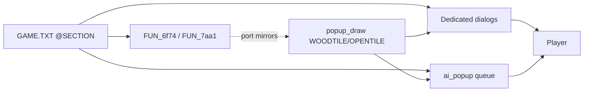

# Popup inventory

Inventory of every player-facing modal in original Colonization, cross-checked
against the Linux port. Canonical copy identity is the `@SECTION` name in
[`COLONIZE/GAME.TXT`](../COLONIZE/GAME.TXT) (499 sections). Decomp call sites
are secondary citations.

Feature-level status also lives in [manual_gap.md](manual_gap.md) and
[port_plan.md](port_plan.md). This file is the **popup checklist**.
Authenticity vs GAME.TXT (invented vs wired): [popup_audit.md](popup_audit.md).

## Legend

| Status | Meaning |
|--------|---------|
| **Done** | Playable wood/list modal with correct choices/behavior (VGA-identical chrome may still be parked) |
| **Partial** | Thin OK, status line, simplified choices, incomplete GAME.TXT fidelity, or PARKED FA stand-in |
| **Missing** | No user-facing modal in the port yet |
| **n/a** | Catalog sentinel / not a player modal |

**Partial** no longer means “invented English OK is fine.” Invented wood INFO OKs are demoted to status; real `@SECTION`s should be wired via `popup_msg_*`.

Structural Done (choices work) is enough per [project_goals.md](project_goals.md);
pixel VGA / portraits are end-game polish.

## Architecture

Original DOS uses one dialog compositor plus a thin message-box helper. Triggers
are scattered; presentation is centralized.

| Layer | Original | Port |
|-------|----------|------|
| Script source | `GAME.TXT` (+ `DEBUG.TXT` cheats) | `assets_msg_find` / hardcoded snippets |
| Compositor | segment `6f74` (`FUN_6f74_36ca` / `3760` / `3848` …) | [`popup.c`](../src/core/popup.c) chrome |
| Thin message box | `FUN_7aa1_003a` | often status line or `ai_popup` KIND_OK (body only; no invent “OK” button — click/key dismiss) |
| Map event queue | flush immediately from AI/turn | [`ai_popup.c`](../src/core/ai_popup.c) (max 16) |
| Dedicated UIs | colony `2f2b`, Europe `38fd`, save `7562`, … | `colony_screen`, Europe menus in `game_loop`, `save_load_dialog`, `pick_music`, `unit_stack`, `cheat_list_dialog`, `new_game` |

### The map status line is not a popup (2026-09-04, bugs.md #369)

DOS has a second, lighter channel that the port kept mistaking for a dialog.
`DS:0x2d54` is a text buffer; `FUN_0000_035c` repaints the map's top strip
every frame and, whenever that buffer is non-empty, draws **its** text there
instead of the strip's normal content (wood pattern id 0x22, ink 0x95 from
`FUN_1009_0004`). Composition is a small append API, all of it via
`FUN_1009_017e` (each append also leaves one trailing space):

| Resident | Thunk | Does |
|----------|-------|------|
| `FUN_1009_00b4(1)` | `281f_0056` | **flush**: wait out the pending line, then clear `0x4a` + the buffer |
| `FUN_1009_017e` | `281f_006a` | append a `char*` |
| `FUN_1009_01a2` | `281f_0074` | append a pooled string by index (`FUN_1000_0062`) |
| `FUN_1009_01b8` | `281f_007e` | append an integer |
| `FUN_1009_0222` | `281f_0088` | drop the last character (kills the trailing space before punctuation) |
| `FUN_1009_0244(kind, ticks, hi)` | `281f_0092` | arm it: `0x4a = 1`, deadline = now + ticks |

The wait (`FUN_1009_0036`) runs until `min(armed deadline, now + 30 ticks)` on
the 60.877 Hz clock, broken early by any key or mouse button — so in practice
each line owns the strip for about half a second and a run of them plays as a
sequence. It **blocks** like a dialog does, but nothing is clicked away.

The **ink** comes from the arm kind (`FUN_1009_0244`'s first argument, kept in
`DS:0x4c`) via `FUN_1009_0004` / `FUN_0000_0094`:

| kind | ink | used by |
|------|-----|---------|
| 1, 2 | `0x95` @COLORS hilite (gold) | every success line — Custom House sale, Europe sale |
| 3 | `0x0c` bright red | Europe refusals (boycott, not enough gold, no room) |
| other | `0x44` @COLORS basic (green) | — |

Port: a ring on `AiPopupState` (`ai_popup_enqueue_bar_message` /
`_kind`, `ai_popup_bar_service`, `ai_popup_bar_message_color`),
`map_menu_set_message(bar, text, ink)` painting the strip in place of the
pull-down titles, and `game_service_bar_message` holding the turn pipeline
while a line is up (parked, not ticked, while any screen covers the map).
Dwell follows DOS's `min(deadline, now + 30 ticks)`: a line with more behind it
holds ~0.5 s, the last of a run lives out the full 0x78 ticks (1971 ms).

Users:

- Custom House sales (`FUN_364b_0688`, one line per cargo) — map strip.
- **Europe sales** (`FUN_38fd_23c4`, arm `FUN_38fd_19d8(1, 0x78, 0)`) — the
  European Status screen's own top strip, `<amount> <Cargo>` + `@CMESSAGE 1`
  "sold for" + gross + `DS:0xfef` "." + tax rate + `@CMESSAGE 0x11` + tax paid
  + `@CMESSAGE 0x12` + net. This one does **not** block: the screen keeps
  taking input and `FUN_1009_0270` retires the line on its deadline. Port:
  `EuropeScreen.bar_event` + `europe_push_sale_status`, drained by
  `game_service_europe_bar`, painted by `render_europe_screen`.

### Dialog script parser — blank lines are the body/choice separator (2026-09-03)

`FUN_6f74_32a4` (EXE 117247) is a **state machine keyed on blank lines**, not a
keyword matcher. `local_6` starts at 1 and is incremented by every empty line;
the loop runs `while (local_6 < 3)`:

| state | meaning |
|---|---|
| 1 | body prose (`291f_08c6` append text line) |
| 2 | choice rows (`291f_0176` add option, ordinal in `local_164`) |
| 3 | stop |

`@`-directives inside a section: `@TEXT` forces state 1, `@OPTIONS` / `@PROMPT`
force state 2, `@SMALLFONT` / `@X` / `@Y` / `@WIDTH` / `@LENGTH` / `@CHECKBOX` /
`@DEFAULT` set box fields, and **any unrecognised `@` sets state 3** — that is
how the next `@SECTION` ends the parse. `@DEFAULT=N` pre-selects the option
whose ordinal is N (`local_164 == local_16c` → box `+0x4c`).

Port: `assets_msg_load_file` records a `blank_before[]` flag per stored line
(blank lines are still not stored — ordinal indexing depends on that), and
`popup_msg_section_body` / `popup_msg_choices` run the same state machine.
The old keyword list (`popup_msg_is_choice_word`) stays only as a backstop for
blankless catalogs; it never knew the quoted rows of `@KINGGALLEON2/3` or the
Euro-diplomacy dialogs, which is why those popups printed their own options
inside the body (bugs.md). `@default` rides the same side-channel as `@width`
(`popup_msg_take_pending_default` → `AiPopupRequest.default_choice` →
`ai_popup` initial selection). `unit_popup_msg` sweeps all 508 GAME.TXT
sections asserting no choice row appears in a body.

**Missing sections show nothing.** `FUN_7314_001a` scans the file for `@TAG`
and returns non-zero at EOF; `32a4` then never allocates a box and `36ca`
returns 0 without drawing. So a tag DOS pushes but GAME.TXT does not ship
(`@CANCELTREATY`, `0x1898`) is a **silent no-op**, not a fallback popup.

### `{}` emphasis markup — shipped 2026-09-02

GAME.TXT colors braced spans (`{far too crowded}`, `{%STRING0}`) with the
@COLORS **hilite** ink (149, gold on the in-game / WOODPANL / EUROPE
palettes) instead of **basic** (68 green). DOS mechanism (dialog text writer
`FUN_6f74_0538`, file offset 0x6C388): `{` sets DS:`0x1f62` = 1, `}` clears
it, both zero-width; the per-char color helper (`0xc346`) picks struct color
+6 (emphasis) over +2 (normal), with the +4 grey/disabled ink overriding
both; `~` escapes the next char, `|` ends the string. `0x1f62` starts 0 per
popup and carries across every drawn line — title, body, then choice rows.

Port: `popup_msg_apply_tokens` **keeps** `{}` (it used to strip); renderers
eat the braces at draw time via `popup_markup_text_width` /
`popup_draw_text_markup` ([`popup.c`](../src/core/popup.c)). Markup-aware:
`ai_popup_render` (title/body/choices, state carried DOS-style, new
`hilite_color` arg), `options_dialog` rows (@COLONYOPTIONS), Europe dock
menu rows (@ARMOPTIONS; greyed rows stay all-grey like DOS), colony-screen
custom-house/dock-orders titles, plus the pre-existing brace-aware paths
(title menu, `europe_draw_prose`, pedia, new_game). Plain-text sinks strip
via `popup_msg_strip_markup` (window-title status via `game_status_text`,
`colony_screen_set_status`, ai_contact/ai_diplo/ai_euro status lines).

### `%NUMBERn$` — the `$` is literal (2026-09-16)

GAME.TXT writes gold amounts as `{%NUMBER0$}`. The DOS expander
`FUN_6f74_309c` matches the 8-byte `%NUMBERn` token, formats the number and
resumes copying at `+8`, so the `$` that follows is copied verbatim: DOS shows
`500$`, and `popup_msg_apply_tokens` does the same. Not a bug.

### Wood frame recipe — audited against `FUN_6f74_2278` (2026-09-07)

The dialog frame is **not** ornate art: it is four drawn layers plus a tiled
brush, and `popup.c`'s `popup_draw` already reproduces all of it. `FUN_6f74_2278`
(6f74:2278, called from `FUN_6f74_248e` via `thunk_FUN_2a1f_0710` with the box's
own `+0x10/+0x12/+0x14/+0x16`) emits, for rect `(x, y, w, h)`:

| # | Run | Colour |
|---|-----|--------|
| 1 | outline `(x, y)`–`(x+w-1, y+h-1)` | `0` black |
| 2 | outline `(x+1, y+1)`–`(x+w-2, y+h-2)` | `DS:0x1f44` = @COLORS **border0** (134) |
| 3 | vline `x+2`, `y+2`..`y+h-3` | `DS:0x1f48` = **border2** (138, dark) |
| 4 | vline `x+w-3`, same rows | `DS:0x1f46` = **border1** (128, light) |
| 5 | hline `y+2`, `x+2`..`x+w-3` | border1 |
| 6 | hline `y+h-3`, same span | border2 |
| 7 | fill `(x+3, y+3, w-6, h-6)` | brush `DS:0x1f3c/0x1f3e` |

**Trap — the bevel corners are decided by order, not by rule.** The two
verticals go down first and the horizontals paint over them, so the shared
top-left pixel is *light* and the bottom-right *dark*. The port drew
top/right/bottom/left and got the top-left corner dark; fixed 2026-09-07.

`DS:0x1f44/46/48` are copied from the NAMES.TXT `@COLORS` bytes at
`DS:0x837/0x838/0x839` by `FUN_75c2_0204` — the same border0/1/2 the port
already uses. `FUN_75c2_024c` is the title-menu variant (mid `0x2e`, border1
`0xfd`, border2 `0x37`, literal indices, no `@COLORS` read).

The brush is real wood, not a dither. Layer 7 goes through `FUN_6f74_033c`
(Ghidra mislabels the wrapped near call as `FUN_7b29_47ec`): when the colour
argument is `7` *and* `DS:0x1f6c` is set it tiles the 32×24 bitmap that
pointer names, else it is a solid `FUN_281f_00ba` rect. `FUN_75c2_0204` builds
that bitmap from **WOODTILE.SS sprite 1** (1-based → the port's sprite 0; the
sheet holds exactly one 32×24 sprite) and points `DS:0x1f6c` at it; the
title-menu set points at the OPENTILE.SS copy, and `DS:0x82e` holds a third
built from PARCH.SS. Brush phase is anchored on the box origin, which is what
`popup_tile_rect` tiling from `(x, y)` reproduces. `TEXTCOLR.TXT`, the only
other writer of `DS:0x1f3c/0x1f3e`, does not ship — those slots keep their EXE
defaults, which is why the `7` arm always wins.

Box flag `0x10` (armed by `FUN_6f74_37f6`, `DS:0x1f56 |= 0x18`) drops layers
1–6 **and** the 3px inset, so the fill covers the whole rect. The King audience
`FUN_75c2_20e2` arms it — its `@KINGLOSE`/`@KINGWIN` text is frameless over the
throne art, which `new_game_render_throne_audience` already matches.

### Popup decorations (MSS/MYR/IND/KING sheets) — shipped 2026-08-31

DOS decorates many popups with a figure sprite. Three latches, all cleared
after every popup show (`LAB_6f74_3018`):

- `DS:0x1f5c` chief/king portrait (`IND{tribe}A{tier}.SS` / `KING.SS`,
  `FUN_6f74_0042`) — ported earlier (P8.6).
- `DS:0x1f5e` = MSS index → `MSS{0-5}.SS` (`FUN_6f74_00c2`, set via far stub
  `FUN_281f_0652(tag, index)` or direct writes): 0 admiral (ships/sea),
  1 continental soldier (war/king/revolution), 2 courtier (gold/prices/court),
  3 frontiersman (terrain work/scout/LCR), 4 friar (religion/unrest),
  5 nun (colony stores/raids).
- `DS:0x1f60` = MYR index → `MYR{0-3}.SS` (`FUN_6f74_00ec`, stub
  `FUN_2a1f_0688(tag, nation)`): Euro ruler by nation id, used by the
  `5bfb` diplomacy dialogs (13b0/153e).

Placement is data-driven from each sheet's 0x98-byte section-0 header
(bytes 0x0e/0x10/0x12 → `ss.h` `place_offset_y`/`place_mode`/`place_offset_x`):
the sprite stands **above** the dialog, bottom overlapping the dialog top by
`place_offset_y`; mode 0 = left edge (horizontal overlap `place_offset_x`),
1 = centred, 2 = right edge; the pair is centred vertically as a unit, and the
sprite is dropped when the combined height reaches 200 (compositor
`viceroy_unpacked.c:116068`).

Draw order matters and depends on which latch is set. `FUN_6f74_248e`
(`viceroy_unpacked.c:116519`) calls the sprite blit `thunk_FUN_2a1f_0ab6`
(→ `FUN_6f74_1ae8`) **before** the frame when `DS:0x1f5c >= 0` and **after**
everything when `DS:0x1f5c < 0`: a chief/King portrait sits *under* the wood,
an MSS/MYR figure *over* it. Fixed in `ai_popup_render` 2026-09-07 (both used
to blit after the frame).

Port wiring: the (tag → index) pairs were lifted from every constant
`FUN_281f_0652` PUSH pair in the VICEROY.EXE asm and keyed by section name in
`popup_msg.c` (`k_popup_msg_mss`); `popup_msg_fill` records the section's index
in a side-channel (same pattern as `@width`) and the next `ai_popup` enqueue
takes it, so all existing fill→enqueue sites decorate without signature
changes. Explicit overrides where DOS latches without a constant tag:
Fountain-of-Youth picks (MSS3) and the Brewster pick (MSS4) in `units.c`
(`FUN_38fd_4884` writes), MYR via `ai_popup_set_last_graphic_myr` in
`ai_diplo.c`'s talk helpers (skipped when the section carries its own MSS
figure, e.g. `@DECLAREWAR`). MYR wins when both are set (DOS loads it last);
a chief portrait suppresses the MSS/MYR sprite in the port.

#### Europe in-screen menus + the King helper — closed 2026-09-07

The Europe Recruit/Purchase menus are drawn by `game_loop`, not `ai_popup`, so
they missed the side-channel. DOS builds them through the *same* generic list
dialog (`FUN_291f_0182` → `FUN_6f74_32a4`, shown by `FUN_291f_016a` →
`FUN_6f74_2580`, which is what reads all three latches and calls
`FUN_6f74_14c6`), latching immediately before it. Asm PUSH/LEA pairs, since
Ghidra drops these args (`LEA BX,[0x87c]` = `GAME`, `LEA AX,[tag]`):

| DOS site | asm | tag | latch |
|---|---|---|---|
| `FUN_38fd_4884(1,0)` FoY pick | `38fd:4910` | `0x10f1` `@LOSTCITY0` | MSS3 — already wired (`units.c`) |
| `FUN_38fd_4884(0,1)` Brewster | `38fd:4924` | `0x10fb` `@RECRUITCHOOSE` | MSS4 — already wired (`units.c`) |
| `FUN_38fd_4884(0,0)` Recruit menu | `38fd:4948` | `0x1109` `@RECRUIT` | **MSS2 — wired now** |
| `FUN_38fd_4b50` Purchase menu | `38fd:4b5d` | `0x1111` `@PURCHASE` | **MSS2 — wired now** |
| `FUN_38fd_2a92` sail confirm | `38fd:2aba` | `0xffc` `@SAILAWAY` | **MSS0 — wired now** (table row) |

`@KINGRECRUIT` (Train) and the dock `@ARMOPTIONS` menu latch nothing, and DOS
shows them bare — `original_screenshots/europe/train.png` confirms.

Placement is the same header-driven rule as `ai_popup_render`, now also in
`europe_menu_layout` (`game_loop.c`): MSS2.SS is 122×84 with
`place_offset_y=6`, `place_mode=1` (centred), `place_offset_x=0`. That
reproduces `recruit.png` exactly — its 102 px dialog gives
`total_h = 84 − 6 + 102 = 180`, `top = (200 − 180)/2 = 10`, so the sprite sits
at y=10 and the dialog at y=88, which is where the screenshot has them. The
same pass replaced the port's hardcoded `dialog_y = 16` with DOS's
`100 − h/2` auto-place (`FUN_6f74_14c6` @ OVL24 `0x16cb`–`0x16f6`);
`train.png`'s undecorated 180 px dialog lands at y=10 by the same formula.
The sprite blits **after** the frame (`FUN_6f74_248e`: sprite-last whenever
`DS:0x1f5c < 0`), and `EUROPE.PIK`'s black 120..251 block takes MSS2's own
palette entries via `ai_popup_sheet_palette_merge` (merge, never remap).

**KING.SS was a refutation** — the "unwired" note was stale. `DS:0x1f5c = 8`
has been live since the tax-audience flair fix (`ai_king.c`, KING.SS base +
KING2.SS frames + palette merge). The asm scan did find three *sites* that
never got it, all now wired: `FUN_38fd_3dc8`'s message-only arm
(`38fd:402a MOV word [0x1f5c],0x8`, reached by a tax cut or by "no cargo
eligible for a tea party"), and the two callers of the King-flair message
helper `FUN_291f_0ad4` (→ `FUN_6f74_378a`, which latches 8 then shows) —
`38fd:5b6e PUSH 0x1134` = `@KINGNEWWAR` (`ai_king.c`) and
`3844:04e1 PUSH 0xf09` = `@LOSENOCOLONIES` (`turn.c`). Those are the only two
`0ad4` call sites in the image; the five extra ones Ghidra shows in
`FUN_2f2b_628a`/`6372`/`2f3e` and `FUN_38fd_3694`/`4f6e` are the `5930` body
re-decoded into neighbouring switch tables (all carry the same `0x1134`), not
real sites.

Still not wired: `FUN_479b_076e`'s idx-5 WoI popup.

Modal input (`game_loop.c`): early gate before parent hotkeys (E/Q/etc.) —
pick_music → save_load → options → name_entry → howmuch → cheat_list →
**ai_popups** → unit_stack. Letters typed in name/howmuch do not switch views.

**Blocking invariant (2026-09-01):** every modal blocks all simulation,
including mid-EOT — `game_update`'s EOT branch presents queued popups/woodcuts
between processor slices and freezes `turn_processor_advance` until each is
answered (DOS popups are blocking calls; ours pause the pipeline instead).
`game_turn_flow_allowed` is false while the EOT processor is active, so a
popup answer can never hand control to a unit mid-EOT. Queue cap raised to 32
(one SETUP slice can queue every colony's production chrome before the
presenter drains any). See architecture.md "Blocking-popup invariant".

**Colony-event choices (2026-09-02):** every colony EOT message DOS routes
through `FUN_364b_0000` (`thunk_FUN_291f_09dc`) carries two choice rows —
LABELS.TXT `@MISC` 34/35 "Continue turn." (id 1) / "Zoom to colony." (id 2,
DS:0x2dfe/0x2e00) — while the per-colony latch DS:0xa898 is clear. Picking
zoom sets the latch (rest of that colony's batch presents optionless) and the
colony screen opens after the batch drains (`FUN_364b_0688` tail
`FUN_281f_0608`). Port: `ai_popup_enqueue_colony_event` (tag
`AI_POPUP_TAG_COLONY_EVENT`, payload = colony id) on the whole family —
BUILT / NOMOREWAREHOUSE / NOMOREWAGONS / DEPLETION / SoL (SONS*/TORY*/REBEL*)
/ EFFICIENT / INEFFICIENT / TRAIN* / NEWCOLONIST / FOOD1-2 / FOODLOW /
STARVE1-2 / ALREADYHAVE / NEEDTOOLS* / raw-out crumbs (LUMBER…TOOLS) /
SPOIL* / CARGOREADY*. `@VANISH` stays optionless (DOS passes the choice flag
false). `game_loop` latches the election (`ai_popup_colony_zoom_elect`) and
opens the colony screen via `ai_popup_take_colony_zoom` once no popups for
that colony remain — mid-EOT too, like DOS. Not in the family (DOS
`FUN_281f_0652` / ticker): TUTORIAL6, UNREST, WARN1/2, Custom House sale line.

**Out of main tables:** MAPEDIT.EXE ([`MAPEDIT.TXT`](../COLONIZE/MAPEDIT.TXT) —
19 sections), Colonizopedia articles, F2–F10 report *plates* (unless a nested
confirm), pulldown chrome from `MENU.TXT`. Woodcut discovery captions
(`WOODCUT.TXT`) are noted under Discovery.

---

## Inventory by system

Each row is one presentation site (what actually opens), not one `@SECTION`
fragment. Related sections are listed in the first column.

### 1. Shell / title / new game

| Popup / `@SECTION`s | When | Status | Port |
|---------------------|------|--------|------|
| `@BEGINMENU` | Title: New World / America / Customize / Load / Exit / HoF | Done | [`game_loop.c`](../src/core/game_loop.c) |
| `@AMERICA`, map pick | America vs generated / load `.MP` | Done | [`new_game.c`](../src/core/new_game.c) |
| `@DIFFICULTY` | Difficulty pick | Done | Image regions on `DIFFICUL.PIK` |
| `@PICKNATION` | Nation pick | Done | Image regions on `NATIONS.PIK` |
| `@LEADERNAME` | Leader name entry | Done | Wood name entry |
| `@VICEROY` / `@VICEROY2` | King audience intro | Done | `KINGLSS.PIK` phase |
| `@NATION0A`…`@NATION3B` | Nation lore | Done | Lore pages |
| `@BUILD1`…`@BUILD10` | Sail-away captions | Done | Over `LEVN*.PIK` |
| `@CUSTOM` / `@CLAND`…`@CCLIM` | Customize land/climate | Done | Image grid + `@MISC` labels |
| `@GAMEOPTIONS` / `@COLONYOPTIONS` / `@SOUNDOPTIONS` | Options checkboxes | Done | [`options_dialog.c`](../src/core/options_dialog.c) |
| `@DOS` / `@DOSYES` | Quit confirm | Done | Map/title confirm via `AI_POPUP_TAG_MAP_CONFIRM` |
| `@RETIRE` | Retire confirm | Done | Confirm then F10 score |
| `@MULTI*` | Multiplayer setup | Missing | — |

### 2. Save / load / music

| Popup / `@SECTION`s | When | Status | Port |
|---------------------|------|--------|------|
| `@SAVEGAME` (+ good/error) | Manual save slots | Done | [`save_load_dialog.c`](../src/core/save_load_dialog.c); GAME→Save / **S** |
| `@LOADGAME` (+ variants) | Manual / title load | Done | Same; slots 0–9; title LOAD / **L** |
| `@PICKMUSIC` + Independence/Military/Indian | GAME→Pick Music | Done | [`pick_music.c`](../src/core/pick_music.c) |

### 3. Map / unit orders

| Popup / `@SECTION`s | When | Status | Port |
|---------------------|------|--------|------|
| `@LANDFALL` / `@LANDFALL2` | Ship→bare land with passengers | Done | `AI_POPUP_TAG_LANDFALL` + `popup_msg_fill` |
| Stack picker | Multi-unit tile click | Done | [`unit_stack.c`](../src/core/unit_stack.c) |
| `@SUREDISBAND` / `@DISBANDSHIP` | Disband confirm / ship cargo error | Done | Confirm `@SUREDISBAND`; `@DISBANDSHIP` OK when units aboard |
| `@FINDCITY` / `@NOCITY` | Find colony picker | Done | `cheat_list` FIND_COLONY |
| `@SAILPORT` | Unit ORDERS "Go to Port" (ships) | Done | 2026-09-16: `game_open_goto_port_picker`/`cheat_list` GOTO_PORT — own coastal colonies + Europe row (999), DOS `FUN_647e_01c6`/`FUN_2b5a_1dfc`; replaces the prior "jump to next owned colony" shortcut (docs/unit_orders.md) |
| `@OVERBOARD` | Dump cargo confirm | Done | Yes/No then dump first hold |
| Order gates (`@ONLYPIO`, `@NEEDTOOLS`, `@NOPLOW`, …) | Illegal order | Done thin | Re-verified 2026-09-16: `@ONLYPIO`/`@NOPLOW`/`@NOROAD` (`units.c` `units_pioneer_emit_order_gate`), EOT `@NEEDTOOLS`/`@NEEDTOOLS0` (`turn.c`), `@SEACOLONY`/`@TOOMOUNTAIN`/`@NOPORT` (`game_loop.c`) all call `popup_msg_fill` with the real GAME.TXT body at the DOS condition — was mis-tallied Partial against a stale note; see Appendix A |

### 4. Colony screen

| Popup / `@SECTION`s | When | Status | Port |
|---------------------|------|--------|------|
| Construction CHANGE | CHANGE / **C** | Done | [`colony_screen.c`](../src/core/colony_screen.c); owned refuse `@ALREADYHAVE` / `@NOMOREWAREHOUSE` |
| Field jobs | Assign colonist to field | Done | Job list popup |
| Leave-as (eject) | Fence with colonist | Done | Role list |
| `@ABANDON` / `@ABANDON2` | Last colonist leave | Done | Yes/No confirm from GAME.TXT |
| `@KEEPSTOCKADE` | Stockade min pop | Done | OK from `@KEEPSTOCKADE` |
| `@MORETHANTHREE` | Assign 4th colonist to a full building | Done | `colonies_assign_workplace` caps at `COLONIZE_BUILDING_MAX_WORKERS` (3); `colonies_emit_more_than_three_chrome` OK. Was previously misdocumented as a `@KEEPSTOCKADE` alias — the two sections are unrelated |
| `@COLONY` / `@RENAMECOLONY` | Found / rename | Done | Name entry after found; **R** rename in colony |
| `@LANDHO` | First land sight | Done | Name New World (`colony_region`); seed from NAMES `@COLONYNAME` per nation |
| `@HOWMUCH1`… | Cargo amount | Done | [`howmuch_dialog.c`](../src/core/howmuch_dialog.c) (`=` colony / Europe **L**) |
| `@WAREHOUSEFULL` | Warehouse overflow | Done thin | Unload full → `ai_popup` OK; spoilage still `@SPOIL*` |
| Train fails (`@NOTEACHER`, `@TRAINFAIL`, …) | School train | Done thin | Re-verified 2026-09-16: EOT `@TRAINFAIL` (`turn.c`), assign-time `@NOTEACHER`/`@NEEDCOLLEGE`/`@NEEDUNIVERSITY` (`colony.c`) all `popup_msg_fill` real body at the DOS condition; see Appendix A |
| `@FULL` | Join at population cap | Done thin | `colonies_emit_full_chrome` → ai_popup OK |
| Spoil / starve (`@SPOIL*`, `@STARVE*`, …) | EOT production | Done | `ai_popup` OK from turn production |
| Docked unit orders | `@COLONYUNIT` + `@SHIPOPTIONS`/`@UNITOPTIONS`, 2nd click on selected dock icon | Done thin | `colony_screen_open_dock_orders`; ineligible rows omitted (`2f2b_5746`); VGA chrome PARKED |
| `@CARGOREADY*` | Century tip / ship-ready | Done thin | EOT century `@CARGOREADY0`–`2`; ship FINISH still thin |

### 5. Europe

| Popup / `@SECTION`s | When | Status | Port |
|---------------------|------|--------|------|
| `@RECRUIT*` | Recruit pool | Done | Wood menu **R** |
| `@PURCHASE` / `@REALLYBUY` | Buy ship/artillery | Done | ~PURCHASE |
| `@SCHOOL1` / `@COLLEGE2` / `@UNIV3` | Train expert | Done | ~TRAIN |
| Europe dock orders | Don’t board / Board / Move front | Done | `EUROPE_MENU_DOCK` |
| `@HOWMUCH4`/`5` | Buy/sell amount | Done | Europe **L**/**U** → howmuch |
| `@PRICEUP` / `@PRICEDOWN` | Price change notice | Done | OK popup (EOT + immediate buy/sell) |
| `@KINGTAX` / `@TAXOPTIONS` / `@TEAPARTY` | Tax audience (also map queue) | Done | `@KINGTAX` body + `@TAXOPTIONS` Kiss/Party; `@TEAPARTY` Done thin (stock dump + tokens; VGA PARKED) |
| `@KISSUP` / `@KISSSORRY` | Click a boycotted market cell | Done | `AI_POPUP_TAG_EUROPE_KISSUP` CHOICE (Unfair / Pay) from `game_europe_ask_boycott_buyback`; Pay then tests the purse and shows `@KISSSORRY` OK, exactly `FUN_38fd_2dfe`'s order (2026-09-16) |

### 6. Indian contact / trade / raids

| Popup / `@SECTION`s | When | Status | Port |
|---------------------|------|--------|------|
| `@INDIANWELCOME` → peace/shun | First contact Yes/No | Done | `CONTACT_WELCOME` |
| Meet Trade/Gift/Demand/Teach/Leave | Village meet | Done | `CONTACT_MEET` |
| Gift amount | Gift gold | Done | Small/Large/Generous CHOICE |
| Demand tools/gold | Tribute | Done | `CONTACT_DEMAND` |
| Teach (`@LEARN*`) | Teach skill result | Done | Re-verified 2026-09-16: `ai_contact_live_among_natives` (menu path, `thunk_FUN_1000_a618`) renders the full script — `@LEARNMAD`/`@LEARNCRIMINAL`/`@LEARNMASTER`/`@LEARNALREADY`/`@LEARNSLOW`/`@LEARNSTAY` CHOICE → `@LEARNDONE`/`@LEARNLATER` — each with the real GAME.TXT body via `popup_msg_fill`; `ai_contact_teach_skill` is only a defensive fallback when no menu unit/village is present. `ai_contact_speak_with_chief` gives Scout→Seasoned `@WELLSEASONED`. AI-only auto-pulse (non-menu) path still skips silently — noted in Appendix A, tracked as a design tension, not a regression |
| Mission / convert (`@MISSION*`, `@INDIANSCONVERT`) | Missionary | Done | `CONTACT_CONVERT` with the real `@MISSION0-3` / `@HERESY0-1` / `@INDIANSCONVERT` bodies (re-verified 2026-09-16) |
| `@RAID*` outcomes | Raid / ambush | Done | `CONTACT_RAID` + real `GAME.TXT` bodies via `popup_msg_fill` for 6 of 7 kinds (P8.4, 2026-08-26); `4528` no longer PARKED (2026-08-27/28). `@RAIDWREAK` re-verified 2026-09-16 as deliberately thin: DOS raw `5fef:126a` does call `FUN_281f_0652(0x1b8a, mode=3)` from `FUN_5fef_0f14`, but with a different mode/loop shape than the other 5 kinds' `mode=5` victim calls, and the GAME.TXT `@RAIDWREAK` text is a third-person "Spies report: … the {adjective} colony of {name}" frame, not a victim status line — see `indian_raid_outcomes.md` |
| Village attitude / HELLO | Enter settlement | Done | `@VILLAGEHAPPY/SAVAGE/MEDIUM/BAD/WAR` band body via `popup_msg_fill`; `@INDIANHELLO1/2` are dead GAME.TXT (no DS tag string, 2026-09-16) |
| `@CHIEF*` | Chief portrait meet | Missing | — |
| `@TRADE0`/`1`, haggle `@BADHAGGLE*` | Deep village trade | Done (structural) | `2820` LAB_002bbc/002e92 human loops ported 2026-08-27 (`ai_contact_2820_sell_haggle`, `ai_contact_2e92_haggle`); VGA PARKED |
| Bribe / encroachment CHOICE | Road/forest / alarm | Missing | Thin OK/status; CHOICE PARKED |

### 7. Euro diplomacy

| Popup / `@SECTION`s | When | Status | Port |
|---------------------|------|--------|------|
| War / Peace / Alliance / Break | Rival offers | Done | `DIPLO_WAR` / `PEACE` / `ALLIANCE` / `BREAK` Accept/Refuse |
| Boycott | War embargo / Tools lift | n/a | no DOS popup: war/peace OKs are `@DECLAREWAR` / `@SIGNTREATY` (2026-09-16: invented "boycott imposed" / "embargo lifted" bodies no longer replace them; the Tools-lift line is status-only) |
| FA `@HELLO*` / `@PEACE*` / `@TRIBUTE*` … | Euro encounter negotiation | Done | `FUN_5bfb_153e` talk machine (`ai_diplo.c`, tag `DIPLO_TALK`); `3f41` is the F2-F9 adviser-report overlay, not diplomacy. `…USA` variants are the one delta |
| Military Assistance / mercenary hire (`@MILITARY`, `@UNFORTUNATE`, `@MERCENARY`) | PEACEMENU choice 4 | Done | Verified 2026-09-16: `ai_diplo.c` `AI_TALK_ST_ALLY_PICK`/`ALLY_PAY` matches raw :98330-98395 (affordability gate, war-bit set both directions incl. Indian side); `@MILITARY` intro line was the one missing piece, added 2026-09-16 |
| Scout enters foreign colony (`@SCOUTCOLONY`, `@LOSTOURSCOUTS`, `@LOSTTHEIRSCOUTS`, `@NOMAYORSDURINGREV`) | Human scout steps onto Euro colony | Done for the human side | `AI_POPUP_TAG_SCOUT_COLONY` (`game_loop.c`); DOS's `@LOSTTHEIRSCOUTS`/`@NOWARSDURINGREV` branches (AI scout vs. human colony; any unit vs. any foreign colony during WoI) live in the shared `FUN_465b_0000`→`FUN_5f7a_0662` dispatcher, which the port never calls for AI-driven unit movement — see Appendix A |

### 8. King / REF / independence / FF

| Popup / `@SECTION`s | When | Status | Port |
|---------------------|------|--------|------|
| Tax audience Accept/Refuse | King tax hike | Done | `KING_AUDIENCE` |
| Dump-goods cargo | Refuse → boycott pick | Done | `KING_DUMP_GOODS` |
| Tax/boycott follow-up | After audience | Done | `KING_TAX` OK from `@TEAPARTY` / `@KINGTAX` / rung sections (`@KINGNAVACT` …) via `popup_msg_fill` |
| Audience flavour sections | Which text the tax audience shows | Done | `FUN_38fd_5be8` names a section per ladder rung: `@KINGVICTORY` (cut) / `@KINGWIFE` (+1) / `@KINGWAR` (+2) / `@KINGNAVACT` (+3-4) / `@KINGSTAMPACT` (+5-8), with `%STRING2` from `@COUNTRIES` / `@ORDINAL` / the player's New World name (2026-09-16, `ai_king.c` `AiKingAudienceFlavor`) |
| King's audience chamber | `@KINGWELCOME0` / `@AUDIENCE` menu / `@KINGBLESS` / `@KINGLAUGH` / `@KINGNO` / `@KINGFUND` / `@KINGLOWER` / `@KINGRAISE` / `@KINGNOTHING` | n/a | Cut feature: the chamber is `FUN_38fd_462e`, which nothing calls in `viceroy_unpacked.asm` or `viceroy_overlays.asm`, and its menu text (`@AUDIENCE` `0x10d4`) and refusal (`@KINGGOAWAY` `0x10c9`) were removed from the shipped `GAME.TXT`. Its five actions (`38fd:44a4`, `38fd:4590`, three thunks) have no other caller either |
| Merc Hire/Decline (`@MERCENARIES`) | Continental mercs | Done | `KING_MERC` |
| Declare (`@DECLARE`) | Independence confirm | Done | `KING_CONGRESS` body+choices via `popup_msg_fill` / `popup_msg_choices`; VGA PARKED |
| `@INDEPENDENCE` letter | Rename / letter | Done | `KING_LETTER` from `@INDEPENDENCE`; signing cinematic Done 2026-08-30 (`declaration.c`) |
| `@INVASION` / intervene | REF / ally arrival | Done thin | REF `@INVASION`; ally `@INTERVENTION`+`@INTERVENE` |
| Crown capture | REF takes colony | Done thin | `KING_CAPTURE` via `@CAPTURED3` |
| Revolution win/lose | End WoI | Done thin | `@WINNING` / `@LOSING1` / `@LOSING2` / `@RETIRING2` via `popup_msg_fill`; latches; VGA PARKED |
| Mid-war warn | WoI | Done | ONE `@WARN%d` per turn from DOS's digit-patch selector (raw 58506-58534): colonies<3 → `@WARN2` > share ≥80% → `@WARN3` > ports<3 → `@WARN1`; skipped on a turn that wins or loses the war; port-side episode latches `market_demand_pool_raw[6]/[7]/[10]`. `@LOSING3` takes over at share ≥90% |
| `@CONTINENTAL` FF elect | Founding Father debate | Done | `FF_CONGRESS` |
| 1800 peacetime end | Auto-end | Done thin | `@SCORED` CHOICE; That's all → `@RETIRING` + retire score; latch `market_demand_pool_raw[4]=3` |
| Anniversary soon-retire | Calendar | Done thin | `@SOONRETIRING0` Spring 1790 peacetime; `@SOONRETIRING1` 1840 WoI |

### 9. Combat / loot / capture

Deep mechanics: [combat.md](combat.md).

| Popup / `@SECTION`s | When | Status | Port |
|---------------------|------|--------|------|
| Combat Analysis (options bit) | After strengths, before roll; human side | Done | DOS `636c` layout: 214-wide frame, per-column header (chrome + type name + baseline right-aligned), label/±N% split rows at 20px pitch; gated by `combat_analysis` |
| `@LOOT*` / `@LOOTCAPTURE` / `@LOOTCASH` | Combat loot / ransom | Done | `@LOOT` treasure + `@LOOT2` burn Done; `@LOOTCAPTURE` ransom Done; `@LOOTCASH` Europe fleet cash-in (`units_king_galleon_cash_in` / `europe_cash_treasure`) Done — see section 9 |
| `@CAPTURED*` / `@BURNED*` / `@SHIPDAMAGE` / `@SHIPSUNK` | Capture / burn / naval | Done | Colony `@CAPTURED*`/`@BURNED*`; ship damage/sunk Done |
| `@COLONISTCAPTURE*` / `@WAGONCAPTURE` / `@CARGOCAPTURE` | Unit / wagon capture | Done | Structural combat popups |
| `@EUROPEWIN` / `@EUROPELOSE` | Euro combat outcome | Done | `{atk} defeat {def nation unit} near {place}!` / reverse; LABELS defeat/defeats |
| `@DEMOTE` | Specialty strip / demote | Done | `@DEMOTE` with nation/unit/status tokens |
| `@SEIZURE*` | Privateer / seizure | Done | Privateer custom body; Crown `@SEIZURESEA` Royal Navy |
| Ambush WIN/LOSE (`@INDIANWIN*`) | Indian ambush | Done | `{tribe} ambush {nation unit} near {place}!` (+ seized by tribe braves); LOSE `{nation unit} {defeat} {tribe} near {place}!` |

### 10. Year-end / victory / HoF / retire

| Popup / `@SECTION`s | When | Status | Port |
|---------------------|------|--------|------|
| `@LOSENOCOLONIES` / defeat | No colonies | Done thin | DOS `3844_0442` Section B (year≥1600, peacetime, zero human colonies): `@LOSENOCOLONIES` OK (`%STRING0` difficulty title, `%STRING1` leader name) then `AI_KING_ENDGAME_LOST` → retire-score/HoF chain (`turn_run_year_end_chrome`) |
| `@SCORE` / `@SCORED` / retire | Retire / F10 | Done thin | `@SCORED` + `@RETIRING` on peacetime 1800 That's all; F10 score; HoF stub `HOF.TXT` |
| `@LOSING*` / `@WARN*` / `@WINNING` | WoI end / anniversary | Done thin | `@WINNING`/`@LOSING1`–`3`/`@RETIRING`/`@RETIRING2`/`@WARN1`–`3`/`@SOONRETIRING0`/`1` Done thin |
| `@TIMECHANGE` | Calendar help | Done thin | Fires once at year 1600 / season 0 (`FUN_130d_0290`, asm-recovered `LEA BX,[0x141]`) via `popup_chrome_ok` in `turn_processor_advance` |
| 1850 WoI win | Year≥1850 + no crown | Done thin | `@WINNING` latch + INFO |
| 1850 WoI stalemate | Year≥1850 + crown alive | Done thin | `@RETIRING2` latch lost + INFO |

See also [sons_of_liberty.md](sons_of_liberty.md),
[`year_end_chrome.md`](../original_sources_annotated/turn/year_end_chrome.md).

### 10a. Game Options

The `GAMEOPTIONS` dialog persists all eight Col1 flags. End of Turn,
Autosave, and Combat Analysis are active. Show Indian Moves and Show
Foreign Moves now watch nearby AI tile steps during interactive end-turn
processing; Fast Piece Slide shortens the tile-step interval. Water Color
Cycling and Tutorial Hints remain persisted flags only until final polish.

### 11. Discovery / tutorial / woodcuts

| Popup / `@SECTION`s | When | Status | Port |
|---------------------|------|--------|------|
| `@LOSTCITY1`…`9`, `@BURIAL*`, `@SCREWED` | Lost City / ruins | Done thin | `units_resolve_lcr_rumour`; @LOSTCITY4 Search/Stay-clear CHOICE auto-resolves as Search (interactive CHOICE PARKED); native-attack combat resolve on `@SCREWED` PARKED (50/50 despawn stand-in) |
| `@TUTORIAL1`…`19`, `@TUT*` | Tutorial hints option | Missing | — |
| `WOODCUT.TXT` captions | Discovery woodcut scenes | Done | [`woodcut.c`](../src/core/woodcut.c) — `FUN_12fd_006c` once-only gate (DS:`0x540a` = `event` + `unknown05`) + tune table, `FUN_6f30_0062` presenter (WOODFRAM.SS frame, WDCUT`nn`.SS art, NAMEPLAT.SS 3-piece plate, FONT-NP.FF caption). Wired ids: 1 new world (land sighted, `FUN_4720_049e`), 2 building a colony (`479b:0950`), 3/4/5 natives/Aztec/Inca (`5bfb:038a`, by tribe tech class), 6 Pacific (`13f1:0280`), 7 entering a village (`4d56:478a`), 8 Fountain of Youth (`65dd:04a9`), 9 cargo from the New World (`48d3:08bf`, a ship docks in Europe with goods), 10 meeting fellow Europeans (`5bfb:15cf`, MET bit still clear), 11 colony burning + 13 Indian raid (`5fef`). Id 12 COLONY DESTROYED has art but **no** call site in the shipped EXE; ids 14-16 have captions but no art; 17-25 are demo-autoplay only |

### 12. Cheats (`DEBUG.TXT`)

| Popup | When | Status | Port |
|-------|------|--------|------|
| `@SETVIEW` Reveal Map | DEBUG → Reveal | Done | [`cheat_list_dialog.c`](../src/core/cheat_list_dialog.c) |
| Kill Indians tribe list | DEBUG | Done | Same |
| `@CREATE` / `@SETHUMAN` / other DEBUG | Other cheats | Missing | Status “Cheat not implemented yet” |

DEBUG sections: `MOTD`, `MOTD2`, `MEMORY`, `CREATE`, `CREATE2`, `CSHIP`,
`FOREIGN`, `FOREIGN2`, `SETVIEW`, `SETHUMAN`, `SETAUTO`, `SETREPORT`,
`SETEUROPE`, `DANGER`, `BADGUYS`, `SOUND`, `OPTIONS`, `FORCED`, `TEST`, `END`.

### 13. Trade routes

DOS module = segment `647e` (mislabelled "colony" in the catalog — records are
0x4a routes, not 0xca colonies); create wizard = OVL19_L0040; Begin =
`FUN_2b5a_1e66`; stop service = `FUN_479b_0bd0`.

| Popup / `@SECTION`s | When | Status | Port |
|---------------------|------|--------|------|
| `@TRADEMANY` | Create at 12-route cap | Done | ai_popup OK, %NUMBER0=12 |
| `@TRADESTART` | Create/editor destination pickers | Done | `cheat_list` TRADE_DEST, %NUMBER0 = stop # |
| `@TRADETYPE` | Create: first colony coastal | Done | AI_POPUP_TAG_TRADE_TYPE CHOICE (1=Sea) |
| `@TRADENAMES` + `@TRADENAME` | Create: default name + entry | Done | "<Colony> <random word>", " A"-suffix dedupe; name_entry TRADE_NAME (31 chars) |
| `@TRADENONE` / `@TRADENONE2` | Begin/Edit with no (matching) routes | Done | ai_popup OK; %STRING0 = @ROUTE Sea/Land |
| `@TRADESELECT` route picker | Begin (sea/land filtered) / Edit | Done | `cheat_list` TRADE_SELECT, "N. NAME" rows |
| `@SAILPORT` / `@TRAVELPLACE` | Begin: multi-stop route starting-stop picker | Done | `game_trade_open_stop_picker` (`game_loop.c`), title by `r->sea` (DOS `FUN_647e_090a`), "N. stop" rows, preselect = unit's current stop or 0 |
| `@CARGOLOAD` / `@CARGOUNLOAD` | Editor cargo append | Done | `cheat_list` TRADE_CARGO_ONE, %STRING0 = stop |
| `@TRADEDELETE` / `@SUREDELETE` | Delete confirm | Done | Route picker + Yes/No; DOS unit fixup + array compaction |
| `@ROUTELOOP` | Route with one distinct port | Done | ai_popup OK at stop service; unit parked |
| VGA TRADE chrome | EDIT TRADE ROUTE screen | Done | [`trade_screen.c`](../src/core/trade_screen.c) — `647e_09da` layout (LABELS @ROUTE headers, 4 stop rows y 61+20i, unload x 125 / load x 208, ICONS.SS #22+ icons), `1064`/`10d2` click zones (rename band, dest/cargo columns, exit ≥ y 169), "(Delete Destination)" row |

---

## Summary counts

---

## Section Index

Detailed popup catalog, with exhaustive `@SECTION` reference and DOS site citations: **See [popups_catalog.md](popups_catalog.md)**
