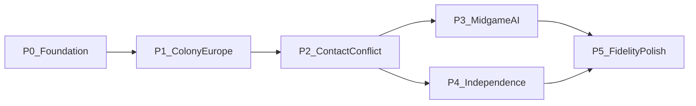

# Whole-project roadmap

Living phase map for the Linux Colonization port: **what’s next for the whole
project**. This is a navigation layer — not a merged feature checklist.

**Detail lives elsewhere:** row-level Done/Partial/Missing in
[manual_gap.md](manual_gap.md); AI FUN inventory and unpark/R5 queues in
[ai_transcription.md](ai_transcription.md); save field atlas in
[save_format_map.md](save_format_map.md); light catalog peels in
[catalog_peel_ranking.md](catalog_peel_ranking.md). Goals and conflict order:
[project_goals.md](project_goals.md).

Update this file when a phase’s **status** or **exit criteria** change. Keep
per-feature and per-FUN status in the owning gap docs.

---

## North star

Same rules, assets, saves, and inputs as DOS Colonization (1994). When goals
conflict, prefer:

1. Save / data interoperability
2. Gameplay / determinism
3. UI parity
4. Visual polish last

Full bar: [project_goals.md](project_goals.md).

---

## Current posture

The port is strong on **shell, map art, navigation, reports / pedia, Col1
save/load, basic units / naval passengers, founding a colony, and Europe
buy/sell/recruit/hire**. Structural Indian contact (including player dialogs),
Euro/Indian diplomacy, king/REF (audience/confirm/merc), FF election, trade
routes (Create/Edit/Begin), and early Euro AI (seed-100 T2 + thin expand/war)
are in (Sepulveda/Cortes/de Witt effects **Done**). Next playability work is
leftover **FF** KINGGALLEON2, deep mid-planner `20e6`, production / combat depth,
and endgame polish — not waiting on missing combat/capture prerequisites. VGA
dialog chrome, Congress UI, COLDIG SFX, and full 1:1 AI bodies remain later.
Snapshot source: [manual_gap.md](manual_gap.md) takeaway.

**Maintained (not blocking):** Col1 save RE P0–P6 is **Done**
([save_format_map.md](save_format_map.md)); keep interop green. VICEROY light
catalog (Layers A–C) is **closed**; Layer D deep extracts only on demand;
MAPEDIT parked ([catalog_peel_ranking.md](catalog_peel_ranking.md)).

---

## Phases

| Phase | Status | Exit criteria (player-visible / save) |
|-------|--------|----------------------------------------|
| **0 Foundation** | Done | New game, map, menus, Col1 save/load round-trip, basic move/orders |
| **1 Colony–Europe loop** | Mostly done | Found/assign/produce/sail/buy-sell/pioneer/trade-routes structural playable |
| **2 Contact & conflict** | Partial | Land/naval combat + capture + Indian meet/trade/raid usable for a human game without deep PARK blockers |
| **3 Mid-game AI** | Partial / active | Euro mid-planner (`5d04` / land `20e6`) + Indian large bodies advance; `smoke_ai_joint` stays green |
| **4 Independence & endgame** | Partial | FF depth leftovers, REF/WoI paths, retire/HoF/auto-end enough to finish a campaign |
| **5 Fidelity & polish** | Later | VGA dialog chrome, COLDIG SFX, VIEW modes, pixel layout, T3 AI goldens, remaining PARKED deep bodies |

Phases **3** and **4** can advance in parallel after contact/combat basics.
Polish is last per [project_goals.md](project_goals.md).

---

## Phase notes and next work

### 0 — Foundation (Done)

Shell, map compositor, fog plane, reports/pedia, music, Col1 save/load I/O,
new-game flow, basic unit move/orders. Maintain save interop; do not reopen as
a feature phase.

### 1 — Colony–Europe loop (Mostly done)

Colony screen, production preview, warehouse↔ship, Europe sail/market,
recruit/hire/train/purchase, pioneer clear/plow/road, trade-route Create/Edit/
Begin + stop nibbles are in. Remaining thin spots (boycotts / volume-price
chrome, docks pick-among-pool UI, SoL display stand-ins) fold into phases 2–4
or polish rather than blocking the loop.

**Leftover (non-blocking):**

- Market volume / pressure chrome — [manual_gap.md](manual_gap.md) (Economy)
- Colony / Europe UI depth beyond structural — [manual_gap.md](manual_gap.md)

### 2 — Contact & conflict (Partial) — active

Human games need reliable fight/capture and Indian contact without depending on
PARKED deep/VGA bodies.

**Now:**

- Combat depth beyond T0 (ship-slow, deeper `5fef`) — [combat.md](combat.md)
- Production / EOT formula fidelity (food, spoilage, bells/crosses) —
  [manual_gap.md](manual_gap.md), [turn_between_players.md](turn_between_players.md)
- Fog / exploration leftovers (VIEW modes stay Missing → phase 5)
- Indian meet/trade/raid: structural Done; deep `2820`/`4528` stay PARKED until
  playability needs them — [ai_transcription.md](ai_transcription.md)

### 3 — Mid-game AI (Partial / active)

Euro rivals and natives must stay coherent through mid-game. Shared surfaces
(`20e6`, Indian×Euro diplo/sticky, raids, FOUND) keep `smoke_ai_joint` green.

**Now:**

- Euro deep land `20e6` / remaining mid-planner (`5d04`) — unpark #4 / R5 Phase 3
  in [ai_transcription.md](ai_transcription.md)
- Indian large bodies (`2154` / `2820` / `4528`) toward R5 Phase 4 — same doc
- Joint mid/late goldens (`JOINT_MIDTURN`, `smoke_ai_joint`) — R5 in
  [ai_transcription.md](ai_transcription.md)
- Seed-100 / early fidelity debt (R0) only as it blocks mid-planner claims —
  [seed100_brave.md](seed100_brave.md)

### 4 — Independence & endgame (Partial)

Finish a campaign: FF leftovers, king/REF, win/lose/retire.

**Now:**

- FF leftovers (e.g. KINGGALLEON2) — [ai_transcription.md](ai_transcription.md)
  unpark #3; [manual_gap.md](manual_gap.md) FF section
- REF / WoI depth beyond structural latches — [ai_transcription.md](ai_transcription.md),
  [sons_of_liberty.md](sons_of_liberty.md)
- Retire → score / HoF and auto-end 1800/1850 UI — [manual_gap.md](manual_gap.md)
  (Win / end sequences)
- Congress / F3 portrait grid → phase 5 unless needed for elect fidelity

### 5 — Fidelity & polish (Later)

Do not prioritize over gameplay/determinism.

**Parked until later:**

- VGA-identical dialog / TRADE / FA / king letter chrome
- Digital SFX (`COLDIG.BIN`)
- Zoom / VIEW modes
- Pixel-exact layout and style
- Blanket T3 AI goldens and remaining deep PARKED bodies (full `2820`/`4528`,
  letter cinematic, hang-dump RE)

---

## Doc ownership

| Concern | Owner |
|---------|-------|
| Phase order / whole-project “what’s next” | **This file** |
| Manual feature Done/Partial/Missing rows | [manual_gap.md](manual_gap.md) |
| AI FUN_* inventory, unpark queue, R5 | [ai_transcription.md](ai_transcription.md) |
| Col1 field atlas / save RE | [save_format_map.md](save_format_map.md) |
| Save codec / interop notes | [savegame.md](savegame.md) |
| Light catalog peel queue | [catalog_peel_ranking.md](catalog_peel_ranking.md) |
| Acceptance order / fidelity bar | [project_goals.md](project_goals.md) |
| Move-enter authority | [move_enter.md](move_enter.md) |
| Combat mechanics | [combat.md](combat.md) |
| EOT / between-player turns | [turn_between_players.md](turn_between_players.md) |
| Decomp / data navigation | [original_index.md](original_index.md) |

---

## How to update

1. Finish a track → update row status in the **owning** gap doc first.
2. If that closes or unblocks a **phase exit criterion**, bump the phase status
   (and “Now” bullets) here.
3. Do not duplicate AI FUN tables or manual feature matrices into this file.
4. Suggested feature order detail that is still useful for bring-up archaeology
   stays under [manual_gap.md](manual_gap.md) “Suggested implementation order”;
   **phase priority** is owned here.
