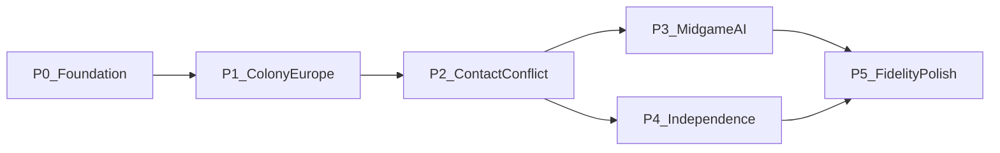

# Whole-project roadmap

Living phase map for the Linux Colonization port: **what’s next for the whole
project**. This is a navigation layer — not a merged feature checklist.

**Detail lives elsewhere:** row-level Done/Partial/Missing in
[manual_gap.md](manual_gap.md); AI FUN inventory and unpark/R5 queues in
[ai_transcription.md](ai_transcription.md); save field atlas in
[save_format_map.md](save_format_map.md); light catalog peels in
[catalog_peel_ranking.md](catalog_peel_ranking.md). Goals and conflict order:
[project_goals.md](project_goals.md).

Update this file when a phase’s **status** or **exit criteria** change. Keep
per-feature and per-FUN status in the owning gap docs.

---

## North star

Same rules, assets, saves, and inputs as DOS Colonization (1994). When goals
conflict, prefer:

1. Save / data interoperability
2. Gameplay / determinism
3. UI parity
4. Visual polish last

Full bar: [project_goals.md](project_goals.md).

---

## Current posture

**2026-08-24 — goal reframed to playability.** [port_plan.md](port_plan.md)
now carries priority tracks P1–P11 (UI, reports, music, colony production,
War of Independence, Europe trade, rumours/treasure, basic Indian
interactions, FF effects, save interop, popups). Rival-AI parity, 1:1 Indian
AI, seed determinism and pixel-exact art are **deferred** (port_plan.md
D1–D6). Music and `COLDIG.BIN` SFX were deferred at the time of writing but
have since been largely closed — see "Audio (2026-08-27)" below. The phase
table below is kept for archaeology; the P-tracks are the working order.

The port is strong on **shell, map art, navigation, reports / pedia, Col1
save/load, basic units / naval passengers, founding a colony, and Europe
buy/sell/recruit/hire**. Structural Indian contact (including player dialogs),
Euro/Indian diplomacy, king/REF (audience/confirm/merc), FF election, trade
routes (Create/Edit/Begin), and early Euro AI (seed-100 T2 + thin expand/war)
are in (Sepulveda/Cortes/de Witt effects **Done**). The two mid-planner
blockers this paragraph used to name closed on 2026-08-27: the `20e6` land
arms are structurally ported (`ai_port_plan.md` T1.18) and `5d04` is wired
live with its hire-ladder tail callees made real (T3.1). Next playability work
is production / combat depth and endgame polish — not waiting on missing
combat/capture prerequisites. (KINGGALLEON2 closed 2026-08-27 and the
`COLDIG` cue wiring closed 2026-08-29; both used to be named here.) VGA
dialog chrome and full 1:1 AI bodies remain later; Congress UI is now
**Done** (2026-08-25, see Phase 4).
Snapshot source: [manual_gap.md](manual_gap.md) takeaway.

**Maintained (not blocking):** Col1 save RE P0–P6 is **Done**
([save_format_map.md](save_format_map.md)); keep interop green. VICEROY light
catalog (Layers A–C) is **closed**; Layer D deep extracts only on demand;
MAPEDIT parked ([catalog_peel_ranking.md](catalog_peel_ranking.md)).

**Audio (2026-08-27).** Two long-standing "deferred" audio items closed in the
same pass:

- **Music.** The "bad remix" complaint was traced to the *song-id table*, not
  the decoder: Pick Music entry *n* is not `0x20+n`, so every A/B comparison
  had been made against the wrong track. The hand-written decoder was replaced
  by a literal `GSOUND.COL` driver emulator (`src/core/gsound_vm.c`) plus a
  mirror of the DOS BGM scheduler. A/B against DOSBox-X captures and OST rips
  now reads dtw 0.04–0.17 (OST-vs-DOSBox itself is 0.07). Remaining: a listen
  test with the user (port_plan.md P3.5).
- **`COLDIG.BIN` digital SFX — Done 2026-08-29.** The earlier "settled negative
  — no reachable DOS trigger" verdict was **wrong** and is retracted: event ids
  `0x40..0x5c` are pushed with the id in `AX`, which Ghidra's decompile drops.
  Sample table, decode, queueing, mixing **and every reachable push site** are
  wired (port_plan.md P3.2 / P3.7, both closed); ids `0x4c`/`0x50`/`0x51`/
  `0x55`/`0x5c` are typed-rule dead ends with no DOS push site. Only the Retire
  tune's coin tier stays PARKed.

Both are owned by [assets.md](assets.md) "Music / sound".

---

## Phases

| Phase | Status | Exit criteria (player-visible / save) |
|-------|--------|----------------------------------------|
| **0 Foundation** | Done | New game, map, menus, Col1 save/load round-trip, basic move/orders |
| **1 Colony–Europe loop** | Mostly done | Found/assign/produce/sail/buy-sell/pioneer/trade-routes structural playable |
| **2 Contact & conflict** | Partial | Land/naval combat + capture + Indian meet/trade/raid usable for a human game without deep PARK blockers |
| **3 Mid-game AI** | Partial / active | Euro mid-planner (`5d04` / land `20e6`) + Indian large bodies advance; `golden_ai_joint` **PARKED / DISABLED** 2026-08-19 — no chance of staying green before AI transcription is complete, see ai_transcription.md R0 |
| **4 Independence & endgame** | Partial | WoI bell→intervention + Europe closed post-declare **Done** (2026-08-22); FF weighted pick **Done**; REF/WoI win/lose latches **Done** thin; all 25 Fathers wired (2026-08-28); KINGGALLEON2 / 65dd Done |
| **5 Fidelity & polish** | Later | VGA dialog chrome, VIEW modes, pixel layout, T3 AI goldens, remaining PARKED deep bodies (COLDIG SFX moved out — playback wired 2026-08-27, remaining push sites tracked in port_plan.md P3.7) |

Phases **3** and **4** can advance in parallel after contact/combat basics.
Polish is last per [project_goals.md](project_goals.md).

---

## Phase notes and next work

### 0 — Foundation (Done)

Shell, map compositor, fog plane, reports/pedia, music, Col1 save/load I/O,
new-game flow, basic unit move/orders. Maintain save interop; do not reopen as
a feature phase.

### 1 — Colony–Europe loop (Mostly done)

Colony screen, production preview, warehouse↔ship, Europe sail/market,
recruit/hire/train/purchase, pioneer clear/plow/road, trade-route Create/Edit/
Begin + stop nibbles are in. Remaining thin spots (boycotts / volume-price
chrome, docks pick-among-pool UI, SoL display stand-ins) fold into phases 2–4
or polish rather than blocking the loop.

**Leftover (non-blocking):**

- Market volume / pressure chrome — [manual_gap.md](manual_gap.md) (Economy)
- Colony / Europe UI depth beyond structural — [manual_gap.md](manual_gap.md)

### 2 — Contact & conflict (Partial) — active

Human games need reliable fight/capture and Indian contact without depending on
PARKED deep/VGA bodies.

**Now:**

- Combat depth beyond T0 (ship-slow, deeper `5fef`) — [combat.md](combat.md)
- Production / EOT formula fidelity (food, spoilage, bells/crosses) —
  [manual_gap.md](manual_gap.md), [turn_between_players.md](turn_between_players.md)
- Fog / exploration: **Done** 2026-08-29 (full DOS reveal/vis-bit/snapshot
  model — [manual_gap.md](manual_gap.md) Fog row). Milestone woodcut screens
  **Done** 2026-08-30 (`FUN_12fd_006c` gate + `FUN_6f30_0062` presenter,
  `src/core/woodcut.c`) — the Pacific discovery is now the real
  WOODFRAM/WDCUT06/NAMEPLAT screen, not a thin info popup
- Indian meet/trade/raid: structural Done. `4528` is **Done 2026-08-27/28** —
  full 9-way action dispatch ported on both arms (human `@ACTIONS` menu with
  per-unit gating, `port_plan.md` P8.8; AI auto-incite `ai_port_plan.md` T4.5;
  AI village attack via `ai_euro_land_try_adjacent_village_seize`); only its
  VGA meet chrome stays open. Deep `2820` (haggle / hard-bargain sub-loops)
  stays PARKED on the T4.4 live capture —
  [ai_transcription.md](ai_transcription.md)

### 3 — Mid-game AI (Partial / active)

Euro rivals and natives must stay coherent through mid-game. Shared surfaces
(`20e6`, Indian×Euro diplo/sticky, raids, FOUND) used to be required to keep
`golden_ai_joint` green; that gate is **PARKED / DISABLED** as of 2026-08-19
(see [ai_transcription.md](ai_transcription.md) R0) — it has no chance of
being useful before AI transcription is complete, since every remaining
unported/stubbed AI callee is a guaranteed future diff. Do not chase it back
to green piecemeal; re-enable it once the port is done and it's a real
regression gate again.

**Now:**

- ~~Euro deep land `20e6` / remaining mid-planner (`5d04`)~~ — **Done
  2026-08-27** (`ai_port_plan.md` T1.18 / T3.1). Both are structurally ported
  and wired; thin spots are listed per-item in that doc's T1.18 entry, and
  `golden_ai_mid01` / `golden_ai_late01` are green again as a result
- Indian large bodies (`2154` / `2820`) toward R5 Phase 4 — same doc (`4528`
  is done, see track 2)
- Joint mid/late goldens — `golden_ai_mid01` / `golden_ai_late01` are
  **re-enabled and green** (2026-08-27); `golden_ai_turns` is down to the 3
  parked TURN1→2 Brave diffs and `golden_ai_joint` waits on it. Flipping
  those two back on is the user's call (`ai_port_plan.md` T3.3)
- Seed-100 / early fidelity debt (R0) only as it blocks mid-planner claims —
  [seed100_brave.md](seed100_brave.md)
- **Found and fixed:** `units_display_name()` missing `Colonists`→`Free
  Colonist` branch + the ~18 dead `units_find_type("Free Colonist")`
  exact-match call sites in `ai_euro.c` (real `NAMES.TXT` only has
  `Colonists`; the Europe-dock hire ladder silently never resolved). Detail
  + regression test: [assets.md](assets.md) Units section and
  `test_ai_euro_expand.c` (`unit_dock_farmer_hire_real_names`).
- **Found and fixed (2026-08-24, confirmed via static decomp trace) —
  `colonies_can_found` minimum-distance gate.** The `dx<=1 && dy<=1`
  Chebyshev-adjacency rejection already shipped 2026-08-14 (`3abe4c4`) is
  now confirmed byte-faithful against DOS, not an invented threshold: the
  real Build Colony order handler (`FUN_2b5a_1662`/`16ce`, an undocumented
  gap in `FUNCTION_CATALOG.md`) calls `FUN_1000_8804` →
  `FUN_15eb_0142`/`FUN_0000_5ff2` (nearest colony, any nation/type) and
  rejects when the `FUN_0000_2500` distance metric equals 1 — which
  evaluates to exactly 1 for all 8 Chebyshev-adjacent tiles. Full trace +
  the related `unit_ai_euro_expand` first-failure-blocks-suite gap (now
  also resolved, same fix): [manual_gap.md](manual_gap.md) "Found colony"
  row and [port_plan.md](port_plan.md) W1.2.

### 4 — Independence & endgame (Partial)

Finish a campaign: FF leftovers, king/REF, win/lose/retire.

**Now (Phase 5, 2026-08-22):**

- **KINGGALLEON2** — **Done** (2026-08-27: `FUN_5fef_1908`, popup ids are DS tag addresses)
- **10f0** — landing scorer, per-call caps, Veteran `0x15` — **Done** Phase 5; foreign MoW ship **PARK**
- **0982 REF wave** — **Done** (2026-08-28 full port: pool gate/regrow, exhaust, 060a need, weakest-colony pick, 0x5333 cap, 0512 seizure, direct landing); `golden_woi_ref01` capture t3 / all lost t10
- **65dd LCR** — **Done** (2026-08-27 full static port, `units_lcr_roll_outcome`)
- **FF leftovers** — **Done** (2026-08-28): de Soto sight radius (`13f1_02f8`), Magellan voyage roll (`48d3_0002`, replaces invented 2/4-turn crossings), Brewster pick-among-pool (`4884(0,1)`); no Father PARKed
- **Year-end D** — `rebel_sentiment` when set, else `ai_king_sol_percent`; continent table at DOS `−0x6bf0` **PARK**
- **Lategame codec** — **Done** (W1.5, 2026-08-24): all Col1 `.SAV` fixtures (starters + lategame + `TURN`) byte-identical on re-encode; the "not yet" here was a stale doc note — fixed same-day it was written (`753662d`, 2026-08-22), just never updated. See [save_format_map.md](save_format_map.md) / [savegame.md](savegame.md) Phase 5
- Bell-pool + bridge load + F3 Congress structural — **Done** (Phase 4)
- WoI bell pool → intervention/REF (`4345_0a22` wartime branch) — **Done** (2026-08-22)
- Europe closed during WoI; `game_options.woi` authoritative — **Done** (2026-08-22)
- Century-weighted FF debate pick (`4345_06d2` / `015a`) — **Done** (2026-08-22)
- `rival_nation_slot_1/2` + slot_2 intervene — **Done** (Phase 4)
- Decile SoL notify — **Done** thin
- Congress VGA-identical chrome — **Done** (2026-08-25): both pages match golden screenshots pixel-for-pixel (title/OK chrome, bells + rebel/tory + expeditionary-force bars, 4-col FF list, page-2 group portrait). Religious (F2) done the same way earlier. See [report_screens.md](report_screens.md) for the workflow — Labor/Economic/Colony/Naval/Foreign/Indian (F4–F9) still need the same treatment.

### 5 — Fidelity & polish (Later)

Do not prioritize over gameplay/determinism.

**Parked until later:**

- VGA-identical dialog / TRADE / FA / king letter chrome
- Digital SFX (`COLDIG.BIN`) — **not parked, Done 2026-08-29**: playback wired
  2026-08-27 and every reachable push site wired by P3.2 / P3.7 (raid loot
  outcomes, naval win/sink, wagon move, tax raise, the `5fef_1b0e` unit-class
  variants and the `0x8020`/`0x8024` chord stings all landed). Only the Retire
  tune's coin tier remains — see [assets.md](assets.md) "COLDIG.BIN"
- Pixel-exact layout and style
- Blanket T3 AI goldens and remaining deep PARKED bodies (full `2820`,
  `4528`'s VGA meet chrome, letter cinematic, hang-dump RE)

---

## Doc ownership

| Concern | Owner |
|---------|-------|
| Phase order / whole-project “what’s next” | **This file** |
| Code architecture / layering (present + intended) | [architecture.md](architecture.md) |
| Manual feature Done/Partial/Missing rows | [manual_gap.md](manual_gap.md) |
| AI FUN_* inventory, unpark queue, R5 | [ai_transcription.md](ai_transcription.md) |
| AI porting — sequenced agent work queue | [ai_port_plan.md](ai_port_plan.md) |
| Whole-project sequenced agent work queue (non-AI + cross-cutting) | [port_plan.md](port_plan.md) |
| Col1 field atlas / save RE | [save_format_map.md](save_format_map.md) |
| Save codec / interop notes | [savegame.md](savegame.md) |
| Light catalog peel queue | [catalog_peel_ranking.md](catalog_peel_ranking.md) |
| Acceptance order / fidelity bar | [project_goals.md](project_goals.md) |
| Move-enter authority | [move_enter.md](move_enter.md) |
| Combat mechanics | [combat.md](combat.md) |
| Report screen (F2–F10 + HoF) DOS FUN map / layout | [reports.md](reports.md) (owner doc — pending creation, see port_plan.md P2.1), [report_screens.md](report_screens.md) (porting how-to) |
| EOT / between-player turns | [turn_between_players.md](turn_between_players.md) |
| Decomp / data navigation | [original_index.md](original_index.md) |

---

## How to update

1. Finish a track → update row status in the **owning** gap doc first.
2. If that closes or unblocks a **phase exit criterion**, bump the phase status
   (and “Now” bullets) here.
3. Do not duplicate AI FUN tables or manual feature matrices into this file.
4. Suggested feature order detail that is still useful for bring-up archaeology
   stays under [manual_gap.md](manual_gap.md) “Suggested implementation order”;
   **phase priority** is owned here.
