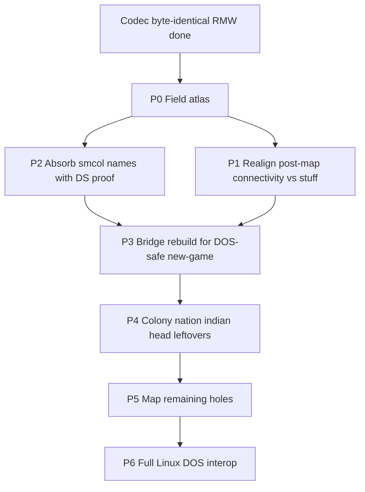

# Col1 save format map (roadmap + field atlas)

Living inventory of every `COLONY##.SAV` region and the path to a
**decomp-backed** field map. Codec layout, byte-identical RMW, P0–P5 naming,
and P6 template export rebuild (density / blank census / colony levels) are
done; unread late `unknown_ds_*` stay zero-on-template by cite.

Companion: [savegame.md](savegame.md) (interop / bridge / gaps summary).
Structs: [`src/core/col1_save.h`](../src/core/col1_save.h).

---

## Goal / non-goals

**Goal:** name every byte (or bit) with evidence — DOS reader/writer cite and
allowed value ranges — so Linux→DOS export can rebuild templates without
inventing blobs.

**Non-goals:**

- Changing packed section sizes or breaking byte-identical fixture RMW
- Inventing post_map / stuff contents without decomp proof
- Treating community names (smcol / Format.md) as proven until matched to
  VICEROY DS / `FUN_*` (cite them as `community`, then promote)

**Standing project bar:** 100% DOS↔port save interop
([project_goals.md](project_goals.md)). This document is the RE track for that.

---

## Status legend

| Status | Meaning |
|--------|---------|
| `mapped` | Named in port; used or clearly documented; values understood |
| `partial` | Named or partly decoded in port; holes or stand-ins remain |
| `community` | Named in smcol / Format.md / viceroy; **not yet** proven here |
| `opaque` | Preserved as bytes; no solid semantics in-repo |
| `misaligned` | Port comment/split conflicts with decomp or community layout |

Rough fixture ratio (COLONY00-sized): map planes dominate structured bytes.
Post-P5, remaining `opaque`/`community` are mostly **closed** save-only pads
(`other`, head pads, `unknown_ds_*`) rather than unnamed mystery regions.

---

## DOS anchors (start here)

| Role | Symbol | Notes |
|------|--------|-------|
| Write save | `FUN_75c2_0288` | Canonical section dump; ~33 discrete stuff writes; post-map DS blobs |
| Load save | `FUN_75c2_0940` | Mirror of 0288 |
| Header probe | `FUN_75c2_0840` | Sig / version **73** / map product — ported as `col1_save_validate_head` |
| Slot UI / paths | `FUN_7562_*` | COLONY## paths, autosave 8/9 |
| Connectivity fill | `FUN_67f4_0088` | Builds 2×`0x10e` planes → saved after map layers |
| Live units | DS:`0x3144` stride `0x1c` | Save dumps the array wholesale |

Catalog: [FUNCTION_CATALOG.md](../original_sources_annotated/FUNCTION_CATALOG.md)
(seg `75c2` / `7562`). Bodies: `original_sources_decompiled/viceroy_unpacked.c`.

**Community oracles** (cite → prove):
[smcol_sav_struct.json](https://github.com/pavelbel/smcol_saves_utility),
[nawagers/Colonization-SAV-files `Format.md`](https://github.com/nawagers/Colonization-SAV-files)
(upstream; [hegemogy fork](https://github.com/hegemogy/Colonization-SAV-files) lags),
[viceroy savegame.h](https://github.com/hegemogy/viceroy).
Byte-level sheet (sparse): [nawagers Google sheet](https://docs.google.com/spreadsheets/d/1_IOGjJbMT43z2Tcr-Rhdwkg65iBaAV7Lo3XRl-08hII/).

**Fixtures:** `original_saves/COLONY00.SAV`, `COLONY01.SAV`,
`original_saves/valid-lategame-saves/COLONY{00–08,10}.SAV`,
`test-saves-ai/TURN*`, `original_saves/mapgen/SEED100.SAV`,
`tests-save-misc/unit flags error.sav`.

---

## File order (standard 58×72)

| Section | Size | Port type |
|---------|------|-----------|
| Prefix (`head` + `player[4]` + `other`) | 390 | — |
| `colony[]` | 202 × C | `ColonizeCol1Colony` |
| `unit[]` | 28 × U | `ColonizeCol1Unit` |
| `nation[4]` | 1264 | `ColonizeCol1Nation` |
| `tribe[]` | 18 × T | `ColonizeCol1Tribe` |
| `indian[8]` | 624 | `ColonizeCol1Indian` |
| `stuff` | 727 | `ColonizeCol1Stuff` (33 DOS DS writes) |
| Map ×4 (tile/mask/path/seen) | 4 × W × H | bitfield structs |
| `post_map` | **614** | `ColonizeCol1PostMap` (was unknown_e+f) |
| `trade_route[12]` | 888 | `ColonizeCol1TradeRoute` |

---

## Field atlas

Offsets are **within the named struct** unless noted. Update status in place
as peels land.

### Head (158)

| Field | Size | Status | Notes |
|-------|------|--------|-------|
| `sig_colonize` / `sig_eof` / `save_version` | 9+1+2 | `mapped` | `COLONIZE\0` + `0x1A`; ver **73** |
| `map_size_x` / `map_size_y` | 4 | `mapped` | Typically 58×72 |
| `tut1.*` known bits | — | `mapped` | Tutorial flags. Nawagers sheet: bit0/bit1 = Pioneer/Soldier message flags (`nr13`/`nr14`) |
| `tut1.unused06` / `unused08` (was `unknown01`/`unknown02`) | 2 bits | `opaque` | DS:0x5380 bit2/bit6 — confirmed dead: never bit-tested/set in any of 3 decompiled sources (only nr13-nr19 bits are); sole touch is init word-clear `*(u16*)0x5380=0` |
| `hotseat_woi_redirect_pending` (was `unknown03`) | 1 | `partial` | DS:`0x5381` bit7 — hotseat/WoI-redirect one-shot latch; set at new-game setup when >1 human chosen, tested+cleared in `FUN_43f7_2564`. Other 7 bits unmapped |
| `game_options.woi`…`ref_unit_threshold` | 7 bits | `mapped` | DS:`0x5382` WoI/REF latches (was `unused01`) |
| `game_options` (hints…moves) | — | `mapped` | |
| `game_options.cheats_enabled` | 1 bit | `mapped` | DS:`0x5383` bit5; Alt-WIN |
| `colony_report_options` | — | `mapped` | `unused03` pad |
| `tut2` / `tut3` | — | `mapped` | `unused04` pad |
| `start_mode_marker` (was `unknown39[2]`) | 2 | `partial` | DS:`0x5388`, one int16 — scenario/start-mode marker from `FUN_75c2_235c` param; tested nonzero to add intro text on first-colony founding |
| `year` / `autumn` / `turn` | 6 | `mapped` | |
| `map_mode` | 2 | `mapped` | DS:`0x5390`; 0=Move / 1=View |
| `active_unit` | 2 | `mapped` | |
| `nation_turn` / `curr_nation_map_view` / `human_player` | 6 | `mapped` | DS:`0x5394`..`0x5398` |
| `tribe_count` / `unit_count` / `colony_count` | 6 | `mapped` | |
| `trade_route_count` / `show_entire_map` / `fixed_nation_map_view` | 6 | `mapped` | DS:`0x53a0`.. |
| `difficulty` | 1 | `mapped` | 0..4 |
| `king_audience_streak` / `king_audience_last_pick` (was `unknown43[2]`) | 2 | `partial` | DS:`0x53a7`/`0x53a8` — King-audience RNG state (streak + last-picked line, avoid repeat); near `FUN_38fd_5be8` (`KING_AUDIENCE` in `ai_king.c`); reset at new game |
| `founding_father[25]` | 25 | `mapped` | −1 = unrecruited |
| `turn_loop_running` / `map_modal_active` / `no_unit_selected` | 6 | `mapped` | DS:`0x53c2`/`c4`/`c6` |
| `nation_relation[4]` | 8 | `mapped` | |
| `rebel_sentiment_report` + `crown_nation_id`/`rival_nation_slot_1`/`_2`/`sol_pct_last_notified` (was `unknown45_pad[8]`) | 10 | `mapped` | DS:`0x53d0`; the 4 int16 slots resolved 2026-08-19 (crown nation, 2 lazy rival-nation caches, SoL-report dedup) |
| `expeditionary_force` / `backup_force` | 16 | `mapped` | |
| `unknown46` / `price_group_state[16]` | 32 | `partial` | DOS market saturation/demand pool (not price) @`0x53ea`, formula traced 2026-08-19 (`FUN_38fd_0058`): seeded `RNG(600,1000)`, topped up per-turn from a per-nation demand table; Linux king bytes 0–5 overlay words 0–2. Only **rum/cigars/cloth/coats** confirmed as a live price group by code (index-9-12 floor-at-1 special case) — was previously only a smcol/experimental guess (SG also lists sugar/tobacco/cotton/fur, but experiments say those move independently); formula connecting this pool to `euro_price[16]` not traced |
| `event` | 2 | `mapped` | Woodcut / discovery flags |
| `unknown05` | 2 | `opaque` | Save R/W; no gameplay cite |

### Players (52 × 4)

| Field | Size | Status | Notes |
|-------|------|--------|-------|
| `name` / `country_name` | 48 | `mapped` | |
| `unknown06_lo` / `lcr_case5_bonus_used` / `named_new_world` | 1 | `partial` | bit7 discovery one-shot (`FUN_4720_049e`); bit6 per-nation LCR case5→4 upgrade latch wired in `units_resolve_lcr_rumour` (`FUN_65dd_0004` outcome table still PARK); bits0-5 opaque, no cite |
| `control` / `founded_colonies` / `diplomacy` | 3 | `mapped` | control 0/1/2 |

### Other (24) — prefix trailer

| Field | Size | Status | Notes |
|-------|------|--------|-------|
| `other[]` | **24** | `community` | DS:`0x948e`; save R/W only in unpacked. Smcol carve: `unknown51a[18]` (“unexplored”) + `click_before_open_colony` x,y (`uint16`×2) + `unknown51b[2]` |

### Colony (202 × C)

| Field | Size | Status | Notes |
|-------|------|--------|-------|
| `x` / `y` / `name` / `nation_id` / `population` | — | `mapped` | |
| `ai_flags` (`ColonizeCol1ColonyAiFlags`) | 1 | `mapped` | +0x1b; ship/AI planner bits — Linux field + MoW/armed ship scan + COLONY 5|8; thin needs_colonists/garrison |
| `flags` (`ColonizeCol1ColonyFlags`) | 1 | `mapped` | +0x1c; Linux `colony_flags` — starvation→LABOR + sol_50/100 + wagon/coastal/small (`FUN_364b_0688`) |
| `build_ai_flags` | 1 | `mapped` | +0x1d; bit7 `wants_construction` (0x80) — Linux field + LABOR latch + clear on queue done; other bits reserved |
| `garrison_quota` | 1 | `mapped` | +0x1e; `threat>>3` (`FUN_5952_035e`, clean recovery 2026-08-14 confirms exact match — [`colony_tick_5952_035e.md`](../original_sources_annotated/ai/colony_tick_5952_035e.md)); Linux `ColonizeColony.garrison_quota` + fortify DEC + thin latch |
| `occupation` / `profession` | 64 | `mapped` | |
| `specialty[16]` | 16 | `mapped` | +0x60; colonist specialty nibbles (`FUN_15eb_0c7a`; was `duration`) |
| `tiles[20]` | 20 | `mapped` | +0x70; ring `[0..7]`; `[8..19]` empty `0xff` in fixtures |
| `buildings` / `custom_house` | — | `mapped` | `unused05` pad. Each 2/3-tier chain field (`fortification`, `armory`, `docks`, `blacksmiths_house`, `carpenters_shop`, …) stores `(1 << N) - 1`, not the tier count `N` directly — reads 0/1/3[/7], never 2/5/6. Player-confirmed 2026-08-18: no chain field ever read 2 across colony_prod01/02's ~30 colonies (a plain-count encoding would hit it constantly), and cross-checked against founding-father gating (a colony reading the top tier of an Adam-Smith-gated factory chain, when its nation didn't own Adam Smith, would be impossible under a plain-count reading but is expected/absent under this one). `col1_apply_building_level`/`col1_encode_building_level` (col1_bridge.c) convert via popcount / `(1<<N)-1`. |
| `improve_timer` | 1 | `mapped` | +0x8c; INC cap `0x7f`; Linux field + pioneer gate (≥2 thin) + clear on plow/road |
| `specialty_cargo` | 1 | `mapped` | +0x8d; `0xff` none (`FUN_5952_0306`); Linux field + haul prefer + warehouse-cap clear |
| `labor_shortage` | 1 | `mapped` | +0x8e; Linux `ColonizeColony.labor_shortage` + admit decrement + AI LABOR latch |
| `cargo_idle_turns` | 1 | `mapped` | +0x8f; INC cap `0x7f` (`FUN_5952_035e`); clear on goods unload; AI haul score `*8` |
| `cargo_produced_mask` | 2 | `mapped` | +0x90; bit per cargo (`FUN_364b_0688`); Linux field + clear/OR on produce + haul prefer |
| `hammers` / `building_in_production` | — | `mapped` | |
| `warehouse_level` | 1 | `mapped` | +0x95; Linux field; cap `100*(1+level)` (`FUN_15eb_0a50`); INC on Warehouse/Expansion complete; also derived from `has_building` |
| `capitol_level` | 1 | `mapped` | +0x96; Linux field; INC on Capitol/Expansion complete (`FUN_364b_0114`); bridged |
| `depletion_counter` | 1 | `mapped` | +0x97; INC on ore/silver field yield; wrap at 50 → `MAP_LAYER2_SUPPRESS` on worked tile (`FUN_364b_033a`) |
| `hammers_purchased` | 2 | `mapped` | +0x98; BUY remainder (`FUN_2f2b_5e44`); Linux field + accumulate on `colonies_buy_construction` |
| `stock[16]` | 32 | `mapped` | |
| `visible_to_euro[4]` | 4 | `partial` | +0xba; **smcol `population_on_map[4]`** — fog-of-war population as each Euro sees this colony. Founding (`FUN_364b_1ba8`) writes `1` per slot (and only when tile seen via map `0x10<<euro`); lategame fixtures store real/estimate pops (owner slot ≈ live `population`). Port still names/exports as visibility latch — **misnamed** vs smcol+fixtures |
| `unknown13_pad[4]` | 4 | `community` | +0xbe; **smcol `fortification_on_map[4]`** (0 none … 3 fortress). Founding clears to 0; lategame COLONY00/05 non-zero and track stockade/fort/fortress per viewer — **not** “found-zero”. Writer confirmed 2026-08-19 via live DOSBox-X trace: fires from a periodic timer-tick ISR (segment `124C`, alternating-tick dispatch off a custom counter at DS:0x8338), not founding/player-action — explains why the 3 decompiled exports show no writer. Exact store opcode not pinned (traced 3 call levels deep); updater/reader cite still open |
| `rebel_dividend` / `rebel_divisor` | 8 | `mapped` | SoL display |

Export often **zeros** unnamed colony bytes on rebuild ([savegame.md](savegame.md)).

### Unit (28 × U) — live DS:`0x3144`

| Field | Size | Status | Notes |
|-------|------|--------|-------|
| `x` / `y` / `type` / `nation_id` | — | `mapped` | Europe sentinels ≥200 (fixtures often `228+nation` diagonal; nawagers also notes 235/239/243 travel states) |
| `vis_mask` | 4 bits | `mapped` | euro owner `1<<n` (`FUN_1427_0992`); natives 0 on spawn/capture |
| 8 named bits (was `unknown15_lo`/`ship_damaged`) | 1 | `mapped` | bit7 `ship_damaged` (`FUN_1427_13b0`); bit0 dead; bits1/2/3/5/6 resolved 2026-08-19 (roam-reeval, stack founders/military, garrison-request, bound-in-transit); bit4 `wander_dest_chosen` partial — see mysteries_catalog.md |
| `moves` / `orders` / `goto_*` | — | `mapped` | |
| `origin` | 1 | `mapped` | Brave home tribe |
| `ai_plan` | 1 | `mapped` | Default `0x58` / `'X'` |
| `facing` / `facing_pad` | 1 | `mapped` | Low 3 = last dir (`FUN_1427_0968`); smcol still `unknown18` |
| Cargo / `turns_worked` / chain | — | `mapped` | |
| `profession` | 1 | `mapped` | Job id; **Treasure** (`type==0x0a`): smcol + DOS Europe exit — value is gold/100 (`profession*100` cash; `FUN_48d3_06ba`) |

### Nation (316 × 4)

| Field | Size | Status | Notes |
|-------|------|--------|-------|
| `tax_rate` / `recruit*` / FF / bells / gold / crosses | — | `mapped` | |
| `liberty_bells_total` / `liberty_bells_last_turn` | 2+2 | `mapped` | `total` = cumulative bells. `last_turn` = live EOT accrual; conditional stash on Linux save write when FF side table active. Early `COLONY00/01` byte-identical; lategame/TURN codec drift documented in [savegame.md](savegame.md) Phase 5 |
| `nation_flags` | 1 | `partial` | Was `unknown19`; bits `0x04`/`0x08`/`0x40` live; bit `0x04` named 2026-08-19 = nation achieved independence |
| `tax_hike_count` | 1 | `mapped` | Was `unused07`; `FUN_38fd_44a4` |
| `unknown21_pad` | 1 | `opaque` | Was `unknown21`; resolved 2026-08-19 confirmed dead — untouched by all 3 DOS exports, the one gap new-game zero-init skips |
| `king_audience_tax_delta` | 2 | `mapped` | Was `unknown22`; `int16`; resolved 2026-08-19: signed King-audience tax delta, `FUN_38fd_5be8` computes/writes, `FUN_38fd_3dc8` applies same-call to `tax_rate`; no DOS reader of the saved copy |
| `ff_count_end_prob` | 2 | `community` | smcol; cleared on independence; no FF-prob reader |
| `rebel_sentiment` + `rebellion_pct_last_notified` + `unknown23_pad[3]` | 5 | `mapped` | nation+0x19; `rebellion_pct_last_notified` (was `unknown23_pad[0]`) resolved 2026-08-19: independence-news dedup latch |
| `artillery_count` / `boycott_bitmap` | — | `mapped` | |
| `royal_money` + `unknown24_pad[4]` | 8 | `mapped` | `int32` @ +0x22 REF budget; `unknown24_pad` confirmed dead 2026-08-19 (zeroed at new-game init only, no other touch) |
| `return_from_europe_x/y` | 2 | `mapped` | `FUN_48d3_007a` |
| `euro_relation[4]` | 4 | `mapped` | −0x77c4 / `FUN_15b3_*` peer flags (ai_diplo: WAR`0x01` PEACE`0x02` ALLY`0x04` MET`0x40`). Smcol’s attitude?/status/piracy bitfield **disagrees** — prefer DOS |
| `relation_by_indian[8]` | 8 | `mapped` | |
| `treaty_timer` / sticky / privateer | 12 | `partial` | Linux stand-ins in `unknown26[]` (`ai_diplo.c`); flags are **not** here |
| `trade` (240) | 240 | `mapped` | euro_price / nr / gold / tons |

### Tribe (18 × T)

| Field | Size | Status | Notes |
|-------|------|--------|-------|
| `x` / `y` / `nation_id` / `state` / `population` / `mission` | — | `mapped` | `unused09` pad |
| `growth_accum` | 1 | `mapped` | +=pop; clear when >19 (`FUN_4d56_152e`); smcol `growth_counter` |
| `sticky_trade_good` | 1 | `mapped` | Was `unknown28_pad`; resolved 2026-08-19: mid-haggle cargo good index, `FUN_4d56_2820`; 0xff idle, 0xfe last-refused |
| `last_bought` / `last_sold` / `alarm[4]` | — | `mapped` | `alarm.attacks`: smcol — rises on dwelling attacks, falls when brave attacks / drifts; may act as retaliation budget |

### Indian (78 × 8)

| Field | Size | Status | Notes |
|-------|------|--------|-------|
| `capitol_*` / `tech` / `tons` / `alarm_by_player` | — | `mapped` | |
| `extinct` | 1 bit | `mapped` | bit7 of first unknown31 byte |
| `lands_bought` | 1 | `mapped` | `FUN_479b_00ca` INC |
| `unknown31_flags` | 1 | `partial` | Linux contact prelude bit `0x20` |
| `muskets` / `horse_herds` | 2 | `mapped` | |
| `horse_breeding` | 2 | `mapped` | ±0x32 acquire/tick (`FUN_5bfb_*` / `4d56`). Smcol: herds→breeding each turn; cash horses at ≥25; notes a DOS bug where only one tribe breeds and breeding += herds×(non-extinct count) |
| `unknown31b`/`unknown31c` pads | 2 | `opaque` | Closed as no-reader pads |
| `hill_silver_bid_bonus` | 2 | `mapped` | Was `unknown31d[2]`; resolved 2026-08-19: map-gen hill-proximity×tech accumulator, feeds tribe's Silver trade bid (`FUN_6a09_0006` write, `FUN_4d56_2154` read) |
| `contact_state[4]` | 8 | `mapped` | +0x2e; FSM 0/1/2 |
| `euro_relation_accum[4]` | 4 | `mapped` | +0x36; spill → `FUN_281f_0d6c` |
| `euro_diplo[4]` | 4 | `mapped` | +0x3a; met `0x20` / peace `0x40` (was `met_by_player`) |
| `unknown33[8]` | 8 | `opaque` | +0x3e; unused by DOS contact |

### Stuff (727)

DOS `FUN_75c2_0288` writes **33** chunks (`FUN_1d1d_060c`); sizes sum to **727**.
RAM is scattered; the port stores one packed `ColonizeCol1Stuff` for RMW.

| File off | Size | DS | Notes |
|----------|------|-----|-------|
| 0 | 12 | `0x9566` | `unknown34_pad` — confirmed dead 2026-08-19, save R/W only |
| 12 | 4 | `0x8cfc` | `all_unit_counts[4]` — `FUN_4962_0018` |
| 16 | 4 | `0x9298` | `colony_counts[4]` — `FUN_4962_0018` |
| 20 | 4 | `0x9408` | `free_colonist_counts[4]` — type==0 units |
| 24 | 4 | `0x940c` | `colony_pop_totals[4]` — Σ colony pop |
| 28 | 4 | `0x9410` | `census_pop_proxy[4]` — +1 skilled unit + Σ pop |
| 32 | 4 | `0x9180` | `land_combat_totals[4]` — Σ land combat mode 0 |
| 36 | 4 | `0x9414` | `ship_cargo_totals[4]` — Σ ship cargo capacity |
| 40 | 4 | `0x9418` | `ship_counts[4]` |
| 44 | 8 | `0x941c` | `land_combat_strength[4]` — Σ combat mode 1 (u16) |
| 52 | 4 | `0x9424` | `armed_ship_counts[4]` |
| 56 | 4 | `0x9428` | `veteran_teach_threshold[4]` — reader-only / vestigial writer |
| 60 | 4 | `0x942c` | `field_combat_totals[4]` — land not in colony / not A\|G |
| 64 | 76 | `0x924c` | `unit_type_counts[4][19]` — `FUN_4962_0018` |
| 140 | 16 | `0x947e` | `village_counts_by_continent` (2026-08-14, **confirmed via raw `.asm` register trace**) — `FUN_4962_06b6` (per-tribe-type recompute, called once per Indian nation) increments `[continent]++` for every tribe/village found on that continent, across **all** tribe types (not nation-filtered at this point in the loop, unlike the per-type tables below) — cross-tribe village density per continent |
| 156 | 16 | `0x95f2` | `continent_presence_flags[16]` — AI readers (`4d56`/`5952`); `= −0x6a0e`, **confirmed writer** `FUN_4962_0018` (2026-08-14): per-continent bitmask, called once per nation and OR'd (not cleared between nations, so accumulates across the full per-turn pass): `1` = any Indian tribe/village exists on this continent (unconditional, no nation filter); `2` = a foreign Euro unit (not this nation, id<4) is present; `4` = a foreign (not this nation's) colony is present; `8` = this nation's own combat-capable land unit is caught out in the open (not on a settlement tile) with a specific pending-orders state. Matches `move_scoring_ship.md`'s already-flagged `−0x6a0e` trio member |
| 172 | 64 | `0x94a6` | `land_unit_counts_by_continent` (2026-08-14, **confirmed**) — `= −0x6b5a`; `FUN_4962_0018` (already the row-251 writer) increments `[continent + nation*0x10]` once per own land unit found on that continent (unit type outside the `[0xd,0x12]` ship range). Confirms the "presence flag" role `euro_g_table_0a60.md`/`move_scoring_ship.md` already guessed for `−0x6b5a`; sharpens it to an exact land-unit count |
| 236 | 64 | `0x94e6` | `colony_counts_by_continent` (2026-08-14, **confirmed**) — `= −0x6b1a`; same `FUN_4962_0018` loop, `[continent + nation*0x10]++` once per own colony on that continent. (Cite history: was `unknown_ds_94e6`; a 2026-08-14 pass wrongly attributed a read site to corrupted `FUN_5952_035e` content and retracted it same day — that correction still stands, this is a *different*, real confirmed writer found afterward.) See `euro_g_table_0a60.md`'s G-table formula (`(colonies+Σcolonies_all_nations)×20 ≤ continent_tally_b[continent]`) and `FUN_521d_20e6`'s `nation*0x10+continent` read (role there not yet reconciled with "friction," may need revisiting) |
| 300 | 64 | `0x95b2` | `field_combat_strength_by_continent` (2026-08-14, **confirmed via raw `.asm` register trace**) — `= −0x6a4e`; per-continent twin of `field_combat_totals[4]` (row 250, `0x942c`, same write site): `FUN_4962_0018` sums `FUN_281f_09c8(unit, mode=1)` (thunk → `FUN_157e_004a`, already catalogued "unit base combat×8 + vet/Drake/damage") into `[continent+nation*0x10]` for units gated the same way as row 250 (not fortified/not in colony — orders `≠0x41('A')` `≠0x47('G')`, plus a difficulty/building-class check at `0x543f`) |
| 364 | 64 | `0x9526` | `skilled_unit_counts_by_continent` (2026-08-14, **confirmed via raw `.asm` register trace**) — `= −0x6ada`; `FUN_4962_0018` increments `[continent+nation*0x10]` by 1 whenever `FUN_281f_0b78(unit) >= 0` (a "unit is skilled" query — also the confirmed writer for the already-known nation-total `0x9410`/`census_pop_proxy`, row 243, "+1 skilled unit" — this is that same signal's per-continent breakdown) |
| 428 | 64 | `0x918c` | `unit_value_sum_by_continent` (2026-08-14, **confirmed via raw `.asm` register trace**) — `= −0x6e74`; `FUN_4962_0018` sums `FUN_281f_09c8(unit, mode=0)` (same `FUN_157e_004a` combat-value function, base/unbonused mode) into `[continent+nation*0x10]` for every non-ship unit — also feeds the already-known nation-total `0x9180` (same write site, no size row here since it's 4 bytes/nation not part of this 64-byte block). This is the G-table's Euro-side "development level" comparison operand (`euro_g_table_0a60.md`) |
| 492 | 64 | `0x9572` | `combat_value_sum_by_continent` (2026-08-14, **confirmed via raw `.asm` register trace**) — `= −0x6a8e`; `FUN_4962_0018` sums `FUN_281f_09c8(unit, mode=1)` (combat-adjusted, vet/Drake-bonused) into `[continent+nation*0x10]` — also feeds the already-known `land_combat_strength[4]` nation-total (row 247, `0x941c`, same write site, confirming that row's "Σ combat mode 1" description). This is the subtraction/"discount" term `FUN_521d_20e6`'s deep matrix reads (**not** `FUN_5952_035e` — see prior same-day correction, still stands) |
| 556 | 8 | `0x944e` | `unknown_ds_944e` — pop word totals |
| 564 | 1 | `0x336` | `ui_toggle_336` — `FUN_2f2b_*` toggle (key `0x4e`); smcol `show_colony_prod_quantities` |
| 565 | 8 | `0x9184` | `tribe_data_9184` — **confirmed 2026-08-14** = `−0x6e7c`: sum of `FUN_281f_09c8(brave, mode=1)` (combat value, `FUN_157e_004a`) across all Braves of this tribe type. This is the second (of two) unnamed price terms `indian_incite_417e.md` flagged as blocking the Incite Indians price formula — see that doc, still not captured (a live sum, not a static constant) |
| 573 | 8 | `0x9622` | `tribe_population_totals` (2026-08-14, **confirmed**) — `= −0x69de`; `FUN_4962_06b6` sums tribe population (`+4` field) per tribe type |
| 581 | 8 | `0x962a` | `tribe_village_counts` (2026-08-14, **confirmed**) — `= −0x69d6`; `FUN_4962_06b6` counts villages per tribe type. First of the two `417e` price terms, see `0x9184` row |
| 589 | 128 | `0x91cc` | **misnamed** — `tribe_dwellings_91cc` was a placeholder guess, never confirmed by a reader before 2026-08-14. Real role: `= −0x6e34`, `FUN_4962_06b6` sums `FUN_281f_09c8(brave, mode=1)` combat value **per tribe-type×continent** (stride `0x10`, same shape as the Euro-side block above) — the G-table's Indian-side "development level" operand (`euro_g_table_0a60.md`). Not literal "dwellings"; the C field name (`col1_save.h`) is unchanged (save-format-critical, renaming needs its own careful pass) but should not be trusted as documentation of intent |
| 717 | 2 | `0x8540` | `stuff.x` focus tile |
| 719 | 2 | `0x853e` | `stuff.y` |
| 721 | 2 | `0x184` | `zoom_level` + `zoom_pad` (`FUN_2b5a_0f92`) |
| 723 | 2 | `0x17c` | `viewport_x` camera center |
| 725 | 2 | `0x17e` | `viewport_y` |

Port packing (727): `unknown34_pad` + census + DS-named late chunks (was
`unknown36[577]`) + cursor/viewport. **Not connectivity** (that is `post_map`).

**Census policy (DOS parity):** RMW/export **preserves** census bytes when the
window is non-zero. Do not freshen mid-turn lag. **Blank templates only:**
`col1_stuff_census_fill_blank` mirrors `FUN_4962_0018` counters from live pools.

| Field | Size | Status | Notes |
|-------|------|--------|-------|
| `unknown34_pad` | 12 | `opaque` | Was `unknown34`; confirmed dead 2026-08-19 — DS:`0x9566`, exhaustive check found zero non-save-I/O touches |
| census + mid-window | 128 | `mapped` | See chunk table |
| late DS chunks (577) | 577 | `partial` | Named `unknown_ds_*` / tribe_* / `ui_toggle_336` (smcol: `show_colony_prod_quantities`) |
| `x` / `y` / zoom / viewport | 10 | `mapped` | Focus + camera |

### Map layers (W×H each)

| Plane | Status | Notes |
|-------|--------|-------|
| `tile` | `mapped` | Terrain bitfield |
| `mask` | `mapped` | Occupancy + density rebuilt on export (`col1_bridge_sync_map_*`; `FUN_684c_08c0` / `137f_015e`); purchased sticky / layer2. Smcol/nawagers: `suppress` clears exhausted / far-ocean primes (not LCR). Nawagers: forest prime pattern is land pattern shifted **+4 columns** (clearing forest can reveal a different prime) |
| `path` | `mapped` | Region + visitor. Nawagers: low nibble = path region (oceans/continents numbered independently; >15 → `0xF`); high nibble = last visitor (`0xF` unvisited; LCR cleared only on occupy, not 8-neighbor reveal) |
| `seen` | `mapped` | Fog / score nibbles (nawagers: hi bits Euro visibility; lo nibble colony-site AI score) |

### Post-map (`ColonizeCol1PostMap`, 614)

Replaces legacy `unknown_e[504]` + `unknown_f[110]` (same bytes). Proven from
`FUN_75c2_0288` asm (`AX` length) + `FUN_67f4_0088` fill:

| File off | Size | DS | Field | Status | Notes |
|----------|------|-----|-------|--------|-------|
| 0 | 270 | `0x86f6` | `sea_connectivity[270]` | `mapped` | 15×18 neighbor bits; fill `local_24==1`; rebuilt on blank export |
| 270 | 270 | `0x85e8` | `land_connectivity[270]` | `mapped` | fill `local_24==0`; rebuilt on blank export |
| 540 | 32 | `0x945e` | `continent_tally_a[16]` | `mapped` | land terrain-class filter; rebuilt. Smcol mis-splits this region as `unknown_map38c*` / partial `strategy` |
| 572 | 32 | `0x85c8` | `continent_tally_b[16]` | `mapped` | land tile counts; rebuilt. Smcol hint: cheat **Show Strategy** numbers live in this post-connect window (their `strategy` field is undersized / misaligned) |
| 604 | 4 | SS:`local_8` | `save_path_blob` | `mapped` | Save-path blob; not filled by 67f4 |
| 608 | 4 | `0x8d80` | `boot_timer` | `mapped` | `FUN_75c2_2d46`; **not** seed |
| 612 | 2 | `0x190` | `prime_resource_seed` | `mapped` | full u16; `FUN_684c_08c0` mapgen |

Smcol’s post-connectivity carve does **not** match these DOS writes — prefer DOS
(`unknown_map38c2`/`c3`/`strategy`/`unknown_map38d` + 1-byte `prime_resource_seed`
+ pad). Port keeps full u16 seed @612 and 16×u16 tallies.
`veteran_teach_threshold` (`0x9428`) is reader-only (no writer in unpacked image).

**Connectivity algorithm (smcol `supplemental-info.md`, community):** each plane is
15×18 **column-major** quads (4×4 tiles); rightmost column of quads is always
zero (map width 58 is not divisible by 4). Per adjacent pair: pick an anchor among the four inner tiles
(sea: water ∩ region_id sea-lane; land: land walkable), pathfind with hop
cap **≤6**, set symmetric neighbor bits. Smcol reports a DOS bug that
mis-fills **NE/SW** bits in rare cases — byte-exact rebuild vs original saves
must relax those bits if comparing naive A*. Port rebuild follows
`FUN_67f4_0088` (COLONY00 planes byte-exact including that quirk).

**Export rebuild (P3+P4):** `col1_post_map_rebuild_connectivity` (`FUN_67f4_0088`)
runs from `col1_bridge_capture` when `post_map` is all-zero. Planes + tallies
from live terrain + layer3; models `FUN_6662_00f2` dest cost-grid cache (COLONY00
planes byte-exact). Tail preserved; blank templates may stamp
`map.prime_resource_seed`. Nonzero DOS `post_map` left intact on RMW.

### Trade routes (74 × 12)

| Field | Size | Status | Notes |
|-------|------|--------|-------|
| `name` / `sea` / `dest_count` | 34 | `mapped` | |
| `stop[4]` (`ColonizeCol1TradeStop`, 10 B) | 40 | `mapped` | DOS unload@+3 then load@+6 (`FUN_647e`); smcol names those blobs swapped |

---

## Phased work queue

| Phase | Scope | Exit criteria | Status |
|-------|--------|---------------|--------|
| **P0 — Atlas** | Inventory every opaque hole | This document exists; all `unknown*` listed | **Done** |
| **P1 — Correct the big mis-split** | Reconcile stuff vs post-map vs `FUN_75c2_0288` / `FUN_67f4_0088`; fix wrong comments | Connectivity planes named; stuff chunk table; `ColonizeCol1PostMap` | **Done** |
| **P2 — Absorb proven community names** | Rename head/nation/indian/unit/trade fields where smcol + decomp agree | Struct names match evidence; sizes unchanged; `unit_col1_save` byte-identical | **Done** |
| **P3 — Export rebuild** | Template/new-game rebuilds connectivity (+ required defaults) so DOS survives past UNITFLAG | Linux→DOS smoke; remaining holes documented | **Done** |
| **P4 — Deep leftovers** | Colony opaques, indian contact, stuff FA/counts, pathfinder | Cite + value ranges | **Done** |
| **P5 — Remaining holes** | Ready peels + nation/head pads + `unknown36` chunk split + `other`/head vestigial close | Every byte named or closed save-only/vestigial + DS | **Done** |
| **P6 — Linux→DOS interop** | Mask density, blank census, colony capture fill, vis_mask, AI blob discipline | Template export smoke; fixture RMW identical | **Done** |

### Remaining HOLD

**P5 naming + P6 template interop complete.** Former export gaps closed:

- Mask `suppress` / `purchased` / `pacific` synthesized on capture
- Blank-template census fill; mid-campaign census still preserved
- Colony specialty / warehouse / capitol / visibility on capture
- Late `unknown_ds_*` / `tribe_dwellings` / `other` / boot path blob: **export-OK
  zero** (save I/O only in unpacked VICEROY — no invented FA rebuild)

Standing rules: keep RMW sizes; do not invent blobs without decomp evidence;
**census** mid-campaign = DOS-parity preserve only (see Stuff §).

---

## Smcol audit (2026-08-10)

Re-read of [pavelbel/smcol_saves_utility](https://github.com/pavelbel/smcol_saves_utility)
(`smcol_sav_struct.json` + `supplemental-info.md` + README changelog) against this
atlas. Most named fields were already absorbed in P2 or superseded by DOS peels.

**New / corrected community clues absorbed above:**

| Smcol claim | Port action |
|-------------|-------------|
| Colony +0xba / +0xbe = fog population / fortification per Euro | Atlas corrected (`partial`/`community`); fixtures corroborate; founding cite `FUN_364b_1ba8` |
| Treasure `profession` = gold/100 | Documented on unit `profession` (DOS Europe-exit already knew) |
| `other` = 18 + click xy + 2 | Documented carve |
| Stuff `0x336` = show colony prod quantities | Community alias on `ui_toggle_336` |
| Price-group mechanics (only processed goods) | Note on `price_group_state` |
| Connectivity quad algorithm + NE/SW bug | Note under post_map (rebuild still DOS-cited) |
| `suppress` prime-resource cases; tribe growth/alarm/horse lore | Notes on mapped fields |

**Already known / prefer DOS (do not take smcol literally):**

- Post-map after connectivity (`strategy` / `unknown_map38*` / 1-byte seed) — wrong carve
- Trade-route load/unload blob order — smcol swapped vs `FUN_647e`
- `euro_relation` attitude/status/piracy bitfield — conflicts with `FUN_15b3` WAR/PEACE/ALLY/MET
- Head `tile_selection_mode` / `manual_save_flag` / `end_of_turn_sign` — port has `map_mode` + `turn_loop_running` / `map_modal_active` / `no_unit_selected` from DS
- Tribe `BLCS.brave_missing` vs port `state.artillery` — keep DOS name until re-cited
- Colony AI / specialty / capitol bytes smcol still calls `unknown*` — port ahead

---

## Nawagers audit (2026-08-10)

[nawagers/Colonization-SAV-files](https://github.com/nawagers/Colonization-SAV-files)
is the **upstream** of the `hegemogy/Colonization-SAV-files` fork already cited.
`Format.md` there is slightly ahead of the fork (correct terrain base table;
Sea/Land Route Maps named; post-connect tail sized as Unknown F = **74** =
our continent tallies 64 + 10-byte seed/path/timer tail; seed near F+`0x47`).

**Useful community notes absorbed:** tut1 Pioneer/Soldier message bits;
path/seen visitor+score semantics; forest prime +4-column shift; Europe
sentinel travel anecdotes; colony fog pop/fort guess (same as smcol — already
promoted). Connectivity prose overlaps smcol `supplemental-info.md`.

**No new byte map beyond what we have:** `colonization.py` is an early partial
codec (orders/cargo/tools RE notes). The linked Google sheet is sparse (~header
labels only). Pacific-to-column-41 claim conflicts with DOS/port `width/2`
pacific walk — prefer `FUN_684c_08c0`.

---

## Related docs

- [savegame.md](savegame.md) — interop layers, bridge, Linux→DOS gaps
- [project_goals.md](project_goals.md) — 100% save interop acceptance
- [decomp_inventory.md](decomp_inventory.md) — what is shipped vs open RE
- [manual_gap.md](manual_gap.md) — Col1 I/O checklist (playable ≠ fully mapped)
- [ai_transcription.md](ai_transcription.md) — uses Col1 blobs; not the field map epic
- [original_index.md](original_index.md) — index entry for SAV layout
