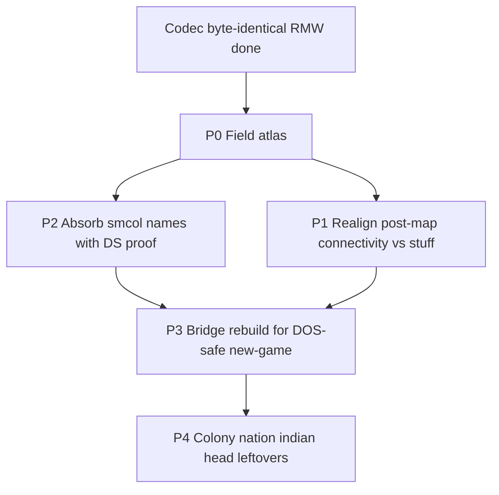

# Col1 save format map (roadmap + field atlas)

Living inventory of every `COLONY##.SAV` region and the path to a
**decomp-backed** field map. Codec layout and byte-identical RMW are done;
semantic mapping of opaque bytes is **not**.

Companion: [savegame.md](savegame.md) (interop / bridge / gaps summary).
Structs: [`src/core/col1_save.h`](../src/core/col1_save.h).

---

## Goal / non-goals

**Goal:** name every byte (or bit) with evidence — DOS reader/writer cite and
allowed value ranges — so Linux→DOS export can rebuild templates without
inventing blobs.

**Non-goals:**

- Changing packed section sizes or breaking byte-identical fixture RMW
- Inventing `unknown_e` / `unknown_f` / stuff contents without decomp proof
- Treating community names (smcol / Format.md) as proven until matched to
  VICEROY DS / `FUN_*` (cite them as `community`, then promote)

**Standing project bar:** 100% DOS↔port save interop
([project_goals.md](project_goals.md)). This document is the RE track for that.

---

## Status legend

| Status | Meaning |
|--------|---------|
| `mapped` | Named in port; used or clearly documented; values understood |
| `partial` | Named or partly decoded in port; holes or stand-ins remain |
| `community` | Named in smcol / Format.md / viceroy; **not yet** proven here |
| `opaque` | Preserved as bytes; no solid semantics in-repo |
| `misaligned` | Port comment/split conflicts with decomp or community layout |

Rough fixture ratio (COLONY00-sized): **~89%** bytes in named/structured
fields (map planes dominate); **~11%** still opaque-preserved under
`unknown*` / `other` / trade `data`.

---

## DOS anchors (start here)

| Role | Symbol | Notes |
|------|--------|-------|
| Write save | `FUN_75c2_0288` | Canonical section dump; ~33 discrete stuff writes; post-map DS blobs |
| Load save | `FUN_75c2_0940` | Mirror of 0288 |
| Header probe | `FUN_75c2_0840` | Sig / version **73** / map product — ported as `col1_save_validate_head` |
| Slot UI / paths | `FUN_7562_*` | COLONY## paths, autosave 8/9 |
| Connectivity fill | `FUN_67f4_0088` | Builds 2×`0x10e` planes → saved after map layers |
| Live units | DS:`0x3144` stride `0x1c` | Save dumps the array wholesale |

Catalog: [FUNCTION_CATALOG.md](../original_sources_annotated/FUNCTION_CATALOG.md)
(seg `75c2` / `7562`). Bodies: `original_sources_decompiled/viceroy_unpacked.c`.

**Community oracles** (cite → prove):
[smcol_sav_struct.json](https://github.com/pavelbel/smcol_saves_utility),
[Format.md](https://github.com/hegemogy/Colonization-SAV-files),
[viceroy savegame.h](https://github.com/hegemogy/viceroy).

**Fixtures:** `original_saves/COLONY00.SAV`, `COLONY01.SAV`,
`test-saves-ai/TURN*`, `test-saves-mapgen/SEED100.SAV`,
`tests-save-misc/unit flags error.sav`.

---

## File order (standard 58×72)

| Section | Size | Port type |
|---------|------|-----------|
| Prefix (`head` + `player[4]` + `other`) | 390 | — |
| `colony[]` | 202 × C | `ColonizeCol1Colony` |
| `unit[]` | 28 × U | `ColonizeCol1Unit` |
| `nation[4]` | 1264 | `ColonizeCol1Nation` |
| `tribe[]` | 18 × T | `ColonizeCol1Tribe` |
| `indian[8]` | 624 | `ColonizeCol1Indian` |
| `stuff` | 727 | `ColonizeCol1Stuff` |
| Map ×4 (tile/mask/path/seen) | 4 × W × H | bitfield structs |
| `unknown_e` | **504** | opaque blob |
| `unknown_f` | **110** | opaque blob |
| `trade_route[12]` | 888 | `ColonizeCol1TradeRoute` |

---

## Field atlas

Offsets are **within the named struct** unless noted. Update status in place
as peels land.

### Head (158)

| Field | Size | Status | Notes |
|-------|------|--------|-------|
| `sig_colonize` / `sig_eof` / `save_version` | 9+1+2 | `mapped` | `COLONIZE\0` + `0x1A`; ver **73** |
| `map_size_x` / `map_size_y` | 4 | `mapped` | Typically 58×72 |
| `tut1.*` known bits | — | `mapped` | Tutorial flags |
| `tut1.unknown01` / `unknown02` | 2 bits | `opaque` | |
| `unknown03` | 1 | `opaque` | |
| `game_options` (named bits) | — | `mapped` | |
| `game_options.unused01` | 7 bits | `opaque` | padding |
| `game_options.unused02` | 1 bit | `community` | smcol: `cheats_enabled` |
| `colony_report_options` | — | `mapped` | `unused03` pad |
| `tut2` / `tut3` | — | `mapped` | `unused04` pad |
| `unknown39` | 2 | `opaque` | |
| `year` / `autumn` / `turn` | 6 | `mapped` | |
| `unknown40` | 2 | `community` | smcol: tile selection mode + pad |
| `active_unit` | 2 | `mapped` | |
| `unknown41` | 6 | `community` | smcol: nation turn / map view / human |
| `tribe_count` / `unit_count` / `colony_count` | 6 | `mapped` | |
| `unknown42` | 6 | `partial` | `[2]` = Complete Map cheat; smcol names more |
| `difficulty` | 1 | `mapped` | 0..4 |
| `unknown43` | 2 | `opaque` | |
| `founding_father[25]` | 25 | `mapped` | −1 = unrecruited |
| `unknown44` | 6 | `community` | smcol: manual save / EOT sign |
| `nation_relation[4]` | 8 | `mapped` | |
| `unknown45` | 10 | `community` | smcol: rebel sentiment report + pad |
| `expeditionary_force` / `backup_force` | 16 | `mapped` | |
| `unknown46` | 32 | `partial` | Port: price-group + king stand-ins; smcol: 16×u16 price groups |
| `event` | 2 | `mapped` | Woodcut / discovery flags |
| `unknown05` | 2 | `opaque` | |

### Players (52 × 4)

| Field | Size | Status | Notes |
|-------|------|--------|-------|
| `name` / `country_name` | 48 | `mapped` | |
| `unknown06` | 1 | `community` | smcol: bit7 `named_new_world` |
| `control` / `founded_colonies` / `diplomacy` | 3 | `mapped` | control 0/1/2 |

### Other (24) — prefix trailer

| Field | Size | Status | Notes |
|-------|------|--------|-------|
| `other[]` | **24** | `community` | Entire blob; smcol: unexplored + click-before-colony xy |

### Colony (202 × C)

| Field | Size | Status | Notes |
|-------|------|--------|-------|
| `x` / `y` / `name` / `nation_id` / `population` | — | `mapped` | |
| `unknown08` | 4 | `opaque` | smcol splits flags |
| `occupation` / `profession` | 64 | `mapped` | |
| `duration[16]` | 16 | `partial` | Named “work duration”; not deeply bridged |
| `tiles[8]` | 8 | `mapped` | Surround citizen index |
| `unknown10` | 12 | `opaque` | |
| `buildings` / `custom_house` | — | `mapped` | `unused05` pad |
| `unknown11` | 6 | `opaque` | |
| `hammers` / `building_in_production` | — | `mapped` | |
| `unknown12` | 5 | `community` | smcol includes `hammers_purchased` |
| `stock[16]` | 32 | `mapped` | |
| `unknown13` | 8 | `partial` | +0..+3 visible counts in some saves |
| `rebel_dividend` / `rebel_divisor` | 8 | `mapped` | SoL display |

Export often **zeros** colony opaques on rebuild ([savegame.md](savegame.md)).

### Unit (28 × U) — live DS:`0x3144`

| Field | Size | Status | Notes |
|-------|------|--------|-------|
| `x` / `y` / `type` / `nation_id` | — | `mapped` | Europe sentinels ≥200 |
| `unused06` | 4 bits | `community` | smcol: `vis_to_{en,fr,sp,du}`; RMW-preserved; spawn 0 |
| `unknown15` | 1 | `community` | smcol includes damaged; bit 0x80 in MP checks |
| `moves` / `orders` / `goto_*` | — | `mapped` | |
| `unknown16[0]` | 1 | `partial` | Brave home tribe / origin |
| `unknown16[1]` | 1 | `partial` | Default `0x58` (`COL1_UNIT_UNKNOWN16_HI_DEFAULT`) |
| `unknown18` | 1 | `partial` | Low 3 = facing / `last_dir` |
| Cargo / profession / `turns_worked` / chain | — | `mapped` | |

### Nation (316 × 4)

| Field | Size | Status | Notes |
|-------|------|--------|-------|
| `tax_rate` / `recruit*` / FF / bells / gold / crosses | — | `mapped` | |
| `unknown19` / `unused07` / `unknown21` / `unknown22` | — | `opaque` | |
| `unused08` | 2 | `community` | smcol: FF end probability count |
| `unknown23` | 5 | `community` | smcol: rebel_sentiment + pad |
| `artillery_count` / `boycott_bitmap` | — | `mapped` | |
| `unknown24` | 8 | `community` | smcol: `royal_money` + pad |
| `unknown25` | 6 | `community` | Europe return xy + euro relation nibbles |
| `relation_by_indian[8]` | 8 | `mapped` | |
| `unknown26` | 12 | `partial` | Diplo timers / peer flags / hostility / privateer mask (`ai_diplo.c`) |
| `trade` (240) | 240 | `mapped` | euro_price / nr / gold / tons |

### Tribe (18 × T)

| Field | Size | Status | Notes |
|-------|------|--------|-------|
| `x` / `y` / `nation_id` / `state` / `population` / `mission` | — | `mapped` | `unused09` pad |
| `unknown28` | 2 | `partial` | `[0]` growth accumulator (`FUN_4d56_152e`); smcol growth_counter |
| `last_bought` / `last_sold` / `alarm[4]` | — | `mapped` | |

### Indian (78 × 8)

| Field | Size | Status | Notes |
|-------|------|--------|-------|
| `capitol_*` / `tech` / `tons` / `met_by_player` / `alarm_by_player` | — | `mapped` | |
| `unknown31` | 11 | `partial` | Lands-bought / contact prelude; smcol muskets/horses/extinct |
| `unknown32` | 12 | `opaque` | |
| `unknown33` | 8 | `partial` | Per-euro peace bit `0x40` (Linux contact) |

### Stuff (727)

| Field | Size | Status | Notes |
|-------|------|--------|-------|
| `unknown34` | 15 | `community` | smcol: early unit/FA counts |
| `counter_decreasing_on_new_colony` | 2 | `mapped` | |
| `unknown35` | 2 | `opaque` | |
| `counter_increasing_on_new_colony` | 2 | `mapped` | |
| `unknown36` | **696** | `misaligned` | Port comment “downsampled connectivity” is **wrong** — connectivity is post-map. DOS writes ~33 stuff chunks; smcol maps FA report / unit counts / tribe tallies inside this span |
| `x` / `y` / `zoom_level` / `viewport_*` | — | `mapped` | Cursor / view |
| `unknown37` | 1 | `opaque` | |

### Map layers (W×H each)

| Plane | Status | Notes |
|-------|--------|-------|
| `tile` | `mapped` | Terrain bitfield |
| `mask` | `partial` | Occupancy rebuilt on export; `suppress`/`purchased`/`pacific` named but not synthesized on templates; bit7 unused |
| `path` | `mapped` | Region + visitor |
| `seen` | `mapped` | Fog / score nibbles |

### Post-map blobs (`unknown_e` + `unknown_f`)

| Port name | Size | Status | Notes |
|-----------|------|--------|-------|
| `unknown_e` | **504** | `misaligned` | Conventional “28×18”; decomp + smcol: start of **2×270** land/sea connectivity (15×18, pitch 18) at DS `0x86f6` / `0x85e8` (`FUN_67f4_0088`) |
| `unknown_f` | **110** | `misaligned` | Remainder of 614 B after maps: connectivity tail + strategy / prime seed / etc. (smcol). **Never rebuilt** on new-game export |

Total post-map before trade routes: **614** bytes.

### Trade routes (74 × 12)

| Field | Size | Status | Notes |
|-------|------|--------|-------|
| `name` / `sea` / `dest_count` | 34 | `mapped` | Enough to preserve |
| `data[40]` | 40 × 12 | `community` | smcol: stop / load / unload breakdown; port preserves verbatim |

---

## Phased work queue

| Phase | Scope | Exit criteria | Status |
|-------|--------|---------------|--------|
| **P0 — Atlas** | Inventory every opaque hole | This document exists; all `unknown*` listed | **Done** |
| **P1 — Correct the big mis-split** | Reconcile stuff vs post-map vs `FUN_75c2_0288` / `FUN_67f4_0088`; fix wrong comments in `col1_save.h` | Connectivity planes named correctly; stuff subfields outlined | Open |
| **P2 — Absorb proven community names** | Rename head/nation/indian/unit fields where smcol + decomp agree (visibility nibble, price groups, trade stops, …) | Struct names match evidence; sizes unchanged; `smoke_col1_save` byte-identical | Open |
| **P3 — Export rebuild** | Template/new-game rebuilds connectivity (+ required defaults) so DOS survives past UNITFLAG | Linux→DOS smoke; remaining holes documented | Open |
| **P4 — Deep leftovers** | Colony opaques, indian `unknown32`, stuff FA/counts, value ranges | Each field: allowed values + ≥1 DOS reader cite | Open |

### Suggested next peels (P1)

1. Walk `FUN_75c2_0288` write list: order, size, DS address of every chunk after `indian[]`.
2. Match `FUN_67f4_0088` outputs to the two 270-byte planes; document pitch 18 / 15×18.
3. Diff stuff bytes across `COLONY00` vs TURN* / SEED100 to locate FA / unit-count windows (smcol cross-check).
4. Only then rename port fields / fix `unknown36` comment — keep RMW sizes.

---

## Related docs

- [savegame.md](savegame.md) — interop layers, bridge, Linux→DOS gaps
- [project_goals.md](project_goals.md) — 100% save interop acceptance
- [decomp_inventory.md](decomp_inventory.md) — what is shipped vs open RE
- [manual_gap.md](manual_gap.md) — Col1 I/O checklist (playable ≠ fully mapped)
- [ai_transcription.md](ai_transcription.md) — uses Col1 blobs; not the field map epic
- [original_index.md](original_index.md) — index entry for SAV layout
