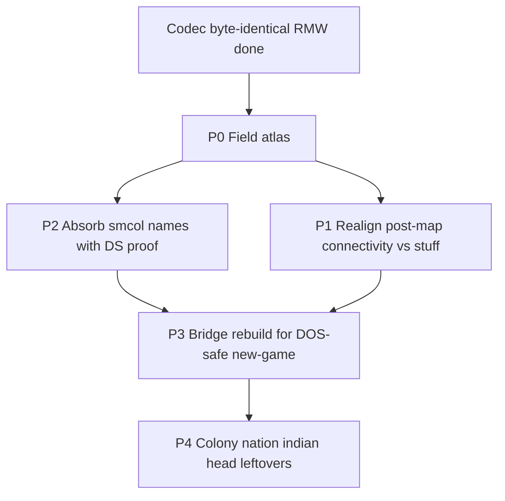

# Col1 save format map (roadmap + field atlas)

Living inventory of every `COLONY##.SAV` region and the path to a
**decomp-backed** field map. Codec layout and byte-identical RMW are done;
semantic mapping of opaque bytes is **not**.

Companion: [savegame.md](savegame.md) (interop / bridge / gaps summary).
Structs: [`src/core/col1_save.h`](../src/core/col1_save.h).

---

## Goal / non-goals

**Goal:** name every byte (or bit) with evidence — DOS reader/writer cite and
allowed value ranges — so Linux→DOS export can rebuild templates without
inventing blobs.

**Non-goals:**

- Changing packed section sizes or breaking byte-identical fixture RMW
- Inventing post_map / stuff contents without decomp proof
- Treating community names (smcol / Format.md) as proven until matched to
  VICEROY DS / `FUN_*` (cite them as `community`, then promote)

**Standing project bar:** 100% DOS↔port save interop
([project_goals.md](project_goals.md)). This document is the RE track for that.

---

## Status legend

| Status | Meaning |
|--------|---------|
| `mapped` | Named in port; used or clearly documented; values understood |
| `partial` | Named or partly decoded in port; holes or stand-ins remain |
| `community` | Named in smcol / Format.md / viceroy; **not yet** proven here |
| `opaque` | Preserved as bytes; no solid semantics in-repo |
| `misaligned` | Port comment/split conflicts with decomp or community layout |

Rough fixture ratio (COLONY00-sized): **~89%** bytes in named/structured
fields (map planes dominate); **~11%** still opaque-preserved under
`unknown*` / `other` / trade `data`.

---

## DOS anchors (start here)

| Role | Symbol | Notes |
|------|--------|-------|
| Write save | `FUN_75c2_0288` | Canonical section dump; ~33 discrete stuff writes; post-map DS blobs |
| Load save | `FUN_75c2_0940` | Mirror of 0288 |
| Header probe | `FUN_75c2_0840` | Sig / version **73** / map product — ported as `col1_save_validate_head` |
| Slot UI / paths | `FUN_7562_*` | COLONY## paths, autosave 8/9 |
| Connectivity fill | `FUN_67f4_0088` | Builds 2×`0x10e` planes → saved after map layers |
| Live units | DS:`0x3144` stride `0x1c` | Save dumps the array wholesale |

Catalog: [FUNCTION_CATALOG.md](../original_sources_annotated/FUNCTION_CATALOG.md)
(seg `75c2` / `7562`). Bodies: `original_sources_decompiled/viceroy_unpacked.c`.

**Community oracles** (cite → prove):
[smcol_sav_struct.json](https://github.com/pavelbel/smcol_saves_utility),
[Format.md](https://github.com/hegemogy/Colonization-SAV-files),
[viceroy savegame.h](https://github.com/hegemogy/viceroy).

**Fixtures:** `original_saves/COLONY00.SAV`, `COLONY01.SAV`,
`original_saves/valid-lategame-saves/COLONY{00–08,10}.SAV`,
`test-saves-ai/TURN*`, `test-saves-mapgen/SEED100.SAV`,
`tests-save-misc/unit flags error.sav`.

---

## File order (standard 58×72)

| Section | Size | Port type |
|---------|------|-----------|
| Prefix (`head` + `player[4]` + `other`) | 390 | — |
| `colony[]` | 202 × C | `ColonizeCol1Colony` |
| `unit[]` | 28 × U | `ColonizeCol1Unit` |
| `nation[4]` | 1264 | `ColonizeCol1Nation` |
| `tribe[]` | 18 × T | `ColonizeCol1Tribe` |
| `indian[8]` | 624 | `ColonizeCol1Indian` |
| `stuff` | 727 | `ColonizeCol1Stuff` (33 DOS DS writes) |
| Map ×4 (tile/mask/path/seen) | 4 × W × H | bitfield structs |
| `post_map` | **614** | `ColonizeCol1PostMap` (was unknown_e+f) |
| `trade_route[12]` | 888 | `ColonizeCol1TradeRoute` |

---

## Field atlas

Offsets are **within the named struct** unless noted. Update status in place
as peels land.

### Head (158)

| Field | Size | Status | Notes |
|-------|------|--------|-------|
| `sig_colonize` / `sig_eof` / `save_version` | 9+1+2 | `mapped` | `COLONIZE\0` + `0x1A`; ver **73** |
| `map_size_x` / `map_size_y` | 4 | `mapped` | Typically 58×72 |
| `tut1.*` known bits | — | `mapped` | Tutorial flags |
| `tut1.unknown01` / `unknown02` | 2 bits | `opaque` | |
| `unknown03` | 1 | `opaque` | |
| `game_options` (named bits) | — | `mapped` | |
| `game_options.unused01` | 7 bits | `opaque` | DOS scenario/WoI/REF bits live here |
| `game_options.cheats_enabled` | 1 bit | `mapped` | DS:`0x5383` bit5; Alt-WIN (was `unused02`) |
| `colony_report_options` | — | `mapped` | `unused03` pad |
| `tut2` / `tut3` | — | `mapped` | `unused04` pad |
| `unknown39` | 2 | `opaque` | |
| `year` / `autumn` / `turn` | 6 | `mapped` | |
| `map_mode` | 2 | `mapped` | DS:`0x5390`; 0=Move / 1=View (`FUN_2b5a_0902`/`0e52`; was `unknown40`) |
| `active_unit` | 2 | `mapped` | |
| `nation_turn` / `curr_nation_map_view` / `human_player` | 6 | `mapped` | DS:`0x5394`..`0x5398` (was `unknown41`) |
| `tribe_count` / `unit_count` / `colony_count` | 6 | `mapped` | |
| `trade_route_count` / `show_entire_map` / `fixed_nation_map_view` | 6 | `mapped` | DS:`0x53a0`..; Complete Map cheat (was `unknown42`) |
| `difficulty` | 1 | `mapped` | 0..4 |
| `unknown43` | 2 | `opaque` | |
| `founding_father[25]` | 25 | `mapped` | −1 = unrecruited |
| `turn_loop_running` / `map_modal_active` / `no_unit_selected` | 6 | `mapped` | DS:`0x53c2`/`c4`/`c6` (was `unknown44`) |
| `nation_relation[4]` | 8 | `mapped` | |
| `rebel_sentiment_report` + `unknown45_pad[8]` | 10 | `mapped` | DS:`0x53d0` congress UI (was `unknown45`) |
| `expeditionary_force` / `backup_force` | 16 | `mapped` | |
| `unknown46` / `price_group_state[16]` | 32 | `partial` | Union @ DS:`0x53ea`; Linux king stand-ins still overlay first bytes |
| `event` | 2 | `mapped` | Woodcut / discovery flags |
| `unknown05` | 2 | `opaque` | |

### Players (52 × 4)

| Field | Size | Status | Notes |
|-------|------|--------|-------|
| `name` / `country_name` | 48 | `mapped` | |
| `unknown06_lo` / `named_new_world` | 1 | `mapped` | bit7 discovery one-shot (`FUN_4720_049e`) |
| `control` / `founded_colonies` / `diplomacy` | 3 | `mapped` | control 0/1/2 |

### Other (24) — prefix trailer

| Field | Size | Status | Notes |
|-------|------|--------|-------|
| `other[]` | **24** | `community` | Entire blob; smcol: unexplored + click-before-colony xy |

### Colony (202 × C)

| Field | Size | Status | Notes |
|-------|------|--------|-------|
| `x` / `y` / `name` / `nation_id` / `population` | — | `mapped` | |
| `unknown08_1b` / `unknown08_1d` / `unknown08_1e` | 3 | `opaque` | +0x1b/1d/1e; found zeros / census clears |
| `flags` (`ColonizeCol1ColonyFlags`) | 1 | `mapped` | +0x1c; SoL/starvation/build-busy/… (`FUN_364b_0688`) |
| `occupation` / `profession` | 64 | `mapped` | |
| `duration[16]` | 16 | `partial` | Named “work duration”; not deeply bridged |
| `tiles[8]` | 8 | `mapped` | Surround citizen index |
| `unknown10` | 12 | `opaque` | +0x78..; weak +0x7c production touches |
| `buildings` / `custom_house` | — | `mapped` | `unused05` pad |
| `unknown11_8c` / `unknown11_8f` | 2 | `partial` | AI counters; INC cap `0x7f` |
| `specialty_cargo` | 1 | `mapped` | +0x8d; `0xff` none (`FUN_5952_0306`) |
| `labor_shortage` | 1 | `mapped` | +0x8e |
| `cargo_produced_mask` | 2 | `mapped` | +0x90; bit per cargo (`FUN_364b_0688`) |
| `hammers` / `building_in_production` | — | `mapped` | |
| `warehouse_level` | 1 | `mapped` | +0x95; cap `100*(1+level)` (`FUN_15eb_0a50`) |
| `capitol_level` | 1 | `mapped` | +0x96; Capitol / Expansion (`0x1e`/`0x1f`) |
| `depletion_counter` | 1 | `mapped` | +0x97; wrap at 50 |
| `hammers_purchased` | 2 | `mapped` | +0x98; BUY remainder (`FUN_2f2b_5e44`) |
| `stock[16]` | 32 | `mapped` | |
| `unknown13` | 8 | `partial` | +0..+3 visible counts in some saves |
| `rebel_dividend` / `rebel_divisor` | 8 | `mapped` | SoL display |

Export often **zeros** unnamed colony bytes on rebuild ([savegame.md](savegame.md)).

### Unit (28 × U) — live DS:`0x3144`

| Field | Size | Status | Notes |
|-------|------|--------|-------|
| `x` / `y` / `type` / `nation_id` | — | `mapped` | Europe sentinels ≥200 |
| `vis_mask` | 4 bits | `mapped` | `0x10<<euro` visibility (`FUN_1427_0992`); RMW-preserved; spawn 0 |
| `unknown15` | 1 | `partial` | bit7 = ship damaged (`FUN_1427_13b0`); other bits live |
| `moves` / `orders` / `goto_*` | — | `mapped` | |
| `origin` | 1 | `mapped` | Brave home tribe (was `unknown16[0]`) |
| `ai_plan` | 1 | `mapped` | Default `0x58` / `'X'` (`COL1_UNIT_UNKNOWN16_HI_DEFAULT`) |
| `unknown18` | 1 | `partial` | Low 3 = facing / `last_dir` |
| Cargo / profession / `turns_worked` / chain | — | `mapped` | |

### Nation (316 × 4)

| Field | Size | Status | Notes |
|-------|------|--------|-------|
| `tax_rate` / `recruit*` / FF / bells / gold / crosses | — | `mapped` | |
| `unknown19` / `unused07` / `unknown21` / `unknown22` | — | `opaque` | |
| `unused08` | 2 | `community` | smcol: FF end probability count |
| `rebel_sentiment` + `unknown23_pad[4]` | 5 | `mapped` | nation+0x19 (was `unknown23`) |
| `artillery_count` / `boycott_bitmap` | — | `mapped` | |
| `royal_money` + `unknown24_pad[4]` | 8 | `mapped` | `int32` @ +0x22 REF budget (`FUN_43f7_1d42`) |
| `unknown25` | 6 | `community` | Europe return xy + euro relation nibbles |
| `relation_by_indian[8]` | 8 | `mapped` | |
| `unknown26` | 12 | `partial` | Diplo timers / peer flags / hostility / privateer mask (`ai_diplo.c`) |
| `trade` (240) | 240 | `mapped` | euro_price / nr / gold / tons |

### Tribe (18 × T)

| Field | Size | Status | Notes |
|-------|------|--------|-------|
| `x` / `y` / `nation_id` / `state` / `population` / `mission` | — | `mapped` | `unused09` pad |
| `unknown28` | 2 | `partial` | `[0]` growth accumulator (`FUN_4d56_152e`); smcol growth_counter |
| `last_bought` / `last_sold` / `alarm[4]` | — | `mapped` | |

### Indian (78 × 8)

| Field | Size | Status | Notes |
|-------|------|--------|-------|
| `capitol_*` / `tech` / `tons` / `met_by_player` / `alarm_by_player` | — | `mapped` | |
| `extinct` | 1 bit | `mapped` | bit7 of first unknown31 byte |
| `lands_bought` | 1 | `mapped` | `FUN_479b_00ca` INC |
| `unknown31_flags` | 1 | `partial` | Linux contact prelude bit `0x20` |
| `muskets` / `horse_herds` | 2 | `mapped` | smcol + purchase path |
| `horse_breeding` + remaining unknown31 pad | 5 | `partial` | smcol name; weaker DOS cite |
| `contact_state[4]` | 8 | `mapped` | +0x2e; per-euro FSM 0/1/2 (`FUN_5bfb_*`) |
| `unknown32_tail[4]` | 4 | `opaque` | +0x36..; searched, no reader cite |
| `unknown33` | 8 | `partial` | Per-euro peace bit `0x40` (Linux contact) |

### Stuff (727)

DOS `FUN_75c2_0288` writes **33** chunks (`FUN_1d1d_060c`); sizes sum to **727**.
RAM is scattered; the port stores one packed `ColonizeCol1Stuff` for RMW.

| File off | Size | DS | Notes |
|----------|------|-----|-------|
| 0 | 12 | `0x9566` | `unknown34` — save R/W only |
| 12 | 4 | `0x8cfc` | `all_unit_counts[4]` — `FUN_4962_0018` |
| 16 | 4 | `0x9298` | `colony_counts[4]` — `FUN_4962_0018` |
| 20 | 4 | `0x9408` | `free_colonist_counts[4]` — type==0 units |
| 24 | 4 | `0x940c` | `colony_pop_totals[4]` — Σ colony pop |
| 28 | 4 | `0x9410` | `census_pop_proxy[4]` — +1 skilled unit + Σ pop |
| 32 | 4 | `0x9180` | `land_combat_totals[4]` — Σ land combat mode 0 |
| 36 | 4 | `0x9414` | `ship_cargo_totals[4]` — Σ ship cargo capacity |
| 40 | 4 | `0x9418` | `ship_counts[4]` |
| 44 | 8 | `0x941c` | `land_combat_strength[4]` — Σ combat mode 1 (u16) |
| 52 | 4 | `0x9424` | `armed_ship_counts[4]` |
| 56 | 4 | `0x9428` | `unknown_9428[4]` — AI reads; writer outside `0018` |
| 60 | 4 | `0x942c` | `field_combat_totals[4]` — land not in colony / not A\|G |
| 64 | 76 | `0x924c` | `unit_type_counts[4][19]` — `FUN_4962_0018` |
| 140 | 16 | `0x947e` | |
| 156 | 16 | `0x95f2` | |
| 172 | 64 | `0x94a6` | |
| 236 | 64 | `0x94e6` | |
| 300 | 64 | `0x95b2` | |
| 364 | 64 | `0x9526` | |
| 428 | 64 | `0x918c` | |
| 492 | 64 | `0x9572` | |
| 556 | 8 | `0x944e` | |
| 564 | 1 | `0x336` | |
| 565 | 8 | `0x9184` | tribe_data_* |
| 573 | 8 | `0x9622` | |
| 581 | 8 | `0x962a` | |
| 589 | 128 | `0x91cc` | tribe dwellings / pad |
| 717 | 2 | `0x8540` | `stuff.x` focus tile |
| 719 | 2 | `0x853e` | `stuff.y` |
| 721 | 2 | `0x184` | `zoom_level` + `zoom_pad` (`FUN_2b5a_0f92`) |
| 723 | 2 | `0x17c` | `viewport_x` camera center |
| 725 | 2 | `0x17e` | `viewport_y` |

Port packing (727): `unknown34[12]` + census (`all_unit_counts` /
`colony_counts` / mid-window 44 / `unit_type_counts`) +
`unknown36[577]` + cursor/viewport. **`unknown36` is not connectivity**.
Misaligned FreeCol “colony counters” at old offset 15 removed.

**Census policy (DOS parity):** RMW/export **preserves** census bytes. Do not
recompute from live pools to “freshen” mid-turn lag (`FUN_4962_0018` can leave
withdrawn-AI rows stale — intentional interop). Template blank-fill, if ever
added, must match `0018` byte-exact — never a Linux truthier recount.

| Field | Size | Status | Notes |
|-------|------|--------|-------|
| `unknown34` | 12 | `partial` | DS:`0x9566` |
| `all_unit_counts[4]` | 4 | `mapped` | DS:`0x8cfc` |
| `colony_counts[4]` | 4 | `mapped` | DS:`0x9298` |
| mid-window (44) | 44 | `mapped` | See chunk table; `unknown_9428` still opaque |
| `unit_type_counts[4][19]` | 76 | `mapped` | DS:`0x924c` |
| `unknown36` | 577 | `community` | FA / tribes — **not** connectivity |
| `x` / `y` | 4 | `mapped` | DS `0x8540` / `0x853e` focus |
| `zoom_level` / `zoom_pad` | 2 | `mapped` | DS:`0x184`; zoom 0..3 |
| `viewport_x` / `viewport_y` | 4 | `mapped` | DS:`0x17c` / `0x17e` camera |

### Map layers (W×H each)

| Plane | Status | Notes |
|-------|--------|-------|
| `tile` | `mapped` | Terrain bitfield |
| `mask` | `partial` | Occupancy rebuilt on export; `suppress`/`purchased`/`pacific` named but not synthesized on templates; bit7 unused |
| `path` | `mapped` | Region + visitor |
| `seen` | `mapped` | Fog / score nibbles |

### Post-map (`ColonizeCol1PostMap`, 614)

Replaces legacy `unknown_e[504]` + `unknown_f[110]` (same bytes). Proven from
`FUN_75c2_0288` asm (`AX` length) + `FUN_67f4_0088` fill:

| File off | Size | DS | Field | Status | Notes |
|----------|------|-----|-------|--------|-------|
| 0 | 270 | `0x86f6` | `sea_connectivity[270]` | `mapped` | 15×18 neighbor bits; fill `local_24==1`; rebuilt on blank export |
| 270 | 270 | `0x85e8` | `land_connectivity[270]` | `mapped` | fill `local_24==0`; rebuilt on blank export |
| 540 | 32 | `0x945e` | `continent_tally_a[16]` | `mapped` | land terrain-class filter; rebuilt |
| 572 | 32 | `0x85c8` | `continent_tally_b[16]` | `mapped` | land tile counts; rebuilt |
| 604 | 4 | SS:`local_8` | `unknown_post_604` | `opaque` | save-path LCG blob; not filled by 67f4 |
| 608 | 4 | `0x8d80` | `unknown_ds_8d80` | `opaque` | boot timer dword (`FUN_75c2_2d46`); **not** seed |
| 612 | 2 | `0x190` | `prime_resource_seed` | `mapped` | full u16; `FUN_684c_08c0` mapgen |

Smcol’s post-connectivity carve (18+16+28+10+1+1) sums to the same **74** tail
bytes but **does not** match these DOS writes — prefer DOS. Mid-window census
chunks are named from `FUN_4962_0018` increment conditions (`unknown_9428`
still opaque).

**Export rebuild (P3+P4):** `col1_post_map_rebuild_connectivity` (`FUN_67f4_0088`)
runs from `col1_bridge_capture` when `post_map` is all-zero. Planes + tallies
from live terrain + layer3; models `FUN_6662_00f2` dest cost-grid cache (COLONY00
planes byte-exact). Tail preserved; blank templates may stamp
`map.prime_resource_seed`. Nonzero DOS `post_map` left intact on RMW.

### Trade routes (74 × 12)

| Field | Size | Status | Notes |
|-------|------|--------|-------|
| `name` / `sea` / `dest_count` | 34 | `mapped` | |
| `stop[4]` (`ColonizeCol1TradeStop`, 10 B) | 40 | `mapped` | DOS unload@+3 then load@+6 (`FUN_647e`); smcol names those blobs swapped |

---

## Phased work queue

| Phase | Scope | Exit criteria | Status |
|-------|--------|---------------|--------|
| **P0 — Atlas** | Inventory every opaque hole | This document exists; all `unknown*` listed | **Done** |
| **P1 — Correct the big mis-split** | Reconcile stuff vs post-map vs `FUN_75c2_0288` / `FUN_67f4_0088`; fix wrong comments | Connectivity planes named; stuff chunk table; `ColonizeCol1PostMap` | **Done** |
| **P2 — Absorb proven community names** | Rename head/nation/indian/unit/trade fields where smcol + decomp agree | Struct names match evidence; sizes unchanged; `smoke_col1_save` byte-identical | **Done** |
| **P3 — Export rebuild** | Template/new-game rebuilds connectivity (+ required defaults) so DOS survives past UNITFLAG | Linux→DOS smoke; remaining holes documented | **Done** |
| **P4 — Deep leftovers** | Colony opaques, indian contact, stuff FA/counts, pathfinder plane parity, value ranges | Each field: allowed values + ≥1 DOS reader cite | **Done** (proven peels + P4b HOLD clear) |

### Remaining HOLD (post-P4b)

1. Stuff `unknown_9428[4]` — AI reads; writer not in `FUN_4962_0018`.
2. Indian `unknown32_tail[4]` (+0x36..); `contact_state[4]` mapped.
3. Colony `unknown10[12]`; residual `unknown08_1b/1d/1e`, `unknown11_8c/8f`.
4. Keep RMW sizes; do not invent blobs without decomp evidence.
5. **Census:** DOS-parity preserve only — never “freshen” on export (see Stuff §).

---

## Related docs

- [savegame.md](savegame.md) — interop layers, bridge, Linux→DOS gaps
- [project_goals.md](project_goals.md) — 100% save interop acceptance
- [decomp_inventory.md](decomp_inventory.md) — what is shipped vs open RE
- [manual_gap.md](manual_gap.md) — Col1 I/O checklist (playable ≠ fully mapped)
- [ai_transcription.md](ai_transcription.md) — uses Col1 blobs; not the field map epic
- [original_index.md](original_index.md) — index entry for SAV layout
