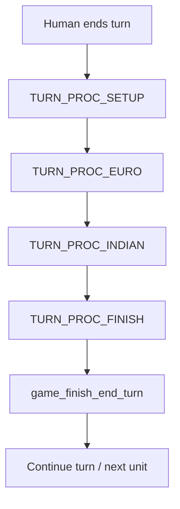
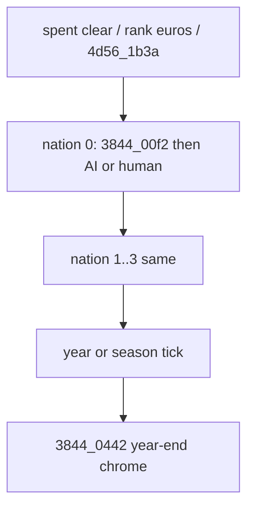

# Between player turns

End-to-end map of what runs after the human finishes orders and before the next
human Move Pieces. Owns the **orchestration** bridge (calendar, production,
nation EOT pieces, Euro/Indian/King order, market, chrome). AI planner
internals stay in [ai_transcription.md](ai_transcription.md).

Layer D extracts + thin callgraph:
[`original_sources_annotated/turn/`](../original_sources_annotated/turn/)
([`between_turns.md`](../original_sources_annotated/turn/between_turns.md)).

Bring-up checklist (shorter): [decomp_inventory.md](decomp_inventory.md)
“End-of-turn recovery checklist”.

---

## Linux path (authoritative for the port)

Entry: Space / Wait / End-of-Turn option →
[`game_do_end_turn`](../src/core/game_loop.c) →
[`turn_processor_start`](../src/core/turn.c) + frame-stepped
`turn_processor_advance` until idle → `game_finish_end_turn`.

Synchronous full run (tests): `turn_end`.

### `TURN_PROC_SETUP` (no turn-owner indicator)

| Step | Linux | DOS provenance |
|------|-------|----------------|
| Calendar | `turn_advance_calendar` (`@TIMECHANGE`) | `FUN_130d_0290` year/autumn tick (runs **after** nation pass in DOS) |
| Colony production | `turn_run_colony_production` | `FUN_364b_0688` via `291f_0950` inside `3844_00f2` (per nation in DOS) |
| Coastal fort fire | `turn_run_coastal_fort_fire` | `FUN_364b_03f6` |
| Nation ticks | `turn_run_nation_ticks` (bells / crosses / FF) | Europe EOT / census pieces of `3844_00f2` + FF helpers |

### `TURN_PROC_EURO` (indicator on; one AI Euro nation per frame)

Order EN→FR→SP→DU; skip `human_nation` and withdrawn (`player.control==2`).

| Step | Linux | DOS |
|------|-------|-----|
| Set active + MP refresh | `turn_set_active_nation` / `turn_refresh_moves_for_nation` | spent clear is mid-pass in `130d`; MP refresh at act entry |
| Treasure tick | `units_tick_treasure_outside_colony` | `FUN_3844_0004` |
| Planner | `ai_euro_nation_turn` → `ai_euro_dispatcher_turn` | `FUN_521d_6d8e` after `3844_00f2` |

### `TURN_PROC_INDIAN` (indicator on; one nation 4..11 per frame)

| Step | Linux | DOS |
|------|-------|-----|
| Nation turn | `ai_indian_nation_turn` (`1816`-shaped) | Mid-pass only `FUN_4d56_1b3a` in resolved `130d`; full `1816` XREF **open** |

### `TURN_PROC_FINISH` (no indicator)

| Step | Linux | DOS |
|------|-------|-----|
| King / REF | `ai_king_nation_turn` | `FUN_43f7_2424` via `291f_0a66` **inside** `3844_00f2` |
| Europe market | `europe_tick_market_prices` | `FUN_38fd_0058` (sibling of nation EOT `38fd_5e52`) |
| Human MP + treasure + Cortes | refresh + `units_tick_treasure_*` + `units_cortes_*` | Human treasure inside that nation’s `00f2`; Cortes elsewhere |
| Select next unit | `turn_select_next_unit` | Return to Move Pieces / focus |
| Autosave flags | decade Spring → slot 8 else 9 | `FUN_130d_0172` |

### After processor idle — `game_finish_end_turn`

1. Apply autosave requests  
2. `game_europe_deliver_bound_ships` (dock arrivals; may open Europe)  
3. Recenter camera on selected unit  

Status line: “Continue turn.” when a unit with moves is selected.

Turn-owner box (`FUN_1984_00aa`, 5×3 at 315,197) only while EURO/INDIAN steps run
(`turn_processor_show_indicator`).

---

## DOS spine

Main loop: **`FUN_130d_0290`** (thunk `FUN_281f_0546`). Annotated:
[`year_loop.c`](../original_sources_annotated/turn/year_loop.c).

Per Euro nation EOT (before AI or human act): **`FUN_3844_00f2`**
([`nation_eot.c`](../original_sources_annotated/turn/nation_eot.c)).

After calendar tick: **`FUN_3844_0442`**
([`year_end_chrome.c`](../original_sources_annotated/turn/year_end_chrome.c)).

Major thunks (catalog):

| Thunk | Real body | Role |
|-------|-----------|------|
| `281f_0644` | `3844_00f2` | Nation EOT |
| `281f_0638` | `521d_6d8e` | Euro AI dispatcher |
| `281f_062c` | `2b5a_3b68` | Human Move/View Pieces |
| `281f_0676` | `4d56_1b3a` | Mid-turn Indian tables |
| `281f_061e` | `3844_0442` | Year-end chrome |
| `281f_0668` | `43f7_2244` | Human merc offer |
| `291f_0a66` | `43f7_2424` | SoL / king (inside `00f2`) |
| `291f_0950` | `364b_0688` | Colony production |
| `291f_0a90` | `38fd_5e52` | Europe nation EOT |
| `291f_0a58` | `3844_0004` | Treasure tick |

---

## Phase correspondence

| Linux step | DOS site | Linux symbol | Fidelity |
|------------|----------|--------------|----------|
| Human already done | `2b5a_3b68` inside `130d` | (prior frame) | Reshape — intentional |
| SETUP calendar | `130d` post-nation tick | `turn_advance_calendar` | **Done** (`@TIMECHANGE`) |
| SETUP production | `364b_0688` in `00f2` | `turn_run_colony_production` | **Partial** (SoL/spoilage; formulas open) |
| SETUP fort fire | `364b_03f6` | `turn_run_coastal_fort_fire` | **Done** |
| SETUP nation ticks | Europe/census crumbs | `turn_run_nation_ticks` | **Partial** |
| EURO treasure | `3844_0004` | `units_tick_treasure_outside_colony` | **Partial** |
| EURO AI | `521d_6d8e` after `00f2` | `ai_euro_nation_turn` | **Partial structural** (T2 early; deep `20e6` OPEN) |
| INDIAN | `4d56_1b3a` mid only; `1816` XREF open | `ai_indian_nation_turn` | **Partial structural** (quiet T2; deep raid PARKED) |
| FINISH king | `43f7_2424` in `00f2` | `ai_king_nation_turn` | **Partial structural** |
| FINISH market | `38fd_0058` / `5e52` family | `europe_tick_market_prices` | **Partial** |
| FINISH human refresh | return to Move Pieces | MP + select next | **Done** |
| FINISH autosave | `130d_0172` | autosave flags | **Done** |
| Year-end chrome | `3844_0442` | — | **UI mapped** ([`year_end_chrome.md`](../original_sources_annotated/turn/year_end_chrome.md)); port **PARKED** |
| Demo autoplay | `130d` `0x828` tail | — | **PARKED** |

### Known reshape (do not paper over)

| Concern | DOS | Linux |
|---------|-----|-------|
| Human slot | Inside nation loop | Pipeline is **post-human only** |
| Calendar | After nations | **First** in SETUP |
| King | Per-nation inside `00f2` | Once in **FINISH** |
| Indians | Mid-pass `1b3a` | Full `1816`-shaped **INDIAN** phase |
| `00f2` | Atomic per Euro | Split across SETUP / EURO / FINISH |

Manual “natives first” order is **not** what either DOS `130d` (as resolved) or
Linux runs; Linux is Euro AI then Indians.

---

## Planner pointers

| Cluster | Doc / extract |
|---------|----------------|
| Euro goals / act / scoring | [ai_transcription.md](ai_transcription.md); [`euro_dispatcher.c`](../original_sources_annotated/ai/euro_dispatcher.c); [`euro_unit_act.md`](../original_sources_annotated/ai/euro_unit_act.md); [`move_scoring.md`](../original_sources_annotated/ai/move_scoring.md) |
| Indian pulse / contact | [`indian_nation_turn.c`](../original_sources_annotated/ai/indian_nation_turn.c); [`indian_contact.md`](../original_sources_annotated/ai/indian_contact.md); [`brave_spent_callgraph.md`](../original_sources_annotated/ai/brave_spent_callgraph.md) |
| King / REF | [`king_ref.md`](../original_sources_annotated/ai/king_ref.md) |
| Diplomacy | [`euro_diplo.md`](../original_sources_annotated/ai/euro_diplo.md) |

---

## Open RE

- **`MULTINEXT` / `TIMECHANGE` / `SEASONS`**: present in `viceroy_unpacked.asm`
  string table; no FUN_* XREF yet (calendar behavior recovered from `@TIMECHANGE`
  + `130d` year/autumn math).
- **`FUN_4d56_1816` call site**: unresolved in the Ghidra export (overlay/thunk
  gap). Linux still implements `1816`-shaped nation turns from annotated structure.
- **`FUN_3844_0442`**: **UI mapped**
  ([`year_end_chrome.md`](../original_sources_annotated/turn/year_end_chrome.md));
  victory / defeat / anniversary / auto-declare dialogs not ported as a module.
- **Demo / independence splash** (`130d_019e` / `0222`): PARKED.
- **Deep AI** (`20e6` / `2820` / `4528`): section-mapped under
  `original_sources_annotated/ai/`; Linux port still PARKED (unpark #4).

---

## Tests / evidence

| Gate | Path |
|------|------|
| Calendar / production smoke | `tests/smoke/test_turn.c` |
| Early AI T2 | `smoke_ai_turns` (`TURN1`…`TURN7`) |
| King thin | `smoke_ai_king` |
| Saves / autosave fields | [savegame.md](savegame.md) |
