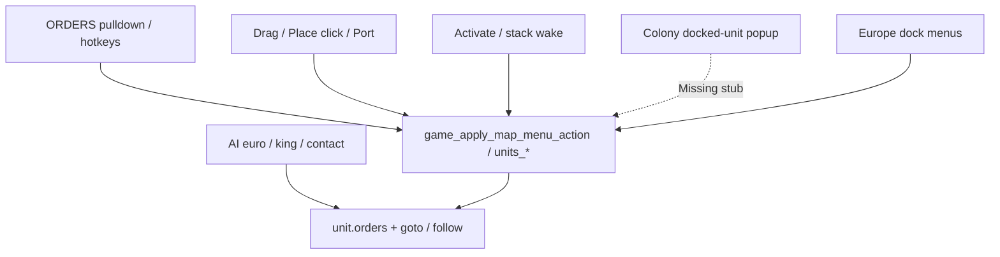
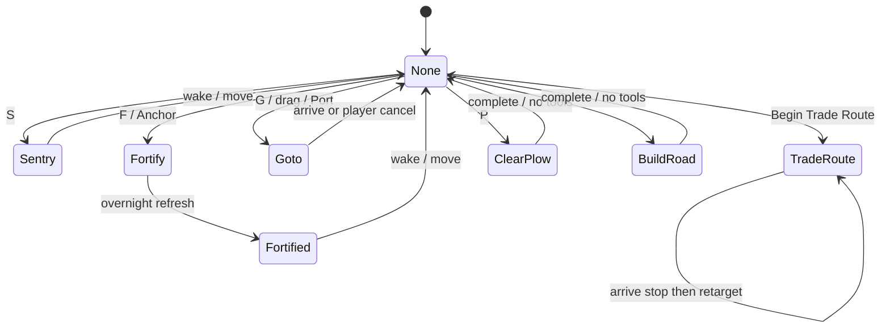

# Unit order mechanics

Player-facing rules for issuing and resolving unit orders: what should happen
in which context. Authority: manual pp. 23–29; `NAMES.TXT` `@ORDERS`;
`MENU.TXT` `@ORDERS`; `GAME.TXT` order gates / confirms; DOS segments
`2b5a` (ORDERS UI), `479b` (pioneer / found / goto tick), `6662` (goto path),
`112b` (orders chrome), `4720` (embark), `48d3` (landfall goto),
`2f2b_5746` (colony docked-unit orders).

Linux entry: `units_*` order APIs ([`units.h`](../src/core/units.h) /
[`units.c`](../src/core/units.c)), ORDERS enable
`map_menu_refresh_orders_dos` ([`map_menu.c`](../src/core/map_menu.c)),
apply path `game_apply_map_menu_action` ([`game_loop.c`](../src/core/game_loop.c)),
overnight ticks `turn_refresh_moves_for_nation` ([`turn.c`](../src/core/turn.c)),
chrome `unit_chrome.c` (`FUN_112b_01ba`).

Status: **Done** / **Partial** / **Missing** / **PARKED**.

Feature checklist rows live in [manual_gap.md](manual_gap.md). Enter/board/landfall
tile rules: [move_enter.md](move_enter.md). Popup inventory: [popups.md](popups.md).

---

## Order byte model

Canonical lasting order is `ColonizeUnit.orders` (`@ORDERS` index). Chrome letter
from `NAMES.TXT` (fallback table in `unit_chrome.c`: `- S T G L F F B P R`).

| Byte | Name | Letter | Lasting? | Notes |
|-----:|------|:------:|:--------:|-------|
| 0 | No Orders | `-` | idle | Default after clear / wake / arrival |
| 1 | Sentry | `S` | yes | Skip selection; auto-board when ship leaves tile |
| 2 | Trade Route | `T` | yes | Goto-following; does **not** clear on stop arrival |
| 3 | Go To | `G` | yes | Human pathing; clears on arrival or player cancel |
| 4 | Live In Village | `L` | data only | Unused in port (no `UNITS_ORDER_*`) |
| 5 | Fortify | `F` | yes | In progress; overnight → 6 |
| 6 | Fortified | `F` | yes | Skip selection until woken; combat defense is context-dependent ([combat.md](combat.md)) |
| 7 | Build Colony | `B` | macro only | Founding is **immediate**; byte never assigned |
| 8 | Clear/Plow | `P` | yes | Pioneer multi-turn |
| 9 | Build Road | `R` | yes | Pioneer multi-turn |
| 10 | (reserved AI) | `-` | — | NAMES “No Orders” |
| 11 | AI Sail | `-` | yes | Euro AI ship course (`UNITS_ORDER_AI_SAIL`) |
| 12 | AI Move | `-` | yes | Euro / Brave land course (`UNITS_ORDER_AI_MOVE`) |
| 13 | Follow | `-` | yes | Stick to another unit (`UNITS_ORDER_FOLLOW`) |

Helpers (`units.h`):

- `units_orders_follow_goto` — GOTO / AI_SAIL / AI_MOVE / TRADE_ROUTE
- `units_orders_is_follow` — FOLLOW
- `units_orders_skip_turn` — SENTRY, FORTIFIED, CLEAR_PLOW, BUILD_ROAD (not FORTIFY; that already has 0 MP)

**UI commands without a lasting `@ORDERS` byte:** Wait, Activate, Disband, Dump
Cargo, Pillage, Load/Unload Cargo, Return to Europe, Join Colony, No Orders
(Space → end turn), Build Colony (immediate found).

---

## Issuance contexts

| Context | Expected (DOS) | Linux | Status |
|---------|----------------|-------|--------|
| ORDERS pulldown | `FUN_2b5a_0070` / `2464` mega-dispatch; enable via `0b34` | `map_menu` → `game_apply_map_menu_action` | Done |
| Plain letter hotkeys | MENU `~` markers | `map_menu_orders_hotkey` | Done |
| Alt+letter menus | Open bar menus | `map_menu_open_alt_hotkey` | Done |
| Hardcoded F / S / Shift+D | Fortify / Sentry / Disband | `game_loop` key paths | Done |
| Mouse Go-To drag | Path then order 3 | `UI_DRAG_MAP_GOTO` → `units_set_goto` | Done |
| Go to Place / Port | Click dest / next owned colony | Place mode + `units_set_goto` | Done |
| Activate / Wait | Stack picker / next unit with MP | `unit_stack` + Wait | Done |
| AI | Sets order bytes + goto / follow | `ai_euro` / `ai_king` / `ai_contact` | Done (structural) |
| Colony docked units | `FUN_2f2b_5746` sentry/fortify/… popup | Status stub only | Missing |
| Europe dock | Don’t board / Board / Move front (`@EUROPESHIPOPTIONS` / dock) | `EUROPE_MENU_DOCK` | Done |
| Ship options chrome | `@SHIPOPTIONS` (anchor / sentry / unload) | Menu-driven; chrome thin | Partial |

---

## Lifecycle

| Phase | When | What |
|-------|------|------|
| Issue | Menu / key / mouse / AI | Set `orders` (+ optional `goto_*` / `follow_unit_id`); often `moves_left = 0` |
| Frame tick | Human map `game_update` (~10 Hz) | `units_advance_goto_one_step` for goto-followers; trade retarget at stop |
| Nation refresh | `turn_refresh_moves_for_nation` | FORTIFY→FORTIFIED; pioneer `units_pioneer_work_tick`; skip-turn units stay at 0 MP; others restore allotment |
| Wake / clear | Activate, stack wake, replace order, arrival, player Go-To cancel | `units_wake` / `units_clear_orders` |
| Manual step | `units_try_move` | Clears SENTRY / FORTIFY / FORTIFIED only; **Go-To not cleared by stepping away** |

---

## Per-command matrix

### Selection / turn flow

| Command | When | Expected (DOS) | Linux | Status |
|---------|------|----------------|-------|--------|
| Wait | ORDERS / Wait | Select next human unit with remaining MP | Same; status “Continue turn.” | Done |
| No Orders (Space) | ORDERS / Space | End turn when exhausted / option | Full turn pipeline | Done |
| Activate unit | ORDERS / stack | Pick unit under cursor; clear orders | Stack popup wake then select | Done |
| Arrow / click move | Map | Immediate step (not an order byte); may wake sentry/fortify | `game_try_unit_move` | Done |

### Fortify / Anchor / Sentry

| Command | When | Expected (DOS) | Linux | Status |
|---------|------|----------------|-------|--------|
| Fortify (land) | ORDERS / **F**; `FUN_2b5a_1112` | Order 5; exhaust MP; overnight → 6 (`479b_0b6c`) | `units_order_fortify` + refresh | Done |
| Anchor (ship) | 2nd Fortify menu / `@SHIPOPTIONS` | Sea unit at own colony or adjacent sea → fortify path | `units_order_anchor` | Done |
| Fortified | Overnight | Skip selection until woken; combat defense context-dependent | Skip via `units_orders_skip_turn` (bonus → [combat.md](combat.md)) | Done |
| Sentry | ORDERS / **S** | Order 1; exhaust MP; skip until wake | `units_order_sentry` | Done |
| Sentry auto-board | Ship leaves tile | Same-tile Sentry land board to capacity | `units_board_sentries_from_tile` | Done |
| Wake | Activate / stack / replace | Clear order; restore MP | `units_wake` | Done |

### Go-To / Trade Route / Follow

| Command | When | Expected (DOS) | Linux | Status |
|---------|------|----------------|-------|--------|
| Go to Place | Land ORDERS / drag | Order 3; path `6662`; walk until MP out; resume next turn; no MP gamble | Drag / Place → `units_set_goto`; 10 steps/sec | Done |
| Go to Port | Ship ORDERS | Goto next owned colony (`479b_0bd0` tails) | Next owned colony dest | Done |
| Goto tick | Frame / AI | Next adjacent step; clear on arrival | `units_advance_goto_one_step` | Done |
| Cancel Go-To | Player (active path) | Clear order 3; unit selectable again | Activate → `units_wake`; replace order; same-tile `units_set_goto` | Done |
| Abort Place / drag | Esc / right-click before dest set | Cancel destination picking only | `map_goto_place_mode` / `UI_DRAG_MAP_GOTO` clear | Done |
| Begin Trade Route | ORDERS | Order 2; pick route; cycle stops | `units_order_trade_route` + aim/cycle; nibble honor | Partial (Edit/VGA thin) |
| Trade at stop | Arrival | Service load/unload; retarget; stay order 2 | `game_trade_route_retarget` | Done (structural) |
| FOLLOW | AI / Brave escort | Stick to unit id | `units_follow_unit` / `advance_follow` | Done (AI-only) |
| AI_MOVE / AI_SAIL | AI planners | Goto-following course bytes | Same stepper as human goto | Done (structural) |

### Pioneer

| Command | When | Expected (DOS) | Linux | Status |
|---------|------|----------------|-------|--------|
| Clear Forest (**P**) | Pioneer on forest | Order 8; `479b_01a6`; turns = `terr_cost+2` (Hardy ÷2); −20 tools; lumber → nearest colony + `@CLEARCUT` / `@DEFOREST` | `units_pioneer_plow` clear path; +20 lumber thin + chrome | Done |
| Plow Fields (**P**) | Pioneer on open land | Same order 8; separate job; refuse if already plowed | Plow path; hills/arctic deny | Done |
| Build Road (**R**) | Pioneer | Order 9; `479b_0526`; turns = `terr_cost` (Hardy ÷2); −20 tools | `units_pioneer_road` | Done |
| Work tick | Nation refresh | Progress; complete → clear order; tools depleted → Free Colonist (`479b_0158` / `@USEDUPTOOLS`); clear grants lumber/`@CLEARCUT`/`@DEFOREST` | `units_pioneer_work_tick` + type→Colonists | Done (Hardy×2 / terrain×20 / road lumber PARKED) |

### Found / Join / cargo / Europe

| Command | When | Expected (DOS) | Linux | Status |
|---------|------|----------------|-------|--------|
| Build Colony (**B**) | Land founder off colony | `479b_076e` found body; name `@COLONY` | Immediate found; `@SEACOLONY` on water; `@NOPORT` CHOICE inland; order 7 unused | Done |
| Join Colony (**B**) | On own colony tile | Admit / open colony | Admit selected land unit; `@FULL` if at POP_MAX; else open colony | Done |
| Load / Unload Cargo | Transport on Euro settlement | Board/unload cargo UI | ORDERS + **O**/**U**; gated off-settlement | Done |
| Return to Europe | Ship on High Seas | Sail home lane | Despawn → Europe Expected | Done |
| Dump Cargo Overboard | Transport with goods | Confirm `@OVERBOARD`; dump hold | Yes/No then first goods hold | Done |
| Disband | Shift+D / ORDERS | Confirm `@SUREDISBAND` / `@DISBANDSHIP` | Confirm then `units_disband` | Done |

### Pillage / Live In Village

| Command | When | Expected (DOS) | Linux | Status |
|---------|------|----------------|-------|--------|
| Pillage | Military on foreign colony / improvements | Full `2b5a` body; menu item often hidden in `0b34` | Thin loot ≤100 richest non-food / clear plow+road; **menu always hidden** (DOS-faithful); API reachable | Partial |
| Live In Village (4) | — | `@ORDERS` letter **L** | No issuer / no tick | Missing |

---

## ORDERS menu enable / hide

Digest of DOS `FUN_2b5a_0b34` (Move Pieces) / `0902` (View Pieces) as ported in
`map_menu_refresh_orders_dos`.

| Rule | Behavior |
|------|----------|
| View Pieces (no unit) | Disable Wait / No Orders / Fortify / Sentry / Build; hide most unit-specific items |
| Pillage | Always hidden in `0b34` |
| Build vs Join | Hide Build on own colony; hide Join off own colony; hide both if not founder-capable |
| Clear ↔ Plow | Forest → show Clear hide Plow; else opposite; hills/arctic hide both |
| Pioneer gates | Clear/Plow/Road disabled if not pioneer (tools>0) |
| Fortify ↔ Anchor | Land → Fortify; sea → Anchor (hide the other) |
| Port ↔ Place | Land → Place (hide Port + Return Europe); sea → Port (hide Place); Return Europe enabled only on High Seas |
| Cargo items | Hide Load/Unload/Trade/Dump if no cargo capacity; Load/Unload disabled off Euro settlement; Dump disabled with no goods |
| Activate | Enabled if a unit exists under cursor |

---

## Order-gate and confirm popups

Full inventory in [popups.md](popups.md) §3 / `@SECTION` index. Order-related:

| `@SECTION` | Trigger | Expected | Linux | Status |
|------------|---------|----------|-------|--------|
| `@ONLYPIO` | Non-pioneer tries pioneer order | Modal | `@ONLYPIO` ai_popup OK | Done thin |
| `@NEEDTOOLS` / `@NEEDTOOLS0` | Colony build tools shortage (related) | Modal | EOT `@NEEDTOOLS`/`@NEEDTOOLS0` Done thin; pioneer Need tools status | Partial |
| `@NOPLOW` | Plow on already-plowed | Modal | `@NOPLOW` ai_popup OK | Done thin |
| `@NOROAD` | Road where road exists | Modal | `@NOROAD` ai_popup OK | Done thin |
| `@USEDUPTOOLS` | Pioneer tools depleted | Modal | Type→Colonists + `@USEDUPTOOLS` ai_popup OK | Done thin |
| `@SUREDISBAND` / `@DISBANDSHIP` | Disband confirm | Yes/No | `AI_POPUP_TAG_MAP_CONFIRM` | Done |
| `@OVERBOARD` | Dump cargo confirm | Yes/No | Same | Done |
| `@LANDFALL` / `@LANDFALL2` | Ship→bare land | Stay / Make Landfall | Done — see [move_enter.md](move_enter.md) |
| `@SHIPOPTIONS` | Ship option list | Anchor / sentry / unload / … | Menu-driven; chrome thin | Partial |
| Docked unit orders | Colony transport pane | Sentry / fortify / … (`2f2b_5746`) | Stub status line | Missing |

---

## Status summary

| Area | Status |
|------|--------|
| Order byte model + chrome letters | Done |
| Fortify / Anchor / Sentry / Wake / Disband | Done |
| Go-To Place / Port / drag + paced pathing (no gamble); player cancel | Done |
| Pioneer clear / plow / road multi-turn + tools wear | Done |
| Board / unload / landfall / sentry auto-board / dump / return Europe | Done |
| Build / Join colony (immediate actions) | Done |
| Trade Route begin / aim / cycle / stop service | Partial (structural Done; Edit UI / VGA PARKED) |
| Pillage | Partial (thin API; ORDERS item hidden like DOS `0b34`) |
| Order-gate modals (`@ONLYPIO`, `@NOPLOW`, …) | Done thin (`@ONLYPIO`/`@NOPLOW`/`@NOROAD`; EOT `@NEEDTOOLS`/`@NEEDTOOLS0`; pioneer `@NEEDTOOLS` still Partial) |
| Colony docked-unit orders popup | Missing |
| `@ORDERS` index 4 Live In Village | Missing |
| Order byte 7 as lasting Build Colony | Unused (founding immediate — acceptable) |
| AI MOVE / SAIL / FOLLOW / fortify / pioneer | Done (structural) |

**Bottom line:** Map ORDERS for the human player are substantially ported. Remaining
order gaps are thin Pillage depth, non-modal order gates, missing colony docked-unit
orders UI, unused Live In Village byte, and TRADE chrome polish.

---

## See also

- [manual_gap.md](manual_gap.md) — Units and map orders checklist
- [move_enter.md](move_enter.md) — enter / board / landfall / combat on move
- [combat.md](combat.md) — fortify defense / odds / peels
- [assets.md](assets.md) — map keys, Go-To draw, orders chrome
- [popups.md](popups.md) — order gates and confirms
- [turn_between_players.md](turn_between_players.md) — EOT / human finish orders
- [ai_transcription.md](ai_transcription.md) — AI use of order bytes
- [`FUNCTION_CATALOG.md`](../original_sources_annotated/FUNCTION_CATALOG.md) — segments `2b5a`, `479b`, `6662`, `112b`
- [`units.h`](../src/core/units.h) — order macros and APIs
